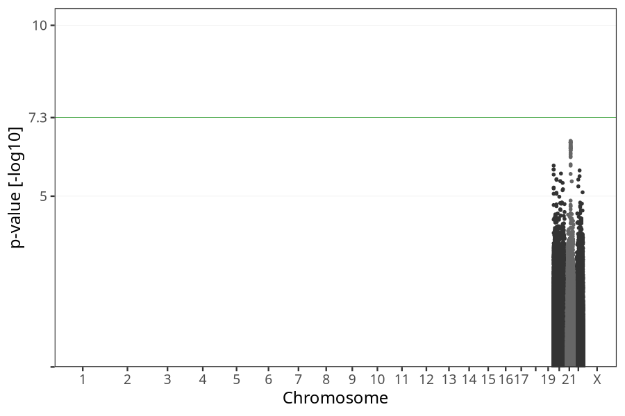
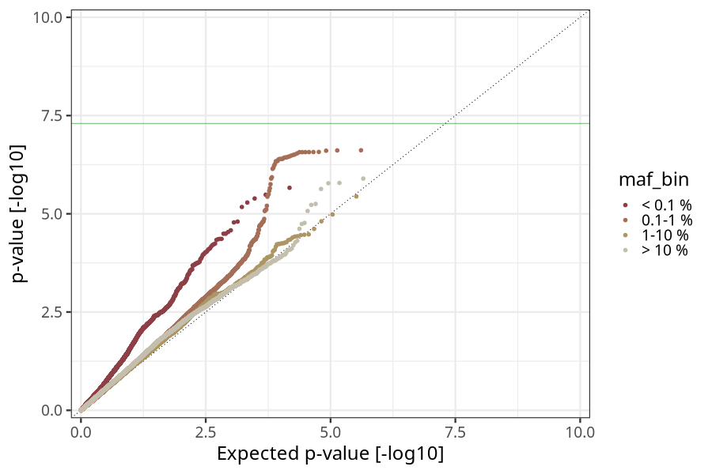
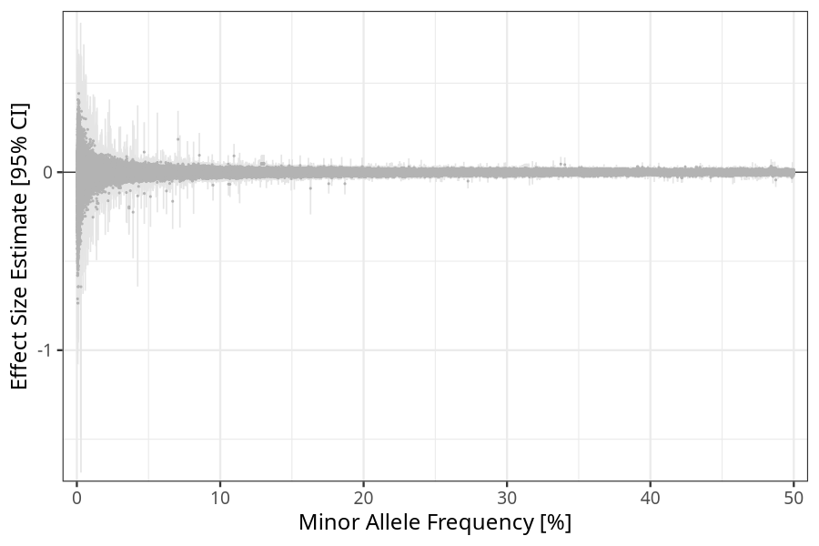
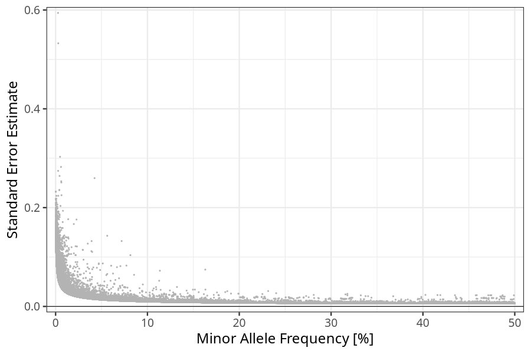

## bmi_diff_end_beginning in children
Association results by regenie for bmi_diff_end_beginning in children, followed by dimple prining of the hits passing p < 5e-08.
### Manhattan

### Top hits
| SNP | chr | bp | allele 0 | allele 1 | allele 1 freq | beta | se | p | n |
| --- | --- | -- | -------- | -------- | ------------- | ---- | -- | - | - |
### Quality Control
- QQ plot

- Beta vs. Allele Frequency

- Standard error vs. Allele Frequency

