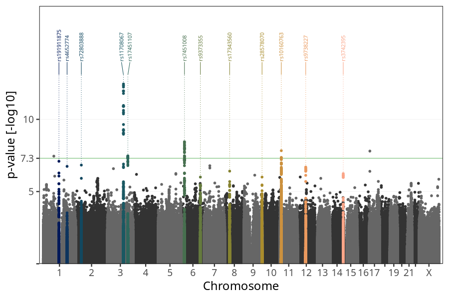
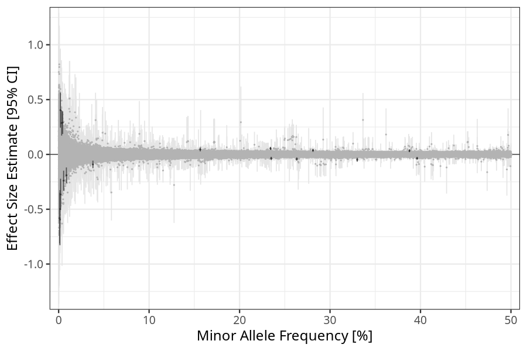

## weight_birth in fathers
Association results by regenie for weight_birth in fathers, followed by simple pruning of the hits passing p < 1e-06.
Note:
- Markers with a maf < 0.01 are not annotated on the Manhattan plot.
### Manhattan

### Top hits common
| SNP | chr | bp | allele 0 | allele 1 | allele 1 freq | beta | se | log10p | n | gene |
| --- | --- | -- | -------- | -------- | ------------- | ---- | -- | ------ | - | ---- |
| rs191911875 | 1 | 120551940 | A | G | 0.330049 | -0.0482047 | 0.00898092 | 7.09771 | 40100 | [NOTCH2](ensembl/rs191911875.md) |
| rs4652774 | 1 | 183060818 | A | G | 0.0379036 | -0.0911758 | 0.0174736 | 6.74244 | 40100 | [LAMC1](ensembl/rs4652774.md) |
| rs72803888 | 2 | 43204791 | C | G | 0.281158 | 0.0372772 | 0.00709157 | 6.83332 | 40100 | [HAAO](ensembl/rs72803888.md) |
| rs11708067 | 3 | 123065778 | A | G | 0.234227 | 0.0536755 | 0.0073822 | 12.4473 | 40100 | [ADCY5](ensembl/rs11708067.md) |
| rs17451107 | 3 | 156797609 | T | C | 0.396259 | -0.0354042 | 0.0064163 | 7.46447 | 40100 | [LEKR1](ensembl/rs17451107.md) |
| rs7451008 | 6 | 20673880 | T | C | 0.263288 | -0.0417759 | 0.00707627 | 8.44915 | 40100 | [CDKAL1](ensembl/rs7451008.md) |
| rs9373355 | 6 | 142949260 | T | C | 0.234975 | -0.0361278 | 0.00738435 | 6.00186 | 40100 | [RP1-67K17.3](ensembl/rs9373355.md) |
| rs17343560 | 8 | 37278911 | C | G | 0.387766 | 0.0335033 | 0.00660009 | 6.41446 | 40100 | [RP11-150O12.6](ensembl/rs17343560.md) |
| rs28578070 | 9 | 139248216 | A | G | 0.580818 | -0.0329974 | 0.00674419 | 6.00237 | 40100 | [GPSM1](ensembl/rs28578070.md) |
| rs10160763 | 11 | 10238173 | G | T | 0.593263 | 0.0360078 | 0.00635715 | 7.83044 | 40100 | [SBF2](ensembl/rs10160763.md) |
| rs9738227 | 12 | 62520507 | A | G | 0.15651 | 0.0447227 | 0.00860515 | 6.69399 | 40100 | [FAM19A2](ensembl/rs9738227.md) |
| rs3742395 | 14 | 101313986 | C | T | 0.599205 | 0.0318705 | 0.00637371 | 6.24231 | 40100 | [RP11-123M6.2](ensembl/rs3742395.md) |
### Top hits rare
| SNP | chr | bp | allele 0 | allele 1 | allele 1 freq | beta | se | log10p | n | gene |
| --- | --- | -- | -------- | -------- | ------------- | ---- | -- | ------ | - | ---- |
| rs190335793 | 1 | 81421617 | G | A | 0.00442756 | 0.290058 | 0.0526239 | 7.4498 | 40100 | No gene found |
| 1_88313974_G:T | 1 | 88313974 | G | T | 0.00111818 | -0.580805 | 0.118032 | 6.06444 | 40100 | No gene found |
| rs115816273 | 3 | 45876276 | A | G | 0.00552281 | -0.239388 | 0.0464795 | 6.58513 | 40100 | [LZTFL1](ensembl/rs115816273.md) |
| rs568319647 | 4 | 24770797 | G | A | 0.00139783 | -0.594297 | 0.119433 | 6.18766 | 40100 | [SOD3](ensembl/rs568319647.md) |
| rs193254689 | 5 | 135726215 | C | A | 0.00213515 | -0.364516 | 0.0728684 | 6.247 | 40100 | [TRPC7](ensembl/rs193254689.md) |
| rs78412508 | 7 | 44223858 | G | A | 0.00857973 | -0.190351 | 0.0363476 | 6.78714 | 40100 | [GCK](ensembl/rs78412508.md) |
| rs184345048 | 9 | 83352731 | G | A | 0.00199276 | 0.403391 | 0.0814669 | 6.13307 | 40100 | No gene found |
| rs61911305 | 12 | 20429414 | A | T | 0.00336521 | 0.286539 | 0.0585465 | 6.00568 | 40100 | [RP11-284H19.1](ensembl/rs61911305.md) |
| rs546911186 | 17 | 5341026 | G | C | 0.00146814 | -0.498178 | 0.0881272 | 7.8021 | 40100 | [C1QBP](ensembl/rs546911186.md) |
### HLA top hits
HLA region: chr 6, 27-34 Mb

| SNP | chr | bp | allele 0 | allele 1 | allele 1 freq | beta | se | p | n | gene |
| --- | --- | -- | -------- | -------- | ------------- | ---- | -- | - | - | ---- |
### Quality Control
- QQ plot

- Beta vs. Allele Frequency

- Standard error vs. Allele Frequency

