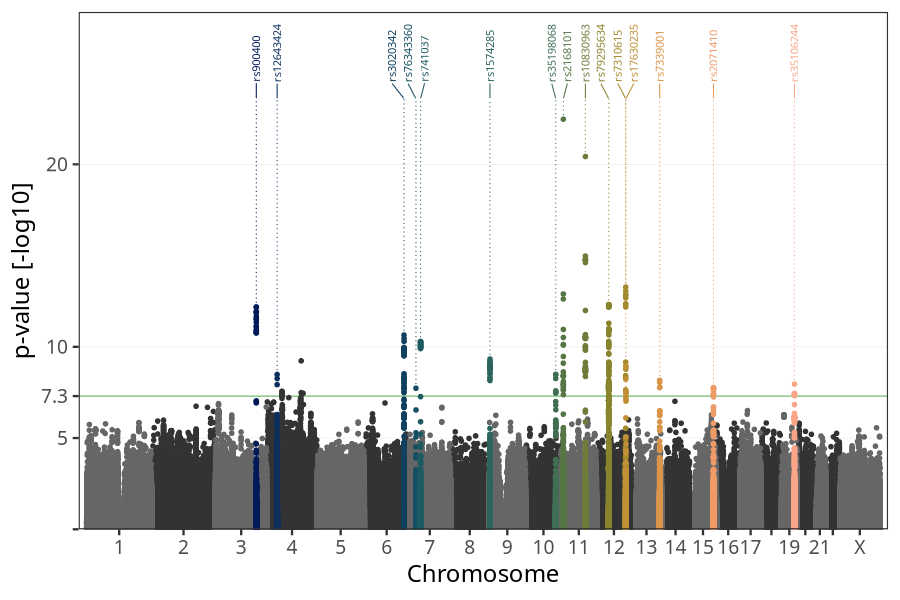
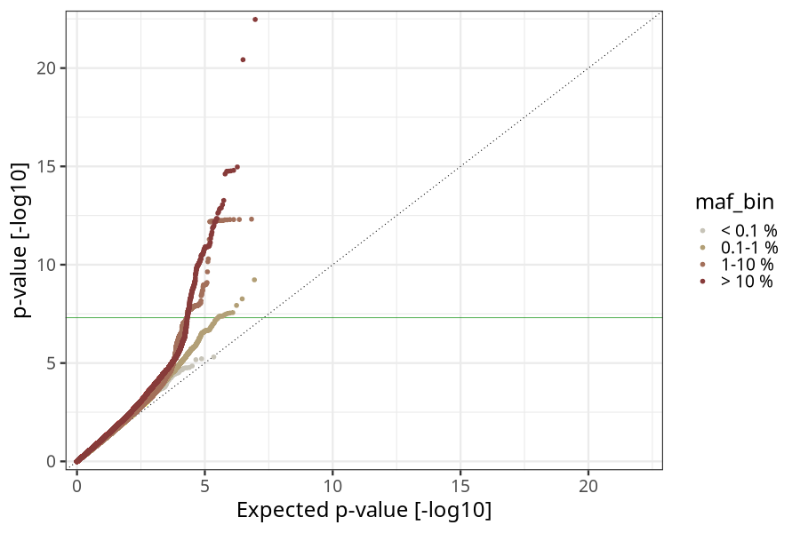
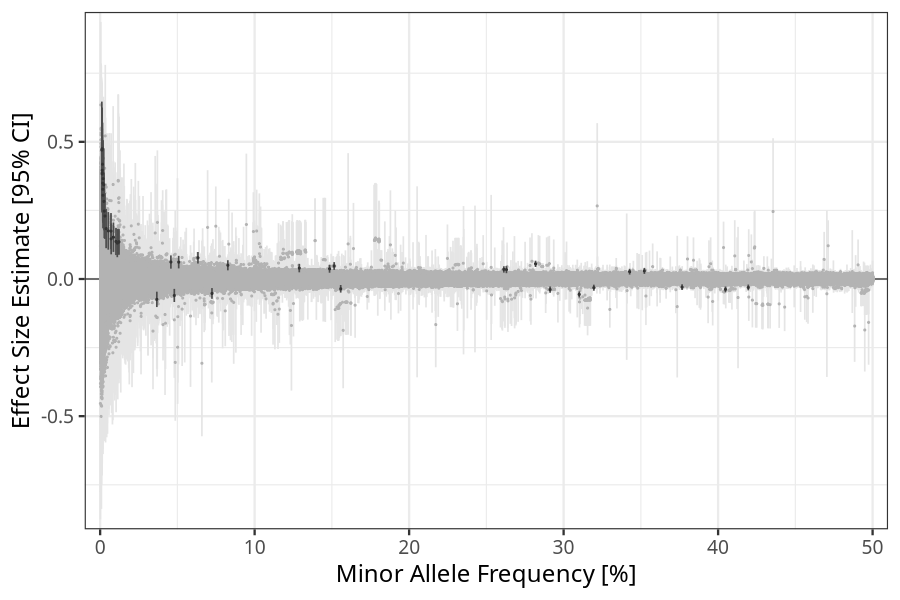
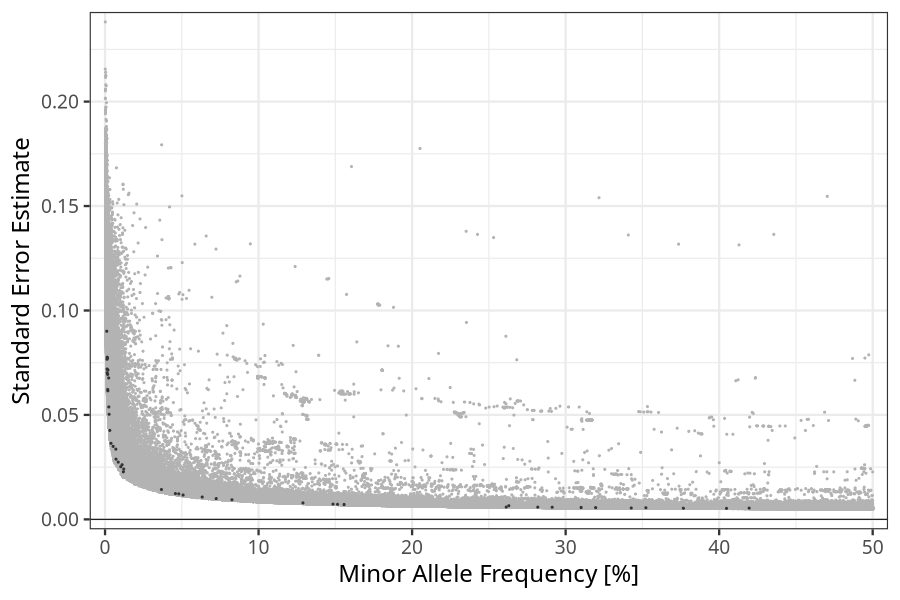

## weight_birth in mothers
Association results by regenie for weight_birth in mothers, followed by simple pruning of the hits passing p < 5e-08.
### Manhattan

### Top hits
| SNP | chr | bp | allele 0 | allele 1 | allele 1 freq | beta | se | log10p | n |
| --- | --- | -- | -------- | -------- | ------------- | ---- | -- | ------ | - |
| rs900400 | 3 | 156798775 | T | C | 0.404775 | -0.0377801 | 0.00525787 | 12.174 | 58314 |
| rs12648333 | 4 | 130491944 | T | C | 0.00127871 | 0.474613 | 0.0766251 | 9.23156 | 58314 |
| rs12643424 | 4 | 38514427 | A | G | 0.0119322 | 0.134624 | 0.0227535 | 8.4833 | 58314 |
| rs55705732 | 4 | 57121857 | C | G | 0.0085967 | 0.152314 | 0.0274033 | 7.56463 | 58314 |
| rs78331365 | 4 | 138087197 | G | A | 0.0013818 | 0.386896 | 0.0701975 | 7.44889 | 58314 |
| rs3020342 | 6 | 152047753 | A | G | 0.291252 | -0.0386442 | 0.00577736 | 10.6481 | 58314 |
| rs741037 | 7 | 44232833 | G | A | 0.151474 | 0.0473265 | 0.00720647 | 10.2902 | 58314 |
| rs76343360 | 7 | 26504924 | C | T | 0.0121592 | 0.135432 | 0.02408 | 7.72976 | 58314 |
| rs1574285 | 9 | 4283137 | G | T | 0.566223 | -0.0326033 | 0.00523322 | 9.3314 | 58314 |
| rs35198068 | 10 | 114754784 | T | C | 0.261312 | 0.0348854 | 0.00589411 | 8.48877 | 58314 |
| rs2168101 | 11 | 8255408 | C | A | 0.310093 | -0.0561856 | 0.0056633 | 22.4718 | 58314 |
| rs10830963 | 11 | 92708710 | C | G | 0.281835 | 0.055125 | 0.00583995 | 20.4256 | 58314 |
| rs7310615 | 12 | 111865049 | C | G | 0.548951 | 0.0391228 | 0.00520132 | 13.267 | 58314 |
| rs79295634 | 12 | 47180008 | A | G | 0.0632976 | 0.0773228 | 0.0106943 | 12.3169 | 58314 |
| rs17630235 | 12 | 112591686 | G | A | 0.376688 | -0.0295821 | 0.00532161 | 7.56619 | 58314 |
| rs7339001 | 13 | 108128848 | T | A | 0.519941 | -0.0299518 | 0.00516819 | 8.1665 | 58314 |
| rs2071410 | 15 | 91420940 | C | G | 0.319564 | -0.0316111 | 0.00560506 | 7.76879 | 58314 |
| rs35106244 | 19 | 49203829 | C | T | 0.419532 | -0.030775 | 0.00538512 | 7.95933 | 58314 |
### Quality Control
- QQ plot

- Beta vs. Allele Frequency

- Standard error vs. Allele Frequency

