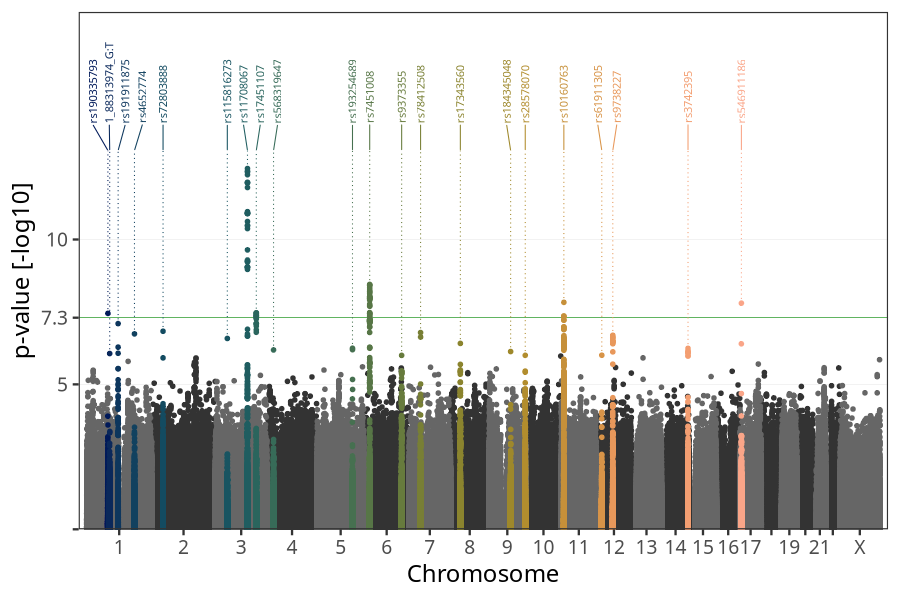
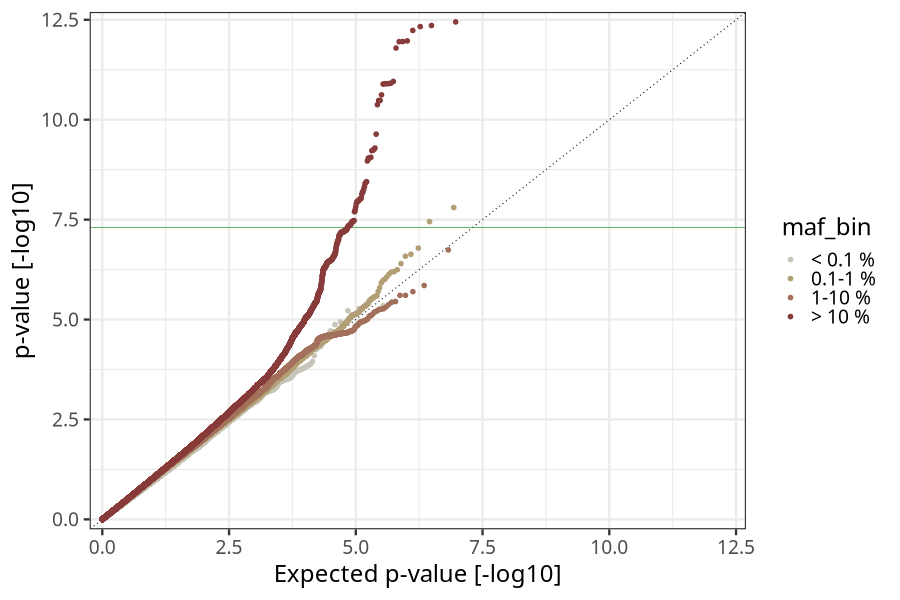
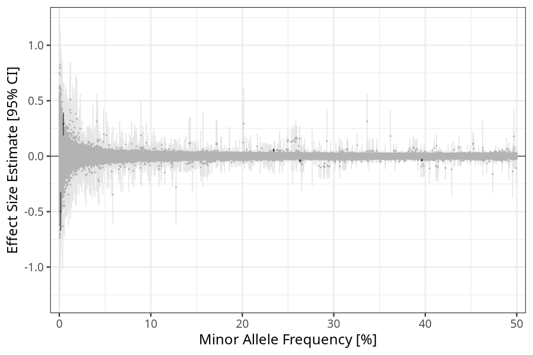
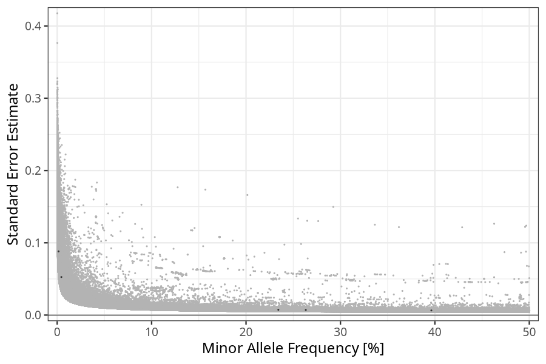

## weight_birth in parents
Association results by regenie for weight_birth in parents, followed by simple pruning of the hits passing p < 5e-08.
### Manhattan

### Top hits
| SNP | chr | bp | allele 0 | allele 1 | allele 1 freq | beta | se | log10p | n |
| --- | --- | -- | -------- | -------- | ------------- | ---- | -- | ------ | - |
| rs190335793 | 1 | 81421617 | G | A | 0.00442756 | 0.290058 | 0.0526239 | 7.4498 | 40100 |
| rs11708067 | 3 | 123065778 | A | G | 0.234227 | 0.0536755 | 0.0073822 | 12.4473 | 40100 |
| rs17451107 | 3 | 156797609 | T | C | 0.396259 | -0.0354042 | 0.0064163 | 7.46447 | 40100 |
| rs7451008 | 6 | 20673880 | T | C | 0.263288 | -0.0417759 | 0.00707627 | 8.44915 | 40100 |
| rs10160763 | 11 | 10238173 | G | T | 0.593263 | 0.0360078 | 0.00635715 | 7.83044 | 40100 |
| rs546911186 | 17 | 5341026 | G | C | 0.00146814 | -0.498178 | 0.0881272 | 7.8021 | 40100 |
### Quality Control
- QQ plot

- Beta vs. Allele Frequency

- Standard error vs. Allele Frequency

