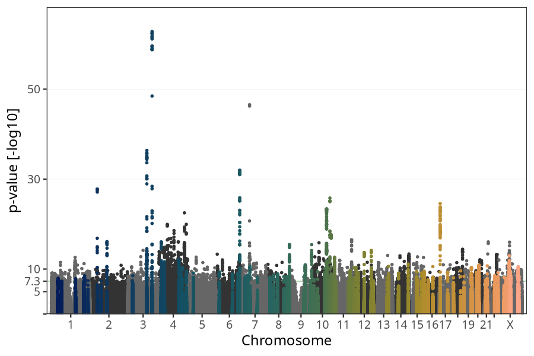
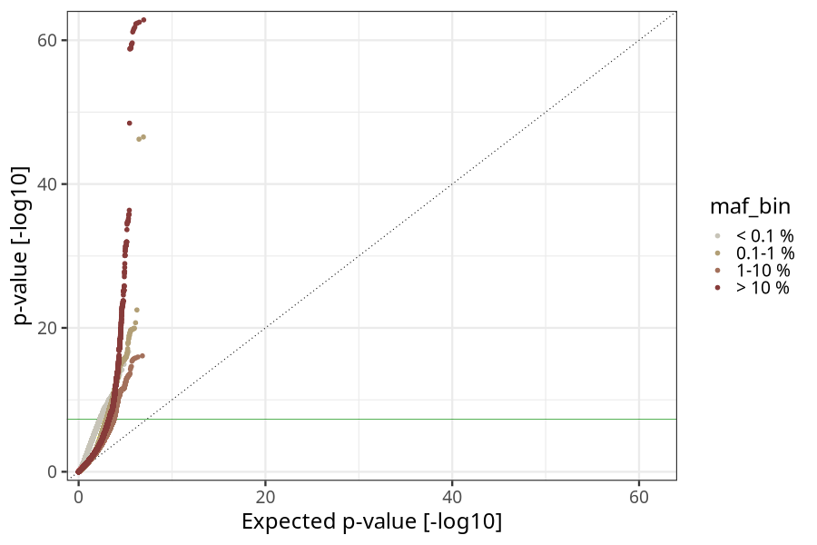
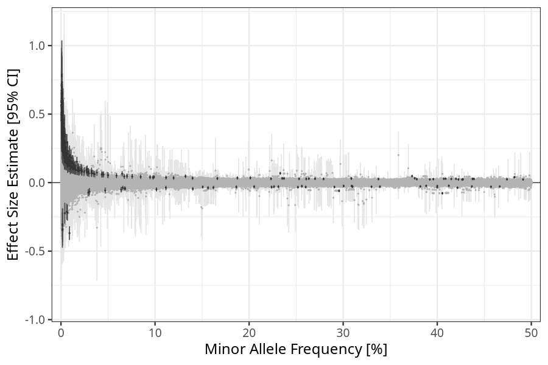
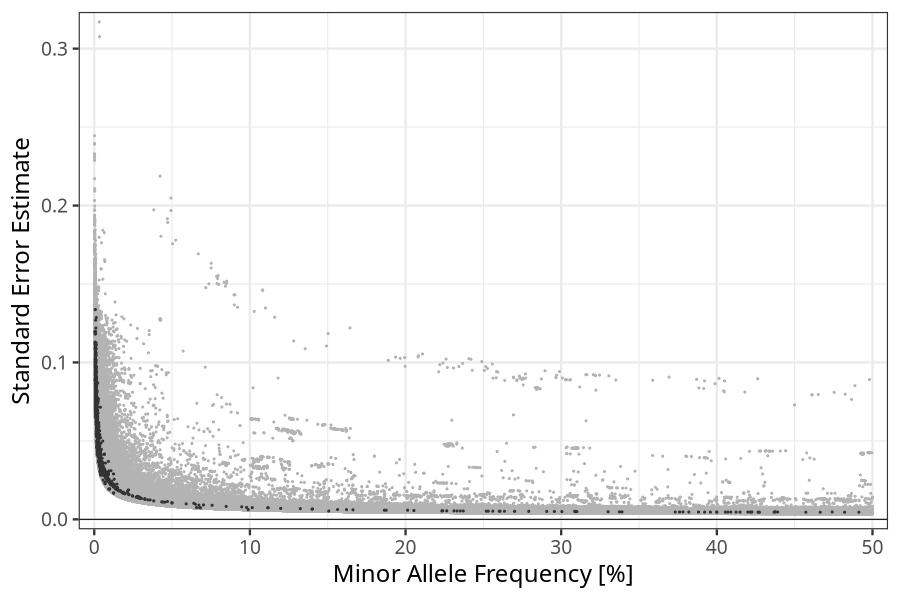

## Birth weight in children
Association results by regenie for Birth weight (weight_birth, quantitative) in children
 using the following covariates: n_previous_deliveries, pregnancy_duration, sex, plural_birth, and genotyping batch
. Simple bp-window pruning of the hits passing p < 5e-08.

Note:
- Markers with a maf < 0.01 are not annotated on the Manhattan plot.
- Markers in the HLA region are not annotated on the Manhattan plot.
### Manhattan

### Top hits common (maf ≥ 1%)
| SNP | chr | bp | allele 0 | allele 1 | allele 1 freq | beta | se | log10p | n | gene |
| --- | --- | -- | -------- | -------- | ------------- | ---- | -- | ------ | - | ---- |
| rs4100072 | 1 | 214181687 | C | T | 0.20132 | 0.034617 | 0.00584717 | 8.49301 | 70952 | [PROX1](ensembl/rs4100072.md) |
| rs12048338 | 1 | 208699659 | G | A | 0.0292843 | 0.0787529 | 0.0137502 | 7.99146 | 70952 | [PLXNA2](ensembl/rs12048338.md) |
| rs841851 | 1 | 43401829 | A | G | 0.237093 | 0.0305079 | 0.0053487 | 7.93119 | 70952 | [SLC2A1](ensembl/rs841851.md) |
| rs114940022 | 1 | 155937390 | C | T | 0.0215754 | 0.0948627 | 0.0166962 | 7.87499 | 70952 | [ARHGEF2](ensembl/rs114940022.md) |
| rs114130331 | 1 | 155306195 | T | C | 0.0274772 | 0.0804628 | 0.0145372 | 7.50681 | 70952 | [ASH1L](ensembl/rs114130331.md) |
| rs7521792 | 1 | 40402527 | C | T | 0.0150701 | 0.104093 | 0.0189025 | 7.43732 | 70952 | [MFSD2A](ensembl/rs7521792.md) |
| rs4319319 | 1 | 235785887 | C | T | 0.0132303 | 0.114542 | 0.0208538 | 7.40233 | 70952 | [GNG4](ensembl/rs4319319.md) |
| rs11208718 | 1 | 66158995 | G | A | 0.39586 | 0.0252438 | 0.00462941 | 7.30497 | 70952 | [LEPR](ensembl/rs11208718.md) |
| rs2797389 | 1 | 215727836 | A | T | 0.253131 | 0.0281386 | 0.00522623 | 7.13786 | 70952 | [KCTD3](ensembl/rs2797389.md) |
| rs7522177 | 1 | 45678395 | G | C | 0.400025 | -0.0246271 | 0.00461556 | 7.02142 | 70952 | [ZSWIM5](ensembl/rs7522177.md) |
| rs2363768 | 1 | 202934044 | A | G | 0.0344467 | 0.0661055 | 0.0124151 | 6.99492 | 70952 | [CYB5R1](ensembl/rs2363768.md) |
| rs4844500 | 1 | 210082206 | A | G | 0.0244836 | 0.0771758 | 0.0150628 | 6.52326 | 70952 | [SYT14](ensembl/rs4844500.md) |
| rs7527327 | 1 | 53446736 | C | T | 0.0359046 | 0.0615972 | 0.0123886 | 6.17893 | 70952 | [SCP2](ensembl/rs7527327.md) |
| rs17034876 | 2 | 46484310 | C | T | 0.693916 | 0.0555485 | 0.00501533 | 27.7838 | 70952 | [EPAS1](ensembl/rs17034876.md) |
| rs11123695 | 2 | 109082052 | A | T | 0.0169406 | 0.152417 | 0.0182862 | 16.111 | 70952 | [GCC2](ensembl/rs11123695.md) |
| rs4145015 | 2 | 108356871 | G | A | 0.0116626 | 0.14529 | 0.0218183 | 10.5599 | 70952 | [RGPD4](ensembl/rs4145015.md) |
| rs60035770 | 2 | 71038270 | T | G | 0.0105124 | 0.123516 | 0.0225466 | 7.36703 | 70952 | [CLEC4F](ensembl/rs60035770.md) |
| rs115191209 | 2 | 158478191 | G | A | 0.028015 | 0.076715 | 0.0142255 | 7.15876 | 70952 | [ACVR1C](ensembl/rs115191209.md) |
| rs17014206 | 2 | 77736014 | A | C | 0.044114 | 0.0592869 | 0.0110639 | 7.07632 | 70952 | [LRRTM4](ensembl/rs17014206.md) |
| rs9973507 | 2 | 191725648 | C | A | 0.223324 | 0.0283614 | 0.00541893 | 6.77967 | 70952 | [AC005540.3](ensembl/rs9973507.md) |
| rs12622323 | 2 | 231833436 | C | T | 0.0149017 | 0.0960419 | 0.0195913 | 6.02347 | 70952 | [GPR55](ensembl/rs12622323.md) |
| rs900400 | 3 | 156798775 | T | C | 0.405478 | -0.0776675 | 0.0046151 | 62.8249 | 70952 | [LEKR1](ensembl/rs900400.md) |
| rs11708067 | 3 | 123065778 | A | G | 0.233066 | 0.0679717 | 0.00534223 | 36.3586 | 70952 | [ADCY5](ensembl/rs11708067.md) |
| rs12488341 | 3 | 32917415 | G | A | 0.308676 | 0.0301159 | 0.00507488 | 8.53009 | 70952 | [TRIM71](ensembl/rs12488341.md) |
| rs1025644 | 3 | 29331859 | C | T | 0.909876 | -0.0433778 | 0.00788018 | 7.43197 | 70952 | [RBMS3-AS3, RBMS3](ensembl/rs1025644.md) |
| rs7431084 | 3 | 156243617 | A | G | 0.231112 | -0.0296614 | 0.00540285 | 7.39573 | 70952 | [KCNAB1](ensembl/rs7431084.md) |
| rs9844281 | 3 | 66749035 | T | A | 0.0847591 | 0.0423175 | 0.00823484 | 6.55838 | 70952 | [LRIG1](ensembl/rs9844281.md) |
| rs2687739 | 3 | 193521978 | G | A | 0.260714 | 0.0265422 | 0.00517595 | 6.53335 | 70952 | [OPA1](ensembl/rs2687739.md) |
| rs145849771 | 3 | 154226213 | A | G | 0.0284432 | 0.0746035 | 0.0145834 | 6.50488 | 70952 | [GPR149](ensembl/rs145849771.md) |
| rs724577 | 4 | 17993410 | A | C | 0.737167 | -0.0426588 | 0.00513503 | 16.0096 | 70952 | [LCORL](ensembl/rs724577.md) |
| rs967002 | 4 | 130945727 | A | G | 0.0279328 | 0.0985431 | 0.0137708 | 12.0804 | 70952 | No gene found |
| rs17581757 | 4 | 38536135 | G | A | 0.0106984 | 0.154866 | 0.0223259 | 11.3961 | 70952 | [RP11-617D20.1](ensembl/rs17581757.md) |
| rs12645094 | 4 | 156197471 | A | C | 0.0134627 | 0.129826 | 0.0197246 | 10.3332 | 70952 | [AC097467.2](ensembl/rs12645094.md) |
| rs61363002 | 4 | 134906168 | A | G | 0.0269555 | 0.0920885 | 0.0140709 | 10.2244 | 70952 | [PABPC4L](ensembl/rs61363002.md) |
| rs12499923 | 4 | 180528229 | G | C | 0.0179861 | 0.107333 | 0.0170796 | 9.48223 | 70952 | No gene found |
| rs2131354 | 4 | 145599908 | G | A | 0.535434 | 0.0269708 | 0.00454422 | 8.53239 | 70952 | [HHIP](ensembl/rs2131354.md) |
| rs4835204 | 4 | 144515216 | G | T | 0.0325155 | 0.0729191 | 0.0129448 | 7.75197 | 70952 | [FREM3](ensembl/rs4835204.md) |
| rs74788800 | 4 | 94247261 | G | T | 0.0132434 | 0.109333 | 0.0205979 | 6.95526 | 70952 | [GRID2](ensembl/rs74788800.md) |
| rs1947867 | 4 | 9584773 | A | G | 0.971985 | -0.0704864 | 0.0136643 | 6.6038 | 70952 | [DEFB131](ensembl/rs1947867.md) |
| rs35503308 | 4 | 1784211 | C | G | 0.508269 | 0.0235149 | 0.00468501 | 6.28489 | 70952 | [FGFR3](ensembl/rs35503308.md) |
| rs13137747 | 4 | 3437086 | C | T | 0.422494 | 0.0230938 | 0.0046661 | 6.1279 | 70952 | [RGS12](ensembl/rs13137747.md) |
| rs183671 | 5 | 33964210 | T | G | 0.975526 | -0.0977277 | 0.0158978 | 9.10329 | 70952 | [SLC45A2](ensembl/rs183671.md) |
| rs12651925 | 5 | 164461883 | A | G | 0.0186058 | 0.0909141 | 0.0172296 | 6.88079 | 70952 | [CTC-340A15.2](ensembl/rs12651925.md) |
| rs329121 | 5 | 133863352 | G | C | 0.624657 | 0.0243283 | 0.00470159 | 6.64103 | 70952 | [JADE2](ensembl/rs329121.md) |
| rs2306193 | 5 | 78302549 | G | A | 0.0138688 | 0.100689 | 0.0194673 | 6.63573 | 70952 | [DMGDH](ensembl/rs2306193.md) |
| rs17068894 | 5 | 167076663 | A | G | 0.0138471 | 0.103737 | 0.0201538 | 6.57791 | 70952 | [TENM2](ensembl/rs17068894.md) |
| rs4019243 | 5 | 90587888 | G | A | 0.846024 | -0.0324462 | 0.00631532 | 6.55576 | 70952 | [CTD-2061E19.6](ensembl/rs4019243.md) |
| rs66584692 | 5 | 158392277 | G | A | 0.388231 | -0.0236881 | 0.00465472 | 6.44388 | 70952 | [EBF1](ensembl/rs66584692.md) |
| rs145800063 | 5 | 28537444 | G | A | 0.0173117 | 0.0889636 | 0.0176835 | 6.31136 | 70952 | No gene found |
| rs72801474 | 5 | 132444128 | G | A | 0.111661 | 0.0370443 | 0.00740581 | 6.24626 | 70952 | [HSPA4](ensembl/rs72801474.md) |
| rs11955753 | 5 | 65294061 | T | A | 0.0112853 | 0.120619 | 0.0243085 | 6.15632 | 70952 | [ERBB2IP](ensembl/rs11955753.md) |
| rs851976 | 6 | 152030008 | T | C | 0.295597 | -0.0598186 | 0.0050245 | 31.9549 | 70952 | [ESR1](ensembl/rs851976.md) |
| rs9368222 | 6 | 20686996 | C | A | 0.260193 | -0.0321165 | 0.00515415 | 9.33451 | 70952 | [CDKAL1](ensembl/rs9368222.md) |
| rs2225906 | 6 | 141869843 | T | C | 0.754839 | 0.0322787 | 0.0052581 | 9.08031 | 70952 | No gene found |
| rs12525502 | 6 | 105344946 | G | T | 0.156346 | -0.0378707 | 0.00625585 | 8.84893 | 70952 | [HACE1](ensembl/rs12525502.md) |
| rs13215673 | 6 | 8180472 | C | T | 0.0452484 | 0.0596629 | 0.0109671 | 7.27387 | 70952 | [EEF1E1](ensembl/rs13215673.md) |
| rs3907648 | 6 | 74395505 | G | A | 0.665421 | 0.0260795 | 0.00484063 | 7.14634 | 70952 | [RP11-553A21.3](ensembl/rs3907648.md) |
| rs9467253 | 6 | 24677326 | C | T | 0.0433011 | 0.0593657 | 0.0111324 | 7.0143 | 70952 | [ACOT13](ensembl/rs9467253.md) |
| rs12199884 | 6 | 51783278 | T | C | 0.205364 | -0.0300207 | 0.00563579 | 7.00018 | 70952 | [PKHD1](ensembl/rs12199884.md) |
| rs9689096 | 6 | 34188892 | A | C | 0.0498714 | 0.0554447 | 0.0105539 | 6.82613 | 70952 | [HMGA1](ensembl/rs9689096.md) |
| rs7744902 | 6 | 166176722 | G | A | 0.0701963 | 0.0477959 | 0.00918381 | 6.71073 | 70952 | [PDE10A](ensembl/rs7744902.md) |
| rs9396979 | 6 | 169982242 | G | T | 0.0110969 | 0.115024 | 0.0223643 | 6.56842 | 70952 | [WDR27](ensembl/rs9396979.md) |
| rs7738930 | 6 | 163320125 | C | T | 0.0159565 | 0.0926248 | 0.0180188 | 6.56213 | 70952 | [PACRG](ensembl/rs7738930.md) |
| rs1775878 | 6 | 91589098 | C | T | 0.589332 | 0.0234963 | 0.00464534 | 6.37306 | 70952 | [MAP3K7](ensembl/rs1775878.md) |
| rs72868643 | 6 | 57095039 | C | T | 0.0639553 | -0.0514186 | 0.010211 | 6.32209 | 70952 | [RAB23](ensembl/rs72868643.md) |
| rs11961412 | 6 | 81051896 | A | G | 0.0500235 | 0.0523824 | 0.0104582 | 6.26135 | 70952 | [BCKDHB](ensembl/rs11961412.md) |
| rs9366889 | 6 | 35508565 | C | T | 0.300478 | -0.0245966 | 0.00494265 | 6.18856 | 70952 | [TULP1](ensembl/rs9366889.md) |
| rs80121495 | 7 | 47269931 | G | T | 0.0650005 | 0.0645671 | 0.00966813 | 10.6168 | 70952 | [TNS3](ensembl/rs80121495.md) |
| rs7790968 | 7 | 35299896 | C | T | 0.382023 | -0.0279645 | 0.00466727 | 8.6824 | 70952 | [TBX20](ensembl/rs7790968.md) |
| rs12667418 | 7 | 16122923 | T | C | 0.414919 | 0.0267139 | 0.004592 | 8.22374 | 70952 | [ISPD](ensembl/rs12667418.md) |
| rs74298926 | 7 | 94593361 | C | T | 0.0145624 | 0.109527 | 0.0188899 | 8.17363 | 70952 | [PPP1R9A](ensembl/rs74298926.md) |
| rs34776209 | 7 | 23513093 | C | T | 0.226474 | -0.0297254 | 0.00543335 | 7.34898 | 70952 | [IGF2BP3](ensembl/rs34776209.md) |
| rs6467120 | 7 | 126961533 | G | A | 0.621396 | 0.0247901 | 0.00464625 | 7.02102 | 70952 | [ZNF800](ensembl/rs6467120.md) |
| rs17153806 | 7 | 26574266 | T | C | 0.0141571 | 0.0996863 | 0.0191752 | 6.69751 | 70952 | [KIAA0087](ensembl/rs17153806.md) |
| rs73133091 | 7 | 72828329 | G | T | 0.0590318 | 0.05089 | 0.00987735 | 6.58928 | 70952 | [FZD9](ensembl/rs73133091.md) |
| rs147778456 | 7 | 72130154 | G | A | 0.0222678 | 0.0803866 | 0.0157597 | 6.47075 | 70952 | [CALN1](ensembl/rs147778456.md) |
| rs1592388 | 7 | 125736495 | G | A | 0.308993 | -0.025015 | 0.00491665 | 6.44102 | 70952 | [AC000370.2](ensembl/rs1592388.md) |
| rs2301680 | 7 | 93116299 | A | G | 0.491243 | 0.0228684 | 0.00452266 | 6.36935 | 70952 | [CALCR](ensembl/rs2301680.md) |
| rs2010596 | 8 | 142243742 | C | T | 0.421527 | -0.0373831 | 0.00458586 | 15.4455 | 70952 | [SLC45A4](ensembl/rs2010596.md) |
| rs56080166 | 8 | 66795198 | G | A | 0.339063 | -0.0290523 | 0.00477233 | 8.94089 | 70952 | [PDE7A](ensembl/rs56080166.md) |
| rs6986080 | 8 | 41488038 | G | C | 0.223913 | -0.0326696 | 0.00546284 | 8.65229 | 70952 | [AGPAT6](ensembl/rs6986080.md) |
| rs10109137 | 8 | 126462698 | C | T | 0.013415 | 0.11712 | 0.0199729 | 8.34483 | 70952 | [TRIB1](ensembl/rs10109137.md) |
| rs10505073 | 8 | 106112262 | G | C | 0.187541 | 0.034034 | 0.00582969 | 8.27722 | 70952 | [RP11-127H5.1](ensembl/rs10505073.md) |
| rs2285284 | 8 | 17198438 | T | G | 0.235169 | 0.0310459 | 0.0053445 | 8.20156 | 70952 | [MTMR7](ensembl/rs2285284.md) |
| rs9643349 | 8 | 95818634 | C | T | 0.474127 | 0.0241456 | 0.00469699 | 6.56258 | 70952 | [INTS8](ensembl/rs9643349.md) |
| rs7015836 | 8 | 28593399 | C | T | 0.599529 | 0.023283 | 0.00462569 | 6.3171 | 70952 | [EXTL3](ensembl/rs7015836.md) |
| rs6998375 | 8 | 25046216 | A | G | 0.800787 | -0.028628 | 0.00569503 | 6.30221 | 70952 | [DOCK5](ensembl/rs6998375.md) |
| rs62507623 | 8 | 72120079 | T | C | 0.0123526 | 0.144011 | 0.028941 | 6.18771 | 70952 | [EYA1](ensembl/rs62507623.md) |
| rs6471586 | 8 | 144005573 | A | G | 0.976296 | -0.0738912 | 0.0148505 | 6.18692 | 70952 | [CYP11B2](ensembl/rs6471586.md) |
| rs28578070 | 9 | 139248216 | A | G | 0.580927 | -0.0402957 | 0.00494663 | 15.4249 | 70952 | [GPSM1](ensembl/rs28578070.md) |
| rs28377268 | 9 | 98225056 | G | T | 0.132393 | 0.0462522 | 0.00681537 | 10.9396 | 70952 | [PTCH1](ensembl/rs28377268.md) |
| rs3750390 | 9 | 88692336 | C | T | 0.0107492 | 0.180843 | 0.0310171 | 8.25735 | 70952 | [GOLM1](ensembl/rs3750390.md) |
| rs7871091 | 9 | 129559935 | A | G | 0.0128113 | 0.140669 | 0.0255486 | 7.43508 | 70952 | [ZBTB43](ensembl/rs7871091.md) |
| rs2418444 | 9 | 119105667 | T | G | 0.800686 | 0.0296336 | 0.0059697 | 6.1608 | 70952 | [PAPPA](ensembl/rs2418444.md) |
| rs10817523 | 9 | 116569532 | T | C | 0.0219572 | 0.0917317 | 0.018722 | 6.01774 | 70952 | [ZNF618](ensembl/rs10817523.md) |
| rs1801253 | 10 | 115805056 | G | C | 0.73772 | 0.0548395 | 0.00514663 | 25.7838 | 70952 | [ADRB1](ensembl/rs1801253.md) |
| rs11187140 | 10 | 94466910 | G | A | 0.373252 | 0.0474021 | 0.00468146 | 23.3708 | 70952 | [HHEX](ensembl/rs11187140.md) |
| rs71486610 | 10 | 124134803 | G | C | 0.482096 | 0.0395324 | 0.00452147 | 17.6449 | 70952 | [PLEKHA1](ensembl/rs71486610.md) |
| rs11814171 | 10 | 97861234 | A | G | 0.0104136 | 0.157574 | 0.0224561 | 11.6446 | 70952 | [ENTPD1-AS1](ensembl/rs11814171.md) |
| rs7100689 | 10 | 82222178 | C | A | 0.756228 | 0.0347428 | 0.00533146 | 10.1431 | 70952 | [TSPAN14](ensembl/rs7100689.md) |
| rs12412437 | 10 | 37096493 | C | A | 0.0185602 | 0.106371 | 0.0169892 | 9.41765 | 70952 | [NAMPTL](ensembl/rs12412437.md) |
| rs10786156 | 10 | 96014622 | C | G | 0.407017 | 0.0284358 | 0.00460116 | 9.19353 | 70952 | [PLCE1](ensembl/rs10786156.md) |
| rs7903146 | 10 | 114758349 | C | T | 0.263537 | 0.029037 | 0.00514116 | 7.78946 | 70952 | [TCF7L2](ensembl/rs7903146.md) |
| rs1953314 | 10 | 13135831 | T | C | 0.87151 | -0.0399789 | 0.00713673 | 7.67352 | 70952 | [CCDC3](ensembl/rs1953314.md) |
| rs150595320 | 10 | 95213678 | G | A | 0.0187214 | 0.0905388 | 0.0168122 | 7.1407 | 70952 | [MYOF](ensembl/rs150595320.md) |
| rs60285632 | 10 | 112849372 | C | T | 0.0124023 | 0.10754 | 0.0206333 | 6.72855 | 70952 | [ADRA2A](ensembl/rs60285632.md) |
| rs5030936 | 10 | 70975642 | A | G | 0.957678 | 0.0581779 | 0.0112562 | 6.62719 | 70952 | [RP11-227H15.4](ensembl/rs5030936.md) |
| rs2646395 | 10 | 8576425 | G | A | 0.0978724 | 0.0375454 | 0.00762377 | 6.07338 | 70952 | [GATA3](ensembl/rs2646395.md) |
| rs61850540 | 10 | 57473212 | C | G | 0.0303224 | -0.0650312 | 0.0132617 | 6.02659 | 70952 | [PCDH15](ensembl/rs61850540.md) |
| rs1562782 | 11 | 10342711 | A | G | 0.399896 | -0.0340777 | 0.00464773 | 12.6448 | 70952 | [AMPD3](ensembl/rs1562782.md) |
| rs3016421 | 11 | 134553466 | G | A | 0.0152092 | 0.122516 | 0.0186191 | 10.3279 | 70952 | [B3GAT1](ensembl/rs3016421.md) |
| rs11213970 | 11 | 111528911 | G | A | 0.251884 | -0.0330997 | 0.00520911 | 9.67879 | 70952 | [SIK2](ensembl/rs11213970.md) |
| rs2168101 | 11 | 8255408 | C | A | 0.31005 | -0.0289454 | 0.00495014 | 8.30161 | 70952 | [LMO1](ensembl/rs2168101.md) |
| rs4757474 | 11 | 17013974 | T | C | 0.337487 | 0.0262445 | 0.00476781 | 7.43156 | 70952 | [PLEKHA7](ensembl/rs4757474.md) |
| rs11037265 | 11 | 1652383 | A | C | 0.186405 | -0.0318169 | 0.00581184 | 7.35777 | 70952 | [KRTAP5-5](ensembl/rs11037265.md) |
| rs1940486 | 11 | 98939756 | G | T | 0.0197933 | 0.0890023 | 0.0162833 | 7.33665 | 70952 | [CNTN5](ensembl/rs1940486.md) |
| rs2303385 | 11 | 65640562 | G | A | 0.656027 | -0.0255705 | 0.00477921 | 7.0566 | 70952 | [EFEMP2](ensembl/rs2303385.md) |
| rs3213221 | 11 | 2157044 | C | G | 0.622913 | -0.0242604 | 0.00467588 | 6.67351 | 70952 | [IGF2, INS-IGF2](ensembl/rs3213221.md) |
| rs7310615 | 12 | 111865049 | C | G | 0.54865 | 0.0356928 | 0.00458611 | 14.1491 | 70952 | [SH2B3](ensembl/rs7310615.md) |
| rs7968902 | 12 | 66363070 | T | G | 0.534344 | -0.0349212 | 0.00456673 | 13.6863 | 70952 | [HMGA2](ensembl/rs7968902.md) |
| rs35756741 | 12 | 12868701 | C | T | 0.101527 | -0.0495099 | 0.00750099 | 10.3873 | 70952 | [CDKN1B](ensembl/rs35756741.md) |
| rs12823128 | 12 | 26872730 | T | C | 0.466431 | -0.0280563 | 0.00452942 | 9.23233 | 70952 | [ITPR2](ensembl/rs12823128.md) |
| rs76895963 | 12 | 4384844 | T | G | 0.0212746 | 0.102466 | 0.017828 | 8.04303 | 70952 | [CCND2-AS1, CCND2](ensembl/rs76895963.md) |
| rs10773106 | 12 | 125312073 | C | G | 0.988908 | -0.122354 | 0.0222366 | 7.42621 | 70952 | [SCARB1](ensembl/rs10773106.md) |
| rs9669403 | 12 | 46798900 | G | A | 0.37825 | 0.0254518 | 0.00473459 | 7.11757 | 70952 | [RP11-474P2.2](ensembl/rs9669403.md) |
| rs703547 | 12 | 102943707 | G | C | 0.806346 | -0.0301618 | 0.00574392 | 6.82043 | 70952 | [IGF1](ensembl/rs703547.md) |
| rs10773084 | 12 | 124792648 | G | C | 0.739605 | -0.0265268 | 0.00529626 | 6.26096 | 70952 | [FAM101A](ensembl/rs10773084.md) |
| rs9588526 | 13 | 89616728 | T | C | 0.0325494 | 0.0852586 | 0.012775 | 10.6035 | 70952 | No gene found |
| rs3898879 | 13 | 79569537 | A | G | 0.98489 | -0.107319 | 0.018674 | 8.04158 | 70952 | [RBM26](ensembl/rs3898879.md) |
| rs17079381 | 13 | 85743203 | G | A | 0.011111 | 0.113984 | 0.0218385 | 6.74593 | 70952 | No gene found |
| rs77235285 | 14 | 101198609 | C | T | 0.140172 | -0.0451824 | 0.00659925 | 11.1213 | 70952 | [DLK1](ensembl/rs77235285.md) |
| rs5029104 | 14 | 38964544 | T | C | 0.436835 | -0.0280748 | 0.00456951 | 9.09421 | 70952 | [CLEC14A](ensembl/rs5029104.md) |
| rs77065166 | 14 | 24871237 | G | A | 0.0102471 | 0.124982 | 0.0232408 | 7.12235 | 70952 | [NYNRIN](ensembl/rs77065166.md) |
| rs4900193 | 14 | 94206166 | G | A | 0.986536 | -0.10124 | 0.0197911 | 6.50449 | 70952 | [PRIMA1](ensembl/rs4900193.md) |
| rs7145817 | 14 | 42564162 | C | T | 0.0672178 | 0.0451947 | 0.00907338 | 6.19894 | 70952 | [LRFN5](ensembl/rs7145817.md) |
| rs55810078 | 15 | 96850534 | G | A | 0.290696 | -0.0319806 | 0.00507508 | 9.5305 | 70952 | [NR2F2-AS1](ensembl/rs55810078.md) |
| rs1426654 | 15 | 48426484 | A | G | 0.0130257 | 0.138471 | 0.0220477 | 9.47182 | 70952 | [SLC24A5](ensembl/rs1426654.md) |
| rs1573643 | 15 | 91420973 | T | C | 0.330165 | -0.0300523 | 0.00487174 | 9.16209 | 70952 | [FURIN](ensembl/rs1573643.md) |
| rs28394202 | 15 | 80950369 | A | G | 0.0108863 | 0.139171 | 0.0226321 | 9.10878 | 70952 | [ABHD17C](ensembl/rs28394202.md) |
| rs7402983 | 15 | 99193276 | A | C | 0.595865 | -0.0290005 | 0.00471723 | 9.10474 | 70952 | [IGF1R](ensembl/rs7402983.md) |
| rs13380145 | 15 | 47578280 | G | A | 0.018556 | 0.0978679 | 0.0167206 | 8.31657 | 70952 | [SEMA6D](ensembl/rs13380145.md) |
| rs8033577 | 15 | 56138416 | G | A | 0.773836 | 0.0302685 | 0.00541302 | 7.64836 | 70952 | [NEDD4](ensembl/rs8033577.md) |
| rs11629749 | 15 | 74919593 | C | G | 0.13989 | 0.0324532 | 0.00651448 | 6.20047 | 70952 | [CLK3](ensembl/rs11629749.md) |
| rs150598670 | 15 | 39525706 | G | T | 0.0146077 | 0.111699 | 0.022435 | 6.1939 | 70952 | [RP11-624L4.1](ensembl/rs150598670.md) |
| rs3814283 | 16 | 50268817 | G | T | 0.756848 | -0.0363152 | 0.00545589 | 10.5512 | 70952 | [PAPD5](ensembl/rs3814283.md) |
| rs1379575 | 16 | 20052123 | G | A | 0.2701 | 0.0285199 | 0.00512153 | 7.59047 | 70952 | [GPR139](ensembl/rs1379575.md) |
| rs78090050 | 16 | 61662707 | C | T | 0.111555 | -0.0374658 | 0.00739529 | 6.39158 | 70952 | [CDH8](ensembl/rs78090050.md) |
| rs1152083 | 16 | 67206375 | C | T | 0.0757135 | 0.0452424 | 0.00894539 | 6.3721 | 70952 | [NOL3](ensembl/rs1152083.md) |
| rs74592648 | 16 | 57060967 | G | A | 0.0102623 | 0.113716 | 0.0225485 | 6.33921 | 70952 | [NLRC5](ensembl/rs74592648.md) |
| rs222849 | 17 | 7185861 | T | C | 0.618178 | 0.0484838 | 0.00466522 | 24.572 | 70952 | [SLC2A4](ensembl/rs222849.md) |
| rs3803756 | 17 | 55363674 | A | T | 0.624655 | -0.0291142 | 0.00467908 | 9.3096 | 70952 | [MSI2](ensembl/rs3803756.md) |
| rs205039 | 17 | 11276045 | A | G | 0.392159 | 0.0230179 | 0.00462815 | 6.18198 | 70952 | [SHISA6](ensembl/rs205039.md) |
| rs11652763 | 17 | 42208172 | G | A | 0.119768 | 0.0342795 | 0.00698988 | 6.02768 | 70952 | [HDAC5](ensembl/rs11652763.md) |
| rs6505204 | 17 | 25644069 | A | G | 0.426462 | 0.0224028 | 0.00457859 | 6.0029 | 70952 | [WSB1](ensembl/rs6505204.md) |
| rs17175796 | 18 | 57945709 | G | T | 0.0122195 | 0.138448 | 0.0218775 | 9.60584 | 70952 | [MC4R](ensembl/rs17175796.md) |
| rs55638894 | 18 | 11995451 | A | G | 0.162076 | -0.035579 | 0.0061863 | 8.05264 | 70952 | [IMPA2](ensembl/rs55638894.md) |
| rs76799297 | 18 | 43339194 | G | A | 0.0297963 | 0.0681196 | 0.0136316 | 6.23527 | 70952 | [SLC14A1](ensembl/rs76799297.md) |
| rs679574 | 19 | 49206108 | C | G | 0.457172 | -0.0298163 | 0.00452777 | 10.3427 | 70952 | [FUT2](ensembl/rs679574.md) |
| rs10413888 | 19 | 1643921 | T | G | 0.419896 | 0.0274056 | 0.00465976 | 8.39041 | 70952 | [TCF3](ensembl/rs10413888.md) |
| rs1062967 | 19 | 53342152 | T | C | 0.439034 | 0.0270997 | 0.00467837 | 8.15912 | 70952 | [ZNF28, ZNF468](ensembl/rs1062967.md) |
| rs56204511 | 19 | 47776012 | C | T | 0.437485 | 0.0269328 | 0.00482957 | 7.61046 | 70952 | [CCDC9](ensembl/rs56204511.md) |
| rs12978031 | 19 | 38715972 | C | G | 0.279146 | 0.0268622 | 0.00509898 | 6.86076 | 70952 | [DPF1](ensembl/rs12978031.md) |
| rs10410204 | 19 | 7224350 | C | T | 0.585593 | -0.0240921 | 0.00458987 | 6.81543 | 70952 | [INSR](ensembl/rs10410204.md) |
| rs41355649 | 19 | 33790556 | G | A | 0.0469815 | -0.0580209 | 0.0113633 | 6.4827 | 70952 | [CTD-2540B15.11, CEBPA](ensembl/rs41355649.md) |
| rs75065878 | 19 | 2583906 | A | C | 0.015075 | 0.099 | 0.0193916 | 6.48115 | 70952 | [GNG7](ensembl/rs75065878.md) |
| rs158366 | 19 | 54705317 | C | G | 0.412337 | -0.0230843 | 0.00461187 | 6.2538 | 70952 | [RPS9](ensembl/rs158366.md) |
| rs12462414 | 19 | 15944856 | T | G | 0.0109189 | 0.10943 | 0.0219641 | 6.20161 | 70952 | [OR10H1](ensembl/rs12462414.md) |
| rs10415976 | 19 | 941603 | A | G | 0.0947127 | 0.0398152 | 0.00800283 | 6.18576 | 70952 | [ARID3A](ensembl/rs10415976.md) |
| rs6029178 | 20 | 39178557 | G | A | 0.376068 | 0.0316197 | 0.00467169 | 10.8853 | 70952 | [MAFB](ensembl/rs6029178.md) |
| rs1974 | 20 | 22562311 | G | A | 0.0382089 | 0.072764 | 0.0117501 | 9.22789 | 70952 | [FOXA2](ensembl/rs1974.md) |
| rs6134000 | 20 | 10682863 | A | G | 0.427332 | 0.0243473 | 0.00456807 | 7.00757 | 70952 | [RP11-103J8.1](ensembl/rs6134000.md) |
| rs2831539 | 21 | 29517567 | T | C | 0.0120957 | 0.152602 | 0.022732 | 10.7201 | 70952 | No gene found |
| rs79303674 | 21 | 19101703 | G | A | 0.0223158 | 0.0875394 | 0.0157955 | 7.52435 | 70952 | [C21orf91](ensembl/rs79303674.md) |
| rs9617090 | 22 | 50439194 | C | T | 0.408924 | 0.0285838 | 0.00463293 | 9.16485 | 70952 | [IL17REL](ensembl/rs9617090.md) |
| rs134569 | 22 | 29463381 | C | T | 0.635452 | -0.028008 | 0.00471206 | 8.55545 | 70952 | [C22orf31](ensembl/rs134569.md) |
| rs5752541 | 22 | 27811651 | A | T | 0.0247324 | 0.0847237 | 0.0147796 | 8.00443 | 70952 | [RP11-375H17.1](ensembl/rs5752541.md) |
| rs35582295 | 22 | 46258800 | A | G | 0.0324166 | 0.0670138 | 0.0130931 | 6.51093 | 70952 | [ATXN10](ensembl/rs35582295.md) |
| rs2285154 | 22 | 36582862 | G | A | 0.0149634 | 0.101901 | 0.0202997 | 6.28632 | 70952 | [APOL4](ensembl/rs2285154.md) |
| rs74880766 | 22 | 20171375 | A | G | 0.0190148 | 0.083518 | 0.0168427 | 6.14894 | 70952 | [XXbac-B444P24.8](ensembl/rs74880766.md) |
| rs12690254 | 23 | 71646193 | A | G | 0.0123554 | 0.117342 | 0.0168599 | 11.4675 | 70952 | No gene found |
| rs12687208 | 23 | 129087973 | T | C | 0.098923 | 0.0412436 | 0.00619159 | 10.5661 | 70952 | No gene found |
| rs2520405 | 23 | 68952086 | A | C | 0.7328 | -0.026011 | 0.0041609 | 9.39033 | 70952 | No gene found |
| rs112062503 | 23 | 79694078 | G | A | 0.150658 | -0.0315769 | 0.00529347 | 8.61217 | 70952 | No gene found |
| rs111342912 | 23 | 80572312 | G | A | 0.0682883 | -0.0438364 | 0.00739562 | 8.51161 | 70952 | No gene found |
| rs7065171 | 23 | 133683590 | C | G | 0.639814 | 0.0229824 | 0.00388902 | 8.46469 | 70952 | No gene found |
| rs112353717 | 23 | 81206719 | C | G | 0.0677121 | -0.0430581 | 0.0074159 | 8.19443 | 70952 | No gene found |
| rs2146004 | 23 | 38054282 | C | T | 0.0125058 | 0.0967276 | 0.0167079 | 8.15083 | 70952 | No gene found |
| rs6614540 | 23 | 50308735 | C | G | 0.729583 | -0.0238922 | 0.00419421 | 7.91252 | 70952 | No gene found |
| rs5937555 | 23 | 75632150 | A | G | 0.901122 | 0.034448 | 0.00639141 | 7.15142 | 70952 | No gene found |
| rs113477789 | 23 | 81732232 | C | T | 0.0656877 | -0.0375882 | 0.00749479 | 6.276 | 70952 | No gene found |
### Top hits rare (maf < 1%)
| SNP | chr | bp | allele 0 | allele 1 | allele 1 freq | beta | se | log10p | n | gene |
| --- | --- | -- | -------- | -------- | ------------- | ---- | -- | ------ | - | ---- |
| rs1846857 | 1 | 153012765 | T | C | 0.00381968 | 0.277294 | 0.0378691 | 12.6135 | 70952 | [SPRR2D](ensembl/rs1846857.md) |
| rs78488654 | 1 | 58255593 | G | A | 0.00133537 | 0.448887 | 0.0645035 | 11.4655 | 70952 | [DAB1](ensembl/rs78488654.md) |
| rs12566135 | 1 | 210646827 | C | T | 0.001412 | 0.436917 | 0.0635687 | 11.202 | 70952 | [HHAT](ensembl/rs12566135.md) |
| rs12038967 | 1 | 167841098 | G | A | 0.00157488 | 0.411111 | 0.0607375 | 10.8861 | 70952 | [ADCY10](ensembl/rs12038967.md) |
| rs12029246 | 1 | 196381177 | C | T | 0.00232322 | 0.342647 | 0.0526683 | 10.1118 | 70952 | [KCNT2](ensembl/rs12029246.md) |
| rs57221566 | 1 | 119012125 | G | C | 0.00149607 | 0.409857 | 0.0642864 | 9.739 | 70952 | [SPAG17](ensembl/rs57221566.md) |
| rs4920176 | 1 | 234453046 | A | G | 0.000912243 | 0.573102 | 0.090889 | 9.54178 | 70952 | [SLC35F3](ensembl/rs4920176.md) |
| rs78356984 | 1 | 246423579 | A | G | 0.00212519 | 0.31345 | 0.0499582 | 9.45425 | 70952 | [SMYD3](ensembl/rs78356984.md) |
| rs12239759 | 1 | 61442735 | G | A | 0.0056133 | 0.195934 | 0.0313351 | 9.39473 | 70952 | [NFIA](ensembl/rs12239759.md) |
| rs10916164 | 1 | 227752690 | T | C | 0.00190562 | 0.351096 | 0.0562289 | 9.37021 | 70952 | [ZNF678](ensembl/rs10916164.md) |
| rs117005242 | 1 | 88725266 | C | T | 0.00105703 | 0.483145 | 0.0779094 | 9.25204 | 70952 | [RP11-76N22.2](ensembl/rs117005242.md) |
| rs12066022 | 1 | 151576357 | C | A | 0.00300482 | 0.265289 | 0.0427901 | 9.24764 | 70952 | [RP11-404E16.1](ensembl/rs12066022.md) |
| rs77102434 | 1 | 5729933 | C | T | 0.000901079 | 0.512835 | 0.0831703 | 9.1549 | 70952 | [NPHP4](ensembl/rs77102434.md) |
| rs16845202 | 1 | 172939504 | A | G | 0.00265609 | 0.334782 | 0.0543801 | 9.12813 | 70952 | [TNFSF18](ensembl/rs16845202.md) |
| rs79403508 | 1 | 222544714 | A | G | 0.00142438 | 0.431801 | 0.0701432 | 9.12718 | 70952 | [HHIPL2](ensembl/rs79403508.md) |
| rs1827954 | 1 | 20377632 | A | C | 0.00199765 | 0.340913 | 0.0556582 | 9.04277 | 70952 | [PLA2G5](ensembl/rs1827954.md) |
| rs201273633 | 1 | 1302536 | A | G | 0.00431289 | 0.296935 | 0.0484911 | 9.03835 | 70952 | [MXRA8](ensembl/rs201273633.md) |
| rs7546799 | 1 | 111127675 | T | C | 0.00179232 | 0.381214 | 0.0623913 | 9.00175 | 70952 | [KCNA2](ensembl/rs7546799.md) |
| rs2078097 | 1 | 201724760 | A | G | 0.000955355 | 0.536506 | 0.0878224 | 8.99883 | 70952 | [NAV1, IPO9-AS1](ensembl/rs2078097.md) |
| rs55901788 | 1 | 240741342 | G | A | 0.00188879 | 0.366402 | 0.0603206 | 8.90457 | 70952 | [GREM2](ensembl/rs55901788.md) |
| rs11163894 | 1 | 76114357 | C | G | 0.00164618 | 0.438227 | 0.0721942 | 8.8934 | 70952 | [SLC44A5](ensembl/rs11163894.md) |
| rs75738382 | 1 | 235182889 | G | A | 0.00388191 | 0.26349 | 0.0435754 | 8.83039 | 70952 | [TOMM20](ensembl/rs75738382.md) |
| rs74060948 | 1 | 27976723 | C | G | 0.003244 | 0.288794 | 0.0479309 | 8.77241 | 70952 | [FGR](ensembl/rs74060948.md) |
| rs57450080 | 1 | 60658917 | A | G | 0.00341001 | 0.269679 | 0.0448336 | 8.74531 | 70952 | [C1orf87](ensembl/rs57450080.md) |
| rs146321861 | 1 | 224945818 | G | A | 0.0007697 | 0.628155 | 0.105826 | 8.53377 | 70952 | [RP11-449J1.1](ensembl/rs146321861.md) |
| rs11802696 | 1 | 42590063 | C | T | 0.000735736 | 0.524536 | 0.0888754 | 8.44456 | 70952 | [GUCA2B](ensembl/rs11802696.md) |
| rs370377388 | 1 | 4714715 | G | C | 0.00096102 | 0.494928 | 0.0839498 | 8.42772 | 70952 | [AJAP1](ensembl/rs370377388.md) |
| rs2294813 | 1 | 14299447 | A | G | 0.00127725 | 0.402404 | 0.0690242 | 8.25601 | 70952 | [PRDM2](ensembl/rs2294813.md) |
| rs74591318 | 1 | 7817748 | A | G | 0.00332144 | 0.245333 | 0.0421623 | 8.22712 | 70952 | [CAMTA1](ensembl/rs74591318.md) |
| rs4660912 | 1 | 46604205 | T | C | 0.00262624 | 0.300379 | 0.0523253 | 8.02531 | 70952 | [PIK3R3, RP4-533D7.5](ensembl/rs4660912.md) |
| rs12568534 | 1 | 205644540 | G | C | 0.00140636 | 0.396516 | 0.069475 | 7.94017 | 70952 | [SLC45A3](ensembl/rs12568534.md) |
| rs3820344 | 1 | 67301518 | T | G | 0.000958173 | 0.507699 | 0.0895585 | 7.8425 | 70952 | [WDR78](ensembl/rs3820344.md) |
| rs9426436 | 1 | 29742062 | A | G | 0.00930975 | 0.137734 | 0.0243062 | 7.8367 | 70952 | [PTPRU](ensembl/rs9426436.md) |
| rs12042905 | 1 | 81490637 | A | G | 0.00104149 | 0.539542 | 0.0953059 | 7.82289 | 70952 | [LPHN2](ensembl/rs12042905.md) |
| rs74317974 | 1 | 6401334 | T | A | 0.00115792 | 0.53023 | 0.0939277 | 7.78226 | 70952 | [ACOT7](ensembl/rs74317974.md) |
| rs3820570 | 1 | 237056395 | C | G | 0.00177629 | 0.315368 | 0.055887 | 7.7769 | 70952 | [MTR](ensembl/rs3820570.md) |
| rs7552951 | 1 | 185473457 | G | T | 0.00878664 | 0.141124 | 0.0250597 | 7.74799 | 70952 | [IVNS1ABP](ensembl/rs7552951.md) |
| rs75942419 | 1 | 15609145 | A | T | 0.00156997 | 0.326649 | 0.058512 | 7.62536 | 70952 | [FHAD1](ensembl/rs75942419.md) |
| rs16858846 | 1 | 162203029 | G | C | 0.00163306 | 0.31734 | 0.0568978 | 7.6123 | 70952 | [NOS1AP](ensembl/rs16858846.md) |
| rs77048895 | 1 | 45064582 | A | G | 0.00172555 | 0.373951 | 0.0671048 | 7.60048 | 70952 | [RNF220](ensembl/rs77048895.md) |
| rs12032521 | 1 | 88075230 | G | T | 0.00179716 | 0.316351 | 0.0568207 | 7.58778 | 70952 | [LMO4](ensembl/rs12032521.md) |
| rs150677944 | 1 | 232258717 | C | G | 0.000876677 | 0.557185 | 0.100203 | 7.57043 | 70952 | [DISC1](ensembl/rs150677944.md) |
| rs12043158 | 1 | 229111808 | G | A | 0.00289657 | 0.28913 | 0.052027 | 7.5623 | 70952 | [RHOU](ensembl/rs12043158.md) |
| rs117914179 | 1 | 27413652 | C | G | 0.00107117 | 0.49499 | 0.0896283 | 7.47645 | 70952 | [SLC9A1](ensembl/rs117914179.md) |
| rs12044745 | 1 | 55382664 | G | A | 0.000911552 | 0.486607 | 0.0884627 | 7.42219 | 70952 | [RP11-67L3.4](ensembl/rs12044745.md) |
| rs17114366 | 1 | 96414627 | G | C | 0.000815354 | 0.462879 | 0.0841752 | 7.41796 | 70952 | [RP11-147C23.1](ensembl/rs17114366.md) |
| rs567961793 | 1 | 187465910 | T | C | 0.00154686 | 0.398566 | 0.0727449 | 7.36869 | 70952 | No gene found |
| rs57075265 | 1 | 78162073 | A | G | 0.00680112 | 0.15828 | 0.0289032 | 7.36202 | 70952 | [USP33](ensembl/rs57075265.md) |
| rs12022372 | 1 | 211219773 | G | A | 0.00245482 | 0.269265 | 0.0495549 | 7.25802 | 70952 | [KCNH1](ensembl/rs12022372.md) |
| rs75352946 | 1 | 180733566 | T | C | 0.00308043 | 0.239676 | 0.0441198 | 7.25488 | 70952 | [XPR1](ensembl/rs75352946.md) |
| rs118084227 | 1 | 233264825 | T | C | 0.00282116 | 0.265535 | 0.048952 | 7.23544 | 70952 | [PCNXL2](ensembl/rs118084227.md) |
| rs78213655 | 1 | 56996054 | T | C | 0.000886156 | 0.519196 | 0.0961105 | 7.18128 | 70952 | [PPAP2B](ensembl/rs78213655.md) |
| rs4654811 | 1 | 23076097 | C | T | 0.00093916 | 0.416189 | 0.0773483 | 7.12965 | 70952 | [EPHB2](ensembl/rs4654811.md) |
| rs12047813 | 1 | 95502865 | G | C | 0.000935761 | 0.435843 | 0.0811507 | 7.10572 | 70952 | [ALG14](ensembl/rs12047813.md) |
| rs78274074 | 1 | 173464108 | C | T | 0.000854513 | 0.475465 | 0.0889217 | 7.04856 | 70952 | [SLC9C2](ensembl/rs78274074.md) |
| rs74899881 | 1 | 209203221 | G | T | 0.00135789 | 0.38941 | 0.0728541 | 7.04392 | 70952 | No gene found |
| rs4553246 | 1 | 105941681 | C | T | 0.0010056 | 0.437217 | 0.0818738 | 7.03209 | 70952 | No gene found |
| rs4145203 | 1 | 18724280 | G | T | 0.00114756 | 0.369717 | 0.0694231 | 6.99722 | 70952 | [IGSF21](ensembl/rs4145203.md) |
| rs78054286 | 1 | 8475050 | G | C | 0.00169222 | 0.381299 | 0.0716379 | 6.99013 | 70952 | [RERE](ensembl/rs78054286.md) |
| rs117636841 | 1 | 78681897 | A | G | 0.00545616 | 0.175139 | 0.0330295 | 6.94228 | 70952 | [GIPC2](ensembl/rs117636841.md) |
| rs75770801 | 1 | 9141489 | C | T | 0.00225563 | 0.261394 | 0.0494398 | 6.90568 | 70952 | [SLC2A5](ensembl/rs75770801.md) |
| rs139351453 | 1 | 37984205 | T | C | 0.00225612 | 0.284921 | 0.053972 | 6.88655 | 70952 | [MEAF6](ensembl/rs139351453.md) |
| rs4339889 | 1 | 100602006 | T | A | 0.00568095 | 0.16499 | 0.0314324 | 6.81559 | 70952 | [TRMT13](ensembl/rs4339889.md) |
| rs12032111 | 1 | 198751402 | G | A | 0.000990728 | 0.476139 | 0.0908216 | 6.80038 | 70952 | [PTPRC](ensembl/rs12032111.md) |
| rs3766012 | 1 | 87350466 | A | G | 0.00124848 | 0.419583 | 0.0800573 | 6.79674 | 70952 | [SEP15](ensembl/rs3766012.md) |
| rs74230384 | 1 | 161231951 | G | A | 0.00254339 | 0.244869 | 0.0467414 | 6.79152 | 70952 | [PCP4L1](ensembl/rs74230384.md) |
| rs117619523 | 1 | 54348417 | C | A | 0.000967901 | 0.503685 | 0.096147 | 6.79125 | 70952 | [YIPF1](ensembl/rs117619523.md) |
| rs79896382 | 1 | 56262378 | C | G | 0.00212082 | 0.264108 | 0.0504634 | 6.77939 | 70952 | No gene found |
| rs58990204 | 1 | 220234019 | A | T | 0.000970996 | 0.47547 | 0.091044 | 6.75302 | 70952 | [BPNT1](ensembl/rs58990204.md) |
| rs75877299 | 1 | 158102005 | A | G | 0.00145589 | 0.355452 | 0.0681045 | 6.7455 | 70952 | [KIRREL](ensembl/rs75877299.md) |
| rs74555200 | 1 | 3363801 | C | T | 0.00149869 | 0.383905 | 0.0736509 | 6.72974 | 70952 | [ARHGEF16](ensembl/rs74555200.md) |
| rs180962133 | 1 | 96946572 | G | C | 0.00148938 | -0.345781 | 0.0663565 | 6.72615 | 70952 | [PTBP2](ensembl/rs180962133.md) |
| rs12096623 | 1 | 206665247 | G | A | 0.00676127 | 0.161589 | 0.0315069 | 6.53494 | 70952 | [IKBKE, C1orf147](ensembl/rs12096623.md) |
| rs138419021 | 1 | 240200671 | C | T | 0.000964972 | 0.430177 | 0.0839891 | 6.51914 | 70952 | [FMN2](ensembl/rs138419021.md) |
| rs17019380 | 1 | 108078966 | G | A | 0.000779096 | 0.534376 | 0.104648 | 6.48365 | 70952 | [VAV3](ensembl/rs17019380.md) |
| rs144599287 | 1 | 32031149 | A | G | 0.00142286 | 0.365552 | 0.0718144 | 6.44657 | 70952 | [RP11-73M7.1](ensembl/rs144599287.md) |
| rs56896924 | 1 | 165162389 | A | G | 0.00123837 | 0.358937 | 0.0705893 | 6.43427 | 70952 | [LMX1A](ensembl/rs56896924.md) |
| rs12028753 | 1 | 4152614 | C | T | 0.000784015 | 0.465626 | 0.0917094 | 6.41674 | 70952 | [C1orf174](ensembl/rs12028753.md) |
| rs12036492 | 1 | 25168431 | A | T | 0.00160783 | 0.301274 | 0.0597164 | 6.34358 | 70952 | [CLIC4](ensembl/rs12036492.md) |
| rs12072558 | 1 | 241290617 | G | A | 0.000766052 | 0.48325 | 0.0961178 | 6.30415 | 70952 | [RGS7](ensembl/rs12072558.md) |
| rs4433357 | 1 | 37097916 | G | A | 0.00776178 | 0.133115 | 0.0264774 | 6.30374 | 70952 | [RP4-614N24.1](ensembl/rs4433357.md) |
| rs75817087 | 1 | 176417089 | C | T | 0.00171931 | 0.378748 | 0.075424 | 6.29034 | 70952 | [PAPPA2](ensembl/rs75817087.md) |
| rs72641162 | 1 | 74086612 | C | G | 0.00136488 | 0.412924 | 0.0822857 | 6.28263 | 70952 | [LRRIQ3](ensembl/rs72641162.md) |
| rs79079587 | 1 | 62914039 | C | A | 0.00105586 | 0.44852 | 0.0896189 | 6.25232 | 70952 | [USP1](ensembl/rs79079587.md) |
| rs75287282 | 1 | 63700160 | T | C | 0.000968454 | 0.448361 | 0.0899868 | 6.20231 | 70952 | [RP4-792G4.2](ensembl/rs75287282.md) |
| rs17126254 | 1 | 102686017 | T | C | 0.00139575 | 0.340555 | 0.0683823 | 6.19701 | 70952 | [OLFM3](ensembl/rs17126254.md) |
| rs12088745 | 1 | 166729235 | G | A | 0.00143508 | 0.335403 | 0.0673966 | 6.18893 | 70952 | [POGK](ensembl/rs12088745.md) |
| rs147430382 | 1 | 169249757 | A | G | 0.00628226 | 0.16046 | 0.0323932 | 6.13733 | 70952 | [NME7](ensembl/rs147430382.md) |
| rs60469012 | 1 | 71219777 | C | T | 0.00111887 | 0.350882 | 0.0708758 | 6.13099 | 70952 | [PTGER3](ensembl/rs60469012.md) |
| rs12043127 | 1 | 175202606 | C | T | 0.00410454 | 0.201081 | 0.0406339 | 6.1264 | 70952 | [KIAA0040](ensembl/rs12043127.md) |
| rs2290498 | 1 | 22182173 | C | T | 0.00143085 | 0.322075 | 0.0651251 | 6.11945 | 70952 | [HSPG2](ensembl/rs2290498.md) |
| rs78592051 | 1 | 163896647 | T | C | 0.00135574 | 0.375691 | 0.0763922 | 6.05816 | 70952 | No gene found |
| rs77343328 | 1 | 216963686 | T | C | 0.00103937 | 0.38848 | 0.0790432 | 6.0512 | 70952 | [ESRRG](ensembl/rs77343328.md) |
| rs74452409 | 1 | 20882201 | C | T | 0.000973732 | 0.435209 | 0.0885523 | 6.05103 | 70952 | [FAM43B](ensembl/rs74452409.md) |
| rs12070843 | 1 | 30284312 | G | A | 0.00393038 | 0.179914 | 0.0366321 | 6.04365 | 70952 | No gene found |
| rs60833534 | 1 | 80257449 | G | A | 0.00143007 | 0.297078 | 0.0605673 | 6.02935 | 70952 | No gene found |
| rs142183252 | 2 | 200226612 | C | G | 0.00194956 | 0.354542 | 0.052503 | 10.8385 | 70952 | [SATB2](ensembl/rs142183252.md) |
| rs16848114 | 2 | 213122138 | A | C | 0.00579345 | 0.219458 | 0.0338324 | 10.0565 | 70952 | [ERBB4](ensembl/rs16848114.md) |
| rs77596264 | 2 | 36429167 | A | G | 0.0046559 | 0.235125 | 0.0365553 | 9.89998 | 70952 | [CRIM1](ensembl/rs77596264.md) |
| rs2028342 | 2 | 42929748 | T | G | 0.00132628 | 0.407044 | 0.0633996 | 9.86643 | 70952 | [MTA3](ensembl/rs2028342.md) |
| rs12612314 | 2 | 47291504 | G | C | 0.00220859 | 0.332872 | 0.0521474 | 9.76114 | 70952 | [TTC7A, C2orf61](ensembl/rs12612314.md) |
| rs145131081 | 2 | 97775920 | C | A | 0.0012746 | 0.490171 | 0.0768432 | 9.74855 | 70952 | [ANKRD36](ensembl/rs145131081.md) |
| rs12618462 | 2 | 113911299 | A | T | 0.00106308 | 0.504774 | 0.0794011 | 9.68745 | 70952 | [PSD4](ensembl/rs12618462.md) |
| rs7562884 | 2 | 84458164 | C | T | 0.000994845 | 0.47786 | 0.0752275 | 9.67312 | 70952 | [SUCLG1](ensembl/rs7562884.md) |
| rs117277055 | 2 | 240691094 | C | T | 0.00110423 | 0.468281 | 0.0748728 | 9.39883 | 70952 | [AC093802.1](ensembl/rs117277055.md) |
| rs142773745 | 2 | 57042801 | C | G | 0.00255085 | 0.300384 | 0.0491408 | 9.00901 | 70952 | [CCDC85A](ensembl/rs142773745.md) |
| rs60602461 | 2 | 102211377 | T | C | 0.000899586 | 0.473204 | 0.0776342 | 8.96165 | 70952 | [MAP4K4](ensembl/rs60602461.md) |
| rs78658636 | 2 | 175019236 | T | A | 0.000931643 | 0.637157 | 0.104999 | 8.88833 | 70952 | [OLA1](ensembl/rs78658636.md) |
| rs78906145 | 2 | 241681020 | C | T | 0.00128615 | 0.391741 | 0.0648659 | 8.81014 | 70952 | [KIF1A](ensembl/rs78906145.md) |
| rs76178878 | 2 | 136493138 | C | T | 0.00112816 | 0.463984 | 0.0771139 | 8.75002 | 70952 | [UBXN4](ensembl/rs76178878.md) |
| rs61578715 | 2 | 150171883 | G | C | 0.00176626 | 0.353617 | 0.0589776 | 8.69357 | 70952 | [LYPD6](ensembl/rs61578715.md) |
| rs57078182 | 2 | 225645532 | G | A | 0.00129488 | 0.422963 | 0.0712343 | 8.53885 | 70952 | [DOCK10](ensembl/rs57078182.md) |
| rs6716785 | 2 | 105802834 | C | T | 0.000932611 | 0.497092 | 0.0850298 | 8.29821 | 70952 | [GPR45](ensembl/rs6716785.md) |
| rs79588865 | 2 | 80142195 | C | T | 0.00159337 | 0.377267 | 0.0648944 | 8.21352 | 70952 | [CTNNA2](ensembl/rs79588865.md) |
| rs149643224 | 2 | 86236875 | T | G | 0.00121413 | 0.387857 | 0.0667861 | 8.19768 | 70952 | [POLR1A](ensembl/rs149643224.md) |
| rs72979153 | 2 | 130093925 | G | A | 0.00417778 | 0.210978 | 0.0363919 | 8.17163 | 70952 | No gene found |
| rs79373793 | 2 | 137652875 | G | A | 0.00175255 | 0.320942 | 0.055413 | 8.15723 | 70952 | [THSD7B](ensembl/rs79373793.md) |
| rs75140714 | 2 | 40416035 | A | C | 0.000991225 | 0.448271 | 0.0774502 | 8.14698 | 70952 | [SLC8A1-AS1, SLC8A1](ensembl/rs75140714.md) |
| rs17038637 | 2 | 49609277 | C | G | 0.00181537 | 0.344195 | 0.0596615 | 8.09865 | 70952 | [FSHR](ensembl/rs17038637.md) |
| rs1156821 | 2 | 160994348 | C | T | 0.00151851 | 0.342669 | 0.059401 | 8.09765 | 70952 | [ITGB6](ensembl/rs1156821.md) |
| rs78848268 | 2 | 154639411 | C | T | 0.00102942 | 0.466865 | 0.0810778 | 8.0706 | 70952 | [GALNT13](ensembl/rs78848268.md) |
| rs17041671 | 2 | 111737953 | C | T | 0.00157549 | 0.335337 | 0.0582542 | 8.066 | 70952 | [ACOXL](ensembl/rs17041671.md) |
| rs187802825 | 2 | 212380663 | G | A | 0.00217424 | 0.337125 | 0.0586595 | 8.04208 | 70952 | [ERBB4](ensembl/rs187802825.md) |
| rs190343989 | 2 | 122788943 | A | G | 0.00114305 | 0.466782 | 0.0812291 | 8.0404 | 70952 | [TSN](ensembl/rs190343989.md) |
| rs78304167 | 2 | 135808908 | T | C | 0.00102461 | 0.479374 | 0.0840261 | 7.93441 | 70952 | [RAB3GAP1](ensembl/rs78304167.md) |
| rs75214387 | 2 | 19036294 | C | G | 0.00112777 | 0.426771 | 0.0748829 | 7.91942 | 70952 | [NT5C1B](ensembl/rs75214387.md) |
| rs111645071 | 2 | 3367921 | C | T | 0.00937502 | 0.137002 | 0.0241257 | 7.86729 | 70952 | [TSSC1](ensembl/rs111645071.md) |
| rs57731566 | 2 | 65253736 | C | A | 0.0020718 | 0.36664 | 0.0655183 | 7.65882 | 70952 | [SLC1A4](ensembl/rs57731566.md) |
| rs79367930 | 2 | 12743283 | T | C | 0.00077835 | 0.596889 | 0.107017 | 7.61262 | 70952 | [TRIB2](ensembl/rs79367930.md) |
| rs77508777 | 2 | 235916644 | G | A | 0.00785571 | 0.14601 | 0.026324 | 7.53584 | 70952 | [SH3BP4](ensembl/rs77508777.md) |
| rs74559457 | 2 | 31477549 | G | A | 0.00118779 | 0.572038 | 0.104485 | 7.35861 | 67126 | [EHD3](ensembl/rs74559457.md) |
| rs75375267 | 2 | 104716727 | T | A | 0.00298332 | 0.242786 | 0.0443793 | 7.34845 | 70952 | No gene found |
| rs76110371 | 2 | 15856183 | G | A | 0.00225402 | 0.267909 | 0.0489867 | 7.34433 | 70952 | [AC008271.1](ensembl/rs76110371.md) |
| rs72617144 | 2 | 229118167 | T | C | 0.00195244 | 0.290013 | 0.0531119 | 7.32328 | 70952 | [SPHKAP](ensembl/rs72617144.md) |
| rs74265012 | 2 | 171933003 | A | T | 0.0011947 | 0.428369 | 0.0785776 | 7.3016 | 70952 | [TLK1](ensembl/rs74265012.md) |
| rs78869113 | 2 | 107788019 | T | G | 0.00711671 | 0.157267 | 0.0288812 | 7.28634 | 70952 | [ST6GAL2](ensembl/rs78869113.md) |
| rs3820849 | 2 | 173770032 | G | T | 0.00135513 | 0.412876 | 0.0759789 | 7.25903 | 70952 | [RAPGEF4](ensembl/rs3820849.md) |
| rs77077950 | 2 | 206629114 | A | T | 0.00152025 | 0.420001 | 0.0773406 | 7.2504 | 70952 | [NRP2](ensembl/rs77077950.md) |
| rs6716305 | 2 | 17125677 | A | G | 0.00231474 | 0.401266 | 0.073954 | 7.23908 | 70952 | [FAM49A](ensembl/rs6716305.md) |
| rs3731898 | 2 | 220149787 | C | G | 0.0011011 | 0.435082 | 0.0803171 | 7.21762 | 70952 | [DNAJB2](ensembl/rs3731898.md) |
| rs7424651 | 2 | 79626748 | G | C | 0.000967404 | 0.488772 | 0.091236 | 7.07311 | 70952 | [CTNNA2](ensembl/rs7424651.md) |
| rs75394788 | 2 | 37264962 | C | T | 0.00122654 | 0.416201 | 0.077898 | 7.0387 | 70952 | [HEATR5B](ensembl/rs75394788.md) |
| rs796220 | 2 | 211877648 | C | T | 0.00306813 | 0.25152 | 0.0471492 | 7.01875 | 70952 | [CPS1](ensembl/rs796220.md) |
| rs1011583 | 2 | 190897962 | A | T | 0.00202708 | 0.355708 | 0.0669451 | 6.96825 | 70952 | [C2orf88](ensembl/rs1011583.md) |
| rs78629246 | 2 | 109769461 | C | T | 0.00140214 | 0.355895 | 0.0670675 | 6.95181 | 70952 | [SH3RF3](ensembl/rs78629246.md) |
| rs77026366 | 2 | 147328347 | T | A | 0.00113139 | 0.407902 | 0.0777788 | 6.80463 | 70952 | No gene found |
| rs16827838 | 2 | 187330796 | T | C | 0.00421003 | 0.185102 | 0.0354493 | 6.75106 | 70952 | [ZC3H15](ensembl/rs16827838.md) |
| rs35974856 | 2 | 135036550 | T | G | 0.00758762 | 0.137593 | 0.0263566 | 6.74836 | 70952 | [MGAT5](ensembl/rs35974856.md) |
| rs17045951 | 2 | 114679995 | A | G | 0.000994845 | 0.391355 | 0.0750051 | 6.74195 | 70952 | [ACTR3](ensembl/rs17045951.md) |
| rs72623177 | 2 | 169835479 | C | A | 0.00361219 | 0.199146 | 0.0383136 | 6.69537 | 70952 | [ABCB11](ensembl/rs72623177.md) |
| rs3732271 | 2 | 69757291 | A | G | 0.00187202 | 0.274239 | 0.0528354 | 6.67819 | 70952 | [AAK1](ensembl/rs3732271.md) |
| rs79913567 | 2 | 11841199 | G | C | 0.000848986 | 0.469213 | 0.0904712 | 6.6686 | 70952 | [LPIN1](ensembl/rs79913567.md) |
| rs78718731 | 2 | 23121299 | C | T | 0.000965801 | 0.55053 | 0.106361 | 6.64474 | 70952 | [KLHL29](ensembl/rs78718731.md) |
| rs72617066 | 2 | 138465721 | C | T | 0.00536919 | 0.165051 | 0.0320228 | 6.59388 | 70952 | [THSD7B](ensembl/rs72617066.md) |
| rs60597145 | 2 | 120073868 | G | A | 0.00175512 | 0.352495 | 0.0685026 | 6.57429 | 70952 | [C2orf76](ensembl/rs60597145.md) |
| rs4666096 | 2 | 28791822 | A | G | 0.00294883 | 0.252615 | 0.04921 | 6.54586 | 70952 | [PLB1](ensembl/rs4666096.md) |
| rs78047565 | 2 | 6664550 | G | A | 0.00156723 | 0.307077 | 0.0598777 | 6.53431 | 70952 | [AC017076.5](ensembl/rs78047565.md) |
| rs78879364 | 2 | 177264390 | C | T | 0.00125835 | 0.342143 | 0.0667611 | 6.52621 | 70952 | [MTX2](ensembl/rs78879364.md) |
| rs78583489 | 2 | 133508779 | G | A | 0.00173815 | 0.310759 | 0.0608396 | 6.48697 | 70952 | [NCKAP5](ensembl/rs78583489.md) |
| rs113091289 | 2 | 33935932 | C | T | 0.00377364 | 0.202814 | 0.03976 | 6.47114 | 70952 | [FAM98A](ensembl/rs113091289.md) |
| rs76669467 | 2 | 179874225 | T | C | 0.000973953 | 0.449706 | 0.0890434 | 6.35571 | 70952 | [CCDC141](ensembl/rs76669467.md) |
| rs13385350 | 2 | 163403224 | A | T | 0.00126614 | 0.342221 | 0.0678368 | 6.34287 | 70952 | [KCNH7](ensembl/rs13385350.md) |
| rs6732438 | 2 | 64735823 | T | C | 0.00494358 | 0.176834 | 0.0351163 | 6.32221 | 70952 | [AFTPH](ensembl/rs6732438.md) |
| rs9967654 | 2 | 2715818 | C | T | 0.00188318 | 0.282393 | 0.0561368 | 6.31041 | 70952 | [MYT1L](ensembl/rs9967654.md) |
| rs28901605 | 2 | 234833085 | C | G | 0.00314432 | 0.204851 | 0.0407362 | 6.30648 | 70952 | [TRPM8](ensembl/rs28901605.md) |
| rs3770680 | 2 | 39050113 | T | G | 0.00153465 | 0.404761 | 0.0806542 | 6.2833 | 70952 | [DHX57](ensembl/rs3770680.md) |
| rs16866270 | 2 | 179205719 | T | C | 0.000980917 | 0.373051 | 0.0748486 | 6.20579 | 70952 | [OSBPL6](ensembl/rs16866270.md) |
| rs76254273 | 2 | 237569962 | C | T | 0.00281505 | 0.217878 | 0.0437268 | 6.20276 | 70952 | [ACKR3](ensembl/rs76254273.md) |
| rs79328942 | 2 | 10798679 | A | T | 0.00278772 | 0.229458 | 0.046145 | 6.17993 | 70952 | [NOL10](ensembl/rs79328942.md) |
| rs75256034 | 2 | 145739060 | C | A | 0.00418764 | 0.189293 | 0.0381349 | 6.16029 | 70952 | [ZEB2](ensembl/rs75256034.md) |
| rs16839521 | 2 | 203953454 | A | G | 0.00498688 | 0.173152 | 0.0348918 | 6.15753 | 70952 | [NBEAL1](ensembl/rs16839521.md) |
| rs56947631 | 2 | 172461182 | C | T | 0.00106717 | 0.408833 | 0.0825072 | 6.14094 | 70952 | [CYBRD1](ensembl/rs56947631.md) |
| rs117971464 | 2 | 74949954 | C | A | 0.00092794 | 0.443198 | 0.0896363 | 6.11702 | 70952 | [SEMA4F](ensembl/rs117971464.md) |
| rs75509825 | 2 | 226895128 | G | A | 0.00371682 | 0.19458 | 0.0394052 | 6.10258 | 70952 | [NYAP2](ensembl/rs75509825.md) |
| rs145984883 | 2 | 239300747 | G | A | 0.000806206 | 0.465353 | 0.0943396 | 6.09106 | 70952 | [TRAF3IP1](ensembl/rs145984883.md) |
| rs78695388 | 2 | 137044575 | A | G | 0.000942034 | 0.432111 | 0.0879306 | 6.04996 | 70952 | [CXCR4](ensembl/rs78695388.md) |
| rs150928500 | 2 | 196503179 | T | G | 0.00129157 | 0.339529 | 0.0691545 | 6.03997 | 70952 | [SLC39A10](ensembl/rs150928500.md) |
| rs57024592 | 3 | 98672148 | C | A | 0.00173185 | 0.49589 | 0.0636855 | 14.162 | 70952 | [CTD-2021J15.1](ensembl/rs57024592.md) |
| rs76954049 | 3 | 84046407 | A | T | 0.00154285 | 0.465983 | 0.0633042 | 12.7387 | 70952 | No gene found |
| rs117764544 | 3 | 116384876 | T | C | 0.00141435 | 0.500409 | 0.0731797 | 11.0955 | 70952 | [LSAMP](ensembl/rs117764544.md) |
| rs74802564 | 3 | 24802025 | C | T | 0.00141311 | 0.403882 | 0.0608998 | 10.4797 | 70952 | [THRB](ensembl/rs74802564.md) |
| rs141712477 | 3 | 149312811 | C | T | 0.00178953 | 0.466346 | 0.0715675 | 10.1419 | 70952 | [WWTR1](ensembl/rs141712477.md) |
| rs150782903 | 3 | 86590752 | G | A | 0.00127228 | 0.452827 | 0.0697846 | 10.0632 | 70952 | [VGLL3](ensembl/rs150782903.md) |
| rs75993375 | 3 | 65353812 | A | C | 0.00401036 | 0.232605 | 0.0373559 | 9.3221 | 70952 | [MAGI1](ensembl/rs75993375.md) |
| rs77283556 | 3 | 181595746 | C | G | 0.00957858 | 0.156135 | 0.0253539 | 9.13335 | 70952 | [SOX2-OT](ensembl/rs77283556.md) |
| rs753331 | 3 | 38348743 | A | C | 0.00121659 | 0.41474 | 0.0675633 | 9.07944 | 70952 | [SLC22A14](ensembl/rs753331.md) |
| rs75570205 | 3 | 104816345 | T | C | 0.00116057 | 0.510509 | 0.0839443 | 8.92427 | 70952 | [ALCAM](ensembl/rs75570205.md) |
| rs34807134 | 3 | 39236460 | G | A | 0.000923159 | 0.604249 | 0.0999505 | 8.82691 | 70952 | [XIRP1](ensembl/rs34807134.md) |
| rs60513766 | 3 | 30290020 | T | G | 0.00246756 | 0.287659 | 0.0477639 | 8.76519 | 70952 | [RBMS3](ensembl/rs60513766.md) |
| rs12490837 | 3 | 50310310 | T | A | 0.00586359 | 0.182667 | 0.0304597 | 8.69688 | 70952 | [SEMA3B-AS1](ensembl/rs12490837.md) |
| rs77832017 | 3 | 23611943 | G | A | 0.00114999 | 0.434321 | 0.072747 | 8.62557 | 70952 | [UBE2E2](ensembl/rs77832017.md) |
| rs60973274 | 3 | 150241578 | C | T | 0.00228066 | 0.30583 | 0.0512675 | 8.61249 | 70952 | [SERP1](ensembl/rs60973274.md) |
| rs72620017 | 3 | 100210744 | A | G | 0.00327106 | 0.245125 | 0.041094 | 8.61141 | 70952 | [TMEM45A](ensembl/rs72620017.md) |
| rs72622114 | 3 | 1677135 | C | G | 0.00532528 | 0.20861 | 0.0354302 | 8.40775 | 70952 | [CNTN6](ensembl/rs72622114.md) |
| rs72624486 | 3 | 14257541 | T | C | 0.00341935 | 0.230807 | 0.0393459 | 8.3505 | 70952 | [LSM3](ensembl/rs72624486.md) |
| rs76078436 | 3 | 61641240 | G | A | 0.00384214 | 0.251895 | 0.0432182 | 8.25225 | 70952 | [PTPRG](ensembl/rs76078436.md) |
| rs78730764 | 3 | 21228673 | G | C | 0.000587251 | 0.649387 | 0.111552 | 8.23384 | 70952 | [ZNF385D](ensembl/rs78730764.md) |
| rs75468267 | 3 | 119353360 | A | G | 0.00204811 | 0.298366 | 0.0514282 | 8.18255 | 70952 | [POPDC2](ensembl/rs75468267.md) |
| rs74483027 | 3 | 134677694 | C | T | 0.00226939 | 0.30015 | 0.0524105 | 7.99022 | 70952 | [EPHB1](ensembl/rs74483027.md) |
| rs118130875 | 3 | 70237878 | T | C | 0.00124196 | 0.37339 | 0.0652314 | 7.983 | 70952 | [RP11-231I13.2](ensembl/rs118130875.md) |
| rs7613337 | 3 | 183204482 | T | A | 0.00270664 | 0.268247 | 0.0472755 | 7.85573 | 70952 | [KLHL6](ensembl/rs7613337.md) |
| rs72615717 | 3 | 82721764 | C | T | 0.00106446 | 0.42941 | 0.0757999 | 7.83274 | 70952 | No gene found |
| rs80036177 | 3 | 196880071 | T | G | 0.00118575 | 0.499211 | 0.088421 | 7.78416 | 70952 | [DLG1](ensembl/rs80036177.md) |
| rs142358790 | 3 | 2430278 | C | T | 0.00103373 | 0.468422 | 0.0839573 | 7.61708 | 70952 | [CNTN4](ensembl/rs142358790.md) |
| rs78431341 | 3 | 135791563 | A | G | 0.0012654 | 0.464157 | 0.0838512 | 7.50811 | 70952 | [PPP2R3A](ensembl/rs78431341.md) |
| rs75985604 | 3 | 35787184 | C | T | 0.0010743 | 0.484702 | 0.0875881 | 7.50415 | 70952 | [ARPP21](ensembl/rs75985604.md) |
| rs200558710 | 3 | 138910307 | C | T | 0.00137279 | 0.411767 | 0.0746652 | 7.45708 | 70952 | [MRPS22](ensembl/rs200558710.md) |
| rs76488646 | 3 | 167601991 | T | C | 0.00156239 | 0.433353 | 0.0787106 | 7.43439 | 70952 | [SERPINI1](ensembl/rs76488646.md) |
| rs4688468 | 3 | 64480364 | A | C | 0.00398806 | 0.246271 | 0.0447391 | 7.43183 | 70952 | [ADAMTS9](ensembl/rs4688468.md) |
| rs58836053 | 3 | 49079486 | G | A | 0.00814812 | 0.141717 | 0.0260181 | 7.29023 | 70952 | [QRICH1](ensembl/rs58836053.md) |
| rs59530103 | 3 | 106298881 | T | C | 0.00148316 | 0.323257 | 0.0597508 | 7.20071 | 70952 | No gene found |
| rs2271239 | 3 | 182703729 | G | A | 0.00135773 | 0.369129 | 0.0683993 | 7.16823 | 70952 | [DCUN1D1](ensembl/rs2271239.md) |
| rs77011947 | 3 | 16685275 | T | C | 0.00127183 | 0.365504 | 0.0678443 | 7.14577 | 70952 | [DAZL](ensembl/rs77011947.md) |
| rs79838620 | 3 | 682449 | C | G | 0.00109491 | 0.522501 | 0.0970531 | 7.13677 | 70952 | [CHL1](ensembl/rs79838620.md) |
| rs150580222 | 3 | 68335243 | C | T | 0.000894833 | 0.545232 | 0.101669 | 7.08655 | 70952 | [FAM19A1](ensembl/rs150580222.md) |
| rs116987380 | 3 | 48543542 | C | T | 0.0010117 | 0.438014 | 0.0820893 | 7.02177 | 70952 | [SHISA5](ensembl/rs116987380.md) |
| rs10460784 | 3 | 144221061 | T | G | 0.0022451 | 0.264748 | 0.0496236 | 7.0201 | 70952 | [C3orf58](ensembl/rs10460784.md) |
| rs74689443 | 3 | 56014705 | T | C | 0.00163593 | 0.303855 | 0.0571091 | 6.98538 | 70952 | [ERC2](ensembl/rs74689443.md) |
| rs117470113 | 3 | 74217848 | T | A | 0.000901935 | 0.441215 | 0.0829634 | 6.97962 | 70952 | [CNTN3](ensembl/rs117470113.md) |
| rs3804847 | 3 | 7705857 | G | C | 0.00109115 | 0.387232 | 0.0728457 | 6.97387 | 70952 | [GRM7](ensembl/rs3804847.md) |
| rs79215810 | 3 | 194706242 | G | A | 0.00115206 | 0.420568 | 0.0792396 | 6.95425 | 70952 | [XXYLT1](ensembl/rs79215810.md) |
| rs80244585 | 3 | 191601755 | G | A | 0.00192516 | 0.295383 | 0.0556868 | 6.94669 | 70952 | [FGF12](ensembl/rs80244585.md) |
| rs73087332 | 3 | 195608546 | T | C | 0.00242951 | 0.283696 | 0.0536891 | 6.89841 | 70952 | [TNK2](ensembl/rs73087332.md) |
| rs147913240 | 3 | 83318983 | A | G | 0.00126437 | 0.34983 | 0.0663233 | 6.87605 | 70952 | No gene found |
| rs72626333 | 3 | 121792014 | T | A | 0.000794379 | 0.540975 | 0.103168 | 6.80291 | 70952 | [CD86](ensembl/rs72626333.md) |
| rs145718707 | 3 | 120104091 | G | C | 0.00171723 | 0.313331 | 0.0597915 | 6.79524 | 70952 | [FSTL1](ensembl/rs145718707.md) |
| rs79316388 | 3 | 142044041 | T | C | 0.00095798 | 0.413598 | 0.0792928 | 6.73817 | 70952 | [XRN1](ensembl/rs79316388.md) |
| rs78228957 | 3 | 158553612 | T | C | 0.00161297 | 0.340061 | 0.0652555 | 6.72678 | 70952 | [MFSD1](ensembl/rs78228957.md) |
| rs60038812 | 3 | 59106530 | T | C | 0.000871896 | 0.490061 | 0.0941453 | 6.71308 | 70952 | [C3orf67](ensembl/rs60038812.md) |
| rs117214731 | 3 | 109601940 | C | T | 0.000752235 | 0.481734 | 0.0928856 | 6.66857 | 70952 | No gene found |
| rs74662372 | 3 | 130462572 | C | G | 0.00204388 | 0.269382 | 0.052403 | 6.56244 | 70952 | [PIK3R4](ensembl/rs74662372.md) |
| rs78978963 | 3 | 175803478 | T | G | 0.000989401 | 0.425969 | 0.0830971 | 6.52913 | 70952 | [NAALADL2](ensembl/rs78978963.md) |
| rs17032596 | 3 | 10308985 | T | G | 0.000865153 | 0.447488 | 0.087385 | 6.51696 | 70952 | [TATDN2, RP11-438J1.1](ensembl/rs17032596.md) |
| rs79949724 | 3 | 35008587 | T | C | 0.00121142 | 0.341798 | 0.0670382 | 6.46563 | 70952 | No gene found |
| rs188170891 | 3 | 3951425 | A | T | 0.000880628 | 0.414197 | 0.0812474 | 6.46433 | 70952 | [SUMF1](ensembl/rs188170891.md) |
| rs55702756 | 3 | 60151133 | G | T | 0.00579273 | 0.157234 | 0.0309128 | 6.43772 | 70952 | [FHIT](ensembl/rs55702756.md) |
| rs9310138 | 3 | 69217208 | C | A | 0.992123 | -0.133103 | 0.0262493 | 6.40201 | 70952 | [FRMD4B](ensembl/rs9310138.md) |
| rs77689129 | 3 | 102094951 | G | T | 0.00145003 | 0.376575 | 0.0743223 | 6.39296 | 70952 | [ZPLD1](ensembl/rs77689129.md) |
| rs75166225 | 3 | 169307423 | C | T | 0.00215661 | 0.253352 | 0.0500439 | 6.38345 | 70952 | [MECOM](ensembl/rs75166225.md) |
| rs6788501 | 3 | 76162666 | C | A | 0.00494549 | 0.169173 | 0.0335386 | 6.34142 | 70952 | [ROBO2](ensembl/rs6788501.md) |
| rs77282141 | 3 | 11732818 | T | G | 0.0015803 | 0.292896 | 0.0580844 | 6.33795 | 70952 | [VGLL4](ensembl/rs77282141.md) |
| rs118170974 | 3 | 42947557 | T | G | 0.00161421 | 0.29424 | 0.0583923 | 6.32981 | 70952 | [KRBOX1, KRBOX1, ZNF662](ensembl/rs118170974.md) |
| rs78652615 | 3 | 71271006 | A | G | 0.00142742 | 0.34375 | 0.0683007 | 6.31594 | 70952 | [FOXP1](ensembl/rs78652615.md) |
| rs4855865 | 3 | 49747042 | A | G | 0.00596634 | 0.152234 | 0.0303481 | 6.27829 | 70952 | [RNF123](ensembl/rs4855865.md) |
| rs75504468 | 3 | 189504933 | A | T | 0.00160854 | 0.315941 | 0.0629927 | 6.27664 | 70952 | [TP63](ensembl/rs75504468.md) |
| rs79617826 | 3 | 80338449 | T | C | 0.00176466 | 0.277797 | 0.0557767 | 6.19781 | 70952 | No gene found |
| rs12487568 | 3 | 53275352 | C | T | 0.000609028 | 0.586496 | 0.118143 | 6.16148 | 70952 | [TKT](ensembl/rs12487568.md) |
| rs74991005 | 3 | 84773505 | T | G | 0.000957427 | 0.380357 | 0.0770756 | 6.09578 | 70952 | [CADM2](ensembl/rs74991005.md) |
| rs74331722 | 3 | 165206577 | G | A | 0.00198193 | 0.302894 | 0.0614025 | 6.09146 | 70952 | [BCHE](ensembl/rs74331722.md) |
| rs78984310 | 3 | 58423297 | C | G | 0.00130591 | 0.410514 | 0.0832354 | 6.08935 | 70952 | [PDHB](ensembl/rs78984310.md) |
| rs562978948 | 3 | 67828214 | A | G | 0.00222393 | 0.269718 | 0.0546894 | 6.08903 | 70952 | [SUCLG2](ensembl/rs562978948.md) |
| rs76843192 | 3 | 46897060 | T | C | 0.00069116 | 0.493034 | 0.10007 | 6.07807 | 70952 | [MYL3](ensembl/rs76843192.md) |
| rs9842854 | 3 | 31480542 | A | T | 0.00388783 | 0.189855 | 0.0385369 | 6.07737 | 70952 | [STT3B](ensembl/rs9842854.md) |
| rs75878234 | 3 | 133779081 | C | T | 0.00461187 | 0.172458 | 0.0350094 | 6.07617 | 70952 | [RYK](ensembl/rs75878234.md) |
| rs79398731 | 3 | 5545825 | G | C | 0.000911276 | 0.437498 | 0.0889822 | 6.05541 | 70952 | [EDEM1](ensembl/rs79398731.md) |
| rs76948195 | 3 | 111518316 | T | C | 0.00406475 | 0.176459 | 0.0359328 | 6.04238 | 70952 | [PLCXD2, PHLDB2](ensembl/rs76948195.md) |
| rs76933864 | 3 | 129638539 | G | A | 0.00394047 | 0.181053 | 0.0369735 | 6.01146 | 70952 | [TMCC1-AS1](ensembl/rs76933864.md) |
| rs77562104 | 3 | 172022973 | A | G | 0.000919248 | 0.531531 | 0.108602 | 6.0059 | 70309 | [FNDC3B](ensembl/rs77562104.md) |
| rs117775628 | 4 | 167412126 | G | A | 0.00366652 | 0.396153 | 0.0399103 | 22.494 | 70952 | [SPOCK3](ensembl/rs117775628.md) |
| rs58919418 | 4 | 179512227 | A | G | 0.00318116 | 0.398601 | 0.0427583 | 19.9433 | 70952 | No gene found |
| rs4865082 | 4 | 57122989 | A | T | 0.00636791 | 0.292784 | 0.0314133 | 19.9359 | 70952 | [KIAA1211](ensembl/rs4865082.md) |
| rs3811801 | 4 | 100244319 | G | A | 0.00324608 | 0.373772 | 0.0416396 | 18.553 | 70952 | [ADH1B](ensembl/rs3811801.md) |
| rs79208895 | 4 | 80240652 | T | A | 0.00139152 | 0.650141 | 0.0762076 | 16.8391 | 70952 | [NAA11](ensembl/rs79208895.md) |
| rs74369532 | 4 | 65661083 | A | G | 0.000897818 | 0.776815 | 0.091497 | 16.685 | 70952 | [TECRL](ensembl/rs74369532.md) |
| rs75019992 | 4 | 127972336 | A | G | 0.00229023 | 0.410106 | 0.0492572 | 16.077 | 70952 | No gene found |
| rs76423234 | 4 | 83069322 | G | A | 0.00155059 | 0.58622 | 0.0706994 | 15.9523 | 70952 | [RASGEF1B](ensembl/rs76423234.md) |
| rs76298789 | 4 | 37920050 | G | A | 0.0018999 | 0.495462 | 0.0620633 | 14.8458 | 70952 | [TBC1D1](ensembl/rs76298789.md) |
| rs17027892 | 4 | 99574380 | A | C | 0.00210885 | 0.426756 | 0.0541755 | 14.4755 | 70952 | [TSPAN5](ensembl/rs17027892.md) |
| rs75656275 | 4 | 25648325 | A | G | 0.00351063 | 0.342861 | 0.0439659 | 14.2026 | 70952 | [SLC34A2](ensembl/rs75656275.md) |
| rs146529818 | 4 | 39140833 | C | T | 0.000924817 | 0.617532 | 0.0792873 | 14.1688 | 70952 | [KLHL5](ensembl/rs146529818.md) |
| rs7695568 | 4 | 4936959 | C | T | 0.00406041 | 0.288967 | 0.0374768 | 13.9021 | 70952 | [MSX1](ensembl/rs7695568.md) |
| rs6534523 | 4 | 126911904 | T | C | 0.998953 | -0.588834 | 0.0767781 | 13.7621 | 70952 | [FAT4](ensembl/rs6534523.md) |
| rs17005053 | 4 | 82025509 | G | T | 0.00280676 | 0.353917 | 0.0464506 | 13.593 | 70952 | [PRKG2](ensembl/rs17005053.md) |
| rs59053340 | 4 | 146316574 | A | G | 0.000996365 | 0.698077 | 0.0919979 | 13.4882 | 70952 | [SMAD1](ensembl/rs59053340.md) |
| rs17048686 | 4 | 137383208 | T | A | 0.00297727 | 0.327871 | 0.0432923 | 13.4394 | 70952 | No gene found |
| rs16840474 | 4 | 7538507 | T | G | 0.0011649 | 0.732925 | 0.0970179 | 13.3764 | 67903 | [SORCS2](ensembl/rs16840474.md) |
| rs77754194 | 4 | 148529361 | T | C | 0.00183615 | 0.412172 | 0.0546581 | 13.3309 | 70952 | [RP11-425A23.1](ensembl/rs77754194.md) |
| rs75996963 | 4 | 72582640 | C | T | 0.00464266 | 0.259747 | 0.0345019 | 13.2896 | 70952 | [GC](ensembl/rs75996963.md) |
| rs76188521 | 4 | 104571204 | G | T | 0.00159008 | 0.451373 | 0.0601963 | 13.1896 | 70952 | [TACR3](ensembl/rs76188521.md) |
| rs150545809 | 4 | 95583106 | G | A | 0.00122394 | 0.555746 | 0.0747666 | 12.9743 | 70952 | [PDLIM5](ensembl/rs150545809.md) |
| rs74288495 | 4 | 40454209 | G | A | 0.00475149 | 0.254874 | 0.0345599 | 12.7838 | 70952 | [RBM47](ensembl/rs74288495.md) |
| rs140981907 | 4 | 62251627 | G | A | 0.00142402 | 0.472417 | 0.0651448 | 12.3859 | 70952 | [LPHN3](ensembl/rs140981907.md) |
| rs78350641 | 4 | 186713366 | T | A | 0.00295629 | 0.327081 | 0.0454504 | 12.209 | 70952 | [SORBS2](ensembl/rs78350641.md) |
| rs117736427 | 4 | 142893422 | C | T | 0.000818532 | 0.704156 | 0.0982336 | 12.1192 | 70952 | [INPP4B](ensembl/rs117736427.md) |
| rs75398881 | 4 | 59840042 | G | A | 0.00179257 | 0.399832 | 0.056079 | 11.9978 | 70952 | No gene found |
| rs4694552 | 4 | 69886605 | G | A | 0.995552 | -0.242845 | 0.0341893 | 11.9132 | 70952 | [UGT2B7](ensembl/rs4694552.md) |
| rs1454208 | 4 | 178791367 | A | G | 0.998571 | -0.470773 | 0.0663554 | 11.8873 | 70952 | [LINC01098](ensembl/rs1454208.md) |
| rs11098059 | 4 | 110923791 | G | C | 0.00446355 | 0.244189 | 0.0347435 | 11.6798 | 70952 | [EGF](ensembl/rs11098059.md) |
| rs78331365 | 4 | 138087197 | G | A | 0.00106393 | 0.533428 | 0.0763683 | 11.5452 | 70952 | [PCDH18](ensembl/rs78331365.md) |
| rs12647144 | 4 | 53750841 | T | C | 0.00191972 | 0.432776 | 0.0626815 | 11.2973 | 70952 | [SCFD2](ensembl/rs12647144.md) |
| rs112696259 | 4 | 15983111 | C | T | 0.00223744 | 0.331877 | 0.0480687 | 11.2969 | 70952 | [PROM1](ensembl/rs112696259.md) |
| rs79885349 | 4 | 145094734 | C | T | 0.00136903 | 0.482949 | 0.0699708 | 11.2905 | 70952 | [GYPA](ensembl/rs79885349.md) |
| rs76938578 | 4 | 10951184 | C | A | 0.00137757 | 0.502556 | 0.0729024 | 11.2643 | 70952 | [CLNK](ensembl/rs76938578.md) |
| rs7697297 | 4 | 28348850 | C | A | 0.00122107 | 0.452221 | 0.0656703 | 11.242 | 70952 | [RP11-180C1.1](ensembl/rs7697297.md) |
| rs17063039 | 4 | 177390924 | G | A | 0.00125116 | 0.456115 | 0.0666611 | 11.1083 | 70952 | [SPCS3](ensembl/rs17063039.md) |
| rs76370369 | 4 | 119955139 | G | T | 0.000812093 | 0.558793 | 0.0818392 | 11.0648 | 70952 | [SYNPO2](ensembl/rs76370369.md) |
| rs3755998 | 4 | 140677312 | G | A | 0.000921501 | 0.551946 | 0.0810477 | 11.011 | 70952 | [MAML3](ensembl/rs3755998.md) |
| rs2086753 | 4 | 162915855 | C | A | 0.00135612 | 0.422234 | 0.0627118 | 10.7792 | 70952 | [FSTL5](ensembl/rs2086753.md) |
| rs1596723 | 4 | 32576227 | C | T | 0.00223371 | 0.356084 | 0.0529728 | 10.7466 | 70952 | No gene found |
| rs28559919 | 4 | 171633772 | G | A | 0.0060323 | 0.196455 | 0.0293621 | 10.6536 | 70952 | No gene found |
| rs4863325 | 4 | 189363504 | A | G | 0.997566 | -0.316627 | 0.0475297 | 10.5674 | 70952 | [TRIML1](ensembl/rs4863325.md) |
| rs74355048 | 4 | 29819392 | C | G | 0.00157538 | 0.433895 | 0.0651565 | 10.5604 | 70952 | No gene found |
| rs17013428 | 4 | 129467781 | T | C | 0.00932787 | 0.166151 | 0.0250974 | 10.4455 | 70952 | [PGRMC2](ensembl/rs17013428.md) |
| rs12640949 | 4 | 90386397 | G | A | 0.000896933 | 0.643117 | 0.0986539 | 10.1499 | 70952 | [RP11-115D19.1](ensembl/rs12640949.md) |
| rs16884382 | 4 | 31126857 | G | C | 0.00350256 | 0.260453 | 0.0400987 | 10.0816 | 70952 | [PCDH7](ensembl/rs16884382.md) |
| rs35661810 | 4 | 171018783 | A | C | 0.00715643 | 0.232241 | 0.0358743 | 10.0196 | 70952 | [AADAT](ensembl/rs35661810.md) |
| rs73844003 | 4 | 89506208 | T | C | 0.00409003 | 0.230658 | 0.0357046 | 9.98057 | 70952 | [HERC3](ensembl/rs73844003.md) |
| rs79791204 | 4 | 81250641 | A | G | 0.000835749 | 0.691143 | 0.107099 | 9.96079 | 70952 | [FGF5](ensembl/rs79791204.md) |
| rs139891640 | 4 | 69297656 | A | G | 0.00116909 | 0.470196 | 0.0729884 | 9.92863 | 70952 | [TMPRSS11E](ensembl/rs139891640.md) |
| rs76020326 | 4 | 113354898 | T | G | 0.00199693 | 0.326451 | 0.0509733 | 9.82096 | 70952 | [ALPK1](ensembl/rs76020326.md) |
| rs138852091 | 4 | 114907024 | C | T | 0.00123279 | 0.545311 | 0.085272 | 9.79428 | 70952 | [ARSJ](ensembl/rs138852091.md) |
| rs201804812 | 4 | 119381967 | G | A | 0.00115889 | 0.446162 | 0.0697746 | 9.79249 | 70952 | [PRSS12](ensembl/rs201804812.md) |
| rs78311988 | 4 | 152589867 | G | A | 0.000871896 | 0.514983 | 0.0806377 | 9.7699 | 70952 | [RP11-164P12.4](ensembl/rs78311988.md) |
| rs1840449 | 4 | 63334258 | G | T | 0.000958505 | 0.592323 | 0.0931146 | 9.69865 | 70952 | [RP11-84A1.3](ensembl/rs1840449.md) |
| rs75972229 | 4 | 124081977 | T | C | 0.00118647 | 0.526514 | 0.0830337 | 9.64147 | 70952 | [SPATA5](ensembl/rs75972229.md) |
| rs80209343 | 4 | 174755332 | C | A | 0.00196872 | 0.346625 | 0.0546912 | 9.63265 | 70952 | [HAND2-AS1](ensembl/rs80209343.md) |
| rs78497340 | 4 | 62753980 | A | G | 0.00370433 | 0.251179 | 0.0397036 | 9.60029 | 70952 | [LPHN3](ensembl/rs78497340.md) |
| rs57046597 | 4 | 35744646 | T | C | 0.00306122 | 0.283485 | 0.0448168 | 9.59762 | 70952 | [ARAP2](ensembl/rs57046597.md) |
| rs3811791 | 4 | 141491773 | T | C | 0.00242354 | 0.30826 | 0.0488782 | 9.54508 | 70952 | [UCP1](ensembl/rs3811791.md) |
| rs184204120 | 4 | 132854371 | C | A | 0.00194644 | 0.397518 | 0.0630849 | 9.53 | 70952 | No gene found |
| rs147255204 | 4 | 105708178 | C | G | 0.00165909 | 0.423838 | 0.0673899 | 9.49646 | 70952 | [AC004053.1](ensembl/rs147255204.md) |
| rs74891885 | 4 | 66215475 | C | T | 0.00109082 | 0.459607 | 0.0731154 | 9.48724 | 70952 | [EPHA5](ensembl/rs74891885.md) |
| rs61020468 | 4 | 71792343 | A | G | 0.00264628 | 0.386897 | 0.0617789 | 9.42184 | 70952 | [MOB1B](ensembl/rs61020468.md) |
| rs17042615 | 4 | 111910180 | C | T | 0.00439308 | 0.234016 | 0.0374795 | 9.3696 | 70952 | [PITX2](ensembl/rs17042615.md) |
| rs140113466 | 4 | 161560629 | T | C | 0.00131561 | 0.408452 | 0.0655706 | 9.32895 | 70952 | No gene found |
| rs72619188 | 4 | 29106728 | T | G | 0.000880841 | 0.78934 | 0.126953 | 9.29685 | 67903 | No gene found |
| rs67531670 | 4 | 13098314 | C | T | 0.00680753 | 0.174554 | 0.0283298 | 9.14231 | 70952 | [RAB28](ensembl/rs67531670.md) |
| rs78220884 | 4 | 157142648 | T | C | 0.00366271 | 0.240059 | 0.0390738 | 9.09365 | 70952 | [CTSO](ensembl/rs78220884.md) |
| rs3752830 | 4 | 120982879 | T | C | 0.00107499 | 0.471937 | 0.0772358 | 9.00253 | 70952 | [MAD2L1](ensembl/rs3752830.md) |
| rs59843369 | 4 | 4059754 | G | A | 0.00252424 | 0.457293 | 0.0752927 | 8.90265 | 69852 | [OTOP1](ensembl/rs59843369.md) |
| rs117689586 | 4 | 70449923 | T | A | 0.00160965 | 0.393341 | 0.0648572 | 8.87882 | 70952 | [UGT2A2, UGT2A1](ensembl/rs117689586.md) |
| rs76360989 | 4 | 175521178 | G | A | 0.00139047 | 0.432713 | 0.0715702 | 8.82828 | 70952 | [GLRA3](ensembl/rs76360989.md) |
| rs117570583 | 4 | 16493737 | A | G | 0.00104636 | 0.471957 | 0.0782996 | 8.77875 | 70952 | [RP11-446J8.1](ensembl/rs117570583.md) |
| rs73073786 | 4 | 5751489 | C | T | 0.00111274 | 0.472528 | 0.0784319 | 8.77099 | 70952 | [EVC, CRMP1](ensembl/rs73073786.md) |
| rs2071694 | 4 | 2929605 | G | C | 0.00136121 | 0.407836 | 0.0678048 | 8.74461 | 70952 | [ADD1](ensembl/rs2071694.md) |
| rs77269868 | 4 | 43392020 | T | G | 0.000644926 | 0.553307 | 0.0920847 | 8.72804 | 70952 | [GRXCR1](ensembl/rs77269868.md) |
| rs78545566 | 4 | 97831664 | G | T | 0.00139932 | 0.429439 | 0.0719306 | 8.62527 | 70952 | [STPG2](ensembl/rs78545566.md) |
| rs116320369 | 4 | 102857516 | A | G | 0.000866673 | 0.493807 | 0.083311 | 8.51145 | 70952 | [BANK1](ensembl/rs116320369.md) |
| rs76747191 | 4 | 33490432 | T | G | 0.00126039 | 0.644593 | 0.108755 | 8.51071 | 68790 | No gene found |
| rs35846809 | 4 | 97252774 | A | T | 0.00464606 | 0.264036 | 0.0445656 | 8.50454 | 70952 | [PDHA2](ensembl/rs35846809.md) |
| rs77385443 | 4 | 34804721 | A | C | 0.000792831 | 0.566357 | 0.0957878 | 8.47274 | 70952 | No gene found |
| rs793782 | 4 | 185370207 | G | C | 0.00328021 | 0.240262 | 0.0408346 | 8.39688 | 70952 | [IRF2](ensembl/rs793782.md) |
| rs72491284 | 4 | 21643832 | T | C | 0.00110729 | 0.412636 | 0.0702775 | 8.36472 | 70952 | [KCNIP4](ensembl/rs72491284.md) |
| rs17072769 | 4 | 182998899 | T | C | 0.00103654 | 0.515917 | 0.0884054 | 8.27141 | 70309 | [AC108142.1](ensembl/rs17072769.md) |
| rs4696522 | 4 | 154833785 | T | C | 0.997923 | -0.300364 | 0.051562 | 8.24406 | 70952 | [SFRP2](ensembl/rs4696522.md) |
| rs76981871 | 4 | 85526774 | A | C | 0.00123864 | 0.430617 | 0.0740348 | 8.22094 | 70952 | [CDS1](ensembl/rs76981871.md) |
| rs74659036 | 4 | 55958095 | A | G | 0.000871813 | 0.529501 | 0.0910822 | 8.21324 | 70952 | [RP11-530I17.1, KDR](ensembl/rs74659036.md) |
| rs1583456 | 4 | 37299033 | C | A | 0.00105429 | 0.430267 | 0.0742564 | 8.16376 | 70952 | [KIAA1239](ensembl/rs1583456.md) |
| rs79541672 | 4 | 109446626 | C | T | 0.00116848 | 0.47761 | 0.0827502 | 8.1053 | 70952 | [RPL34](ensembl/rs79541672.md) |
| rs17014673 | 4 | 130315857 | T | C | 0.00253007 | 0.274657 | 0.0475935 | 8.10316 | 70952 | [C4orf33](ensembl/rs17014673.md) |
| rs79403494 | 4 | 14784149 | C | T | 0.0011918 | 0.405454 | 0.0703835 | 8.07679 | 70952 | [CPEB2](ensembl/rs79403494.md) |
| rs17882570 | 4 | 24797595 | T | A | 0.000845476 | 0.535118 | 0.0931567 | 8.03473 | 70952 | [SOD3](ensembl/rs17882570.md) |
| rs980643 | 4 | 53038156 | A | G | 0.00130455 | 0.377733 | 0.0657683 | 8.03246 | 70952 | [SPATA18](ensembl/rs980643.md) |
| rs59540003 | 4 | 20586118 | C | T | 0.00415 | 0.215655 | 0.0377814 | 7.94182 | 70952 | [SLIT2](ensembl/rs59540003.md) |
| rs74412030 | 4 | 162068291 | T | A | 0.00105769 | 0.482072 | 0.0847168 | 7.89706 | 70952 | [RP11-234O6.2](ensembl/rs74412030.md) |
| rs77970779 | 4 | 150693564 | G | A | 0.000866203 | 0.544332 | 0.0958388 | 7.86979 | 70952 | [DCLK2](ensembl/rs77970779.md) |
| rs79822845 | 4 | 804236 | T | A | 0.00151246 | 0.358301 | 0.0631191 | 7.86197 | 70952 | [CPLX1](ensembl/rs79822845.md) |
| rs10008600 | 4 | 87901829 | G | A | 0.998141 | -0.301357 | 0.0531084 | 7.85637 | 70952 | [AFF1](ensembl/rs10008600.md) |
| rs60896772 | 4 | 8534281 | A | G | 0.00118954 | 0.427701 | 0.0754205 | 7.84753 | 70952 | [GPR78](ensembl/rs60896772.md) |
| rs77301370 | 4 | 160360271 | C | T | 0.00111487 | 0.513014 | 0.0904995 | 7.84198 | 70952 | [RAPGEF2](ensembl/rs77301370.md) |
| rs80036579 | 4 | 93154145 | C | A | 0.00104125 | 0.445176 | 0.0785619 | 7.83656 | 70952 | [RP11-9B6.1](ensembl/rs80036579.md) |
| rs79302595 | 4 | 164710877 | C | T | 0.000899977 | 0.476656 | 0.0841953 | 7.82329 | 70309 | [MARCH1](ensembl/rs79302595.md) |
| rs76689219 | 4 | 123029145 | C | T | 0.00166288 | 0.328325 | 0.0586801 | 7.65676 | 70952 | [KIAA1109](ensembl/rs76689219.md) |
| rs78625161 | 4 | 158656371 | A | G | 0.000930317 | 0.436256 | 0.0780214 | 7.64758 | 70952 | [GRIA2](ensembl/rs78625161.md) |
| rs74384249 | 4 | 26723300 | C | G | 0.00197886 | 0.399394 | 0.0714786 | 7.63783 | 70952 | [TBC1D19](ensembl/rs74384249.md) |
| rs74509539 | 4 | 19786677 | G | A | 0.00228727 | 0.307303 | 0.0550246 | 7.63089 | 70952 | [SLIT2](ensembl/rs74509539.md) |
| rs2728122 | 4 | 88987554 | C | G | 0.00172945 | 0.324759 | 0.0581601 | 7.62856 | 70952 | [PKD2](ensembl/rs2728122.md) |
| rs114600715 | 4 | 108605969 | T | C | 0.00110116 | 0.46668 | 0.0835791 | 7.62808 | 70952 | [PAPSS1](ensembl/rs114600715.md) |
| rs16848000 | 4 | 73330568 | G | A | 0.00196056 | 0.290215 | 0.0520664 | 7.60372 | 70952 | [ADAMTS3](ensembl/rs16848000.md) |
| rs6813789 | 4 | 19281726 | C | T | 0.00540752 | 0.189382 | 0.0340908 | 7.55713 | 70952 | No gene found |
| rs78408400 | 4 | 147110932 | A | G | 0.00110876 | 0.438398 | 0.0789682 | 7.54804 | 70952 | [LSM6](ensembl/rs78408400.md) |
| rs137878620 | 4 | 10380075 | G | A | 0.00111503 | 0.408057 | 0.0736117 | 7.52767 | 70952 | [ZNF518B](ensembl/rs137878620.md) |
| rs17869332 | 4 | 118344588 | G | T | 0.00646314 | 0.173017 | 0.0312767 | 7.49906 | 70952 | [TRAM1L1](ensembl/rs17869332.md) |
| rs77982161 | 4 | 169858191 | G | A | 0.00252374 | 0.304118 | 0.0550501 | 7.48065 | 70952 | [CBR4](ensembl/rs77982161.md) |
| rs76019638 | 4 | 172562918 | G | A | 0.000864047 | 0.512168 | 0.0927929 | 7.46849 | 70952 | [GALNTL6](ensembl/rs76019638.md) |
| rs76045574 | 4 | 60750588 | G | A | 0.000965801 | 0.477317 | 0.0866706 | 7.43833 | 70952 | No gene found |
| rs80034009 | 4 | 131769492 | G | A | 0.00364331 | 0.210328 | 0.0382339 | 7.42312 | 70952 | No gene found |
| rs77904619 | 4 | 155401163 | G | A | 0.00324157 | 0.242134 | 0.0440438 | 7.41447 | 70952 | [DCHS2](ensembl/rs77904619.md) |
| rs28563109 | 4 | 134394037 | T | C | 0.00849309 | 0.139867 | 0.0254897 | 7.38895 | 70952 | [PCDH10](ensembl/rs28563109.md) |
| rs2098849 | 4 | 107552462 | T | C | 0.000789432 | 0.546352 | 0.100085 | 7.31956 | 70952 | [AIMP1](ensembl/rs2098849.md) |
| rs76048226 | 4 | 17030920 | A | T | 0.000949302 | 0.422412 | 0.0774615 | 7.3056 | 70952 | [LDB2](ensembl/rs76048226.md) |
| rs12501178 | 4 | 139111138 | T | C | 0.00178906 | 0.31874 | 0.0593068 | 7.1145 | 70952 | [SLC7A11](ensembl/rs12501178.md) |
| rs72493553 | 4 | 41843883 | G | A | 0.001246 | 0.507884 | 0.094568 | 7.1052 | 70952 | [RP11-227F19.1](ensembl/rs72493553.md) |
| rs61577919 | 4 | 91956107 | T | C | 0.00136911 | 0.408184 | 0.0761413 | 7.08187 | 70952 | [CCSER1](ensembl/rs61577919.md) |
| rs12647614 | 4 | 112832116 | T | C | 0.00241693 | 0.247417 | 0.0463106 | 7.03791 | 70952 | [C4orf32](ensembl/rs12647614.md) |
| rs75685225 | 4 | 113991262 | G | A | 0.0030586 | 0.230213 | 0.04336 | 6.95853 | 70952 | [ANK2, RP11-650J17.1](ensembl/rs75685225.md) |
| rs77783266 | 4 | 187917509 | G | T | 0.00334802 | 0.227048 | 0.0427836 | 6.9527 | 70952 | [FAT1](ensembl/rs77783266.md) |
| rs72970148 | 4 | 166816888 | A | G | 0.00111901 | 0.359913 | 0.0679953 | 6.92012 | 70952 | [TLL1](ensembl/rs72970148.md) |
| rs117191230 | 4 | 59097583 | G | A | 0.000866949 | 0.452352 | 0.0856063 | 6.8985 | 70952 | No gene found |
| rs117469777 | 4 | 125393993 | T | C | 0.000937723 | 0.444661 | 0.0845919 | 6.8333 | 70952 | [ANKRD50](ensembl/rs117469777.md) |
| rs79846795 | 4 | 139715412 | A | G | 0.00153407 | 0.335482 | 0.063934 | 6.81155 | 70952 | [RP11-371F15.3](ensembl/rs79846795.md) |
| rs17009756 | 4 | 86183738 | A | G | 0.00163961 | 0.397401 | 0.0757497 | 6.80901 | 70952 | [ARHGAP24](ensembl/rs17009756.md) |
| rs79189717 | 4 | 36751405 | C | T | 0.000638487 | 0.506861 | 0.0978879 | 6.64915 | 70952 | [RP11-431M7.2](ensembl/rs79189717.md) |
| rs117766980 | 4 | 159225827 | G | A | 0.000954 | 0.490737 | 0.0949642 | 6.62503 | 70952 | [RXFP1](ensembl/rs117766980.md) |
| rs150230391 | 4 | 49080952 | C | G | 0.000879144 | 0.484668 | 0.0937984 | 6.62393 | 70309 | [CWH43](ensembl/rs150230391.md) |
| rs571689422 | 4 | 58380826 | C | T | 0.00345226 | 0.229216 | 0.0445034 | 6.58543 | 70952 | [IGFBP7-AS1](ensembl/rs571689422.md) |
| rs12640738 | 4 | 189949045 | G | C | 0.000859322 | 0.607699 | 0.118304 | 6.55363 | 70952 | No gene found |
| rs77746465 | 4 | 79627352 | T | C | 0.000858935 | 0.477731 | 0.093083 | 6.54334 | 70952 | [RP11-109G23.3](ensembl/rs77746465.md) |
| rs12642680 | 4 | 84809764 | A | C | 0.000853656 | 0.456646 | 0.0893984 | 6.4873 | 70952 | [AGPAT9](ensembl/rs12642680.md) |
| rs149279663 | 4 | 76142666 | G | T | 0.00294272 | 0.232188 | 0.0458982 | 6.37469 | 70952 | [PARM1](ensembl/rs149279663.md) |
| rs143175233 | 4 | 27423380 | G | A | 0.000766605 | 0.491456 | 0.0975971 | 6.32198 | 70952 | [STIM2](ensembl/rs143175233.md) |
| rs79488894 | 4 | 143403000 | C | T | 0.00148145 | 0.345768 | 0.0689449 | 6.27578 | 70952 | [INPP4B](ensembl/rs79488894.md) |
| rs72617731 | 4 | 101161895 | C | T | 0.00385624 | 0.193908 | 0.0387043 | 6.26417 | 70952 | [RP11-588P8.1](ensembl/rs72617731.md) |
| rs3775082 | 4 | 57852093 | A | C | 0.0046882 | 0.167035 | 0.0333906 | 6.24711 | 70952 | [POLR2B](ensembl/rs3775082.md) |
| rs77948957 | 4 | 74925893 | G | C | 0.00192837 | 0.270182 | 0.0541598 | 6.21596 | 70952 | [CXCL3](ensembl/rs77948957.md) |
| rs77328568 | 4 | 135526726 | T | C | 0.000785618 | 0.594136 | 0.119355 | 6.19192 | 70952 | [PABPC4L](ensembl/rs77328568.md) |
| rs369242699 | 4 | 106933854 | G | C | 0.000596371 | 0.498454 | 0.10071 | 6.12816 | 70952 | [RP11-710F7.3](ensembl/rs369242699.md) |
| rs75346006 | 4 | 136502584 | C | T | 0.000995619 | 0.394748 | 0.0798292 | 6.11816 | 70952 | No gene found |
| rs12508222 | 4 | 126370647 | G | A | 0.000963811 | 0.396146 | 0.0804773 | 6.06821 | 70952 | [FAT4](ensembl/rs12508222.md) |
| rs116848605 | 4 | 74415144 | G | T | 0.00103265 | 0.364826 | 0.0743825 | 6.02894 | 70952 | [RASSF6](ensembl/rs116848605.md) |
| rs148182052 | 4 | 48285401 | T | C | 0.00112935 | 0.378383 | 0.0772639 | 6.01245 | 70952 | [TEC](ensembl/rs148182052.md) |
| rs80350680 | 4 | 76930099 | A | C | 0.000888753 | 0.421053 | 0.0860087 | 6.00844 | 70952 | [CXCL9](ensembl/rs80350680.md) |
| rs11728959 | 4 | 103616975 | C | T | 0.00112722 | 0.364994 | 0.0745743 | 6.00603 | 70952 | [MANBA](ensembl/rs11728959.md) |
| rs2456210 | 5 | 52128001 | A | G | 0.995685 | -0.259768 | 0.035407 | 12.6595 | 70952 | [ITGA1](ensembl/rs2456210.md) |
| rs78628012 | 5 | 95171055 | T | C | 0.00172047 | 0.458561 | 0.0659476 | 11.4479 | 70952 | [AC008592.4](ensembl/rs78628012.md) |
| rs77679389 | 5 | 124423662 | C | T | 0.00118313 | 0.520392 | 0.0786415 | 10.4366 | 70952 | [ZNF608](ensembl/rs77679389.md) |
| rs17075043 | 5 | 172072777 | G | A | 0.00203145 | 0.376764 | 0.0574208 | 10.2734 | 70952 | [NEURL1B](ensembl/rs17075043.md) |
| rs12659856 | 5 | 104483155 | C | G | 0.000898536 | 0.613241 | 0.0944758 | 10.0692 | 70952 | No gene found |
| rs78838758 | 5 | 42915697 | A | C | 0.00284636 | 0.328999 | 0.0507117 | 10.0595 | 70952 | [SEPP1](ensembl/rs78838758.md) |
| rs6875304 | 5 | 108195198 | G | C | 0.998139 | -0.452204 | 0.0703456 | 9.88932 | 70952 | [FER](ensembl/rs6875304.md) |
| rs35949 | 5 | 53594253 | T | A | 0.996019 | -0.24131 | 0.0377638 | 9.78017 | 70952 | [ARL15](ensembl/rs35949.md) |
| rs77061897 | 5 | 21702996 | G | A | 0.0010785 | 0.460174 | 0.0731884 | 9.49136 | 70952 | [RP11-804N13.1](ensembl/rs77061897.md) |
| rs76811012 | 5 | 165840255 | A | G | 0.00174904 | 0.349599 | 0.0562203 | 9.29898 | 70952 | No gene found |
| rs79742397 | 5 | 168350279 | G | A | 0.000945655 | 0.487333 | 0.0788284 | 9.19918 | 70952 | [SLIT3](ensembl/rs79742397.md) |
| rs117088922 | 5 | 30116502 | G | A | 0.00106819 | 0.549544 | 0.0898787 | 9.01328 | 70952 | No gene found |
| rs2521558 | 5 | 9635940 | T | C | 0.992367 | -0.163188 | 0.0270365 | 8.80093 | 70952 | [CTD-2001E22.1, TAS2R1](ensembl/rs2521558.md) |
| rs33697 | 5 | 66078009 | C | T | 0.00184217 | 0.35544 | 0.059042 | 8.75873 | 70952 | [MAST4](ensembl/rs33697.md) |
| rs12652434 | 5 | 153184615 | G | A | 0.000750576 | 0.657689 | 0.109368 | 8.74104 | 70952 | [GRIA1](ensembl/rs12652434.md) |
| rs181342 | 5 | 77098337 | C | T | 0.00253834 | 0.283106 | 0.0472361 | 8.68726 | 70952 | [TBCA](ensembl/rs181342.md) |
| rs76918119 | 5 | 156959029 | T | C | 0.00112423 | 0.509596 | 0.0859504 | 8.5159 | 70952 | [ADAM19](ensembl/rs76918119.md) |
| rs245823 | 5 | 142418325 | G | A | 0.998288 | -0.344962 | 0.0584184 | 8.45271 | 70952 | [ARHGAP26](ensembl/rs245823.md) |
| rs2075686 | 5 | 82372746 | C | T | 0.00311138 | 0.26141 | 0.0442971 | 8.44292 | 70952 | [TMEM167A](ensembl/rs2075686.md) |
| rs4957013 | 5 | 72244 | A | G | 0.99911 | -0.582414 | 0.0992125 | 8.36168 | 70952 | [PLEKHG4B](ensembl/rs4957013.md) |
| rs75951216 | 5 | 58071639 | C | T | 0.000946318 | 0.461433 | 0.0787795 | 8.32741 | 70952 | [RAB3C, RP11-479O16.1](ensembl/rs75951216.md) |
| rs77937649 | 5 | 107624686 | T | C | 0.00160539 | 0.353481 | 0.0605523 | 8.2761 | 70952 | [FBXL17](ensembl/rs77937649.md) |
| rs139176660 | 5 | 118315395 | G | A | 0.00117627 | 0.457928 | 0.0784584 | 8.27337 | 70952 | [DTWD2](ensembl/rs139176660.md) |
| rs79016290 | 5 | 87442487 | T | C | 0.00142886 | 0.388371 | 0.0672089 | 8.12297 | 70952 | [TMEM161B](ensembl/rs79016290.md) |
| rs1203486 | 5 | 8815412 | C | A | 0.00193588 | 0.345533 | 0.0598381 | 8.11241 | 70952 | [CTD-2215L10.1](ensembl/rs1203486.md) |
| rs796381 | 5 | 107120853 | A | G | 0.00364972 | 0.219448 | 0.0381793 | 8.04383 | 70952 | [FBXL17](ensembl/rs796381.md) |
| rs669242 | 5 | 180213762 | C | T | 0.00480482 | 0.205823 | 0.0360994 | 7.92551 | 70952 | [CTC-205M6.5](ensembl/rs669242.md) |
| rs78242678 | 5 | 120186912 | G | A | 0.00119067 | 0.460141 | 0.0808996 | 7.89047 | 70952 | [PRR16](ensembl/rs78242678.md) |
| rs57880457 | 5 | 103487025 | A | G | 0.00166685 | 0.402236 | 0.0710061 | 7.83212 | 70952 | No gene found |
| rs12656193 | 5 | 86740931 | T | C | 0.00160893 | 0.345516 | 0.0610615 | 7.81615 | 70952 | [CCNH](ensembl/rs12656193.md) |
| rs10515053 | 5 | 67097325 | C | T | 0.0015952 | 0.416284 | 0.0742866 | 7.6783 | 70952 | [RP11-404L6.2](ensembl/rs10515053.md) |
| rs78536366 | 5 | 169851241 | G | A | 0.000925467 | 0.480967 | 0.0858569 | 7.67378 | 70309 | [KCNIP1](ensembl/rs78536366.md) |
| rs76140278 | 5 | 99464395 | C | A | 0.0010274 | 0.407278 | 0.0736593 | 7.49258 | 70952 | [FAM174A](ensembl/rs76140278.md) |
| rs58115240 | 5 | 177900013 | A | G | 0.00540918 | 0.173761 | 0.0314854 | 7.46679 | 70952 | [COL23A1](ensembl/rs58115240.md) |
| rs117729297 | 5 | 162218841 | A | G | 0.000715148 | 0.491605 | 0.089314 | 7.43087 | 70952 | [RP11-541P9.3](ensembl/rs117729297.md) |
| rs201112843 | 5 | 75068880 | G | A | 0.000842906 | 0.546278 | 0.0993279 | 7.41984 | 70952 | [POC5](ensembl/rs201112843.md) |
| rs75180138 | 5 | 2922719 | C | G | 0.00152544 | 0.326019 | 0.0595798 | 7.35159 | 70952 | [C5orf38](ensembl/rs75180138.md) |
| rs2887031 | 5 | 39453532 | G | A | 0.998547 | -0.351634 | 0.0644454 | 7.31324 | 70952 | [DAB2](ensembl/rs2887031.md) |
| rs76180806 | 5 | 122424591 | A | G | 0.00143944 | 0.426676 | 0.0784026 | 7.27858 | 70952 | [AC106786.1](ensembl/rs76180806.md) |
| rs76279315 | 5 | 80946807 | T | C | 0.000743668 | 0.569739 | 0.104827 | 7.26129 | 70952 | [SSBP2](ensembl/rs76279315.md) |
| rs79653628 | 5 | 23490262 | A | C | 0.00143745 | 0.347177 | 0.0639964 | 7.23675 | 70952 | [PRDM9](ensembl/rs79653628.md) |
| rs1544816 | 5 | 146738295 | C | A | 0.00122806 | 0.368504 | 0.067979 | 7.22683 | 70952 | [STK32A](ensembl/rs1544816.md) |
| rs10942054 | 5 | 24534195 | G | A | 0.000988748 | 0.598156 | 0.110465 | 7.21235 | 68637 | [CDH10](ensembl/rs10942054.md) |
| rs12055103 | 5 | 157742784 | T | C | 0.000853242 | 0.448317 | 0.083011 | 7.17794 | 70952 | [EBF1](ensembl/rs12055103.md) |
| rs75859114 | 5 | 140652715 | A | G | 0.00109641 | 0.419439 | 0.078246 | 7.081 | 70952 | [PCDHB15](ensembl/rs75859114.md) |
| rs10461450 | 5 | 59578619 | G | C | 0.00111818 | 0.458256 | 0.0858718 | 7.02342 | 70952 | [PDE4D](ensembl/rs10461450.md) |
| rs76857092 | 5 | 50209349 | C | T | 0.000719238 | 0.459102 | 0.0863016 | 6.98333 | 70952 | [PARP8](ensembl/rs76857092.md) |
| rs79382631 | 5 | 5419787 | G | C | 0.00105375 | 0.467704 | 0.0885215 | 6.89711 | 70309 | [KIAA0947](ensembl/rs79382631.md) |
| rs75053580 | 5 | 10933844 | C | G | 0.000756767 | 0.483287 | 0.0916631 | 6.87084 | 70952 | [CTNND2](ensembl/rs75053580.md) |
| rs3734084 | 5 | 153766171 | G | A | 0.000843791 | 0.482142 | 0.0915017 | 6.86325 | 70952 | [GALNT10, SAP30L-AS1](ensembl/rs3734084.md) |
| rs17058451 | 5 | 160341779 | G | A | 0.000852523 | 0.425987 | 0.0821933 | 6.66025 | 70952 | [ATP10B](ensembl/rs17058451.md) |
| rs13185509 | 5 | 75789434 | A | G | 0.99829 | -0.387877 | 0.075046 | 6.62716 | 70952 | [IQGAP2](ensembl/rs13185509.md) |
| rs117441662 | 5 | 8048087 | A | G | 0.00173829 | 0.29494 | 0.0571418 | 6.61097 | 70952 | [MTRR](ensembl/rs117441662.md) |
| rs12657238 | 5 | 85140925 | C | T | 0.00103315 | 0.41964 | 0.0813815 | 6.59916 | 70952 | No gene found |
| rs12513647 | 5 | 42361795 | G | A | 0.00111448 | 0.408397 | 0.0795105 | 6.55273 | 70952 | [GHR](ensembl/rs12513647.md) |
| rs17053606 | 5 | 155968173 | A | G | 0.00107283 | 0.357269 | 0.0695873 | 6.54748 | 70952 | [SGCD](ensembl/rs17053606.md) |
| rs45481691 | 5 | 135368434 | C | T | 0.000855272 | 0.452301 | 0.08811 | 6.54575 | 70309 | [TGFBI](ensembl/rs45481691.md) |
| rs77953901 | 5 | 154286890 | C | T | 0.000929433 | 0.443758 | 0.0865127 | 6.53659 | 70952 | [GEMIN5](ensembl/rs77953901.md) |
| rs7728853 | 5 | 58753637 | G | A | 0.00164212 | 0.307131 | 0.0599637 | 6.51942 | 70952 | [PDE4D](ensembl/rs7728853.md) |
| rs10462589 | 5 | 1382786 | C | T | 0.00234494 | 0.260384 | 0.0511239 | 6.45334 | 70952 | [SLC6A3](ensembl/rs10462589.md) |
| rs74599458 | 5 | 155368214 | C | T | 0.00159312 | 0.351192 | 0.0689659 | 6.45122 | 70952 | [SGCD](ensembl/rs74599458.md) |
| rs78083642 | 5 | 94179089 | G | T | 0.000516173 | 0.564648 | 0.111841 | 6.35169 | 70952 | [MCTP1](ensembl/rs78083642.md) |
| rs28786990 | 5 | 108780844 | C | T | 0.00321872 | 0.216534 | 0.0429478 | 6.33614 | 70952 | [PJA2](ensembl/rs28786990.md) |
| rs75164636 | 5 | 13870725 | C | T | 0.00408733 | 0.21494 | 0.0427043 | 6.31668 | 70952 | [DNAH5, CTB-51A17.1](ensembl/rs75164636.md) |
| rs117204107 | 5 | 173940877 | G | T | 0.00213928 | 0.258452 | 0.0516571 | 6.2489 | 70952 | [MSX2](ensembl/rs117204107.md) |
| rs74707814 | 5 | 150535959 | G | A | 0.00086413 | 0.485874 | 0.0973846 | 6.21737 | 70952 | [ANXA6](ensembl/rs74707814.md) |
| rs77990066 | 5 | 51135884 | A | G | 0.000508177 | 0.563487 | 0.11299 | 6.21243 | 70309 | [CTD-2203A3.1](ensembl/rs77990066.md) |
| rs143000350 | 5 | 152142873 | A | T | 0.00157616 | 0.366215 | 0.0737251 | 6.16821 | 70952 | [NMUR2](ensembl/rs143000350.md) |
| rs75428362 | 5 | 117131221 | A | C | 0.000891848 | 0.460398 | 0.0929002 | 6.14255 | 70952 | No gene found |
| rs78009050 | 5 | 106467690 | T | C | 0.00258689 | 0.262068 | 0.0532216 | 6.07187 | 70952 | [EFNA5](ensembl/rs78009050.md) |
| rs58775131 | 5 | 112279470 | T | C | 0.000800707 | 0.412827 | 0.0842096 | 6.02372 | 70952 | [REEP5](ensembl/rs58775131.md) |
| rs75391854 | 5 | 40330834 | C | T | 0.00107286 | 0.385965 | 0.0787519 | 6.02074 | 70952 | [PTGER4](ensembl/rs75391854.md) |
| rs9405326 | 6 | 7099356 | C | A | 0.00242636 | 0.394639 | 0.0523779 | 13.3095 | 70952 | [RREB1](ensembl/rs9405326.md) |
| rs79176099 | 6 | 40314430 | T | C | 0.00213431 | 0.366639 | 0.0513162 | 12.0449 | 70952 | [TDRG1](ensembl/rs79176099.md) |
| rs117294260 | 6 | 147709881 | A | G | 0.0020144 | 0.365521 | 0.0520455 | 11.6635 | 70952 | [STXBP5](ensembl/rs117294260.md) |
| rs76430845 | 6 | 170694803 | C | T | 0.00558693 | 0.205687 | 0.0304871 | 10.8203 | 70952 | [FAM120B](ensembl/rs76430845.md) |
| rs77339230 | 6 | 8929963 | A | G | 0.000892705 | 0.545491 | 0.0814436 | 10.6745 | 70952 | [SLC35B3](ensembl/rs77339230.md) |
| rs74746670 | 6 | 149243152 | G | A | 0.0025762 | 0.335175 | 0.0504462 | 10.5159 | 70952 | [UST](ensembl/rs74746670.md) |
| rs58609820 | 6 | 139632864 | G | A | 0.00334393 | 0.303652 | 0.0458036 | 10.4724 | 70952 | [TXLNB](ensembl/rs58609820.md) |
| rs715083 | 6 | 160573292 | A | C | 0.00103901 | 0.504062 | 0.0764208 | 10.3739 | 70952 | [SLC22A1](ensembl/rs715083.md) |
| rs16875774 | 6 | 85868517 | A | G | 0.00305879 | 0.272972 | 0.0415276 | 10.3078 | 70952 | [NT5E](ensembl/rs16875774.md) |
| rs4429972 | 6 | 130395304 | T | A | 0.997975 | -0.32667 | 0.0513898 | 9.68591 | 70952 | [L3MBTL3](ensembl/rs4429972.md) |
| rs148614446 | 6 | 158048927 | C | T | 0.000818283 | 0.66962 | 0.105861 | 9.59774 | 70952 | [ZDHHC14](ensembl/rs148614446.md) |
| rs79255152 | 6 | 164638900 | G | A | 0.00370966 | 0.257312 | 0.0406925 | 9.59177 | 70952 | No gene found |
| rs73510172 | 6 | 106294875 | C | T | 0.00191165 | 0.382118 | 0.060476 | 9.57823 | 70952 | [PRDM1](ensembl/rs73510172.md) |
| rs80308143 | 6 | 156443481 | C | T | 0.000929433 | 0.475063 | 0.0770542 | 9.15277 | 70952 | No gene found |
| rs76420204 | 6 | 155907209 | G | A | 0.00263879 | 0.280695 | 0.045785 | 9.05806 | 70952 | [NOX3](ensembl/rs76420204.md) |
| rs79612641 | 6 | 46344065 | C | A | 0.00109337 | 0.485052 | 0.0801003 | 8.85408 | 70952 | [RCAN2](ensembl/rs79612641.md) |
| rs9791235 | 6 | 148625132 | A | C | 0.00124713 | 0.413872 | 0.0685136 | 8.81415 | 70952 | [SASH1](ensembl/rs9791235.md) |
| rs201913370 | 6 | 102238058 | T | C | 0.000913653 | 0.564402 | 0.0941505 | 8.6906 | 70952 | [GRIK2](ensembl/rs201913370.md) |
| rs12530285 | 6 | 118550037 | G | A | 0.00217275 | 0.518432 | 0.0870017 | 8.59518 | 66586 | [SLC35F1](ensembl/rs12530285.md) |
| rs2816300 | 6 | 1562176 | C | T | 0.00297392 | 0.252338 | 0.0438323 | 8.06711 | 70952 | [FOXC1](ensembl/rs2816300.md) |
| rs78314096 | 6 | 54220196 | G | T | 0.00113791 | 0.391683 | 0.0681975 | 8.03239 | 70952 | [TINAG](ensembl/rs78314096.md) |
| rs75475406 | 6 | 15283281 | C | T | 0.000773459 | 0.508314 | 0.0890003 | 7.95051 | 70952 | [JARID2](ensembl/rs75475406.md) |
| rs9387380 | 6 | 116327579 | C | T | 0.00228636 | 0.284424 | 0.0498234 | 7.94352 | 70952 | [FRK](ensembl/rs9387380.md) |
| rs16871783 | 6 | 94706814 | T | C | 0.00397181 | 0.204571 | 0.036148 | 7.8181 | 70952 | No gene found |
| rs9385610 | 6 | 132765112 | C | G | 0.00730759 | 0.161319 | 0.0285575 | 7.79194 | 70952 | [STX7](ensembl/rs9385610.md) |
| rs61285538 | 6 | 39002182 | G | T | 0.00164248 | 0.323767 | 0.0573172 | 7.79136 | 70952 | [DNAH8](ensembl/rs61285538.md) |
| rs9345006 | 6 | 91072977 | C | T | 0.00277874 | 0.320258 | 0.0567926 | 7.76708 | 70952 | [BACH2](ensembl/rs9345006.md) |
| rs2799643 | 6 | 96360247 | G | A | 0.995612 | -0.19795 | 0.0353298 | 7.67619 | 70952 | [FUT9](ensembl/rs2799643.md) |
| rs77217716 | 6 | 9628339 | G | T | 0.00112611 | 0.497992 | 0.0896444 | 7.55704 | 70952 | [OFCC1](ensembl/rs77217716.md) |
| rs12175053 | 6 | 103378898 | C | G | 0.00104589 | 0.488232 | 0.08855 | 7.45406 | 70952 | No gene found |
| rs72650626 | 6 | 193923 | A | G | 0.00459828 | 0.225928 | 0.0410831 | 7.41869 | 70952 | [DUSP22](ensembl/rs72650626.md) |
| rs28472716 | 6 | 38227353 | A | C | 0.00451158 | 0.197996 | 0.0360656 | 7.39557 | 70952 | [BTBD9](ensembl/rs28472716.md) |
| rs56405937 | 6 | 42304934 | G | A | 0.00158481 | 0.344159 | 0.0629284 | 7.34445 | 70952 | [TRERF1](ensembl/rs56405937.md) |
| rs9381928 | 6 | 51002346 | C | A | 0.00079717 | 0.551201 | 0.100843 | 7.33673 | 70952 | [TFAP2B](ensembl/rs9381928.md) |
| rs58921648 | 6 | 41200522 | G | A | 0.000820218 | 0.549859 | 0.100614 | 7.33467 | 70952 | [TREML4](ensembl/rs58921648.md) |
| rs9402692 | 6 | 135487812 | G | A | 0.000959002 | 0.479284 | 0.0884129 | 7.22712 | 70952 | [MYB](ensembl/rs9402692.md) |
| rs6570476 | 6 | 100457949 | A | G | 0.993001 | -0.148263 | 0.0278367 | 6.99868 | 70952 | [MCHR2-AS1](ensembl/rs6570476.md) |
| rs79954544 | 6 | 87074469 | C | T | 0.0010982 | 0.435163 | 0.0817689 | 6.9884 | 70952 | No gene found |
| rs4897259 | 6 | 128843374 | C | G | 0.000733443 | 0.584377 | 0.110616 | 6.89572 | 70952 | [PTPRK](ensembl/rs4897259.md) |
| rs76886234 | 6 | 133407849 | C | T | 0.000788271 | 0.49548 | 0.0942748 | 6.83131 | 70952 | [EYA4](ensembl/rs76886234.md) |
| rs12175768 | 6 | 101605940 | C | T | 0.00836105 | 0.128766 | 0.0248823 | 6.64226 | 70952 | [GRIK2](ensembl/rs12175768.md) |
| rs9389151 | 6 | 134543007 | T | A | 0.00169156 | 0.424765 | 0.0821346 | 6.63426 | 70952 | [SGK1](ensembl/rs9389151.md) |
| rs78738192 | 6 | 146049277 | A | G | 0.000732061 | 0.455888 | 0.088367 | 6.60515 | 70952 | [EPM2A](ensembl/rs78738192.md) |
| rs138351256 | 6 | 168687802 | C | G | 0.000993823 | 0.464596 | 0.0901396 | 6.59389 | 70952 | [DACT2](ensembl/rs138351256.md) |
| rs9396813 | 6 | 17845739 | T | C | 0.00114358 | 0.419947 | 0.0814948 | 6.5913 | 70952 | [KIF13A](ensembl/rs9396813.md) |
| rs117478620 | 6 | 13831635 | C | G | 0.00330204 | 0.222891 | 0.0432684 | 6.58738 | 70952 | [MCUR1](ensembl/rs117478620.md) |
| rs9297013 | 6 | 16635021 | C | T | 0.00231921 | 0.270075 | 0.052619 | 6.54409 | 70952 | [ATXN1](ensembl/rs9297013.md) |
| rs79878017 | 6 | 70810197 | C | T | 0.0019326 | 0.280522 | 0.0548705 | 6.49755 | 70952 | [COL19A1](ensembl/rs79878017.md) |
| rs75152586 | 6 | 4396403 | C | T | 0.00115414 | 0.361108 | 0.0706663 | 6.49203 | 70952 | [RP3-400B16.4](ensembl/rs75152586.md) |
| rs12175356 | 6 | 90559046 | C | T | 0.00814514 | 0.129165 | 0.025354 | 6.45633 | 70952 | [MDN1](ensembl/rs12175356.md) |
| rs74955046 | 6 | 12019693 | C | T | 0.00137259 | 0.394351 | 0.077954 | 6.3747 | 70952 | [HIVEP1](ensembl/rs74955046.md) |
| rs9405855 | 6 | 5609549 | T | C | 0.00106888 | 0.448591 | 0.088767 | 6.36289 | 70952 | [FARS2](ensembl/rs9405855.md) |
| rs9351344 | 6 | 93656414 | G | C | 0.0094133 | 0.120046 | 0.0238159 | 6.33341 | 70952 | [EPHA7](ensembl/rs9351344.md) |
| rs141332029 | 6 | 72880191 | T | G | 0.001386 | 0.335155 | 0.0667129 | 6.29542 | 70952 | [RIMS1](ensembl/rs141332029.md) |
| rs142592811 | 6 | 54991059 | A | G | 0.00112733 | 0.361591 | 0.0720544 | 6.28293 | 70952 | [HCRTR2](ensembl/rs142592811.md) |
| rs7741500 | 6 | 101060083 | T | C | 0.00817283 | 0.128262 | 0.0256044 | 6.26275 | 70952 | [ASCC3](ensembl/rs7741500.md) |
| rs75869258 | 6 | 165237372 | T | G | 0.00149654 | 0.321267 | 0.0643701 | 6.22123 | 70952 | [C6orf118](ensembl/rs75869258.md) |
| rs73448164 | 6 | 45452153 | A | T | 0.00168802 | 0.296518 | 0.0594301 | 6.21767 | 70952 | [RUNX2](ensembl/rs73448164.md) |
| rs11969441 | 6 | 99580350 | T | A | 0.00207028 | 0.251901 | 0.0505101 | 6.21269 | 70952 | [FAXC](ensembl/rs11969441.md) |
| rs2750027 | 6 | 95298274 | G | T | 0.0030694 | 0.227286 | 0.0455917 | 6.20844 | 70952 | No gene found |
| rs117391427 | 6 | 167632771 | G | A | 0.000968343 | 0.437012 | 0.0877452 | 6.19769 | 70952 | [TCP10L2](ensembl/rs117391427.md) |
| rs58609266 | 6 | 86433267 | A | G | 0.00215691 | 0.247684 | 0.0497919 | 6.18404 | 70952 | [SYNCRIP](ensembl/rs58609266.md) |
| rs74496292 | 6 | 152840981 | C | T | 0.0010492 | 0.371043 | 0.0747981 | 6.15319 | 70952 | [SYNE1](ensembl/rs74496292.md) |
| rs144664715 | 6 | 63713501 | A | C | 0.000911331 | 0.447898 | 0.0908538 | 6.0847 | 70952 | [FKBP1C](ensembl/rs144664715.md) |
| rs9398445 | 6 | 117076940 | T | C | 0.00207647 | 0.277064 | 0.0565943 | 6.00877 | 70952 | [FAM162B](ensembl/rs9398445.md) |
| rs138715366 | 7 | 44246271 | C | T | 0.00908327 | -0.368323 | 0.0255057 | 46.5429 | 70952 | [YKT6](ensembl/rs138715366.md) |
| rs147912898 | 7 | 48963526 | T | A | 0.000945185 | 0.631115 | 0.0881004 | 12.1046 | 70952 | [AC004899.1](ensembl/rs147912898.md) |
| rs188722495 | 7 | 43661279 | C | T | 0.00613033 | -0.212717 | 0.0301901 | 11.7346 | 70952 | [STK17A, COA1](ensembl/rs188722495.md) |
| rs76060515 | 7 | 88938393 | C | T | 0.00789501 | 0.182937 | 0.0264323 | 11.3481 | 70952 | [ZNF804B](ensembl/rs76060515.md) |
| rs74301530 | 7 | 71466125 | T | C | 0.0026908 | 0.306887 | 0.0445302 | 11.2585 | 70952 | [CALN1](ensembl/rs74301530.md) |
| rs117715911 | 7 | 4144362 | G | A | 0.0012586 | 0.577981 | 0.0856171 | 10.8325 | 70952 | [SDK1](ensembl/rs117715911.md) |
| rs59183392 | 7 | 148993514 | G | T | 0.00195534 | 0.357217 | 0.0529954 | 10.8018 | 70952 | [ZNF783](ensembl/rs59183392.md) |
| rs75474660 | 7 | 83784651 | A | G | 0.00264645 | 0.321101 | 0.0490421 | 10.2327 | 70952 | [SEMA3A](ensembl/rs75474660.md) |
| rs79212014 | 7 | 1656649 | A | G | 0.0035066 | 0.271108 | 0.0416331 | 10.1294 | 70952 | [PSMG3](ensembl/rs79212014.md) |
| rs56039657 | 7 | 57700255 | A | G | 0.00185508 | 0.372702 | 0.0580321 | 9.87226 | 70952 | [ZNF716](ensembl/rs56039657.md) |
| rs61547437 | 7 | 17117735 | G | C | 0.00118727 | 0.45065 | 0.0705422 | 9.77557 | 70952 | [AGR3](ensembl/rs61547437.md) |
| rs12533937 | 7 | 38604561 | A | G | 0.00108516 | 0.530498 | 0.0835806 | 9.65887 | 70952 | [AMPH](ensembl/rs12533937.md) |
| rs17147230 | 7 | 22762176 | T | A | 0.00644487 | 0.187191 | 0.0297884 | 9.48159 | 70952 | [AC073072.5](ensembl/rs17147230.md) |
| rs117865971 | 7 | 116217080 | G | T | 0.00533061 | 0.214842 | 0.0343105 | 9.41931 | 70952 | [AC006159.4](ensembl/rs117865971.md) |
| rs78725415 | 7 | 155638257 | A | G | 0.00267983 | 0.29383 | 0.0469846 | 9.39717 | 70952 | [SHH](ensembl/rs78725415.md) |
| rs17170318 | 7 | 146794129 | A | G | 0.00180293 | 0.498203 | 0.0814535 | 9.01906 | 70952 | [CNTNAP2, AC006004.1](ensembl/rs17170318.md) |
| rs80142859 | 7 | 123620629 | C | T | 0.00084871 | 0.523848 | 0.0873294 | 8.70089 | 70952 | [SPAM1](ensembl/rs80142859.md) |
| rs714123 | 7 | 119747852 | C | T | 0.00514775 | 0.21017 | 0.0350996 | 8.67224 | 70952 | [KCND2](ensembl/rs714123.md) |
| rs60652576 | 7 | 91484105 | T | C | 0.00146006 | 0.407829 | 0.06862 | 8.55384 | 70952 | [MTERF](ensembl/rs60652576.md) |
| rs200305198 | 7 | 143245024 | A | C | 0.00366752 | 0.264347 | 0.0445739 | 8.52004 | 70952 | [CTAGE15](ensembl/rs200305198.md) |
| rs75358479 | 7 | 105473782 | C | T | 0.000773514 | 0.508133 | 0.0859161 | 8.47717 | 70952 | [ATXN7L1](ensembl/rs75358479.md) |
| rs112631926 | 7 | 20749819 | G | A | 0.000723273 | 0.706595 | 0.119598 | 8.46082 | 70952 | [ABCB5](ensembl/rs112631926.md) |
| rs78976562 | 7 | 129109897 | G | A | 0.00132451 | 0.420848 | 0.0715528 | 8.39124 | 70952 | [STRIP2](ensembl/rs78976562.md) |
| rs79093622 | 7 | 5632090 | C | G | 0.00529115 | 0.213148 | 0.0364152 | 8.31695 | 70952 | [FSCN1](ensembl/rs79093622.md) |
| rs34026616 | 7 | 150758022 | G | A | 0.00126103 | 0.392118 | 0.0670147 | 8.31162 | 70952 | [SLC4A2](ensembl/rs34026616.md) |
| rs77206092 | 7 | 138717760 | C | T | 0.00126893 | 0.512851 | 0.0881211 | 8.22987 | 70952 | [ZC3HAV1L](ensembl/rs77206092.md) |
| rs184966700 | 7 | 44970717 | C | T | 0.00406762 | -0.223369 | 0.0391297 | 7.94301 | 70952 | [RP4-647J21.1](ensembl/rs184966700.md) |
| rs77932671 | 7 | 17656154 | C | A | 0.00133589 | 0.378701 | 0.0664496 | 7.91916 | 70952 | [SNX13](ensembl/rs77932671.md) |
| rs17168264 | 7 | 96896443 | C | T | 0.00707487 | 0.154822 | 0.0271687 | 7.91785 | 70952 | [ACN9](ensembl/rs17168264.md) |
| rs75759248 | 7 | 114053546 | A | G | 0.000875626 | 0.515122 | 0.0905557 | 7.89214 | 70952 | [FOXP2](ensembl/rs75759248.md) |
| rs118121325 | 7 | 127839661 | A | C | 0.000924741 | 0.603264 | 0.106275 | 7.86158 | 70309 | [LEP](ensembl/rs118121325.md) |
| rs76269604 | 7 | 158643311 | G | A | 0.000689309 | 0.509343 | 0.0902059 | 7.78569 | 70952 | [WDR60](ensembl/rs76269604.md) |
| rs79397171 | 7 | 25929677 | T | C | 0.00128656 | 0.382 | 0.0679191 | 7.72998 | 70952 | [NFE2L3](ensembl/rs79397171.md) |
| rs17165903 | 7 | 131466907 | A | G | 0.00440171 | 0.201714 | 0.0359543 | 7.6947 | 70952 | [PODXL](ensembl/rs17165903.md) |
| rs60305182 | 7 | 107306267 | C | T | 0.00169731 | 0.348494 | 0.062195 | 7.67702 | 70952 | [SLC26A4](ensembl/rs60305182.md) |
| rs17132399 | 7 | 2472707 | G | C | 0.00132849 | 0.458544 | 0.0822201 | 7.61143 | 70952 | [CHST12](ensembl/rs17132399.md) |
| rs75878164 | 7 | 132171408 | A | G | 0.00140509 | 0.356687 | 0.0642245 | 7.55345 | 70952 | [PLXNA4](ensembl/rs75878164.md) |
| rs75852253 | 7 | 103717322 | T | C | 0.00164364 | 0.324679 | 0.0585637 | 7.52929 | 70952 | [ORC5](ensembl/rs75852253.md) |
| rs142246636 | 7 | 100526640 | A | G | 0.00276539 | 0.277917 | 0.0501938 | 7.51156 | 70952 | [MUC3A](ensembl/rs142246636.md) |
| rs58170228 | 7 | 7303068 | T | C | 0.00133775 | 0.419405 | 0.0758929 | 7.48532 | 70952 | [C1GALT1](ensembl/rs58170228.md) |
| rs117736800 | 7 | 79357256 | G | A | 0.00125183 | 0.362412 | 0.0660197 | 7.3945 | 70952 | [MAGI2](ensembl/rs117736800.md) |
| rs75143068 | 7 | 15364319 | C | T | 0.00220961 | 0.276821 | 0.0506313 | 7.34034 | 70952 | [AGMO](ensembl/rs75143068.md) |
| rs75666838 | 7 | 19136860 | C | G | 0.00165166 | 0.345873 | 0.063352 | 7.32118 | 70952 | [TWIST1](ensembl/rs75666838.md) |
| rs13246054 | 7 | 62017331 | C | T | 0.00123809 | 0.382899 | 0.0701922 | 7.31007 | 70952 | No gene found |
| rs77876361 | 7 | 40446043 | C | T | 0.000811706 | 0.525145 | 0.097638 | 7.12429 | 70952 | [SUGCT](ensembl/rs77876361.md) |
| rs1616786 | 7 | 139249264 | C | T | 0.00187865 | 0.415231 | 0.0774286 | 7.08639 | 70952 | [HIPK2](ensembl/rs1616786.md) |
| rs78836440 | 7 | 31205650 | G | A | 0.00187185 | 0.358698 | 0.0673704 | 6.99411 | 70952 | [ADCYAP1R1](ensembl/rs78836440.md) |
| rs12538975 | 7 | 157414319 | G | A | 0.00310063 | 0.231798 | 0.0437331 | 6.93694 | 70952 | [PTPRN2](ensembl/rs12538975.md) |
| rs17155753 | 7 | 27785285 | C | T | 0.00479264 | 0.192274 | 0.0362986 | 6.92915 | 70952 | [TAX1BP1](ensembl/rs17155753.md) |
| rs117979018 | 7 | 147296436 | A | T | 0.000981633 | 0.477464 | 0.091583 | 6.73199 | 70309 | [CNTNAP2](ensembl/rs117979018.md) |
| rs74441180 | 7 | 21748374 | G | A | 0.00185234 | 0.283501 | 0.054851 | 6.62726 | 70952 | [DNAH11](ensembl/rs74441180.md) |
| rs12670630 | 7 | 140822431 | G | A | 0.00173788 | 0.308134 | 0.05987 | 6.57662 | 70952 | [TMEM178B](ensembl/rs12670630.md) |
| rs28720963 | 7 | 14568298 | T | C | 0.00564226 | 0.157222 | 0.0306138 | 6.55104 | 70952 | [DGKB](ensembl/rs28720963.md) |
| rs17150525 | 7 | 77955893 | A | G | 0.00101126 | 0.436721 | 0.0850848 | 6.5444 | 70952 | [MAGI2](ensembl/rs17150525.md) |
| rs6963097 | 7 | 89695380 | G | A | 0.00797573 | 0.133 | 0.0259432 | 6.5301 | 70952 | [STEAP1](ensembl/rs6963097.md) |
| rs558916447 | 7 | 46407717 | G | A | 0.00163206 | -0.304333 | 0.0594531 | 6.51236 | 70952 | [AC011294.3](ensembl/rs558916447.md) |
| rs75534652 | 7 | 145495514 | A | T | 0.000714844 | 0.554613 | 0.108788 | 6.46465 | 70952 | [CNTNAP2](ensembl/rs75534652.md) |
| rs118084975 | 7 | 70466920 | A | G | 0.00122469 | 0.376811 | 0.0739702 | 6.45541 | 70952 | [WBSCR17](ensembl/rs118084975.md) |
| rs76247954 | 7 | 11636712 | G | T | 0.00172818 | 0.33218 | 0.0655219 | 6.39978 | 70952 | [THSD7A](ensembl/rs76247954.md) |
| rs10249127 | 7 | 111566423 | T | A | 0.00366412 | 0.204162 | 0.0402778 | 6.39767 | 70952 | [DOCK4](ensembl/rs10249127.md) |
| rs75040636 | 7 | 135877050 | G | A | 0.00147811 | 0.428764 | 0.0847333 | 6.37787 | 70952 | [MTPN](ensembl/rs75040636.md) |
| rs59298831 | 7 | 118983988 | T | A | 0.00159318 | 0.34565 | 0.0683506 | 6.37071 | 70952 | No gene found |
| rs77978356 | 7 | 129991937 | G | C | 0.00269522 | 0.253444 | 0.0502482 | 6.34078 | 70952 | [CPA5](ensembl/rs77978356.md) |
| rs58702805 | 7 | 154506544 | G | C | 0.00354645 | 0.211602 | 0.0420619 | 6.31103 | 70952 | [DPP6](ensembl/rs58702805.md) |
| rs191082051 | 7 | 33035000 | C | T | 0.00119556 | 0.374305 | 0.0747248 | 6.26215 | 70952 | [AVL9, FKBP9](ensembl/rs191082051.md) |
| rs76711231 | 7 | 25062865 | T | G | 0.000837821 | 0.405534 | 0.0816597 | 6.16559 | 70952 | [OSBPL3](ensembl/rs76711231.md) |
| rs74223573 | 7 | 68202280 | C | G | 0.0010827 | 0.41838 | 0.0842506 | 6.16505 | 70952 | No gene found |
| rs118190904 | 7 | 51995362 | C | T | 0.0019822 | 0.265256 | 0.0534862 | 6.15035 | 70952 | No gene found |
| rs143386036 | 7 | 149623346 | G | T | 0.000911193 | 0.466558 | 0.0941436 | 6.14249 | 70952 | [ATP6V0E2](ensembl/rs143386036.md) |
| rs78031327 | 7 | 37921700 | T | C | 0.000988572 | 0.381934 | 0.0771718 | 6.1276 | 70952 | [EPDR1, NME8](ensembl/rs78031327.md) |
| rs77657923 | 7 | 13960407 | T | C | 0.000940293 | 0.375115 | 0.0761917 | 6.07011 | 70952 | [ETV1](ensembl/rs77657923.md) |
| rs74301804 | 7 | 108676035 | C | T | 0.00117682 | 0.422947 | 0.086079 | 6.04828 | 70952 | [FLJ00325](ensembl/rs74301804.md) |
| rs75652775 | 7 | 156295486 | G | A | 0.000662613 | 0.474267 | 0.0966894 | 6.02964 | 70952 | [C7orf13](ensembl/rs75652775.md) |
| rs76016511 | 8 | 95015698 | C | G | 0.00123876 | 0.487645 | 0.0700093 | 11.4849 | 70952 | [PDP1](ensembl/rs76016511.md) |
| rs78228896 | 8 | 4068459 | G | T | 0.00114297 | 0.486624 | 0.0713366 | 11.0453 | 70952 | [CSMD1](ensembl/rs78228896.md) |
| rs76591944 | 8 | 60012260 | A | G | 0.00129748 | 0.539248 | 0.0799654 | 10.8108 | 70952 | [TOX](ensembl/rs76591944.md) |
| rs117187244 | 8 | 3243859 | T | C | 0.00262691 | 0.298448 | 0.0458666 | 10.115 | 70952 | [CSMD1](ensembl/rs117187244.md) |
| rs60198027 | 8 | 23196002 | C | G | 0.00122215 | 0.434729 | 0.0686612 | 9.6148 | 70952 | [LOXL2](ensembl/rs60198027.md) |
| rs74208719 | 8 | 26078136 | A | G | 0.00139672 | 0.453177 | 0.0728675 | 9.30127 | 70952 | [PPP2R2A](ensembl/rs74208719.md) |
| rs12678554 | 8 | 92248205 | A | C | 0.00105758 | 0.473273 | 0.076545 | 9.20123 | 70952 | [SLC26A7](ensembl/rs12678554.md) |
| rs12541739 | 8 | 55784682 | G | A | 0.00246751 | 0.287661 | 0.0466171 | 9.16758 | 70952 | [XKR4](ensembl/rs12541739.md) |
| rs80060390 | 8 | 31903228 | G | A | 0.00108411 | 0.491676 | 0.0805888 | 8.97726 | 70952 | [NRG1, NRG1-IT1](ensembl/rs80060390.md) |
| rs141272875 | 8 | 117426473 | A | C | 0.0020142 | 0.318698 | 0.05315 | 8.69469 | 70952 | [EIF3H](ensembl/rs141272875.md) |
| rs80252151 | 8 | 77963393 | T | A | 0.00523709 | 0.192606 | 0.0332609 | 8.15453 | 70952 | [PEX2](ensembl/rs80252151.md) |
| rs143781651 | 8 | 144760025 | T | A | 0.000778682 | 0.636855 | 0.110152 | 8.1308 | 70952 | [ZNF707](ensembl/rs143781651.md) |
| rs117847014 | 8 | 4823689 | C | G | 0.00136977 | 0.367355 | 0.0642612 | 7.96386 | 70952 | [CSMD1](ensembl/rs117847014.md) |
| rs4737645 | 8 | 64315116 | G | A | 0.00319363 | 0.232153 | 0.040744 | 7.91601 | 70952 | [YTHDF3](ensembl/rs4737645.md) |
| rs78750334 | 8 | 36690386 | A | G | 0.00151776 | 0.360954 | 0.0634219 | 7.89942 | 70952 | [KCNU1](ensembl/rs78750334.md) |
| rs16926830 | 8 | 62004272 | A | G | 0.000932915 | 0.529278 | 0.0938718 | 7.76515 | 70952 | [CLVS1](ensembl/rs16926830.md) |
| rs77694927 | 8 | 83288904 | C | T | 0.000977463 | 0.430369 | 0.0766399 | 7.70767 | 70952 | No gene found |
| rs142849060 | 8 | 32484114 | C | T | 0.000843708 | 0.491786 | 0.0876642 | 7.69367 | 70952 | [NRG1](ensembl/rs142849060.md) |
| rs3750239 | 8 | 5935657 | G | A | 0.00201943 | 0.321841 | 0.0582545 | 7.48152 | 70952 | [RP11-115C21.2](ensembl/rs3750239.md) |
| rs9644023 | 8 | 13000231 | C | A | 0.00345917 | 0.250141 | 0.0462761 | 7.18934 | 70952 | [DLC1](ensembl/rs9644023.md) |
| rs7828256 | 8 | 76033673 | T | C | 0.00142289 | 0.34452 | 0.064207 | 7.09363 | 70952 | [CRISPLD1](ensembl/rs7828256.md) |
| rs78125976 | 8 | 79900624 | T | C | 0.00317492 | 0.219854 | 0.0412075 | 7.02046 | 70952 | [IL7](ensembl/rs78125976.md) |
| rs2853273 | 8 | 98001027 | G | A | 0.99746 | -0.362381 | 0.0680185 | 7.0023 | 70952 | [CPQ](ensembl/rs2853273.md) |
| rs16909279 | 8 | 82418151 | G | A | 0.000863163 | 0.448942 | 0.0844849 | 6.96931 | 70952 | [RP11-157I4.4](ensembl/rs16909279.md) |
| rs60264615 | 8 | 84788674 | A | G | 0.00141858 | 0.367875 | 0.0693416 | 6.94879 | 70952 | [RALYL](ensembl/rs60264615.md) |
| rs74831963 | 8 | 10133045 | A | G | 0.00110859 | 0.36918 | 0.0699622 | 6.88132 | 70952 | [MSRA](ensembl/rs74831963.md) |
| rs77249223 | 8 | 56541305 | A | T | 0.00126202 | 0.373363 | 0.0710459 | 6.83021 | 70952 | [TMEM68](ensembl/rs77249223.md) |
| rs77351074 | 8 | 102968943 | C | T | 0.00140484 | 0.330103 | 0.0628527 | 6.8226 | 70952 | [NCALD](ensembl/rs77351074.md) |
| rs10099198 | 8 | 128832814 | A | G | 0.0017976 | 0.304166 | 0.0579207 | 6.82125 | 70952 | [MYC](ensembl/rs10099198.md) |
| rs75015149 | 8 | 118049805 | T | C | 0.00117395 | 0.378766 | 0.073056 | 6.66457 | 70952 | [SLC30A8](ensembl/rs75015149.md) |
| rs12546164 | 8 | 127903238 | C | T | 0.00130994 | 0.35682 | 0.0690445 | 6.6259 | 70952 | [RP11-89K10.1](ensembl/rs12546164.md) |
| rs77664333 | 8 | 60863687 | A | G | 0.00356341 | 0.197073 | 0.0381889 | 6.60853 | 70952 | [CA8](ensembl/rs77664333.md) |
| rs78387105 | 8 | 107424598 | C | T | 0.00283826 | 0.253196 | 0.0492375 | 6.56651 | 70952 | [OXR1](ensembl/rs78387105.md) |
| rs79723361 | 8 | 29762561 | A | G | 0.00121129 | 0.383226 | 0.074527 | 6.56595 | 70952 | [TMEM66](ensembl/rs79723361.md) |
| rs2721136 | 8 | 145747485 | C | G | 0.999156 | -0.418771 | 0.081863 | 6.5046 | 70952 | [LRRC14](ensembl/rs2721136.md) |
| rs111784754 | 8 | 1813672 | C | T | 0.0018687 | 0.28145 | 0.0561164 | 6.27651 | 70952 | [ARHGEF10](ensembl/rs111784754.md) |
| rs570244616 | 8 | 18114511 | G | A | 0.00263009 | 0.229133 | 0.0464155 | 6.09955 | 70952 | [NAT1](ensembl/rs570244616.md) |
| rs9643173 | 8 | 123351455 | T | G | 0.00136027 | 0.320471 | 0.0649895 | 6.08747 | 70952 | [ZHX2](ensembl/rs9643173.md) |
| rs36011273 | 8 | 16224743 | C | T | 0.00215713 | 0.257462 | 0.052233 | 6.08297 | 70952 | [MSR1](ensembl/rs36011273.md) |
| rs79802558 | 8 | 108426721 | T | G | 0.00258413 | 0.232887 | 0.0475096 | 6.02264 | 70952 | [ANGPT1](ensembl/rs79802558.md) |
| rs144750455 | 9 | 11927933 | C | G | 0.00107557 | 0.497403 | 0.0779876 | 9.74606 | 70952 | No gene found |
| rs10976091 | 9 | 726788 | C | T | 0.00169725 | 0.357332 | 0.0562334 | 9.67947 | 70952 | [KANK1](ensembl/rs10976091.md) |
| rs138527042 | 9 | 10885474 | C | A | 0.00185817 | 0.323647 | 0.0548246 | 8.44825 | 70952 | [PTPRD](ensembl/rs138527042.md) |
| rs117758160 | 9 | 11409031 | C | T | 0.00104558 | 0.417329 | 0.0733227 | 7.90034 | 70952 | No gene found |
| rs72607185 | 9 | 113713765 | T | G | 0.00906907 | 0.160989 | 0.0283754 | 7.85427 | 70952 | [LPAR1](ensembl/rs72607185.md) |
| rs10962351 | 9 | 16241676 | G | A | 0.0026892 | 0.434356 | 0.0768063 | 7.80785 | 64373 | [C9orf92](ensembl/rs10962351.md) |
| rs79842020 | 9 | 8008626 | A | T | 0.00290315 | 0.253674 | 0.044959 | 7.7753 | 70952 | [TMEM261](ensembl/rs79842020.md) |
| rs11531652 | 9 | 12432181 | G | T | 0.00243973 | 0.261941 | 0.0466094 | 7.71887 | 70952 | [TYRP1](ensembl/rs11531652.md) |
| rs11142095 | 9 | 90704793 | G | A | 0.00406287 | 0.291251 | 0.0520392 | 7.66076 | 70952 | [CDK20](ensembl/rs11142095.md) |
| rs11535400 | 9 | 25948258 | G | C | 0.00718981 | 0.167569 | 0.0305275 | 7.3937 | 70952 | [TUSC1](ensembl/rs11535400.md) |
| rs12379084 | 9 | 114776541 | A | C | 0.00292352 | 0.325816 | 0.0599426 | 7.26237 | 70952 | [RP11-4O1.2](ensembl/rs12379084.md) |
| rs61437731 | 9 | 27121728 | G | C | 0.0019591 | 0.356265 | 0.0658184 | 7.20739 | 70952 | [TEK](ensembl/rs61437731.md) |
| rs114405432 | 9 | 17646685 | G | A | 0.00907389 | 0.197821 | 0.0369178 | 7.07598 | 48671 | [SH3GL2](ensembl/rs114405432.md) |
| rs76636130 | 9 | 32565448 | G | C | 0.00187579 | 0.402568 | 0.0768559 | 6.78951 | 67690 | [TOPORS-AS1, NDUFB6](ensembl/rs76636130.md) |
| rs10961377 | 9 | 14089339 | C | T | 0.00859791 | 0.140355 | 0.0271091 | 6.64781 | 70952 | [NFIB](ensembl/rs10961377.md) |
| rs117056455 | 9 | 26484904 | G | T | 0.00245645 | 0.284317 | 0.0550711 | 6.61371 | 70952 | [CAAP1](ensembl/rs117056455.md) |
| rs77284245 | 9 | 15240881 | A | G | 0.00300341 | 0.302526 | 0.0586259 | 6.60802 | 70952 | [TTC39B](ensembl/rs77284245.md) |
| rs10816957 | 9 | 113031360 | T | G | 0.00811477 | 0.152956 | 0.0300709 | 6.43807 | 70952 | [TXN](ensembl/rs10816957.md) |
| rs77291183 | 9 | 10230268 | C | T | 0.00109828 | 0.372924 | 0.0734031 | 6.4243 | 70952 | [PTPRD](ensembl/rs77291183.md) |
| rs142939518 | 9 | 130189494 | C | T | 0.00203866 | 0.353664 | 0.0696547 | 6.41719 | 70952 | [ZNF79](ensembl/rs142939518.md) |
| rs76937068 | 9 | 7428421 | C | G | 0.00162101 | 0.329957 | 0.0655395 | 6.31954 | 70952 | [KDM4C](ensembl/rs76937068.md) |
| rs78960463 | 9 | 107512869 | C | T | 0.00189147 | 0.31287 | 0.0624934 | 6.25615 | 70952 | [NIPSNAP3A](ensembl/rs78960463.md) |
| rs16912015 | 9 | 125400380 | A | G | 0.00382529 | 0.216598 | 0.0436084 | 6.16724 | 70952 | [RP11-64P14.7](ensembl/rs16912015.md) |
| rs138794008 | 9 | 106057254 | T | A | 0.00125795 | 0.433278 | 0.0872704 | 6.16253 | 67014 | [CYLC2](ensembl/rs138794008.md) |
| rs145215594 | 9 | 127206857 | C | A | 0.00288668 | 0.301327 | 0.0615571 | 6.0076 | 68180 | [GPR144](ensembl/rs145215594.md) |
| rs75276084 | 10 | 45446788 | G | A | 0.00238115 | 0.451028 | 0.0545697 | 15.8554 | 70952 | [TMEM72-AS1](ensembl/rs75276084.md) |
| rs3908476 | 10 | 18722759 | T | A | 0.00247616 | 0.366492 | 0.0498451 | 12.7114 | 70952 | [CACNB2](ensembl/rs3908476.md) |
| rs1245575 | 10 | 73808941 | T | C | 0.998204 | -0.460108 | 0.06373 | 12.283 | 70952 | [SPOCK2](ensembl/rs1245575.md) |
| rs7081295 | 10 | 105553932 | C | T | 0.00177513 | 0.39598 | 0.0550603 | 12.194 | 70952 | [SH3PXD2A](ensembl/rs7081295.md) |
| rs11001935 | 10 | 78683182 | G | A | 0.00873153 | 0.186146 | 0.0262848 | 11.847 | 70952 | [KCNMA1, RP11-443A13.5](ensembl/rs11001935.md) |
| rs12249569 | 10 | 107739157 | A | T | 0.0012657 | 0.491489 | 0.0706156 | 11.4684 | 70952 | No gene found |
| rs148092641 | 10 | 91205922 | C | G | 0.0013383 | 0.525095 | 0.0755852 | 11.4283 | 70952 | [SLC16A12](ensembl/rs148092641.md) |
| rs74703708 | 10 | 28948705 | G | A | 0.00144668 | 0.417018 | 0.0609431 | 11.1097 | 70952 | [BAMBI](ensembl/rs74703708.md) |
| rs17096990 | 10 | 119646623 | G | A | 0.00151939 | 0.465444 | 0.0681947 | 11.0566 | 70952 | [RAB11FIP2](ensembl/rs17096990.md) |
| rs142090661 | 10 | 23590855 | G | A | 0.00135618 | 0.511491 | 0.075114 | 11.0091 | 70952 | [C10orf67](ensembl/rs142090661.md) |
| rs117556238 | 10 | 68106234 | A | G | 0.00147457 | 0.429843 | 0.0649852 | 10.4284 | 70952 | [CTNNA3](ensembl/rs117556238.md) |
| rs987367 | 10 | 9198569 | A | G | 0.00566514 | 0.217865 | 0.0330318 | 10.3732 | 70952 | No gene found |
| rs9419345 | 10 | 133889540 | T | C | 0.00260657 | 0.292532 | 0.0449608 | 10.1136 | 70952 | [JAKMIP3](ensembl/rs9419345.md) |
| rs74855542 | 10 | 17317398 | T | C | 0.0010798 | 0.650162 | 0.0999507 | 10.1091 | 70952 | [VIM](ensembl/rs74855542.md) |
| rs12221359 | 10 | 2854518 | G | A | 0.00154081 | 0.521585 | 0.080592 | 10.0143 | 70952 | [PFKP](ensembl/rs12221359.md) |
| rs11248370 | 10 | 124805737 | C | T | 0.00471821 | 0.22493 | 0.0351749 | 9.79336 | 70952 | [ACADSB](ensembl/rs11248370.md) |
| rs11014777 | 10 | 26137072 | C | T | 0.000718796 | 0.712 | 0.112363 | 9.62915 | 70952 | [RP11-435M3.2](ensembl/rs11014777.md) |
| rs11253245 | 10 | 5625004 | C | A | 0.00140459 | 0.437456 | 0.0693681 | 9.54396 | 70952 | [ASB13](ensembl/rs11253245.md) |
| rs80091819 | 10 | 11611177 | T | C | 0.0016414 | 0.410884 | 0.0653372 | 9.49459 | 70952 | [USP6NL](ensembl/rs80091819.md) |
| rs4881384 | 10 | 5094912 | G | A | 0.00250783 | 0.33236 | 0.0531989 | 9.3798 | 70952 | [AKR1C3](ensembl/rs4881384.md) |
| rs79177816 | 10 | 103313728 | A | C | 0.00942617 | 0.191189 | 0.0308235 | 9.25567 | 70952 | [BTRC](ensembl/rs79177816.md) |
| rs11012416 | 10 | 21243765 | G | A | 0.00607569 | 0.184344 | 0.0298838 | 9.16206 | 70952 | [NEBL](ensembl/rs11012416.md) |
| rs59510112 | 10 | 52259743 | A | T | 0.00386431 | 0.229481 | 0.0372051 | 9.16018 | 70952 | [SGMS1](ensembl/rs59510112.md) |
| rs117453909 | 10 | 132875132 | C | T | 0.00123339 | 0.470004 | 0.0762508 | 9.14895 | 70952 | [TCERG1L](ensembl/rs117453909.md) |
| rs117997540 | 10 | 113798670 | G | T | 0.00133714 | 0.445938 | 0.0723605 | 9.14569 | 70952 | [GPAM](ensembl/rs117997540.md) |
| rs3802692 | 10 | 129861325 | C | T | 0.000840778 | 0.485232 | 0.0791616 | 9.05511 | 70952 | [PTPRE](ensembl/rs3802692.md) |
| rs79002618 | 10 | 120337268 | C | T | 0.00118404 | 0.41267 | 0.0676747 | 8.96856 | 70952 | [PRLHR](ensembl/rs79002618.md) |
| rs117853419 | 10 | 55352312 | C | A | 0.00102035 | 0.55405 | 0.0913163 | 8.88597 | 70952 | [PCDH15](ensembl/rs117853419.md) |
| rs57630487 | 10 | 103972747 | T | C | 0.000915145 | 0.484507 | 0.0801425 | 8.82715 | 70952 | [ELOVL3](ensembl/rs57630487.md) |
| rs11101192 | 10 | 50854767 | G | A | 0.0022491 | 0.312439 | 0.0520445 | 8.71366 | 70952 | [CHAT](ensembl/rs11101192.md) |
| rs78047407 | 10 | 81067536 | T | C | 0.00253176 | 0.282778 | 0.0473033 | 8.64602 | 70952 | [ZMIZ1](ensembl/rs78047407.md) |
| rs117162703 | 10 | 22806319 | C | A | 0.00158815 | 0.375163 | 0.0629819 | 8.58937 | 70952 | [PIP4K2A](ensembl/rs117162703.md) |
| rs4453132 | 10 | 93927533 | C | T | 0.000656644 | 0.583441 | 0.0990095 | 8.42049 | 70952 | [CPEB3](ensembl/rs4453132.md) |
| rs1930142 | 10 | 56314548 | A | G | 0.00167545 | 0.3667 | 0.0624799 | 8.35833 | 70952 | [PCDH15, RP11-257I14.1](ensembl/rs1930142.md) |
| rs56159564 | 10 | 89532022 | A | G | 0.0073121 | 0.157435 | 0.0269845 | 8.26743 | 70952 | [ATAD1](ensembl/rs56159564.md) |
| rs78147207 | 10 | 43691390 | C | A | 0.00178005 | 0.344379 | 0.059655 | 8.1082 | 70952 | [RASGEF1A](ensembl/rs78147207.md) |
| rs11186542 | 10 | 93111129 | T | C | 0.00110343 | 0.648502 | 0.112475 | 8.08991 | 67126 | [HECTD2](ensembl/rs11186542.md) |
| rs57137179 | 10 | 87991162 | C | G | 0.000706111 | 0.675422 | 0.118703 | 7.89606 | 70952 | [GRID1](ensembl/rs57137179.md) |
| rs77585121 | 10 | 83582288 | T | C | 0.00126125 | 0.397119 | 0.0707029 | 7.71085 | 70952 | [NRG3](ensembl/rs77585121.md) |
| rs113202721 | 10 | 2335323 | A | C | 0.00274027 | 0.242143 | 0.0435675 | 7.56374 | 70952 | No gene found |
| rs16929696 | 10 | 54113536 | A | G | 0.00853538 | 0.141529 | 0.0258794 | 7.34378 | 70952 | [DKK1](ensembl/rs16929696.md) |
| rs116912353 | 10 | 14859829 | T | C | 0.00105429 | 0.397831 | 0.0729183 | 7.31211 | 70952 | [CDNF](ensembl/rs116912353.md) |
| rs80289000 | 10 | 68718242 | T | C | 0.00217623 | 0.316142 | 0.05795 | 7.31109 | 70952 | [CTNNA3, LRRTM3](ensembl/rs80289000.md) |
| rs7920145 | 10 | 118147085 | C | T | 0.00288486 | 0.233873 | 0.0430889 | 7.24345 | 70952 | [CCDC172](ensembl/rs7920145.md) |
| rs79009367 | 10 | 119101255 | T | C | 0.000681571 | 0.720252 | 0.133682 | 7.14674 | 70952 | [PDZD8](ensembl/rs79009367.md) |
| rs16924996 | 10 | 69720481 | C | T | 0.00306609 | 0.227229 | 0.0421753 | 7.14657 | 70952 | [HERC4](ensembl/rs16924996.md) |
| rs74503670 | 10 | 125783132 | C | T | 0.00276373 | 0.247523 | 0.0459519 | 7.14379 | 70952 | [CHST15](ensembl/rs74503670.md) |
| rs78267702 | 10 | 121616357 | G | A | 0.00122955 | 0.359611 | 0.0673269 | 7.03479 | 70952 | [MCMBP](ensembl/rs78267702.md) |
| rs144702685 | 10 | 24691196 | G | C | 0.00072178 | 0.472037 | 0.0886601 | 6.99379 | 70952 | [KIAA1217](ensembl/rs144702685.md) |
| rs72631874 | 10 | 31569340 | A | G | 0.000890964 | 0.428507 | 0.0805888 | 6.97726 | 70952 | [ZEB1](ensembl/rs72631874.md) |
| rs74861246 | 10 | 85656365 | G | A | 0.00225281 | 0.276189 | 0.0520289 | 6.95622 | 70952 | [RP11-338I21.1](ensembl/rs74861246.md) |
| rs1131465 | 10 | 12292350 | A | G | 0.00208437 | 0.288065 | 0.0544385 | 6.91624 | 70952 | [CDC123](ensembl/rs1131465.md) |
| rs200170319 | 10 | 116853741 | A | C | 0.00164188 | 0.457932 | 0.086875 | 6.86785 | 61411 | [ATRNL1](ensembl/rs200170319.md) |
| rs80155836 | 10 | 126714591 | C | T | 0.000814414 | 0.516866 | 0.0985707 | 6.80282 | 70952 | [CTBP2](ensembl/rs80155836.md) |
| rs112218017 | 10 | 87103339 | T | G | 0.00158671 | 0.325465 | 0.0621454 | 6.78763 | 70952 | [GRID1](ensembl/rs112218017.md) |
| rs10995919 | 10 | 66344560 | C | T | 0.000554448 | 0.569145 | 0.108797 | 6.77371 | 70952 | No gene found |
| rs11204240 | 10 | 48494794 | T | C | 0.00116842 | 0.357479 | 0.0685501 | 6.73528 | 70952 | [GDF10](ensembl/rs11204240.md) |
| rs80206133 | 10 | 13661258 | T | A | 0.00187956 | 0.325569 | 0.0625315 | 6.71567 | 70952 | [PRPF18, RP11-295P9.3](ensembl/rs80206133.md) |
| rs10509745 | 10 | 102639518 | T | C | 0.00479775 | 0.179987 | 0.0346262 | 6.69583 | 70952 | [RP11-179B2.2](ensembl/rs10509745.md) |
| rs7394287 | 10 | 77379182 | C | T | 0.0015483 | 0.347709 | 0.0671593 | 6.64776 | 70952 | [C10orf11](ensembl/rs7394287.md) |
| rs11199731 | 10 | 122807265 | G | A | 0.00194664 | 0.288092 | 0.0557476 | 6.62546 | 70952 | [WDR11](ensembl/rs11199731.md) |
| rs76740497 | 10 | 20108981 | C | T | 0.00083749 | 0.427058 | 0.0827214 | 6.61344 | 70952 | [PLXDC2](ensembl/rs76740497.md) |
| rs72631846 | 10 | 28120478 | T | C | 0.00319658 | 0.21497 | 0.0416697 | 6.60485 | 70952 | [ARMC4](ensembl/rs72631846.md) |
| rs76260586 | 10 | 1590319 | C | T | 0.000883171 | 0.407731 | 0.0791138 | 6.59286 | 70952 | [ADARB2, ADARB2-AS1](ensembl/rs76260586.md) |
| rs74485116 | 10 | 109796146 | A | G | 0.000893645 | 0.490152 | 0.095112 | 6.59212 | 70952 | No gene found |
| rs78043315 | 10 | 47677948 | C | G | 0.00099851 | 0.627328 | 0.121918 | 6.57381 | 68396 | [ANTXRL](ensembl/rs78043315.md) |
| rs80177810 | 10 | 44859365 | A | G | 0.00199928 | 0.278953 | 0.0543516 | 6.54346 | 70952 | [CXCL12](ensembl/rs80177810.md) |
| rs16930789 | 10 | 30222798 | G | A | 0.000900111 | 0.41895 | 0.081913 | 6.50243 | 70952 | [KIAA1462](ensembl/rs16930789.md) |
| rs78325603 | 10 | 53110598 | C | T | 0.00272692 | 0.250443 | 0.0491633 | 6.45545 | 70952 | [PRKG1](ensembl/rs78325603.md) |
| rs73302224 | 10 | 49801412 | T | C | 0.0062813 | 0.156331 | 0.0308483 | 6.39512 | 70952 | [ARHGAP22](ensembl/rs73302224.md) |
| rs192070276 | 10 | 43064248 | A | C | 0.00146932 | 0.314224 | 0.0626675 | 6.27352 | 70952 | [ZNF33B](ensembl/rs192070276.md) |
| rs79527391 | 10 | 127386742 | G | A | 0.000874438 | 0.47007 | 0.093925 | 6.25231 | 68546 | [TEX36](ensembl/rs79527391.md) |
| rs28554144 | 10 | 128402656 | C | T | 0.00170284 | 0.327642 | 0.0655363 | 6.24027 | 70952 | [C10orf90](ensembl/rs28554144.md) |
| rs200607102 | 10 | 6557071 | C | A | 0.00392317 | 0.356839 | 0.0714862 | 6.22296 | 57630 | [PRKCQ](ensembl/rs200607102.md) |
| rs118127986 | 10 | 84577844 | G | A | 0.000620165 | 0.508765 | 0.102154 | 6.19744 | 70952 | [NRG3](ensembl/rs118127986.md) |
| rs12224052 | 11 | 120154631 | G | C | 0.00420229 | 0.300636 | 0.035582 | 16.5323 | 70952 | [POU2F3](ensembl/rs12224052.md) |
| rs11036851 | 11 | 42365246 | T | A | 0.00298288 | 0.3021 | 0.0424116 | 11.9765 | 70952 | No gene found |
| rs2863085 | 11 | 44479224 | T | C | 0.00390065 | 0.278885 | 0.0392793 | 11.9041 | 70952 | [CD82](ensembl/rs2863085.md) |
| rs79605102 | 11 | 92466791 | A | G | 0.00241597 | 0.349162 | 0.0529174 | 10.3809 | 70952 | [FAT3](ensembl/rs79605102.md) |
| rs143989898 | 11 | 57982107 | C | T | 0.00149289 | 0.446557 | 0.0686274 | 10.1153 | 70952 | [OR1S1](ensembl/rs143989898.md) |
| rs7113217 | 11 | 11317033 | T | G | 0.995708 | -0.233344 | 0.0366823 | 9.69857 | 70952 | [GALNT18](ensembl/rs7113217.md) |
| rs717210 | 11 | 56962854 | G | A | 0.00161421 | 0.36582 | 0.0577995 | 9.60805 | 70952 | [LRRC55](ensembl/rs717210.md) |
| rs188198833 | 11 | 60868650 | C | A | 0.0036044 | 0.33634 | 0.0540213 | 9.3203 | 70952 | [CD5](ensembl/rs188198833.md) |
| rs115005056 | 11 | 124572944 | G | A | 0.000827541 | 0.504446 | 0.0814667 | 9.2263 | 70952 | [SPA17](ensembl/rs115005056.md) |
| rs57535397 | 11 | 61641889 | G | A | 0.00168838 | 0.366242 | 0.0598564 | 9.02525 | 70952 | [FADS3](ensembl/rs57535397.md) |
| rs6591371 | 11 | 68843913 | C | G | 0.990149 | -0.140061 | 0.0229544 | 8.97902 | 70952 | [TPCN2](ensembl/rs6591371.md) |
| rs7946971 | 11 | 69357595 | C | T | 0.00422116 | 0.215034 | 0.0354206 | 8.89542 | 70952 | [CCND1](ensembl/rs7946971.md) |
| rs607070 | 11 | 71789298 | C | T | 0.00200696 | 0.417594 | 0.0693168 | 8.77028 | 70952 | [NUMA1](ensembl/rs607070.md) |
| rs11218819 | 11 | 122668574 | C | G | 0.000738306 | 0.517647 | 0.0885579 | 8.29611 | 70952 | [UBASH3B](ensembl/rs11218819.md) |
| rs12576294 | 11 | 21913388 | C | T | 0.00162098 | 0.359175 | 0.0615865 | 8.26159 | 70952 | [ANO5](ensembl/rs12576294.md) |
| rs72638133 | 11 | 29009092 | T | C | 0.00183023 | 0.332073 | 0.0569532 | 8.25791 | 70952 | No gene found |
| rs11225044 | 11 | 101741515 | T | C | 0.00216697 | 0.316722 | 0.054631 | 8.17184 | 70952 | [TRPC6](ensembl/rs11225044.md) |
| rs150349976 | 11 | 78958322 | C | A | 0.000860068 | 0.473188 | 0.0824151 | 8.02764 | 70952 | [TENM4](ensembl/rs150349976.md) |
| rs11216660 | 11 | 117844541 | G | A | 0.00124121 | 0.473756 | 0.0827721 | 7.98182 | 70952 | [IL10RA](ensembl/rs11216660.md) |
| rs4757260 | 11 | 12215779 | T | C | 0.996489 | -0.219565 | 0.0388421 | 7.80162 | 70952 | [MICAL2](ensembl/rs4757260.md) |
| rs77704666 | 11 | 90064377 | A | C | 0.000977573 | 0.471348 | 0.0837705 | 7.73582 | 70952 | [CHORDC1](ensembl/rs77704666.md) |
| rs79861800 | 11 | 131898208 | C | G | 0.00184273 | 0.398767 | 0.0718807 | 7.53821 | 70952 | [NTM](ensembl/rs79861800.md) |
| rs12419417 | 11 | 24535561 | T | G | 0.000976606 | 0.409346 | 0.0738203 | 7.53214 | 70952 | [LUZP2](ensembl/rs12419417.md) |
| rs76100456 | 11 | 101072460 | G | A | 0.000995675 | 0.433133 | 0.0787193 | 7.426 | 70952 | [PGR](ensembl/rs76100456.md) |
| rs117814359 | 11 | 69858727 | G | T | 0.00257874 | 0.251887 | 0.0466006 | 7.18891 | 70952 | [ANO1-AS2](ensembl/rs117814359.md) |
| rs74425799 | 11 | 114668306 | C | T | 0.000814939 | 0.513513 | 0.0951219 | 7.17256 | 70952 | [NXPE2](ensembl/rs74425799.md) |
| rs1247732 | 11 | 79915969 | T | C | 0.00340584 | 0.221968 | 0.0411836 | 7.15141 | 70952 | No gene found |
| rs3017013 | 11 | 126119919 | C | A | 0.00601594 | 0.159018 | 0.0296465 | 7.08889 | 70952 | [FAM118B](ensembl/rs3017013.md) |
| rs16914903 | 11 | 25950852 | A | G | 0.00504625 | 0.172689 | 0.0325518 | 6.94826 | 70952 | [ANO3](ensembl/rs16914903.md) |
| rs3758775 | 11 | 75272335 | G | A | 0.000873803 | 0.453656 | 0.086475 | 6.80866 | 70952 | [SERPINH1](ensembl/rs3758775.md) |
| rs75047103 | 11 | 84112457 | C | T | 0.000941537 | 0.507727 | 0.0969146 | 6.79175 | 70952 | [DLG2](ensembl/rs75047103.md) |
| rs3759076 | 11 | 5257189 | G | A | 0.00185732 | 0.314255 | 0.0603378 | 6.71984 | 70952 | [HBD](ensembl/rs3759076.md) |
| rs12574542 | 11 | 96032002 | C | T | 0.00147841 | 0.343771 | 0.0660174 | 6.71753 | 70952 | [MAML2](ensembl/rs12574542.md) |
| rs78918469 | 11 | 63844853 | G | A | 0.00132506 | 0.358576 | 0.0692671 | 6.64625 | 70952 | [MACROD1, RP11-21A7A.2](ensembl/rs78918469.md) |
| rs75890912 | 11 | 34275242 | T | G | 0.000908817 | 0.481335 | 0.093234 | 6.61355 | 70952 | [ABTB2](ensembl/rs75890912.md) |
| rs148879802 | 11 | 34985966 | C | T | 0.00064465 | 0.615104 | 0.119541 | 6.57392 | 70952 | [PDHX](ensembl/rs148879802.md) |
| rs11824921 | 11 | 3230402 | T | C | 0.00108538 | 0.390394 | 0.0761436 | 6.53123 | 70952 | [MRGPRG](ensembl/rs11824921.md) |
| rs12417371 | 11 | 23741379 | A | G | 0.00129155 | 0.657296 | 0.128553 | 6.4989 | 53274 | No gene found |
| rs11222611 | 11 | 131297960 | G | T | 0.00978123 | 0.118994 | 0.0233084 | 6.48089 | 70952 | [NTM](ensembl/rs11222611.md) |
| rs75780693 | 11 | 62995409 | C | T | 0.00097481 | 0.405305 | 0.0797818 | 6.42354 | 70952 | [SLC22A10, SLC22A25](ensembl/rs75780693.md) |
| rs16935671 | 11 | 41416843 | G | A | 0.000657611 | 0.495298 | 0.098346 | 6.3236 | 70952 | [LRRC4C](ensembl/rs16935671.md) |
| rs76029285 | 11 | 22997091 | G | A | 0.000932048 | 0.399568 | 0.0793999 | 6.3147 | 70309 | [RP11-17A1.3](ensembl/rs76029285.md) |
| rs75047085 | 11 | 29953717 | T | C | 0.00125489 | 0.348872 | 0.0696903 | 6.25522 | 70952 | [KCNA4](ensembl/rs75047085.md) |
| rs76520626 | 11 | 31951685 | T | A | 0.00217993 | 0.272887 | 0.0546436 | 6.228 | 70952 | [RCN1](ensembl/rs76520626.md) |
| rs73571248 | 11 | 119503865 | T | C | 0.000415056 | 0.593935 | 0.119589 | 6.1663 | 70952 | [RP11-196E1.3, PVRL1](ensembl/rs73571248.md) |
| rs112774372 | 11 | 60327808 | T | G | 0.00128919 | 0.352691 | 0.071097 | 6.15344 | 70952 | [MS4A13](ensembl/rs112774372.md) |
| rs12278249 | 11 | 28442763 | T | G | 0.00345682 | 0.191516 | 0.0391283 | 6.00645 | 70952 | [METTL15](ensembl/rs12278249.md) |
| rs116113859 | 12 | 86260145 | G | T | 0.005196 | 0.235477 | 0.0337846 | 11.4989 | 70952 | [NTS](ensembl/rs116113859.md) |
| rs11066211 | 12 | 112678697 | G | A | 0.00331174 | 0.274757 | 0.0406491 | 10.8579 | 70952 | [HECTD4](ensembl/rs11066211.md) |
| rs79211069 | 12 | 30859845 | A | C | 0.000837683 | 0.590692 | 0.0875097 | 10.8303 | 70952 | [CAPRIN2](ensembl/rs79211069.md) |
| rs12229775 | 12 | 6955796 | C | T | 0.00161504 | 0.388052 | 0.0623222 | 9.32163 | 70952 | [GNB3, CDCA3](ensembl/rs12229775.md) |
| rs76270095 | 12 | 131050515 | T | C | 0.00156668 | 0.420804 | 0.0677462 | 9.27992 | 70952 | [RIMBP2](ensembl/rs76270095.md) |
| rs17091849 | 12 | 43154086 | T | C | 0.00121474 | 0.413847 | 0.0666756 | 9.26723 | 70952 | [PRICKLE1](ensembl/rs17091849.md) |
| rs3741473 | 12 | 117652806 | C | T | 0.00122649 | 0.415353 | 0.0689722 | 8.76386 | 70952 | [NOS1](ensembl/rs3741473.md) |
| rs79673012 | 12 | 128587431 | C | T | 0.0012846 | 0.449362 | 0.0757744 | 8.51936 | 70952 | [TMEM132C](ensembl/rs79673012.md) |
| rs78948962 | 12 | 20320073 | C | T | 0.000842906 | 0.527037 | 0.0898912 | 8.34253 | 70952 | [RP11-284H19.1](ensembl/rs78948962.md) |
| rs12582820 | 12 | 105977156 | C | T | 0.00100781 | 0.444364 | 0.0759825 | 8.30382 | 70952 | [C12orf75](ensembl/rs12582820.md) |
| rs11056467 | 12 | 15572376 | G | A | 0.00113576 | 0.413216 | 0.0714896 | 8.12688 | 70952 | [PTPRO](ensembl/rs11056467.md) |
| rs3825339 | 12 | 3678568 | A | G | 0.00110207 | 0.586331 | 0.101606 | 8.10256 | 70952 | [PRMT8](ensembl/rs3825339.md) |
| rs2305908 | 12 | 113565889 | G | A | 0.000997996 | 0.424825 | 0.0738983 | 8.04627 | 70952 | [RASAL1](ensembl/rs2305908.md) |
| rs3751232 | 12 | 27849435 | A | G | 0.00132898 | 0.405354 | 0.0707924 | 7.98779 | 70952 | [RP11-1060J15.4, REP15](ensembl/rs3751232.md) |
| rs11060204 | 12 | 129694614 | G | T | 0.00370104 | 0.223696 | 0.0393413 | 7.88599 | 70952 | [TMEM132D](ensembl/rs11060204.md) |
| rs57816304 | 12 | 33636530 | C | T | 0.00128184 | 0.442616 | 0.0779458 | 7.86685 | 70952 | [SYT10](ensembl/rs57816304.md) |
| rs202079517 | 12 | 29986351 | T | C | 0.00102508 | 0.454545 | 0.0802705 | 7.82668 | 70952 | [TMTC1](ensembl/rs202079517.md) |
| rs11541302 | 12 | 48765038 | T | A | 0.00221962 | 0.287275 | 0.0510719 | 7.73143 | 70952 | [RP11-370I10.6](ensembl/rs11541302.md) |
| rs11561206 | 12 | 25716862 | G | A | 0.00321164 | 0.23835 | 0.0425562 | 7.67096 | 70952 | [IFLTD1](ensembl/rs11561206.md) |
| rs57971590 | 12 | 78950940 | C | T | 0.000965773 | 0.411276 | 0.0736266 | 7.63375 | 70952 | [SYT1](ensembl/rs57971590.md) |
| rs372406095 | 12 | 133413131 | G | A | 0.00136217 | 0.428438 | 0.0767348 | 7.62723 | 70952 | [CHFR](ensembl/rs372406095.md) |
| rs73400273 | 12 | 116058089 | A | T | 0.00228591 | 0.265354 | 0.0477679 | 7.55674 | 70952 | [RP11-116D17.1](ensembl/rs73400273.md) |
| rs58473649 | 12 | 67543566 | A | C | 0.00110199 | 0.463299 | 0.0840354 | 7.45285 | 70952 | [CAND1](ensembl/rs58473649.md) |
| rs148513777 | 12 | 51656060 | T | C | 0.000942753 | 0.440849 | 0.0803725 | 7.38374 | 70952 | [DAZAP2, SMAGP](ensembl/rs148513777.md) |
| rs78304689 | 12 | 123512736 | C | T | 0.00138674 | 0.413438 | 0.0754376 | 7.37257 | 70952 | [PITPNM2](ensembl/rs78304689.md) |
| rs3741725 | 12 | 52914153 | A | G | 0.00166522 | 0.376827 | 0.0696981 | 7.19214 | 70952 | [KRT5](ensembl/rs3741725.md) |
| rs77963167 | 12 | 98109580 | C | T | 0.000920119 | 0.407126 | 0.0753505 | 7.18377 | 70952 | No gene found |
| rs11107139 | 12 | 94041819 | C | T | 0.00365461 | 0.210551 | 0.0391295 | 7.13003 | 70952 | [CRADD](ensembl/rs11107139.md) |
| rs72653452 | 12 | 5600735 | C | T | 0.00983526 | 0.123019 | 0.0235866 | 6.73708 | 70952 | [NTF3](ensembl/rs72653452.md) |
| rs76721344 | 12 | 96097525 | A | C | 0.00152691 | 0.313773 | 0.0603316 | 6.7024 | 70952 | [NTN4](ensembl/rs76721344.md) |
| rs11169972 | 12 | 52384386 | C | T | 0.00210103 | 0.303015 | 0.0586216 | 6.62828 | 70952 | [ACVR1B](ensembl/rs11169972.md) |
| rs56954174 | 12 | 102203663 | G | C | 0.00559776 | 0.156536 | 0.0304057 | 6.58017 | 70952 | [GNPTAB](ensembl/rs56954174.md) |
| rs73337946 | 12 | 71411118 | C | T | 0.0044515 | 0.175432 | 0.034159 | 6.55124 | 70952 | [CTD-2021H9.2](ensembl/rs73337946.md) |
| rs61532099 | 12 | 2599799 | C | T | 0.00175697 | 0.321984 | 0.0627167 | 6.54709 | 70952 | [CACNA1C](ensembl/rs61532099.md) |
| rs17124129 | 12 | 50311208 | G | A | 0.00552016 | 0.159295 | 0.0310477 | 6.53952 | 70952 | [FAIM2](ensembl/rs17124129.md) |
| rs77103510 | 12 | 53820956 | C | T | 0.000875958 | 0.413211 | 0.081113 | 6.45581 | 70952 | [AMHR2](ensembl/rs77103510.md) |
| rs79077415 | 12 | 100506713 | C | T | 0.0010088 | 0.432683 | 0.085137 | 6.42818 | 70952 | [UHRF1BP1L](ensembl/rs79077415.md) |
| rs881250 | 12 | 10901455 | C | T | 0.000843364 | 0.532341 | 0.104897 | 6.4115 | 70309 | [YBX3](ensembl/rs881250.md) |
| rs17033645 | 12 | 103663058 | C | T | 0.00237263 | 0.238792 | 0.0473905 | 6.32936 | 70952 | [C12orf42](ensembl/rs17033645.md) |
| rs10875692 | 12 | 48239130 | C | T | 0.00246228 | 0.265443 | 0.0532503 | 6.20747 | 70952 | [VDR](ensembl/rs10875692.md) |
| rs9565831 | 13 | 83581569 | C | T | 0.0014825 | 0.465054 | 0.0624397 | 13.0235 | 70952 | No gene found |
| rs9552978 | 13 | 24072684 | G | A | 0.0019376 | 0.366419 | 0.0526629 | 11.4614 | 70952 | [SACS](ensembl/rs9552978.md) |
| rs9553988 | 13 | 27883296 | T | A | 0.00260043 | 0.328245 | 0.0473753 | 11.3717 | 70952 | [RASL11A](ensembl/rs9553988.md) |
| rs117578338 | 13 | 112029998 | C | T | 0.00102936 | 0.634094 | 0.0930573 | 11.0227 | 70952 | [TEX29](ensembl/rs117578338.md) |
| rs17080364 | 13 | 24774335 | C | T | 0.000959776 | 0.558867 | 0.0832218 | 10.7269 | 70952 | [RP11-307N16.6, SPATA13](ensembl/rs17080364.md) |
| rs60984491 | 13 | 78409763 | A | T | 0.00140305 | 0.461163 | 0.070575 | 10.1946 | 70952 | [EDNRB](ensembl/rs60984491.md) |
| rs9559527 | 13 | 109891204 | T | C | 0.0022805 | 0.314918 | 0.0482565 | 10.1701 | 70952 | [MYO16](ensembl/rs9559527.md) |
| rs9553703 | 13 | 26601040 | T | A | 0.00206793 | 0.364027 | 0.0560039 | 10.0953 | 70952 | [ATP8A2](ensembl/rs9553703.md) |
| rs75236981 | 13 | 42896423 | A | G | 0.000882701 | 0.575533 | 0.0891351 | 9.97104 | 70952 | [AKAP11](ensembl/rs75236981.md) |
| rs12583132 | 13 | 19842781 | G | T | 0.00112583 | 0.612106 | 0.0963476 | 9.67568 | 68396 | [RP11-408E5.4](ensembl/rs12583132.md) |
| rs9551207 | 13 | 26063734 | C | T | 0.00359951 | 0.267719 | 0.0424013 | 9.56534 | 70952 | [ATP8A2](ensembl/rs9551207.md) |
| rs112851697 | 13 | 113929253 | C | T | 0.00146968 | 0.46318 | 0.0735677 | 9.51501 | 70952 | [CUL4A](ensembl/rs112851697.md) |
| rs74664649 | 13 | 55547807 | T | C | 0.00125362 | 0.434073 | 0.0695012 | 9.37438 | 70952 | No gene found |
| rs9556697 | 13 | 97957019 | T | C | 0.000845918 | 0.521508 | 0.0847635 | 9.11765 | 70952 | [MBNL2](ensembl/rs9556697.md) |
| rs72628006 | 13 | 60799981 | T | G | 0.00202841 | 0.33042 | 0.0537371 | 9.10759 | 70952 | [DIAPH3](ensembl/rs72628006.md) |
| rs9571742 | 13 | 67815067 | C | A | 0.00129704 | 0.450335 | 0.0735965 | 9.02606 | 70952 | [PCDH9](ensembl/rs9571742.md) |
| rs77067048 | 13 | 102881124 | C | T | 0.00447417 | 0.210271 | 0.0343789 | 9.01869 | 70952 | [FGF14](ensembl/rs77067048.md) |
| rs2274084 | 13 | 20763642 | C | T | 0.00184278 | 0.347085 | 0.0576588 | 8.75746 | 70952 | [GJB2](ensembl/rs2274084.md) |
| rs77945426 | 13 | 70522549 | G | A | 0.00701021 | 0.16509 | 0.0274535 | 8.74083 | 70952 | [KLHL1](ensembl/rs77945426.md) |
| rs77241512 | 13 | 32803597 | A | G | 0.0033784 | 0.263543 | 0.0441367 | 8.62761 | 70952 | [FRY](ensembl/rs77241512.md) |
| rs74368094 | 13 | 99831744 | G | A | 0.00066604 | 0.553313 | 0.0946306 | 8.30079 | 70952 | [UBAC2](ensembl/rs74368094.md) |
| rs76411393 | 13 | 35385535 | T | C | 0.00257238 | 0.262933 | 0.0452491 | 8.20636 | 70952 | [NBEA](ensembl/rs76411393.md) |
| rs75625229 | 13 | 68455182 | A | G | 0.0010198 | 0.469321 | 0.0811423 | 8.13681 | 70952 | No gene found |
| rs57935617 | 13 | 30287378 | C | T | 0.00392356 | 0.226682 | 0.0396736 | 7.9564 | 70952 | [UBL3](ensembl/rs57935617.md) |
| rs77798194 | 13 | 80083314 | G | A | 0.0018092 | 0.333056 | 0.0584802 | 7.90926 | 70952 | [NDFIP2](ensembl/rs77798194.md) |
| rs79508937 | 13 | 86472046 | A | T | 0.00220002 | 0.352392 | 0.0619159 | 7.8998 | 70952 | [SLITRK6](ensembl/rs79508937.md) |
| rs10492464 | 13 | 30878044 | G | A | 0.00402307 | 0.209649 | 0.0374351 | 7.6697 | 70952 | [KATNAL1](ensembl/rs10492464.md) |
| rs79730377 | 13 | 46904803 | C | T | 0.00282149 | 0.247469 | 0.0445171 | 7.56639 | 70952 | [KIAA0226L](ensembl/rs79730377.md) |
| rs79958235 | 13 | 56913335 | C | T | 0.00108143 | 0.40273 | 0.0726563 | 7.52663 | 70952 | No gene found |
| rs149874587 | 13 | 109237954 | T | C | 0.00133133 | 0.443736 | 0.0801114 | 7.51682 | 70952 | [MYO16](ensembl/rs149874587.md) |
| rs9576900 | 13 | 40349207 | C | T | 0.00307081 | 0.246661 | 0.0449521 | 7.38896 | 70952 | [COG6](ensembl/rs9576900.md) |
| rs117963913 | 13 | 72757856 | T | C | 0.00151237 | 0.335251 | 0.0611956 | 7.36724 | 70952 | [DACH1](ensembl/rs117963913.md) |
| rs2073841 | 13 | 77559338 | C | G | 0.00105957 | 0.423866 | 0.0782491 | 7.21717 | 70952 | [CLN5](ensembl/rs2073841.md) |
| rs74793056 | 13 | 94120656 | A | G | 0.00234047 | 0.256122 | 0.0476053 | 7.12824 | 70952 | [GPC6](ensembl/rs74793056.md) |
| rs77697171 | 13 | 83000673 | A | G | 0.000839701 | 0.557811 | 0.10373 | 7.122 | 70952 | No gene found |
| rs58037368 | 13 | 50742424 | G | A | 0.000988793 | 0.398258 | 0.0743011 | 7.0799 | 70952 | [DLEU1](ensembl/rs58037368.md) |
| rs9556205 | 13 | 93388120 | C | T | 0.00343668 | 0.210677 | 0.0394442 | 7.03449 | 70952 | [GPC5](ensembl/rs9556205.md) |
| rs9580284 | 13 | 22621075 | T | G | 0.00258946 | 0.303475 | 0.0571428 | 6.96201 | 70952 | [FGF9](ensembl/rs9580284.md) |
| rs74671786 | 13 | 41255771 | C | T | 0.00318252 | 0.215257 | 0.0405776 | 6.94776 | 70952 | [FOXO1](ensembl/rs74671786.md) |
| rs75089028 | 13 | 110700048 | A | C | 0.0010861 | 0.535899 | 0.101083 | 6.93999 | 70952 | [COL4A1](ensembl/rs75089028.md) |
| rs77335115 | 13 | 51460369 | A | G | 0.00111846 | 0.422255 | 0.0797696 | 6.92066 | 70952 | [RNASEH2B-AS1](ensembl/rs77335115.md) |
| rs146847593 | 13 | 54548081 | T | C | 0.000858797 | 0.457524 | 0.0867078 | 6.88077 | 70952 | No gene found |
| rs9554357 | 13 | 97318076 | A | C | 0.00579627 | 0.168038 | 0.0319622 | 6.83534 | 70952 | [HS6ST3](ensembl/rs9554357.md) |
| rs75560681 | 13 | 94722993 | T | C | 0.000945848 | 0.410024 | 0.0780293 | 6.82905 | 70952 | [GPC6](ensembl/rs75560681.md) |
| rs12585573 | 13 | 38941324 | A | G | 0.000889002 | 0.477001 | 0.0907985 | 6.82589 | 70952 | [UFM1](ensembl/rs12585573.md) |
| rs78140577 | 13 | 92109298 | A | G | 0.00158331 | 0.300225 | 0.057841 | 6.6784 | 70952 | [GPC5](ensembl/rs78140577.md) |
| rs9573516 | 13 | 75853398 | G | C | 0.000899117 | 0.421903 | 0.0814743 | 6.65003 | 70952 | [TBC1D4](ensembl/rs9573516.md) |
| rs75385270 | 13 | 27347840 | T | C | 0.00102254 | 0.450689 | 0.0876311 | 6.56807 | 70952 | [GPR12](ensembl/rs75385270.md) |
| rs76407772 | 13 | 56304519 | A | G | 0.000716226 | 0.458999 | 0.08985 | 6.48849 | 70952 | No gene found |
| rs9556015 | 13 | 91053154 | T | C | 0.00662334 | 0.142524 | 0.0279304 | 6.47545 | 70952 | No gene found |
| rs76813048 | 13 | 105432494 | G | C | 0.00100643 | 0.564332 | 0.110978 | 6.43474 | 70309 | No gene found |
| rs58253267 | 13 | 106889443 | C | A | 0.00241597 | 0.250251 | 0.04923 | 6.43074 | 70952 | [EFNB2](ensembl/rs58253267.md) |
| rs9634735 | 13 | 80859215 | T | C | 0.00205679 | 0.274269 | 0.0539548 | 6.43072 | 70952 | [SPRY2](ensembl/rs9634735.md) |
| rs77458171 | 13 | 32091704 | A | G | 0.00102317 | 0.474719 | 0.0934815 | 6.41906 | 70952 | [B3GALTL](ensembl/rs77458171.md) |
| rs2241915 | 13 | 76381530 | A | G | 0.00223697 | 0.24793 | 0.0488245 | 6.41855 | 70952 | [LMO7](ensembl/rs2241915.md) |
| rs60606673 | 13 | 36786059 | G | A | 0.00741241 | 0.134334 | 0.0266581 | 6.33009 | 70952 | [SOHLH2, CCDC169-SOHLH2](ensembl/rs60606673.md) |
| rs147640756 | 13 | 44126977 | T | C | 0.00170002 | -0.312685 | 0.0623906 | 6.26806 | 70952 | [ENOX1](ensembl/rs147640756.md) |
| rs9568806 | 13 | 53674243 | T | C | 0.000957565 | 0.390221 | 0.0795985 | 6.02369 | 70952 | [OLFM4](ensembl/rs9568806.md) |
| rs115091999 | 14 | 106004659 | G | A | 0.00300333 | 0.365131 | 0.0483786 | 13.3525 | 70952 | [TMEM121](ensembl/rs115091999.md) |
| rs12589286 | 14 | 48074414 | A | T | 0.00274953 | 0.325689 | 0.0438553 | 12.9525 | 70952 | [MDGA2, MDGA2](ensembl/rs12589286.md) |
| rs147453412 | 14 | 75547375 | C | T | 0.000920368 | 0.659126 | 0.093682 | 11.703 | 70952 | [NEK9](ensembl/rs147453412.md) |
| rs12588448 | 14 | 73996394 | C | G | 0.00260403 | 0.329391 | 0.0501567 | 10.2902 | 70952 | [HEATR4, RP3-414A15.2](ensembl/rs12588448.md) |
| rs568342754 | 14 | 49228389 | C | A | 0.00317179 | 0.338749 | 0.0517552 | 10.2261 | 70952 | No gene found |
| rs76116611 | 14 | 83125386 | A | G | 0.0011511 | 0.456254 | 0.0699718 | 10.1546 | 70952 | No gene found |
| rs1950992 | 14 | 58249265 | G | A | 0.00192903 | 0.337036 | 0.0539471 | 9.37984 | 70952 | [SLC35F4](ensembl/rs1950992.md) |
| rs28472269 | 14 | 72856949 | A | G | 0.00471042 | 0.206076 | 0.0336161 | 9.05689 | 70952 | [RGS6](ensembl/rs28472269.md) |
| rs74854360 | 14 | 69635649 | G | A | 0.000863163 | 0.579986 | 0.0958985 | 8.83348 | 70952 | [DCAF5](ensembl/rs74854360.md) |
| rs72622470 | 14 | 56234619 | G | A | 0.00783485 | 0.156981 | 0.0259733 | 8.8228 | 70952 | [KTN1](ensembl/rs72622470.md) |
| rs12435331 | 14 | 86249715 | T | A | 0.00615647 | 0.172504 | 0.029257 | 8.42935 | 70952 | [FLRT2](ensembl/rs12435331.md) |
| rs74333255 | 14 | 97212596 | C | T | 0.00118144 | 0.428072 | 0.0732505 | 8.2926 | 70952 | [VRK1](ensembl/rs74333255.md) |
| rs78251992 | 14 | 55176234 | G | A | 0.000926199 | 0.44944 | 0.0775417 | 8.16831 | 70952 | [SAMD4A](ensembl/rs78251992.md) |
| rs10873534 | 14 | 103006723 | A | T | 0.997612 | -0.305577 | 0.0527212 | 8.16828 | 70952 | [ANKRD9](ensembl/rs10873534.md) |
| rs72627172 | 14 | 76565926 | A | G | 0.000774896 | 0.622855 | 0.10847 | 8.0293 | 70952 | [IFT43](ensembl/rs72627172.md) |
| rs77528446 | 14 | 35387860 | G | A | 0.000764394 | 0.567363 | 0.0989103 | 8.01384 | 70952 | [RP11-73E17.2](ensembl/rs77528446.md) |
| rs17107860 | 14 | 70620531 | G | A | 0.000822953 | 0.615466 | 0.107311 | 8.01183 | 70952 | [SLC8A3](ensembl/rs17107860.md) |
| rs17098670 | 14 | 32765622 | G | A | 0.00171284 | 0.335473 | 0.0590472 | 7.87431 | 70952 | [AKAP6](ensembl/rs17098670.md) |
| rs76940956 | 14 | 61939940 | G | T | 0.000850202 | 0.472799 | 0.0837599 | 7.78127 | 70952 | [PRKCH](ensembl/rs76940956.md) |
| rs141011320 | 14 | 90218838 | T | G | 0.000816293 | 0.561613 | 0.0998346 | 7.73274 | 70952 | [EFCAB11](ensembl/rs141011320.md) |
| rs79608133 | 14 | 51664791 | T | A | 0.00112669 | 0.391966 | 0.0709357 | 7.48376 | 70952 | [TMX1](ensembl/rs79608133.md) |
| rs77447506 | 14 | 77687206 | C | T | 0.00141899 | 0.405191 | 0.0738567 | 7.38645 | 70952 | [RP11-463C8.4, TMEM63C](ensembl/rs77447506.md) |
| rs117324845 | 14 | 35992786 | C | T | 0.00380169 | 0.213937 | 0.0392981 | 7.28303 | 70952 | [INSM2](ensembl/rs117324845.md) |
| rs17110307 | 14 | 80577744 | A | G | 0.00215572 | 0.278947 | 0.0519078 | 7.11321 | 70952 | [DIO2](ensembl/rs17110307.md) |
| rs75027733 | 14 | 41467993 | C | T | 0.00110025 | 0.380545 | 0.0708617 | 7.10442 | 70952 | No gene found |
| rs145504708 | 14 | 104046255 | A | C | 0.000897403 | 0.509831 | 0.0950786 | 7.08506 | 70952 | [KLC1, APOPT1, RP11-73M18.2](ensembl/rs145504708.md) |
| rs76602157 | 14 | 74715946 | A | C | 0.00760069 | 0.14315 | 0.0268308 | 7.02047 | 70952 | [VSX2](ensembl/rs76602157.md) |
| rs146799480 | 14 | 56869693 | C | T | 0.00223777 | 0.26348 | 0.0496778 | 6.94527 | 70952 | [TMEM260](ensembl/rs146799480.md) |
| rs75644804 | 14 | 52404147 | T | C | 0.00185237 | 0.291984 | 0.0553211 | 6.88404 | 70952 | [GNG2](ensembl/rs75644804.md) |
| rs79460971 | 14 | 66296508 | A | G | 0.00267731 | 0.253542 | 0.0480672 | 6.8763 | 70952 | [FUT8](ensembl/rs79460971.md) |
| rs77454674 | 14 | 105416971 | T | G | 0.000785673 | 0.543513 | 0.104035 | 6.75745 | 70952 | [AHNAK2](ensembl/rs77454674.md) |
| rs76601221 | 14 | 47030094 | T | C | 0.000983653 | 0.477593 | 0.0914285 | 6.75597 | 70952 | [RPL10L](ensembl/rs76601221.md) |
| rs17512593 | 14 | 102492524 | C | T | 0.00125141 | 0.408016 | 0.0781274 | 6.75306 | 70952 | [DYNC1H1](ensembl/rs17512593.md) |
| rs79375940 | 14 | 63567877 | T | C | 0.000850202 | 0.438504 | 0.0846994 | 6.64732 | 70952 | [KCNH5](ensembl/rs79375940.md) |
| rs77741127 | 14 | 33745663 | A | T | 0.00713788 | 0.140064 | 0.0270772 | 6.63708 | 70952 | [NPAS3](ensembl/rs77741127.md) |
| rs80044526 | 14 | 31952257 | A | G | 0.000969835 | 0.42472 | 0.0823426 | 6.60266 | 70952 | [NUBPL](ensembl/rs80044526.md) |
| rs78974307 | 14 | 21724244 | A | G | 0.00163789 | 0.335221 | 0.065069 | 6.58834 | 70952 | [HNRNPC](ensembl/rs78974307.md) |
| rs75934704 | 14 | 98865497 | G | A | 0.000650288 | 0.452508 | 0.0887333 | 6.46813 | 70952 | [C14orf177](ensembl/rs75934704.md) |
| rs74319785 | 14 | 44339926 | T | G | 0.000708737 | 0.490013 | 0.0962199 | 6.45208 | 70952 | No gene found |
| rs12589149 | 14 | 54062422 | C | T | 0.00776985 | 0.133588 | 0.026612 | 6.28641 | 70952 | [BMP4](ensembl/rs12589149.md) |
| rs79278562 | 14 | 99379182 | T | C | 0.00108267 | 0.381659 | 0.0764588 | 6.22293 | 70952 | [C14orf177](ensembl/rs79278562.md) |
| rs79136667 | 14 | 87577115 | A | G | 0.00110348 | 0.44898 | 0.0909147 | 6.10382 | 70309 | [RP11-322L20.1](ensembl/rs79136667.md) |
| rs528350911 | 15 | 53747228 | C | G | 0.00684904 | -0.219238 | 0.0298119 | 12.716 | 70952 | [WDR72](ensembl/rs528350911.md) |
| rs80222922 | 15 | 92674371 | A | G | 0.00416205 | 0.278436 | 0.0380615 | 12.5908 | 70952 | [SLCO3A1](ensembl/rs80222922.md) |
| rs57490512 | 15 | 48967277 | G | A | 0.00149328 | 0.525666 | 0.0756441 | 11.4349 | 70952 | [FBN1](ensembl/rs57490512.md) |
| rs76930569 | 15 | 28196145 | C | T | 0.0034757 | 0.309742 | 0.0451299 | 11.1722 | 70952 | [OCA2](ensembl/rs76930569.md) |
| rs77044402 | 15 | 50821818 | T | A | 0.000886791 | 0.579829 | 0.0864369 | 10.7052 | 70952 | [USP50](ensembl/rs77044402.md) |
| rs74730907 | 15 | 78963570 | A | G | 0.00149162 | 0.403946 | 0.0602278 | 10.7018 | 70952 | [CHRNB4](ensembl/rs74730907.md) |
| rs16971224 | 15 | 79964833 | T | C | 0.00126285 | 0.431935 | 0.0644687 | 10.6808 | 70952 | [MTHFS](ensembl/rs16971224.md) |
| rs78755046 | 15 | 46815386 | A | T | 0.00251794 | 0.35672 | 0.053326 | 10.6496 | 70952 | No gene found |
| rs3850771 | 15 | 41287487 | G | T | 0.00250597 | 0.329353 | 0.0505357 | 10.145 | 70952 | [INO80](ensembl/rs3850771.md) |
| rs17705112 | 15 | 51966427 | C | T | 0.00086518 | 0.523736 | 0.0856946 | 9.00612 | 70952 | [SCG3](ensembl/rs17705112.md) |
| rs59569753 | 15 | 53165823 | A | G | 0.00631653 | 0.177146 | 0.0289939 | 9.00101 | 70952 | [ONECUT1](ensembl/rs59569753.md) |
| rs61652975 | 15 | 40144363 | A | G | 0.00134523 | 0.382526 | 0.0628041 | 8.94939 | 70952 | [GPR176](ensembl/rs61652975.md) |
| rs75467621 | 15 | 52541903 | T | C | 0.00100648 | 0.527847 | 0.0879728 | 8.70515 | 70952 | [MYO5C](ensembl/rs75467621.md) |
| rs7182779 | 15 | 37430224 | C | T | 0.00285559 | 0.274267 | 0.0457142 | 8.70378 | 70952 | [MEIS2](ensembl/rs7182779.md) |
| rs72625186 | 15 | 38048873 | T | C | 0.000949534 | 0.566761 | 0.0946098 | 8.67947 | 70309 | [TMCO5A](ensembl/rs72625186.md) |
| rs74008313 | 15 | 34083502 | G | A | 0.00250976 | 0.278786 | 0.0469944 | 8.52482 | 70952 | [RYR3](ensembl/rs74008313.md) |
| rs117449733 | 15 | 41968373 | C | T | 0.000851971 | 0.535104 | 0.0930215 | 8.0558 | 70952 | [MGA](ensembl/rs117449733.md) |
| rs78756685 | 15 | 38667650 | C | A | 0.00165318 | 0.346492 | 0.060398 | 8.01557 | 70952 | [SPRED1](ensembl/rs78756685.md) |
| rs16974581 | 15 | 54693703 | A | C | 0.000874742 | 0.535471 | 0.0959155 | 7.62569 | 70952 | [UNC13C](ensembl/rs16974581.md) |
| rs16957341 | 15 | 73130731 | C | T | 0.0012586 | 0.40285 | 0.0730315 | 7.4602 | 70952 | [ADPGK-AS1](ensembl/rs16957341.md) |
| rs60567829 | 15 | 45951738 | C | G | 0.00188937 | 0.319715 | 0.058143 | 7.41743 | 70952 | [RP11-96O20.4, SQRDL](ensembl/rs60567829.md) |
| rs28723540 | 15 | 70100117 | C | A | 0.00222838 | 0.277186 | 0.0508097 | 7.31097 | 70952 | [TLE3](ensembl/rs28723540.md) |
| rs4886516 | 15 | 77852599 | A | G | 0.00175703 | 0.31892 | 0.0591206 | 7.1627 | 70952 | [LINGO1](ensembl/rs4886516.md) |
| rs61573009 | 15 | 78422985 | C | T | 0.000806124 | 0.539146 | 0.100246 | 7.12366 | 70952 | [CIB2](ensembl/rs61573009.md) |
| rs79412597 | 15 | 72156956 | G | A | 0.00455279 | 0.18665 | 0.0357328 | 6.75551 | 70952 | [MYO9A](ensembl/rs79412597.md) |
| rs692339 | 15 | 50004648 | T | G | 0.998771 | -0.358084 | 0.0685843 | 6.74986 | 70952 | [RP11-353B9.1](ensembl/rs692339.md) |
| rs79181526 | 15 | 76230343 | A | C | 0.00129342 | 0.357418 | 0.0686899 | 6.70837 | 70952 | [NRG4](ensembl/rs79181526.md) |
| rs74887178 | 15 | 90853535 | G | A | 0.00598646 | 0.154332 | 0.0297778 | 6.66033 | 70952 | [NGRN](ensembl/rs74887178.md) |
| rs58763897 | 15 | 82366769 | A | G | 0.00522278 | 0.165067 | 0.0318609 | 6.65592 | 70952 | [RP11-597K23.2](ensembl/rs58763897.md) |
| rs17237353 | 15 | 61021047 | G | A | 0.000856752 | 0.428343 | 0.0828776 | 6.62685 | 70952 | [RORA](ensembl/rs17237353.md) |
| rs138867188 | 15 | 28702640 | C | T | 0.00539918 | 0.257881 | 0.0499113 | 6.62316 | 70952 | [GOLGA8G](ensembl/rs138867188.md) |
| rs12591254 | 15 | 93928361 | G | A | 0.00116431 | 0.450563 | 0.088282 | 6.47742 | 70952 | [AC112693.2](ensembl/rs12591254.md) |
| rs79333046 | 15 | 26923153 | G | A | 0.00221746 | 0.301654 | 0.0594033 | 6.41871 | 70952 | [GABRB3](ensembl/rs79333046.md) |
| rs141936001 | 15 | 57946370 | A | T | 0.00267253 | 0.227802 | 0.0449241 | 6.40219 | 70952 | [GCOM1, MYZAP, POLR2M](ensembl/rs141936001.md) |
| rs402345 | 15 | 58645206 | G | A | 0.997151 | -0.218647 | 0.0431347 | 6.39788 | 70952 | [ALDH1A2](ensembl/rs402345.md) |
| rs79910527 | 15 | 88648946 | C | A | 0.000777714 | 0.5157 | 0.102001 | 6.36805 | 70952 | [NTRK3](ensembl/rs79910527.md) |
| rs76086606 | 15 | 99708234 | G | C | 0.0010347 | 0.3599 | 0.0717396 | 6.27942 | 70952 | [TTC23](ensembl/rs76086606.md) |
| rs1433466 | 15 | 87631357 | A | G | 0.00151066 | 0.29143 | 0.0591211 | 6.08357 | 70952 | [AGBL1](ensembl/rs1433466.md) |
| rs148532407 | 15 | 57131541 | C | T | 0.00253566 | 0.239869 | 0.0486643 | 6.08287 | 70952 | [ZNF280D](ensembl/rs148532407.md) |
| rs62704561 | 16 | 89804336 | T | C | 0.00507645 | 0.244227 | 0.0389174 | 9.45785 | 70952 | [ZNF276, FANCA](ensembl/rs62704561.md) |
| rs371617393 | 16 | 31968022 | C | T | 0.00123143 | 0.602738 | 0.0971794 | 9.25466 | 69030 | [ZNF267](ensembl/rs371617393.md) |
| rs8054810 | 16 | 54558394 | A | C | 0.998968 | -0.422847 | 0.0730616 | 8.14615 | 70952 | [IRX3](ensembl/rs8054810.md) |
| rs76526476 | 16 | 14581455 | A | G | 0.00167559 | 0.384182 | 0.0667884 | 8.05514 | 70952 | [PARN](ensembl/rs76526476.md) |
| rs17697788 | 16 | 76022861 | A | G | 0.0010245 | 0.414405 | 0.072477 | 7.9668 | 70952 | [TERF2IP](ensembl/rs17697788.md) |
| rs78297586 | 16 | 7493681 | A | G | 0.00324284 | 0.227103 | 0.0409663 | 7.5284 | 70952 | [RBFOX1](ensembl/rs78297586.md) |
| rs528784287 | 16 | 1615239 | G | A | 0.00169159 | -0.339538 | 0.0616025 | 7.44946 | 70952 | [IFT140](ensembl/rs528784287.md) |
| rs118055628 | 16 | 10844341 | C | T | 0.00115322 | 0.49537 | 0.0906616 | 7.33193 | 70952 | [NUBP1](ensembl/rs118055628.md) |
| rs75368649 | 16 | 69485488 | A | G | 0.000751184 | 0.548206 | 0.101646 | 7.15999 | 70952 | [CYB5B](ensembl/rs75368649.md) |
| rs58876449 | 16 | 73037025 | C | T | 0.00144091 | 0.340292 | 0.063137 | 7.15143 | 70952 | [ZFHX3](ensembl/rs58876449.md) |
| rs12595985 | 16 | 53876751 | C | A | 0.0048591 | 0.178614 | 0.0332256 | 7.11778 | 70952 | [FTO](ensembl/rs12595985.md) |
| rs77342057 | 16 | 62367307 | A | G | 0.000982382 | 0.515152 | 0.0972272 | 6.93255 | 70952 | [CDH8](ensembl/rs77342057.md) |
| rs77738218 | 16 | 74565524 | C | T | 0.00190999 | 0.31294 | 0.0592519 | 6.89237 | 70952 | [GLG1](ensembl/rs77738218.md) |
| rs137860950 | 16 | 28605963 | G | A | 0.00136709 | 0.441773 | 0.0852402 | 6.66012 | 70952 | [SULT1A2](ensembl/rs137860950.md) |
| rs116100746 | 16 | 81554152 | A | C | 0.00140927 | 0.365179 | 0.0705211 | 6.6499 | 70952 | [CMIP](ensembl/rs116100746.md) |
| rs77773665 | 16 | 55112447 | T | A | 0.000727501 | 0.459748 | 0.0888986 | 6.63433 | 70952 | [IRX5](ensembl/rs77773665.md) |
| rs79499397 | 16 | 12583357 | G | A | 0.00227268 | 0.251053 | 0.0488406 | 6.56166 | 70952 | [SNX29](ensembl/rs79499397.md) |
| rs186778651 | 16 | 291670 | A | C | 0.00124392 | 0.428107 | 0.0846932 | 6.36568 | 70309 | [ITFG3](ensembl/rs186778651.md) |
| rs16966782 | 16 | 63999052 | T | C | 0.0010054 | 0.370824 | 0.0739473 | 6.2748 | 70952 | No gene found |
| rs74251047 | 16 | 87320870 | C | G | 0.000954912 | 0.402367 | 0.080539 | 6.23244 | 70952 | [C16orf95, RP11-178L8.5](ensembl/rs74251047.md) |
| rs74880419 | 16 | 856215 | G | A | 0.00136977 | 0.362993 | 0.0727351 | 6.22048 | 70952 | [PRR25](ensembl/rs74880419.md) |
| rs75331747 | 16 | 29899123 | G | T | 0.00388813 | 0.184468 | 0.0371514 | 6.16373 | 70952 | [SEZ6L2](ensembl/rs75331747.md) |
| rs80162231 | 16 | 76911976 | A | G | 0.000925149 | 0.398164 | 0.0802594 | 6.15401 | 70952 | [RP11-58C22.1](ensembl/rs80162231.md) |
| rs72640486 | 16 | 22301549 | C | T | 0.00336817 | 0.226579 | 0.0458459 | 6.11211 | 70952 | [RP11-141O15.1](ensembl/rs72640486.md) |
| rs200513715 | 16 | 88722658 | C | G | 0.00658078 | 0.205537 | 0.0416207 | 6.10354 | 70952 | [MVD](ensembl/rs200513715.md) |
| rs76488574 | 16 | 65373905 | G | A | 0.00175587 | 0.278893 | 0.0564832 | 6.10195 | 70952 | [CDH11](ensembl/rs76488574.md) |
| rs75202678 | 17 | 27427231 | A | G | 0.00116801 | 0.577992 | 0.0850867 | 10.9592 | 70952 | [MYO18A](ensembl/rs75202678.md) |
| rs77984954 | 17 | 71365414 | T | C | 0.000797114 | 0.600399 | 0.0883932 | 10.9574 | 70952 | [SDK2](ensembl/rs77984954.md) |
| rs76303484 | 17 | 69451360 | T | A | 0.00199881 | 0.405495 | 0.0621236 | 10.1739 | 70952 | No gene found |
| rs77629855 | 17 | 57802966 | C | T | 0.00243777 | 0.335101 | 0.0521959 | 9.86575 | 70952 | [VMP1](ensembl/rs77629855.md) |
| rs77894989 | 17 | 80308927 | C | T | 0.00140698 | 0.526268 | 0.0895976 | 8.37037 | 70309 | [TEX19](ensembl/rs77894989.md) |
| rs74604677 | 17 | 64899090 | G | A | 0.000953503 | 0.45873 | 0.0795235 | 8.09696 | 70952 | [CACNG5](ensembl/rs74604677.md) |
| rs12453352 | 17 | 79373142 | C | A | 0.00162117 | 0.484764 | 0.0858283 | 7.78979 | 70952 | [RP11-1055B8.6](ensembl/rs12453352.md) |
| rs80226723 | 17 | 4559941 | C | T | 0.00139669 | 0.363525 | 0.0644525 | 7.76993 | 70952 | [ALOX15](ensembl/rs80226723.md) |
| rs3752801 | 17 | 73126460 | A | G | 0.0025967 | 0.27916 | 0.049662 | 7.72205 | 70952 | [NT5C](ensembl/rs3752801.md) |
| rs16959066 | 17 | 64336302 | C | T | 0.00177836 | 0.366971 | 0.0664946 | 7.46687 | 70952 | [PRKCA](ensembl/rs16959066.md) |
| rs80304391 | 17 | 75499143 | G | T | 0.000730872 | 0.602491 | 0.109274 | 7.4539 | 70952 | [SEPT9](ensembl/rs80304391.md) |
| rs117746137 | 17 | 48269428 | C | G | 0.00080021 | 0.50009 | 0.0909386 | 7.4185 | 70952 | [COL1A1](ensembl/rs117746137.md) |
| rs76292075 | 17 | 68319401 | C | T | 0.000948473 | 0.577712 | 0.105647 | 7.34268 | 70952 | [KCNJ2](ensembl/rs76292075.md) |
| rs75658352 | 17 | 12953849 | A | G | 0.00273679 | 0.247579 | 0.045404 | 7.30471 | 70952 | [ELAC2](ensembl/rs75658352.md) |
| rs75763763 | 17 | 5287585 | C | T | 0.00107209 | 0.388537 | 0.0712673 | 7.30229 | 70952 | [RABEP1, NUP88](ensembl/rs75763763.md) |
| rs2285324 | 17 | 9999000 | G | C | 0.00215268 | 0.297316 | 0.0550671 | 7.17423 | 70952 | [GAS7](ensembl/rs2285324.md) |
| rs59301506 | 17 | 44876234 | G | T | 0.00133122 | 0.406275 | 0.0753205 | 7.16163 | 70952 | [WNT3](ensembl/rs59301506.md) |
| rs146180377 | 17 | 58401889 | T | C | 0.00141347 | 0.358452 | 0.0696189 | 6.58138 | 70952 | [USP32](ensembl/rs146180377.md) |
| rs80129294 | 17 | 68880626 | A | G | 0.000944798 | 0.435908 | 0.0850972 | 6.52063 | 70952 | No gene found |
| rs6503719 | 17 | 40941163 | A | G | 0.998755 | -0.413966 | 0.0826348 | 6.26322 | 70952 | [WNK4](ensembl/rs6503719.md) |
| rs16960987 | 17 | 65567022 | A | G | 0.00156612 | 0.373626 | 0.0747928 | 6.23144 | 70952 | [PITPNC1](ensembl/rs16960987.md) |
| rs141865691 | 17 | 21063562 | C | T | 0.00123864 | 0.352016 | 0.0714258 | 6.08147 | 70952 | [DHRS7B](ensembl/rs141865691.md) |
| rs9953418 | 18 | 70303754 | G | T | 0.0034296 | 0.314283 | 0.0399931 | 14.4101 | 70952 | [CBLN2](ensembl/rs9953418.md) |
| rs9964280 | 18 | 33055145 | T | C | 0.00484431 | 0.232677 | 0.0334812 | 11.4358 | 70952 | [RP11-322E11.6, INO80C](ensembl/rs9964280.md) |
| rs150615809 | 18 | 69620570 | G | A | 0.00328692 | 0.286634 | 0.042924 | 10.6149 | 70952 | [RP11-723G8.2](ensembl/rs150615809.md) |
| rs79981505 | 18 | 45007927 | A | G | 0.00210255 | 0.404288 | 0.0613422 | 10.3587 | 70952 | [SKOR2](ensembl/rs79981505.md) |
| rs75698650 | 18 | 29838996 | G | A | 0.000906053 | 0.667146 | 0.101762 | 10.2573 | 70952 | [GAREM](ensembl/rs75698650.md) |
| rs12604959 | 18 | 13622038 | G | A | 0.00336303 | 0.273851 | 0.0422088 | 10.0606 | 70952 | [LDLRAD4](ensembl/rs12604959.md) |
| rs58819658 | 18 | 53322172 | C | T | 0.00155996 | 0.439194 | 0.0681932 | 9.924 | 70952 | [TCF4](ensembl/rs58819658.md) |
| rs139528835 | 18 | 12715208 | A | G | 0.00129217 | 0.447757 | 0.0696011 | 9.90323 | 70952 | [PSMG2](ensembl/rs139528835.md) |
| rs75010413 | 18 | 59294414 | T | A | 0.00108795 | 0.554165 | 0.0861824 | 9.89455 | 70952 | [CDH20](ensembl/rs75010413.md) |
| rs60130302 | 18 | 56072262 | T | C | 0.00096417 | 0.579173 | 0.0939029 | 9.15957 | 70952 | [NEDD4L](ensembl/rs60130302.md) |
| rs2155944 | 18 | 29100701 | C | G | 0.00147471 | 0.360478 | 0.0605306 | 8.58571 | 70952 | [DSG2](ensembl/rs2155944.md) |
| rs1893519 | 18 | 66794716 | T | G | 0.997463 | -0.296266 | 0.0498469 | 8.55443 | 70952 | [CCDC102B](ensembl/rs1893519.md) |
| rs112298857 | 18 | 22498875 | A | C | 0.00428975 | 0.217532 | 0.0367002 | 8.51143 | 70952 | [ZNF521](ensembl/rs112298857.md) |
| rs79303205 | 18 | 60018077 | G | T | 0.00469439 | 0.195921 | 0.0332411 | 8.42356 | 70952 | [TNFRSF11A](ensembl/rs79303205.md) |
| rs948672 | 18 | 34967399 | C | T | 0.00229208 | 0.286034 | 0.048755 | 8.35222 | 70952 | [CELF4](ensembl/rs948672.md) |
| rs117644541 | 18 | 3645183 | C | T | 0.00100394 | 0.439919 | 0.0754399 | 8.25989 | 70952 | [DLGAP1](ensembl/rs117644541.md) |
| rs12458473 | 18 | 19196182 | G | A | 0.00111981 | 0.503717 | 0.0864221 | 8.25254 | 70952 | [SNRPD1](ensembl/rs12458473.md) |
| rs75946662 | 18 | 41013544 | A | T | 0.000989705 | 0.468129 | 0.0835277 | 7.68009 | 70952 | [SYT4](ensembl/rs75946662.md) |
| rs147824764 | 18 | 847797 | A | G | 0.00205206 | 0.340278 | 0.0612156 | 7.56573 | 70952 | [YES1](ensembl/rs147824764.md) |
| rs77331184 | 18 | 50101274 | C | A | 0.0012175 | 0.3629 | 0.0666353 | 7.28821 | 70952 | [DCC](ensembl/rs77331184.md) |
| rs75066801 | 18 | 48682198 | C | T | 0.00098089 | 0.409756 | 0.0758278 | 7.18539 | 70952 | [MEX3C](ensembl/rs75066801.md) |
| rs16975312 | 18 | 39371771 | T | G | 0.00678293 | 0.152602 | 0.0283386 | 7.13991 | 70952 | [PIK3C3](ensembl/rs16975312.md) |
| rs4797196 | 18 | 5215786 | A | G | 0.00205088 | 0.414226 | 0.0772996 | 7.07666 | 70952 | [C18orf42](ensembl/rs4797196.md) |
| rs76651172 | 18 | 24581242 | G | T | 0.00119081 | 0.408748 | 0.0775888 | 6.86068 | 70952 | [AQP4-AS1, CHST9](ensembl/rs76651172.md) |
| rs117770298 | 18 | 58471456 | G | C | 0.00321236 | 0.23677 | 0.0449508 | 6.85876 | 70952 | [MC4R](ensembl/rs117770298.md) |
| rs76308701 | 18 | 26434570 | T | G | 0.00112584 | 0.396633 | 0.0767138 | 6.63131 | 70952 | No gene found |
| rs77894090 | 18 | 7563784 | T | C | 0.00139116 | 0.348944 | 0.0676495 | 6.60303 | 70952 | [PTPRM](ensembl/rs77894090.md) |
| rs140956613 | 18 | 9977469 | A | G | 0.00447662 | 0.179236 | 0.0347572 | 6.59998 | 70952 | [VAPA](ensembl/rs140956613.md) |
| rs75659354 | 18 | 71062800 | C | A | 0.00144552 | 0.336305 | 0.0654829 | 6.5513 | 70952 | [RP11-169F17.1](ensembl/rs75659354.md) |
| rs78433701 | 18 | 61251654 | C | T | 0.00102779 | 0.405171 | 0.0795286 | 6.45671 | 70952 | [SERPINB13](ensembl/rs78433701.md) |
| rs77339180 | 18 | 69098220 | G | A | 0.00135333 | 0.31757 | 0.062456 | 6.43391 | 70952 | [RP11-723G8.2](ensembl/rs77339180.md) |
| rs112540150 | 18 | 46449925 | C | T | 0.00250238 | 0.233126 | 0.046347 | 6.30941 | 70952 | [SMAD7](ensembl/rs112540150.md) |
| rs4798454 | 18 | 6511669 | T | G | 0.998 | -0.262207 | 0.0526499 | 6.19711 | 70952 | [C18orf64](ensembl/rs4798454.md) |
| rs75848911 | 18 | 4608854 | G | A | 0.000981138 | 0.459362 | 0.092855 | 6.12303 | 70952 | [DLGAP1](ensembl/rs75848911.md) |
| rs2137185 | 18 | 35920506 | G | T | 0.00738776 | 0.141253 | 0.0285586 | 6.12075 | 70952 | No gene found |
| rs1004084 | 19 | 18708987 | G | T | 0.00236691 | 0.380835 | 0.0537811 | 11.8449 | 70952 | [CRLF1](ensembl/rs1004084.md) |
| rs4508522 | 19 | 9984713 | A | C | 0.997095 | -0.292581 | 0.0452319 | 10.0044 | 70952 | [OLFM2](ensembl/rs4508522.md) |
| rs35596516 | 19 | 28806943 | G | A | 0.00207218 | 0.317606 | 0.0501179 | 9.63077 | 70952 | No gene found |
| rs16960761 | 19 | 34432677 | T | C | 0.00814671 | 0.173699 | 0.0298132 | 8.24644 | 70952 | [KCTD15](ensembl/rs16960761.md) |
| rs78027948 | 19 | 57433712 | T | C | 0.00241423 | 0.388084 | 0.0678033 | 7.98195 | 70952 | [ZIM2](ensembl/rs78027948.md) |
| rs80001604 | 19 | 23711639 | G | C | 0.00148855 | 0.341622 | 0.0609988 | 7.67006 | 70952 | [ZNF675](ensembl/rs80001604.md) |
| rs34454450 | 19 | 55231496 | T | G | 0.00640696 | 0.219793 | 0.0413207 | 6.98204 | 70952 | [KIR3DL1](ensembl/rs34454450.md) |
| rs75271956 | 19 | 30259945 | G | C | 0.00388852 | 0.197622 | 0.0372596 | 6.94561 | 70952 | [CCNE1](ensembl/rs75271956.md) |
| rs144039379 | 19 | 50040060 | G | A | 0.00124257 | 0.374578 | 0.0707277 | 6.9269 | 70952 | [RCN3](ensembl/rs144039379.md) |
| rs58742367 | 19 | 42258141 | G | A | 0.00305686 | 0.226053 | 0.0430746 | 6.81303 | 70952 | [CEA, CEACAM6](ensembl/rs58742367.md) |
| rs491474 | 19 | 56027213 | G | T | 0.998873 | -0.357874 | 0.0683784 | 6.77957 | 70952 | [SSC5D](ensembl/rs491474.md) |
| rs80128712 | 19 | 7924592 | C | T | 0.00126462 | 0.376382 | 0.0731583 | 6.5721 | 70952 | [EVI5L](ensembl/rs80128712.md) |
| rs118160899 | 19 | 32691312 | T | A | 0.00108383 | 0.399936 | 0.0791443 | 6.36215 | 70952 | [ZNF507](ensembl/rs118160899.md) |
| rs4803553 | 19 | 43460149 | T | G | 0.00878747 | 0.144801 | 0.0288865 | 6.27036 | 70952 | [PSG6](ensembl/rs4803553.md) |
| rs2967507 | 19 | 36859848 | T | C | 0.996917 | -0.212533 | 0.0429497 | 6.12601 | 70952 | [ZFP14](ensembl/rs2967507.md) |
| rs1883836 | 20 | 44774044 | C | A | 0.00235569 | 0.335891 | 0.0469975 | 12.0521 | 70952 | [CD40](ensembl/rs1883836.md) |
| rs6127781 | 20 | 55104754 | G | A | 0.00268337 | 0.340862 | 0.0480767 | 11.8724 | 70952 | [FAM209B](ensembl/rs6127781.md) |
| rs6132186 | 20 | 19253874 | G | T | 0.00860543 | 0.159298 | 0.0251427 | 9.62671 | 70952 | [SLC24A3, RP5-1027G4.3](ensembl/rs6132186.md) |
| rs73605574 | 20 | 20066207 | G | A | 0.00156093 | 0.436278 | 0.0716046 | 8.95505 | 70952 | [C20orf26](ensembl/rs73605574.md) |
| rs73602146 | 20 | 747968 | G | A | 0.00575551 | 0.191545 | 0.0317739 | 8.78089 | 70952 | [SLC52A3](ensembl/rs73602146.md) |
| rs77816852 | 20 | 35209068 | C | G | 0.00135461 | 0.501471 | 0.0833482 | 8.74922 | 70309 | [RP5-977B1.11, TGIF2, TGIF2-C20orf24](ensembl/rs77816852.md) |
| rs59218760 | 20 | 6450964 | A | G | 0.00186047 | 0.333758 | 0.0557041 | 8.68244 | 70952 | [BMP2](ensembl/rs59218760.md) |
| rs6124006 | 20 | 59245127 | C | G | 0.00431175 | 0.219449 | 0.0370184 | 8.51365 | 70952 | No gene found |
| rs17789112 | 20 | 48644255 | C | T | 0.00175382 | 0.328283 | 0.0556182 | 8.4459 | 70952 | [SNAI1](ensembl/rs17789112.md) |
| rs117521857 | 20 | 1525955 | A | G | 0.00136497 | 0.468304 | 0.0797133 | 8.37344 | 70952 | [SIRPD, RP4-576H24.4](ensembl/rs117521857.md) |
| rs3803934 | 20 | 25221538 | G | A | 0.00125188 | 0.453271 | 0.0772146 | 8.36146 | 70952 | [PYGB](ensembl/rs3803934.md) |
| rs78427600 | 20 | 46663703 | A | C | 0.00106241 | 0.423766 | 0.0725243 | 8.2904 | 70952 | [SULF2](ensembl/rs78427600.md) |
| rs2235468 | 20 | 36473285 | G | A | 0.00144071 | 0.410845 | 0.0710774 | 8.12732 | 70952 | [CTNNBL1](ensembl/rs2235468.md) |
| rs73602421 | 20 | 5449694 | G | C | 0.00145398 | 0.360432 | 0.0636044 | 7.83711 | 70952 | [RP5-1022P6.5](ensembl/rs73602421.md) |
| rs4811789 | 20 | 37012718 | T | C | 0.00649724 | 0.179852 | 0.0321402 | 7.6585 | 70952 | [LBP](ensembl/rs4811789.md) |
| rs59351652 | 20 | 21548000 | T | C | 0.00434127 | 0.194897 | 0.0352764 | 7.48182 | 70952 | [NKX2-2](ensembl/rs59351652.md) |
| rs3746577 | 20 | 43109261 | T | C | 0.0014736 | 0.355571 | 0.0660924 | 7.12769 | 70952 | [TTPAL](ensembl/rs3746577.md) |
| rs76729398 | 20 | 62000053 | G | A | 0.000999958 | 0.52512 | 0.097918 | 7.08662 | 68546 | [CHRNA4, RP11-261N11.8](ensembl/rs76729398.md) |
| rs9973984 | 20 | 16221710 | G | C | 0.00270376 | 0.230556 | 0.0438636 | 6.83252 | 70952 | [KIF16B](ensembl/rs9973984.md) |
| rs6135077 | 20 | 14150941 | G | A | 0.000903815 | 0.475515 | 0.0907935 | 6.78803 | 70952 | [MACROD2](ensembl/rs6135077.md) |
| rs35371372 | 20 | 39777954 | A | G | 0.00136386 | 0.32962 | 0.0631292 | 6.7505 | 70952 | [PLCG1](ensembl/rs35371372.md) |
| rs4141604 | 20 | 54101600 | A | G | 0.00224949 | 0.333611 | 0.0643283 | 6.66801 | 70952 | [CBLN4](ensembl/rs4141604.md) |
| rs6124386 | 20 | 40460525 | A | G | 0.000944328 | 0.411891 | 0.0794963 | 6.65681 | 70952 | [RP5-1121H13.4](ensembl/rs6124386.md) |
| rs6132387 | 20 | 21040006 | G | A | 0.0017261 | 0.310265 | 0.0606172 | 6.51132 | 70952 | [RP5-872K7.7](ensembl/rs6132387.md) |
| rs143501303 | 20 | 33978955 | C | T | 0.00276915 | 0.247257 | 0.0486693 | 6.42394 | 70952 | [UQCC1](ensembl/rs143501303.md) |
| rs16995988 | 20 | 15542375 | C | T | 0.00376048 | 0.192661 | 0.0382167 | 6.33495 | 70952 | [MACROD2](ensembl/rs16995988.md) |
| rs543763001 | 20 | 26301174 | A | C | 0.00118108 | 0.448322 | 0.0890348 | 6.32151 | 70952 | [FAM182B](ensembl/rs543763001.md) |
| rs41418446 | 20 | 3658094 | C | T | 0.0012209 | 0.404384 | 0.0810939 | 6.2115 | 70952 | [ADAM33](ensembl/rs41418446.md) |
| rs60629738 | 20 | 9313419 | G | A | 0.00330176 | 0.204448 | 0.0411435 | 6.17231 | 70952 | [PLCB4](ensembl/rs60629738.md) |
| rs12483550 | 21 | 35842345 | G | A | 0.0033278 | 0.338482 | 0.0407148 | 16.0319 | 70952 | [KCNE1](ensembl/rs12483550.md) |
| rs61597520 | 21 | 32451675 | G | A | 0.0067396 | 0.212623 | 0.0281685 | 13.3554 | 70952 | [TIAM1](ensembl/rs61597520.md) |
| rs2096858 | 21 | 45417467 | C | T | 0.998373 | -0.461456 | 0.0702777 | 10.2872 | 70952 | [AGPAT3](ensembl/rs2096858.md) |
| rs12626911 | 21 | 31083274 | A | G | 0.00224935 | 0.312098 | 0.0492911 | 9.61539 | 70952 | [GRIK1](ensembl/rs12626911.md) |
| rs75554958 | 21 | 43738477 | A | G | 0.00128767 | 0.401653 | 0.0669185 | 8.71051 | 70952 | [TFF3](ensembl/rs75554958.md) |
| rs2064039 | 21 | 16481688 | C | A | 0.00162883 | 0.379544 | 0.0637087 | 8.59154 | 70952 | [NRIP1](ensembl/rs2064039.md) |
| rs7280300 | 21 | 21816114 | G | T | 0.00132197 | 0.394166 | 0.0712386 | 7.50205 | 70952 | No gene found |
| rs75577140 | 21 | 40762568 | G | A | 0.00151248 | 0.418488 | 0.0765177 | 7.34472 | 70952 | [WRB](ensembl/rs75577140.md) |
| 21_39801522_C:T | 21 | 39801522 | T | C | 0.00166097 | 0.308918 | 0.0572091 | 7.17578 | 70952 | [ERG](ensembl/21_39801522_C_T.md) |
| rs17004658 | 21 | 45937158 | C | T | 0.00106031 | 0.444664 | 0.0854053 | 6.71576 | 70952 | [TSPEAR, C21orf90](ensembl/rs17004658.md) |
| rs75970187 | 21 | 42820432 | G | A | 0.000636525 | 0.473697 | 0.0932996 | 6.41668 | 70952 | [MX1](ensembl/rs75970187.md) |
| rs76636806 | 22 | 42171817 | C | T | 0.00266142 | 0.330933 | 0.0440223 | 13.2528 | 70952 | [MEI1](ensembl/rs76636806.md) |
| rs77204544 | 22 | 45396146 | C | T | 0.00206818 | 0.409877 | 0.0545505 | 13.2405 | 70952 | [PHF21B](ensembl/rs77204544.md) |
| rs2281337 | 22 | 41664410 | C | T | 0.00240853 | 0.320711 | 0.0461726 | 11.4248 | 70952 | [RANGAP1](ensembl/rs2281337.md) |
| rs2267421 | 22 | 40349353 | G | A | 0.00239599 | 0.353615 | 0.0568587 | 9.30129 | 70952 | [GRAP2](ensembl/rs2267421.md) |
| rs117724989 | 22 | 42702185 | G | A | 0.00195498 | 0.302524 | 0.0525995 | 8.05319 | 70952 | [TCF20](ensembl/rs117724989.md) |
| rs5015453 | 22 | 40960679 | C | T | 0.00179973 | 0.349743 | 0.0617777 | 7.82327 | 70952 | [MKL1](ensembl/rs5015453.md) |
| rs5763564 | 22 | 30270070 | C | G | 0.00583076 | 0.173541 | 0.0308051 | 7.75304 | 70952 | [MTMR3](ensembl/rs5763564.md) |
| rs79496468 | 22 | 44684282 | C | T | 0.00177112 | 0.31432 | 0.056695 | 7.52936 | 70952 | [KIAA1644](ensembl/rs79496468.md) |
| rs5759047 | 22 | 43333053 | G | T | 0.00119772 | 0.383426 | 0.070985 | 7.1799 | 70952 | [PACSIN2](ensembl/rs5759047.md) |
| rs366165 | 22 | 22812648 | T | G | 0.998862 | -0.711945 | 0.133258 | 7.03801 | 58671 | [IGLV7-35](ensembl/rs366165.md) |
| rs75618883 | 22 | 25922183 | C | T | 0.00145321 | 0.384127 | 0.0725296 | 6.92711 | 70952 | [CTA-407F11.8](ensembl/rs75618883.md) |
| rs150487842 | 22 | 31104117 | C | A | 0.0016854 | 0.300329 | 0.0568919 | 6.88629 | 70952 | [OSBP2](ensembl/rs150487842.md) |
| rs117607303 | 22 | 49071548 | C | T | 0.0014694 | 0.328158 | 0.0627511 | 6.76967 | 70952 | [FAM19A5](ensembl/rs117607303.md) |
| rs16979067 | 22 | 25241633 | G | C | 0.00363441 | 0.214623 | 0.0419604 | 6.50315 | 70952 | [SGSM1](ensembl/rs16979067.md) |
| rs77522499 | 22 | 35988659 | G | C | 0.0022399 | 0.25823 | 0.0505175 | 6.49584 | 70952 | [MB](ensembl/rs77522499.md) |
| rs2267175 | 22 | 32504785 | C | T | 0.00173343 | 0.334904 | 0.0662149 | 6.3726 | 70952 | [SLC5A1](ensembl/rs2267175.md) |
| rs117438255 | 22 | 34116316 | G | A | 0.00103011 | 0.410168 | 0.0829175 | 6.12214 | 70952 | [LARGE](ensembl/rs117438255.md) |
| rs17825937 | 22 | 49657942 | T | C | 0.00101757 | 0.523462 | 0.10627 | 6.07559 | 67903 | [C22orf34](ensembl/rs17825937.md) |
| rs528798828 | 22 | 21837250 | G | A | 0.00343093 | 0.277176 | 0.0564369 | 6.04335 | 70952 | [HIC2](ensembl/rs528798828.md) |
| rs6647475 | 23 | 73628032 | A | G | 0.00931701 | 0.16052 | 0.0193452 | 15.974 | 70952 | No gene found |
| rs7061264 | 23 | 72381073 | G | A | 0.00966478 | 0.148439 | 0.0191103 | 14.0965 | 70952 | No gene found |
| rs6641144 | 23 | 4861957 | C | A | 0.00350671 | 0.24619 | 0.034484 | 12.0277 | 70952 | No gene found |
| rs189683549 | 23 | 61888370 | T | C | 0.00307819 | 0.271294 | 0.0380642 | 11.9898 | 70952 | No gene found |
| rs182362164 | 23 | 78289196 | C | T | 0.00146849 | 0.365775 | 0.0528782 | 11.337 | 70952 | No gene found |
| rs79280490 | 23 | 92007252 | G | A | 0.00906434 | 0.20149 | 0.0294223 | 11.1262 | 70952 | No gene found |
| rs6612931 | 23 | 58444321 | T | C | 0.00353 | 0.233557 | 0.0348373 | 10.6936 | 70952 | No gene found |
| rs6647168 | 23 | 75115887 | A | G | 0.00317196 | 0.23085 | 0.0346389 | 10.5757 | 70952 | No gene found |
| rs150020300 | 23 | 69518226 | A | G | 0.00187951 | 0.283032 | 0.043129 | 10.2763 | 70952 | No gene found |
| rs143472678 | 23 | 79192120 | T | C | 0.00156767 | 0.326779 | 0.0498657 | 10.2493 | 70952 | No gene found |
| rs17325326 | 23 | 147960873 | G | C | 0.00533794 | 0.217552 | 0.0338309 | 9.89575 | 70952 | No gene found |
| rs144241524 | 23 | 65204267 | A | G | 0.00130292 | 0.45906 | 0.0714 | 9.89245 | 70952 | No gene found |
| rs2073945 | 23 | 9905342 | A | G | 0.00585428 | 0.17977 | 0.0280296 | 9.84721 | 70952 | No gene found |
| rs72633112 | 23 | 84596188 | A | G | 0.00108082 | 0.439563 | 0.0685507 | 9.8434 | 70952 | No gene found |
| rs72609416 | 23 | 120983548 | A | G | 0.00401987 | 0.182543 | 0.028638 | 9.73519 | 70952 | No gene found |
| rs12688702 | 23 | 95491337 | T | C | 0.00208528 | 0.305263 | 0.0479211 | 9.72381 | 70952 | No gene found |
| rs1365003 | 23 | 151425252 | G | A | 0.00249641 | 0.256255 | 0.0403654 | 9.66237 | 70952 | No gene found |
| rs72612757 | 23 | 150739280 | C | T | 0.0034888 | 0.291797 | 0.0467476 | 9.36439 | 70952 | No gene found |
| rs17344253 | 23 | 27979522 | A | G | 0.00383847 | 0.219362 | 0.0357102 | 9.09116 | 70952 | No gene found |
| rs3905232 | 23 | 99073734 | A | T | 0.00164555 | 0.294818 | 0.0482547 | 9.00059 | 70952 | No gene found |
| rs6648228 | 23 | 76200334 | G | C | 0.00321759 | 0.205988 | 0.0337513 | 8.98284 | 70952 | No gene found |
| rs4892538 | 23 | 74298421 | T | A | 0.0037877 | 0.194435 | 0.0322679 | 8.77354 | 70952 | No gene found |
| rs6623992 | 23 | 77737747 | G | T | 0.00276381 | 0.221102 | 0.0372758 | 8.52269 | 70952 | No gene found |
| rs6610445 | 23 | 40482299 | G | A | 0.00166931 | 0.288921 | 0.0497083 | 8.21036 | 70952 | No gene found |
| rs1475939 | 23 | 32029750 | C | T | 0.00368902 | 0.177404 | 0.0305825 | 8.18061 | 70952 | No gene found |
| rs3027513 | 23 | 48775253 | T | G | 0.00249876 | 0.229293 | 0.0395919 | 8.15619 | 70952 | No gene found |
| rs3765546 | 23 | 47747296 | C | T | 0.00348822 | 0.201129 | 0.0348665 | 8.09717 | 70952 | No gene found |
| rs12688335 | 23 | 67980923 | T | C | 0.00165598 | 0.410835 | 0.0712957 | 8.08132 | 63474 | No gene found |
| rs1489960 | 23 | 56635374 | C | T | 0.0067697 | 0.133999 | 0.0233432 | 8.02478 | 70952 | No gene found |
| rs145752542 | 23 | 23633868 | G | A | 0.0042769 | 0.16047 | 0.0280974 | 7.95005 | 70952 | No gene found |
| rs6642641 | 23 | 112929763 | A | G | 0.00104492 | 0.397765 | 0.069707 | 7.93743 | 70952 | No gene found |
| rs56688164 | 23 | 91113841 | T | C | 0.00172143 | 0.338709 | 0.0595735 | 7.88481 | 70952 | No gene found |
| rs139964709 | 23 | 134205891 | A | T | 0.00191093 | 0.235124 | 0.0415684 | 7.81067 | 70952 | No gene found |
| rs147297879 | 23 | 77017550 | G | A | 0.00116378 | 0.347787 | 0.0618343 | 7.73036 | 70952 | No gene found |
| rs6633732 | 23 | 23066883 | T | C | 0.00570667 | 0.140576 | 0.0250437 | 7.70205 | 70952 | No gene found |
| rs6643097 | 23 | 112053595 | T | G | 0.00138619 | 0.401518 | 0.0718207 | 7.64525 | 68396 | No gene found |
| rs144220663 | 23 | 70080808 | A | G | 0.00155656 | 0.255424 | 0.0457611 | 7.62306 | 70952 | No gene found |
| rs147224821 | 23 | 66062757 | C | T | 0.00176742 | 0.34911 | 0.0632556 | 7.46743 | 70952 | No gene found |
| rs4595276 | 23 | 3660415 | G | A | 0.00495836 | 0.165263 | 0.0299547 | 7.46259 | 70952 | No gene found |
| rs73621863 | 23 | 33036801 | T | C | 0.00201423 | 0.227809 | 0.0413867 | 7.4313 | 70952 | No gene found |
| rs57591627 | 23 | 102163785 | A | G | 0.00136878 | 0.298753 | 0.0542936 | 7.42673 | 70952 | No gene found |
| rs6649474 | 23 | 149228603 | G | T | 0.00257929 | 0.244889 | 0.0445399 | 7.41598 | 70952 | No gene found |
| rs138214421 | 23 | 64329908 | T | C | 0.00206154 | 0.266092 | 0.0486384 | 7.34875 | 70952 | No gene found |
| rs7887408 | 23 | 18069752 | C | T | 0.00266761 | 0.199402 | 0.0365084 | 7.32669 | 70952 | No gene found |
| rs145721689 | 23 | 4310152 | C | G | 0.0011742 | 0.353812 | 0.0648637 | 7.3093 | 70952 | No gene found |
| rs12686916 | 23 | 137856370 | C | T | 0.00112297 | 0.330816 | 0.060692 | 7.29961 | 70309 | No gene found |
| rs6653496 | 23 | 152594497 | A | G | 0.00224761 | 0.222157 | 0.0409498 | 7.23714 | 70952 | No gene found |
| rs6612796 | 23 | 57413442 | T | C | 0.00705639 | 0.122869 | 0.0226846 | 7.21598 | 70952 | No gene found |
| rs2266894 | 23 | 153548895 | C | T | 0.00150121 | 0.332199 | 0.0616059 | 7.1577 | 70952 | No gene found |
| rs6611027 | 23 | 44648821 | G | A | 0.00165489 | 0.25267 | 0.0469898 | 7.12098 | 70952 | No gene found |
| rs5911460 | 23 | 122052038 | G | A | 0.99465 | -0.14077 | 0.0263907 | 7.01759 | 70952 | No gene found |
| rs58384095 | 23 | 142267170 | G | C | 0.00409437 | 0.151777 | 0.0286151 | 6.94601 | 70952 | No gene found |
| rs190179807 | 23 | 15450648 | G | A | 0.00145191 | 0.286699 | 0.0540845 | 6.93856 | 70952 | No gene found |
| rs144632945 | 23 | 30853752 | T | C | 0.00180227 | 0.231394 | 0.0443094 | 6.75255 | 70952 | No gene found |
| rs2147526 | 23 | 143257922 | A | G | 0.00123245 | 0.580579 | 0.111307 | 6.73801 | 56449 | No gene found |
| rs191114064 | 23 | 85566585 | G | A | 0.00125628 | 0.282353 | 0.0542374 | 6.71425 | 70952 | No gene found |
| rs114668028 | 23 | 148712681 | T | C | 0.00443379 | 0.156037 | 0.030072 | 6.67435 | 70952 | No gene found |
| rs59445405 | 23 | 94196462 | A | C | 0.00424092 | 0.14689 | 0.0283536 | 6.65537 | 70952 | No gene found |
| rs72620285 | 23 | 22190986 | G | A | 0.0036545 | 0.157142 | 0.0306662 | 6.52482 | 70952 | No gene found |
| rs192195540 | 23 | 66791836 | G | C | 0.00157008 | 0.356968 | 0.0702313 | 6.42945 | 70952 | No gene found |
| rs6630035 | 23 | 25465904 | C | G | 0.0023358 | 0.215161 | 0.0425663 | 6.3655 | 70952 | No gene found |
| rs6611420 | 23 | 55704617 | G | A | 0.0098907 | 0.0983603 | 0.0195098 | 6.33567 | 70952 | No gene found |
| rs140968285 | 23 | 138495119 | T | C | 0.0013412 | 0.281833 | 0.0559048 | 6.33499 | 70952 | No gene found |
| rs72618390 | 23 | 109030088 | T | C | 0.00123356 | 0.412504 | 0.0819388 | 6.3191 | 69030 | No gene found |
| rs148096150 | 23 | 101255586 | C | T | 0.00188216 | 0.24072 | 0.0480947 | 6.25317 | 70952 | No gene found |
| rs149387329 | 23 | 13682248 | A | G | 0.001483 | 0.230735 | 0.0462526 | 6.2159 | 70952 | No gene found |
| rs6616485 | 23 | 102888105 | T | G | 0.00109384 | 0.319865 | 0.0649317 | 6.0765 | 70952 | No gene found |
| rs145447025 | 23 | 144130643 | G | A | 0.00712824 | 0.116809 | 0.0237205 | 6.07252 | 70952 | No gene found |
### HLA top hits
HLA region: chr 6, 27-34 Mb

| SNP | chr | bp | allele 0 | allele 1 | allele 1 freq | beta | se | p | n | gene |
| --- | --- | -- | -------- | -------- | ------------- | ---- | -- | - | - | ---- |
| rs113525864 | 6 | 31733186 | A | C | 0.0290068 | -0.0735925 | 0.0134568 | 7.34382 | 70952 | [SAPCD1-AS1](ensembl/rs113525864.md) |
| rs12663789 | 6 | 28609998 | T | C | 0.0013318 | 0.349865 | 0.065825 | 6.97218 | 70952 | [SCAND3](ensembl/rs12663789.md) |
| rs9263737 | 6 | 31109545 | G | C | 0.166212 | 0.0306811 | 0.00608225 | 6.34198 | 70952 | [CCHCR1](ensembl/rs9263737.md) |
| rs13191810 | 6 | 32586831 | C | T | 0.25608 | -0.0260063 | 0.00519931 | 6.24583 | 70952 | [HLA-DQA1](ensembl/rs13191810.md) |
### Quality Control
- QQ plot

- Beta vs. Allele Frequency

- Standard error vs. Allele Frequency

