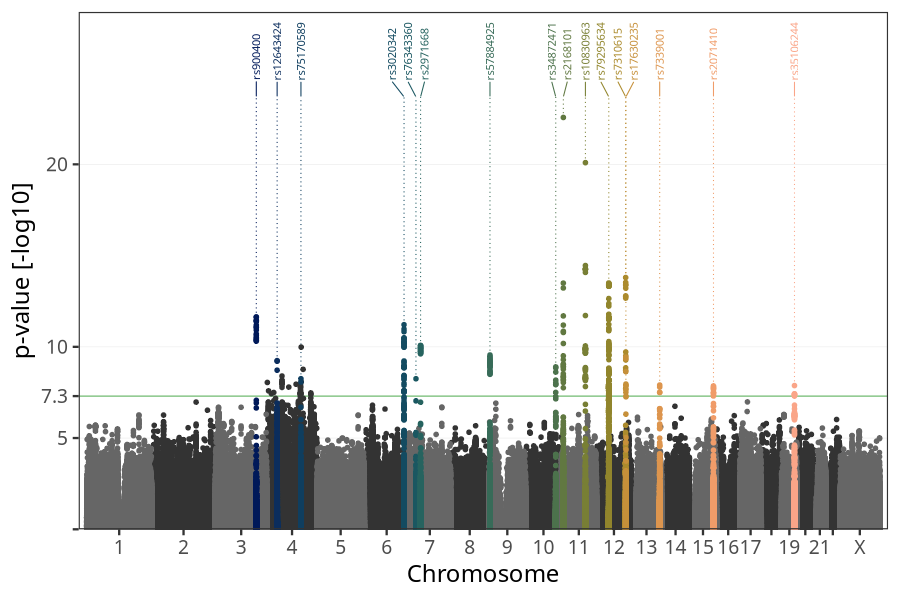
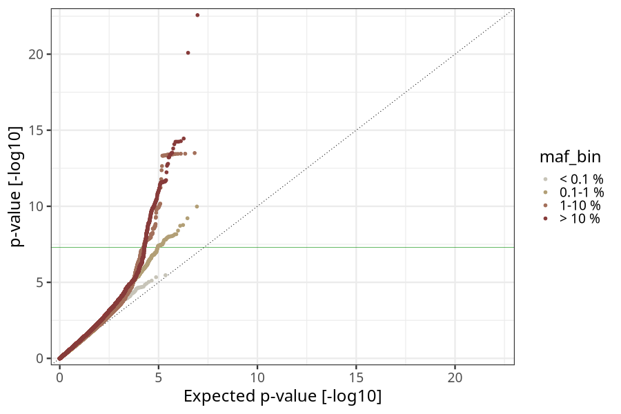
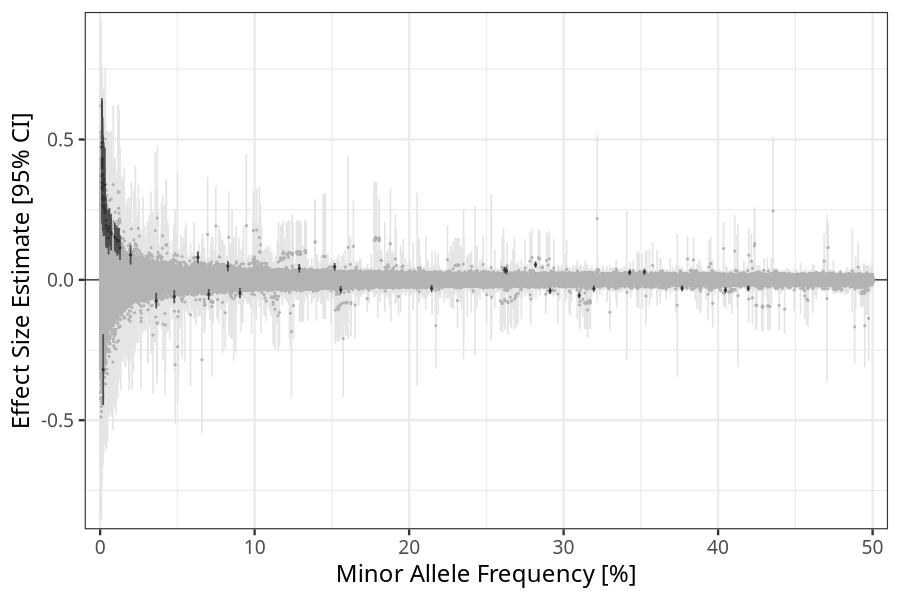
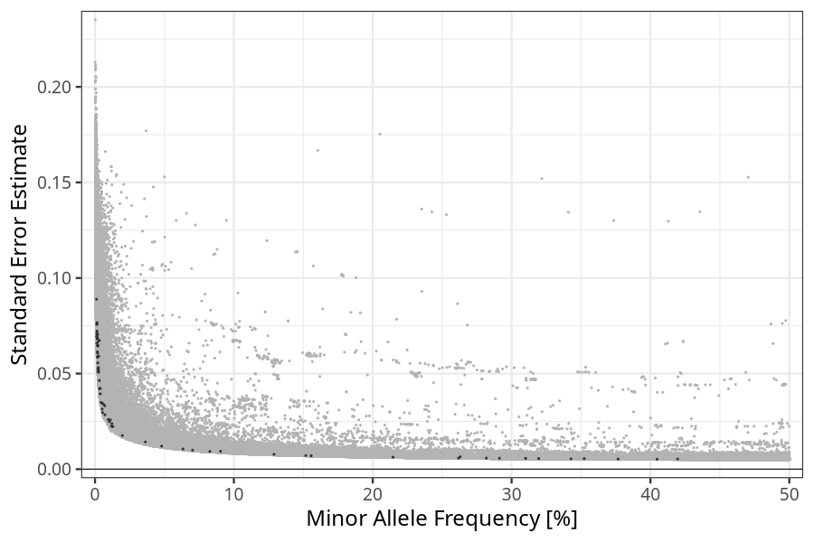

## Birth weight in mothers
Association results by regenie for Birth weight (weight_birth, quantitative) in mothers
 using the following covariates: n_previous_deliveries, pregnancy_duration, sex, plural_birth, and genotyping batch
. Simple bp-window pruning of the hits passing p < 5e-08.

Note:
- Markers with a maf < 0.01 are not annotated on the Manhattan plot.
- Markers in the HLA region are not annotated on the Manhattan plot.
### Manhattan

### Top hits common (maf ≥ 1%)
| SNP | chr | bp | allele 0 | allele 1 | allele 1 freq | beta | se | log10p | n | gene |
| --- | --- | -- | -------- | -------- | ------------- | ---- | -- | ------ | - | ---- |
| rs2816991 | 1 | 200147594 | C | G | 0.683033 | 0.0278633 | 0.00556065 | 6.26598 | 58314 | [NR5A2](ensembl/rs2816991.md) |
| rs539447 | 2 | 45138325 | A | G | 0.526917 | -0.0258083 | 0.0051532 | 6.26013 | 58314 | [SIX3-AS1](ensembl/rs539447.md) |
| rs900400 | 3 | 156798775 | T | C | 0.404775 | -0.0364104 | 0.00519161 | 11.6331 | 58314 | [LEKR1](ensembl/rs900400.md) |
| rs17036101 | 3 | 12277845 | G | A | 0.0702659 | -0.0517214 | 0.00995673 | 6.68795 | 58314 | [PPARG](ensembl/rs17036101.md) |
| rs62289922 | 3 | 194755810 | T | G | 0.262986 | 0.0325113 | 0.00646846 | 6.3006 | 58314 | [XXYLT1](ensembl/rs62289922.md) |
| rs12643424 | 4 | 38514427 | A | G | 0.0119322 | 0.139218 | 0.0224611 | 9.24321 | 58314 | [RP11-617D20.1](ensembl/rs12643424.md) |
| rs75170589 | 4 | 129619501 | G | T | 0.010254 | 0.14508 | 0.0248902 | 8.2532 | 58314 | [JADE1](ensembl/rs75170589.md) |
| rs139440853 | 4 | 89179590 | G | A | 0.0128646 | 0.114451 | 0.0222708 | 6.55886 | 58314 | [PPM1K](ensembl/rs139440853.md) |
| rs72641741 | 4 | 180388092 | T | C | 0.0197141 | 0.0885217 | 0.0176004 | 6.30828 | 58314 | No gene found |
| rs3020342 | 6 | 152047753 | A | G | 0.291252 | -0.0392185 | 0.00570331 | 11.2121 | 58314 | [ESR1](ensembl/rs3020342.md) |
| rs2321443 | 6 | 79204960 | T | C | 0.352276 | 0.0283008 | 0.0054934 | 6.58834 | 58314 | [IRAK1BP1](ensembl/rs2321443.md) |
| rs2971668 | 7 | 44243438 | G | C | 0.151786 | 0.046157 | 0.00710797 | 10.077 | 58314 | [YKT6](ensembl/rs2971668.md) |
| rs76343360 | 7 | 26504924 | C | T | 0.0121592 | 0.138559 | 0.0237754 | 8.25065 | 58314 | [KIAA0087](ensembl/rs76343360.md) |
| rs188224301 | 7 | 125593798 | A | G | 0.0363009 | -0.074015 | 0.0142362 | 6.69832 | 58314 | [AC000370.2](ensembl/rs188224301.md) |
| rs57884925 | 9 | 4285119 | C | G | 0.506702 | 0.0321657 | 0.0050978 | 9.55357 | 58314 | [GLIS3](ensembl/rs57884925.md) |
| rs111526775 | 9 | 26678042 | A | G | 0.0111048 | 0.136576 | 0.0258218 | 6.91061 | 58314 | [CAAP1](ensembl/rs111526775.md) |
| rs34872471 | 10 | 114754071 | T | C | 0.261827 | 0.0353203 | 0.00581644 | 8.89984 | 58314 | [TCF7L2](ensembl/rs34872471.md) |
| rs2168101 | 11 | 8255408 | C | A | 0.310093 | -0.0555916 | 0.00559096 | 22.5682 | 58314 | [LMO1](ensembl/rs2168101.md) |
| rs10830963 | 11 | 92708710 | C | G | 0.281835 | 0.0539522 | 0.00576534 | 20.0902 | 58314 | [MTNR1B](ensembl/rs10830963.md) |
| rs35826789 | 11 | 66867155 | T | A | 0.0904801 | -0.046828 | 0.00932809 | 6.28698 | 58314 | [KDM2A](ensembl/rs35826789.md) |
| rs1870019 | 11 | 100901473 | A | G | 0.34274 | 0.0267782 | 0.00535794 | 6.23676 | 58314 | [PGR](ensembl/rs1870019.md) |
| rs7310615 | 12 | 111865049 | C | G | 0.548951 | 0.0394341 | 0.00513515 | 13.7958 | 58314 | [SH2B3](ensembl/rs7310615.md) |
| rs79295634 | 12 | 47180008 | A | G | 0.0632976 | 0.0801543 | 0.0105587 | 13.4994 | 58314 | [SLC38A4](ensembl/rs79295634.md) |
| rs17630235 | 12 | 112591686 | G | A | 0.376688 | -0.0300247 | 0.00525401 | 7.95885 | 58314 | [TRAFD1](ensembl/rs17630235.md) |
| rs7339001 | 13 | 108128848 | T | A | 0.519941 | -0.0290493 | 0.00510226 | 7.90478 | 58314 | [FAM155A](ensembl/rs7339001.md) |
| rs73154241 | 13 | 23089113 | G | T | 0.0480038 | -0.0596809 | 0.012043 | 6.1421 | 58314 | No gene found |
| rs3759526 | 14 | 51292535 | C | T | 0.0826628 | 0.0483224 | 0.00926117 | 6.74203 | 58314 | [NIN](ensembl/rs3759526.md) |
| rs2071410 | 15 | 91420940 | C | G | 0.319564 | -0.0313923 | 0.00553229 | 7.85637 | 58314 | [FURIN](ensembl/rs2071410.md) |
| rs62011732 | 15 | 83565221 | C | T | 0.214583 | -0.0306545 | 0.00624514 | 6.03737 | 58314 | [HOMER2](ensembl/rs62011732.md) |
| rs7200772 | 16 | 68446811 | T | C | 0.58428 | 0.0260844 | 0.00522322 | 6.22793 | 58314 | [SMPD3](ensembl/rs7200772.md) |
| rs35106244 | 19 | 49203829 | C | T | 0.419532 | -0.0302066 | 0.00531636 | 7.87527 | 58314 | [FUT2](ensembl/rs35106244.md) |
| rs2918299 | 19 | 8787273 | C | T | 0.155708 | -0.0353003 | 0.00702744 | 6.29402 | 58314 | [ACTL9](ensembl/rs2918299.md) |
### Top hits rare (maf < 1%)
| SNP | chr | bp | allele 0 | allele 1 | allele 1 freq | beta | se | log10p | n | gene |
| --- | --- | -- | -------- | -------- | ------------- | ---- | -- | ------ | - | ---- |
| rs140387300 | 2 | 169679595 | T | G | 0.00110292 | 0.472488 | 0.0889047 | 6.97093 | 58314 | [NOSTRIN](ensembl/rs140387300.md) |
| rs16848114 | 2 | 213122138 | A | C | 0.00702566 | 0.170022 | 0.033176 | 6.52613 | 58314 | [ERBB4](ensembl/rs16848114.md) |
| rs57024592 | 3 | 98672148 | C | A | 0.00258274 | 0.263393 | 0.0507066 | 6.68756 | 58314 | [CTD-2021J15.1](ensembl/rs57024592.md) |
| rs12648333 | 4 | 130491944 | T | C | 0.00127871 | 0.488702 | 0.0756402 | 9.98255 | 58314 | [C4orf33](ensembl/rs12648333.md) |
| rs78331365 | 4 | 138087197 | G | A | 0.0013818 | 0.417335 | 0.0692949 | 8.76538 | 58314 | [PCDH18](ensembl/rs78331365.md) |
| rs6846642 | 4 | 57121691 | T | A | 0.00954336 | 0.152896 | 0.0259818 | 8.39936 | 58314 | [KIAA1211](ensembl/rs6846642.md) |
| rs79531584 | 4 | 971378 | C | T | 0.00133335 | 0.408471 | 0.0710465 | 8.04775 | 58314 | [DGKQ](ensembl/rs79531584.md) |
| rs12644202 | 4 | 127968503 | T | G | 0.00311932 | 0.240098 | 0.0420239 | 7.95559 | 58314 | No gene found |
| rs10488883 | 4 | 110947882 | A | G | 0.00713248 | 0.162477 | 0.0284495 | 7.94978 | 58314 | [EGF](ensembl/rs10488883.md) |
| rs117252740 | 4 | 83178902 | T | A | 0.00153594 | 0.430722 | 0.0762455 | 7.79251 | 58314 | [HNRNPD](ensembl/rs117252740.md) |
| rs73073786 | 4 | 5751489 | C | T | 0.00137034 | 0.426612 | 0.0766337 | 7.58617 | 58314 | [EVC, CRMP1](ensembl/rs73073786.md) |
| rs6847721 | 4 | 25631615 | T | C | 0.00604641 | 0.188423 | 0.0340669 | 7.49695 | 58314 | [SLC34A2](ensembl/rs6847721.md) |
| rs117775628 | 4 | 167412126 | G | A | 0.00512217 | 0.173526 | 0.0314254 | 7.4743 | 58314 | [SPOCK3](ensembl/rs117775628.md) |
| rs117570583 | 4 | 16493737 | A | G | 0.00140911 | 0.397595 | 0.0722351 | 7.43074 | 58314 | [RP11-446J8.1](ensembl/rs117570583.md) |
| rs1596723 | 4 | 32576227 | C | T | 0.0030782 | 0.250477 | 0.0463798 | 7.17763 | 58314 | No gene found |
| rs12501178 | 4 | 139111138 | T | C | 0.00246714 | 0.286832 | 0.0531218 | 7.1751 | 58314 | [SLC7A11](ensembl/rs12501178.md) |
| rs72936651 | 4 | 131101106 | C | T | 0.00233217 | 0.358921 | 0.0668231 | 7.10674 | 58314 | No gene found |
| rs3814060 | 4 | 119948797 | A | G | 0.00125487 | 0.369699 | 0.0692911 | 7.02088 | 58314 | [SYNPO2](ensembl/rs3814060.md) |
| rs7695568 | 4 | 4936959 | C | T | 0.00525946 | 0.183278 | 0.0344841 | 6.97162 | 58314 | [MSX1](ensembl/rs7695568.md) |
| rs17088231 | 4 | 58355502 | C | T | 0.00174179 | 0.325606 | 0.0613937 | 6.94477 | 58314 | [IGFBP7-AS1](ensembl/rs17088231.md) |
| rs77482484 | 4 | 37653711 | T | C | 0.00183637 | 0.321133 | 0.0607511 | 6.90311 | 58314 | [RELL1](ensembl/rs77482484.md) |
| rs74717170 | 4 | 69181763 | T | C | 0.00226468 | 0.267311 | 0.0509531 | 6.80895 | 58314 | [YTHDC1](ensembl/rs74717170.md) |
| rs79208895 | 4 | 80240652 | T | A | 0.00193378 | 0.338572 | 0.0646196 | 6.79305 | 58314 | [NAA11](ensembl/rs79208895.md) |
| rs58919418 | 4 | 179512227 | A | G | 0.00438885 | 0.18145 | 0.03485 | 6.71596 | 58314 | No gene found |
| rs79823426 | 4 | 65929877 | A | G | 0.00249427 | 0.265155 | 0.0515278 | 6.57465 | 58314 | [EPHA5](ensembl/rs79823426.md) |
| rs76872690 | 4 | 40305977 | G | A | 0.00248092 | 0.26535 | 0.0518945 | 6.49944 | 58314 | [CHRNA9](ensembl/rs76872690.md) |
| rs57162329 | 4 | 2836879 | T | C | 0.00207924 | 0.282549 | 0.0555963 | 6.42809 | 58314 | [SH3BP2](ensembl/rs57162329.md) |
| rs150545809 | 4 | 95583106 | G | A | 0.00196714 | 0.297571 | 0.058592 | 6.42016 | 58314 | [PDLIM5](ensembl/rs150545809.md) |
| rs78545566 | 4 | 97831664 | G | T | 0.0019507 | 0.326857 | 0.0644948 | 6.39565 | 58314 | [STPG2](ensembl/rs78545566.md) |
| rs148583489 | 4 | 4104207 | G | C | 0.00306108 | 0.339437 | 0.0674199 | 6.31997 | 58314 | [OTOP1](ensembl/rs148583489.md) |
| rs74772928 | 4 | 99963000 | A | G | 0.0054685 | 0.148512 | 0.029576 | 6.28983 | 58314 | [METAP1](ensembl/rs74772928.md) |
| rs144189220 | 4 | 28413802 | T | G | 0.00129966 | 0.328018 | 0.065827 | 6.20346 | 58314 | [RP11-180C1.1](ensembl/rs144189220.md) |
| rs192126945 | 4 | 107197243 | A | C | 0.00199582 | -0.319569 | 0.064583 | 6.12549 | 58314 | [TBCK](ensembl/rs192126945.md) |
| rs79967451 | 4 | 163180666 | C | A | 0.0013742 | 0.34508 | 0.06983 | 6.11104 | 58314 | [FSTL5](ensembl/rs79967451.md) |
| rs4694552 | 4 | 69886605 | G | A | 0.994199 | -0.150448 | 0.0304485 | 6.10962 | 58314 | [UGT2B7](ensembl/rs4694552.md) |
| rs76188521 | 4 | 104571204 | G | T | 0.00220305 | 0.25821 | 0.0523583 | 6.08851 | 58314 | [TACR3](ensembl/rs76188521.md) |
| rs115862008 | 4 | 72665892 | C | T | 0.00170302 | 0.289121 | 0.0587608 | 6.06342 | 58314 | [GC](ensembl/rs115862008.md) |
| rs17005053 | 4 | 82025509 | G | T | 0.00378828 | 0.193616 | 0.0393885 | 6.05286 | 58314 | [PRKG2](ensembl/rs17005053.md) |
| rs538309509 | 5 | 157477980 | A | G | 0.00376582 | 0.212007 | 0.0423249 | 6.26196 | 58314 | [CLINT1](ensembl/rs538309509.md) |
| rs17101726 | 14 | 75118275 | C | G | 0.00165736 | 0.336395 | 0.068225 | 6.08646 | 58314 | [AREL1](ensembl/rs17101726.md) |
| rs56234649 | 17 | 28532039 | A | G | 0.00189044 | 0.37541 | 0.0705829 | 6.98085 | 58314 | [SLC6A4, RP11-354P11.4](ensembl/rs56234649.md) |
| rs75202678 | 17 | 27427231 | A | G | 0.00171822 | 0.348982 | 0.0685191 | 6.45339 | 58314 | [MYO18A](ensembl/rs75202678.md) |
| rs117463091 | 22 | 40137530 | T | G | 0.00263872 | 0.289832 | 0.0591526 | 6.01787 | 58314 | [ENTHD1](ensembl/rs117463091.md) |
### HLA top hits
HLA region: chr 6, 27-34 Mb

| SNP | chr | bp | allele 0 | allele 1 | allele 1 freq | beta | se | p | n | gene |
| --- | --- | -- | -------- | -------- | ------------- | ---- | -- | - | - | ---- |
| rs9265190 | 6 | 31289640 | C | T | 0.128899 | 0.0407572 | 0.00777457 | 6.79991 | 58314 | [HLA-B](ensembl/rs9265190.md) |
### Quality Control
- QQ plot

- Beta vs. Allele Frequency

- Standard error vs. Allele Frequency

