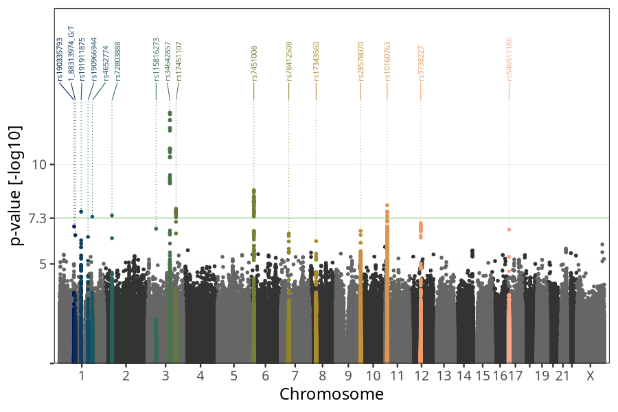
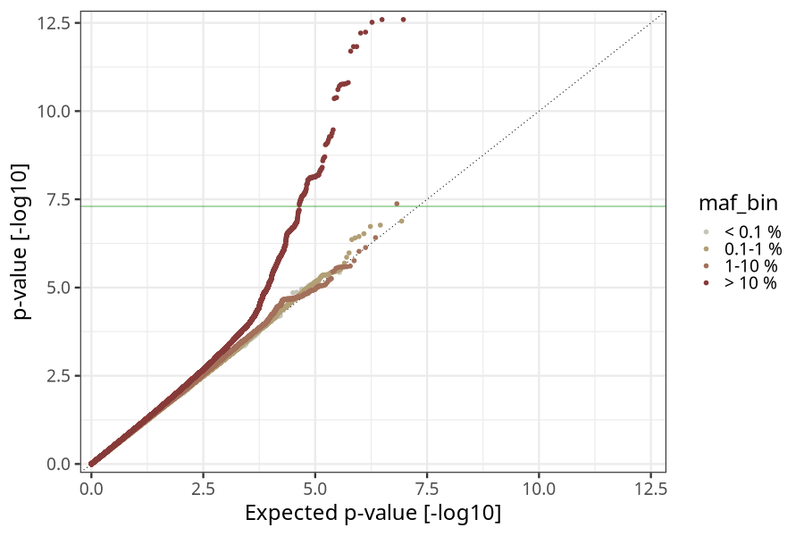
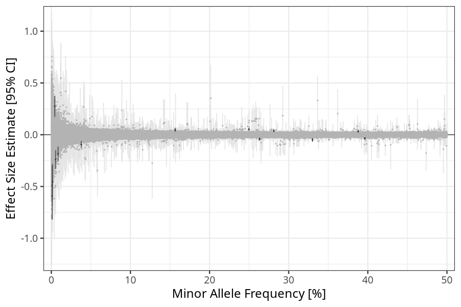
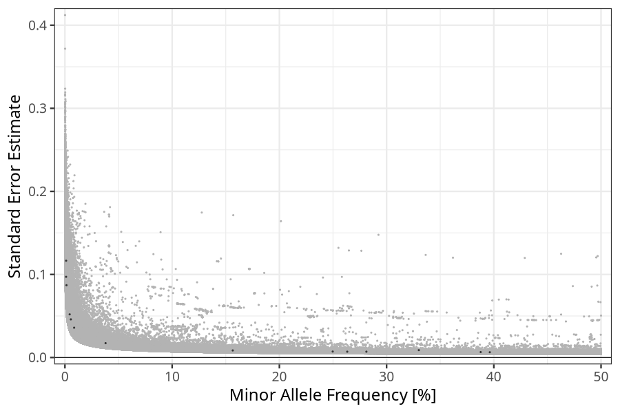

## Birth weight in parents
Association results by regenie for Birth weight (weight_birth, quantitative) in parents
 using the following covariates: n_previous_deliveries, pregnancy_duration, sex, plural_birth, and genotyping batch
. Simple bp-window pruning of the hits passing p < 1e-06.

### Manhattan

### Top hits common (maf ≥ 1%)
| SNP | chr | bp | allele 0 | allele 1 | allele 1 freq | beta | se | log10p | n | gene |
| --- | --- | -- | -------- | -------- | ------------- | ---- | -- | ------ | - | ---- |
| rs191911875 | 1 | 120551940 | A | G | 0.330049 | -0.0495084 | 0.00886752 | 7.62665 | 40100 | [NOTCH2](ensembl/rs191911875.md) |
| rs4652774 | 1 | 183060818 | A | G | 0.0379036 | -0.094568 | 0.0172533 | 7.37413 | 40100 | [LAMC1](ensembl/rs4652774.md) |
| rs72803888 | 2 | 43204791 | C | G | 0.281158 | 0.0385559 | 0.00700167 | 7.4369 | 40100 | [HAAO](ensembl/rs72803888.md) |
| rs34642857 | 3 | 123051019 | T | C | 0.249751 | 0.0525 | 0.00717543 | 12.5947 | 40100 | [ADCY5](ensembl/rs34642857.md) |
| rs17451107 | 3 | 156797609 | T | C | 0.396259 | -0.0357577 | 0.00633818 | 7.77356 | 40100 | [LEKR1](ensembl/rs17451107.md) |
| rs7451008 | 6 | 20673880 | T | C | 0.263288 | -0.0419305 | 0.00698817 | 8.70539 | 40100 | [CDKAL1](ensembl/rs7451008.md) |
| rs17343560 | 8 | 37278911 | C | G | 0.387766 | 0.0323128 | 0.00651814 | 6.14597 | 40100 | [RP11-150O12.6](ensembl/rs17343560.md) |
| rs28578070 | 9 | 139248216 | A | G | 0.580818 | -0.0345085 | 0.00665884 | 6.65938 | 40100 | [GPSM1](ensembl/rs28578070.md) |
| rs10160763 | 11 | 10238173 | G | T | 0.593263 | 0.0358488 | 0.00627662 | 7.95079 | 40100 | [SBF2](ensembl/rs10160763.md) |
| rs9738227 | 12 | 62520507 | A | G | 0.15651 | 0.0454626 | 0.00849946 | 7.05305 | 40100 | [FAM19A2](ensembl/rs9738227.md) |
### Top hits rare (maf < 1%)
| SNP | chr | bp | allele 0 | allele 1 | allele 1 freq | beta | se | log10p | n | gene |
| --- | --- | -- | -------- | -------- | ------------- | ---- | -- | ------ | - | ---- |
| rs190335793 | 1 | 81421617 | G | A | 0.00442756 | 0.274199 | 0.0519588 | 6.88223 | 40100 | [LPHN2](ensembl/rs190335793.md) |
| 1_88313974_G:T | 1 | 88313974 | G | T | 0.00111818 | -0.593155 | 0.116537 | 6.44565 | 40100 | [LMO4](ensembl/1_88313974_G_T.md) |
| rs190966944 | 1 | 158867138 | T | G | 0.00109726 | -0.490785 | 0.0971386 | 6.36026 | 40100 | [PYHIN1](ensembl/rs190966944.md) |
| rs115816273 | 3 | 45876276 | A | G | 0.00552281 | -0.240092 | 0.0459139 | 6.7689 | 40100 | [LZTFL1](ensembl/rs115816273.md) |
| rs78412508 | 7 | 44223858 | G | A | 0.00857973 | -0.183947 | 0.0358961 | 6.52514 | 40100 | [GCK](ensembl/rs78412508.md) |
| rs546911186 | 17 | 5341026 | G | C | 0.00146814 | -0.453722 | 0.087034 | 6.73128 | 40100 | [C1QBP](ensembl/rs546911186.md) |
### HLA top hits
HLA region: chr 6, 27-34 Mb

| SNP | chr | bp | allele 0 | allele 1 | allele 1 freq | beta | se | p | n | gene |
| --- | --- | -- | -------- | -------- | ------------- | ---- | -- | - | - | ---- |
### Quality Control
- QQ plot

- Beta vs. Allele Frequency

- Standard error vs. Allele Frequency

