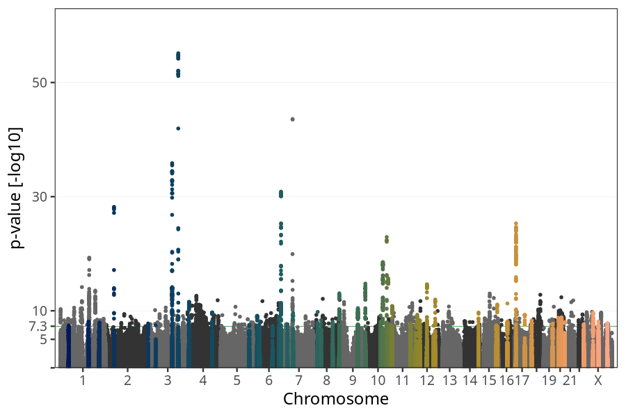
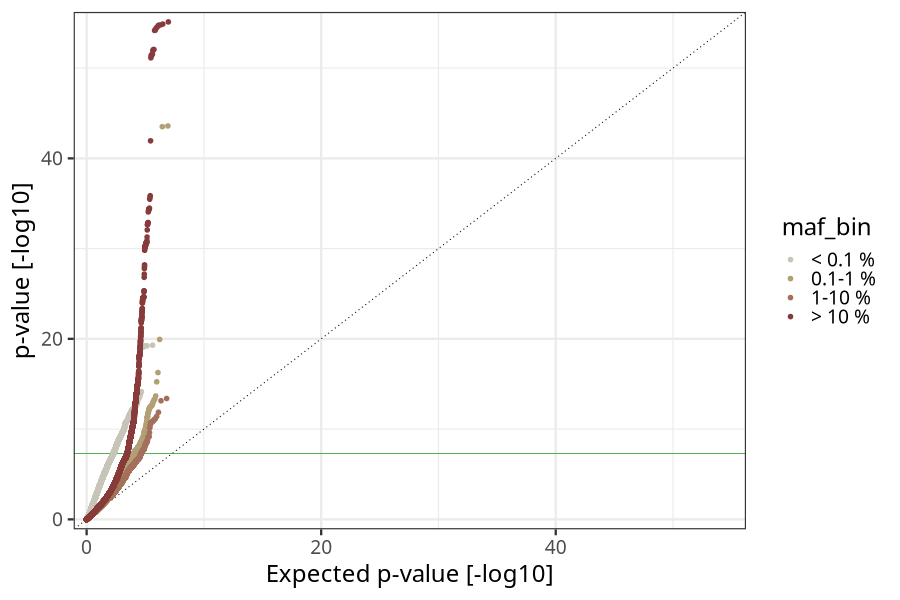
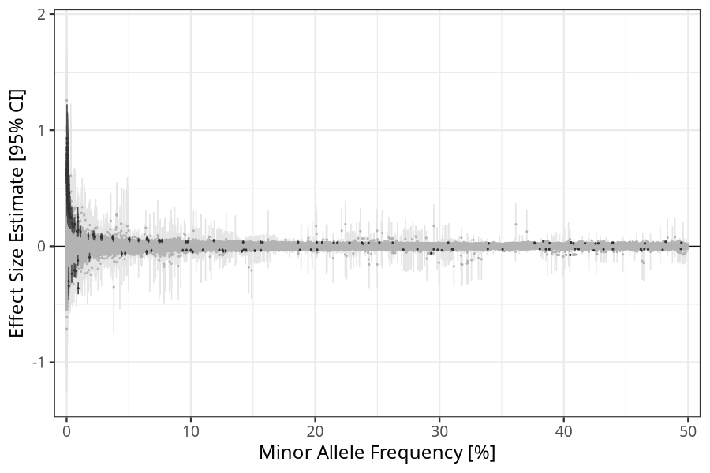
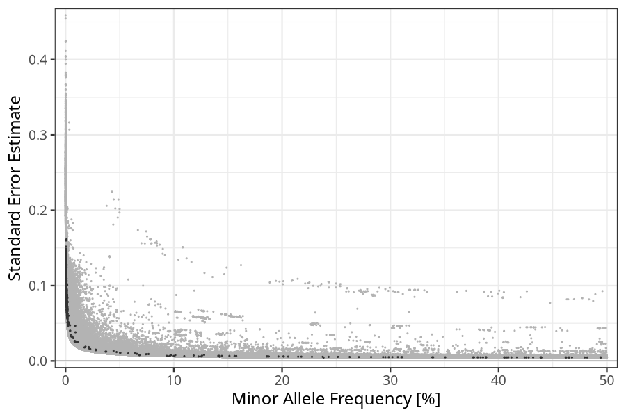

## Birth weight in children
Association results by regenie for Birth weight (weight_birth_eur_core, quantitative) in children
 using the following covariates: n_previous_deliveries, pregnancy_duration, sex, plural_birth, and genotyping batch
. Simple bp-window pruning of the hits passing p < 5e-08.

Note:
- Markers with a maf < 0.01 are not annotated on the Manhattan plot.
- Markers in the HLA region are not annotated on the Manhattan plot.
### Manhattan

### Top hits common (maf ≥ 1%)
| SNP | chr | bp | allele 0 | allele 1 | allele 1 freq | beta | se | log10p | n | gene |
| --- | --- | -- | -------- | -------- | ------------- | ---- | -- | ------ | - | ---- |
| rs114130331 | 1 | 155306195 | T | C | 0.0278393 | 0.086131 | 0.0149238 | 8.10448 | 65581 | [ASH1L](ensembl/rs114130331.md) |
| rs7556562 | 1 | 215609272 | G | A | 0.251595 | 0.0309496 | 0.00543375 | 7.91085 | 65581 | [KCTD3](ensembl/rs7556562.md) |
| rs114940022 | 1 | 155937390 | C | T | 0.0218141 | 0.0968889 | 0.0171813 | 7.76746 | 65581 | [ARHGEF2](ensembl/rs114940022.md) |
| rs4100072 | 1 | 214181687 | C | T | 0.201172 | 0.0334524 | 0.00604446 | 7.50542 | 65581 | [PROX1](ensembl/rs4100072.md) |
| rs10890383 | 1 | 46588503 | A | G | 0.431967 | -0.0260834 | 0.00473874 | 7.43104 | 65581 | [PIK3R3](ensembl/rs10890383.md) |
| rs841851 | 1 | 43401829 | A | G | 0.237546 | 0.0300766 | 0.00552137 | 7.29124 | 65581 | [SLC2A1](ensembl/rs841851.md) |
| rs529346 | 1 | 160743809 | A | G | 0.983781 | -0.101298 | 0.0186157 | 7.27725 | 65581 | [SLAMF7](ensembl/rs529346.md) |
| rs2991979 | 1 | 46055858 | A | G | 0.715502 | -0.0277016 | 0.00524588 | 6.89032 | 65581 | [NASP](ensembl/rs2991979.md) |
| rs4655764 | 1 | 66126159 | C | T | 0.407699 | 0.0239115 | 0.00476476 | 6.28314 | 65581 | [LEPR](ensembl/rs4655764.md) |
| rs17034876 | 2 | 46484310 | C | T | 0.694275 | 0.0578617 | 0.00518463 | 28.1951 | 65581 | [EPAS1](ensembl/rs17034876.md) |
| rs838716 | 2 | 234294791 | G | C | 0.669222 | 0.0280101 | 0.00496399 | 7.77611 | 65581 | [DGKD](ensembl/rs838716.md) |
| rs11124906 | 2 | 43197221 | G | C | 0.3886 | 0.0264964 | 0.0049167 | 7.1498 | 65581 | [HAAO](ensembl/rs11124906.md) |
| rs115191209 | 2 | 158478191 | G | A | 0.0282938 | 0.0775791 | 0.0146377 | 6.93619 | 65581 | [ACVR1C](ensembl/rs115191209.md) |
| rs6432007 | 2 | 9615556 | T | C | 0.580748 | 0.0247026 | 0.00475223 | 6.69611 | 65581 | [IAH1](ensembl/rs6432007.md) |
| rs11901985 | 2 | 116764312 | A | C | 0.0174902 | 0.0879511 | 0.0179165 | 6.03828 | 65581 | [DPP10](ensembl/rs11901985.md) |
| rs900400 | 3 | 156798775 | T | C | 0.405133 | -0.075066 | 0.00476801 | 55.1197 | 65581 | [LEKR1](ensembl/rs900400.md) |
| rs9883204 | 3 | 123096820 | T | C | 0.739413 | -0.0672503 | 0.00532316 | 35.8603 | 65581 | [ADCY5](ensembl/rs9883204.md) |
| rs12488341 | 3 | 32917415 | G | A | 0.306933 | 0.0289775 | 0.00525388 | 7.45856 | 65581 | [TRIM71](ensembl/rs12488341.md) |
| rs2687739 | 3 | 193521978 | G | A | 0.262433 | 0.0289149 | 0.00534088 | 7.20992 | 65581 | [OPA1](ensembl/rs2687739.md) |
| rs9833720 | 3 | 67047977 | T | C | 0.813148 | -0.0299641 | 0.00601872 | 6.19324 | 65581 | [KBTBD8](ensembl/rs9833720.md) |
| rs62285074 | 3 | 156242649 | A | C | 0.338814 | -0.0246652 | 0.00495844 | 6.18403 | 65581 | [KCNAB1](ensembl/rs62285074.md) |
| rs13079464 | 3 | 13822439 | G | C | 0.464764 | -0.0234853 | 0.00473796 | 6.14477 | 65581 | [LINC00620](ensembl/rs13079464.md) |
| rs925098 | 4 | 17919811 | G | A | 0.736217 | -0.0371352 | 0.00531077 | 11.5684 | 65581 | [LCORL](ensembl/rs925098.md) |
| rs13146972 | 4 | 145569692 | C | T | 0.439472 | 0.0298834 | 0.0046927 | 9.71798 | 65581 | [HHIP-AS1, HHIP](ensembl/rs13146972.md) |
| rs6836368 | 4 | 130751286 | G | A | 0.0280236 | 0.0720535 | 0.0142015 | 6.40867 | 65581 | No gene found |
| rs66584692 | 5 | 158392277 | G | A | 0.388323 | -0.0266594 | 0.00480737 | 7.53301 | 65581 | [EBF1](ensembl/rs66584692.md) |
| rs11955753 | 5 | 65294061 | T | A | 0.0111999 | 0.125073 | 0.0252388 | 6.14193 | 65581 | [ERBB2IP](ensembl/rs11955753.md) |
| rs79535450 | 5 | 122713989 | C | T | 0.227607 | 0.0273372 | 0.00557756 | 6.02131 | 65581 | [CEP120](ensembl/rs79535450.md) |
| rs329121 | 5 | 133863352 | G | C | 0.621594 | 0.0237709 | 0.00485327 | 6.01386 | 65581 | [JADE2](ensembl/rs329121.md) |
| rs11756568 | 6 | 152042413 | A | T | 0.293315 | -0.060822 | 0.00520025 | 30.8741 | 65581 | [ESR1](ensembl/rs11756568.md) |
| rs4712523 | 6 | 20657564 | A | G | 0.298486 | -0.0314644 | 0.00511559 | 9.11267 | 65581 | [CDKAL1](ensembl/rs4712523.md) |
| rs2225906 | 6 | 141869843 | T | C | 0.753098 | 0.0330542 | 0.00542039 | 8.9693 | 65581 | No gene found |
| rs9689096 | 6 | 34188892 | A | C | 0.0502552 | 0.0629468 | 0.0108695 | 8.15541 | 65581 | [HMGA1](ensembl/rs9689096.md) |
| rs12523821 | 6 | 105343875 | T | C | 0.156326 | -0.0354555 | 0.00647123 | 7.36868 | 65581 | [HACE1](ensembl/rs12523821.md) |
| rs10948660 | 6 | 51787428 | A | C | 0.201596 | -0.0312805 | 0.00587367 | 6.99717 | 65581 | [PKHD1](ensembl/rs10948660.md) |
| rs3907648 | 6 | 74395505 | G | A | 0.66448 | 0.0262293 | 0.0050006 | 6.80664 | 65581 | [RP11-553A21.3](ensembl/rs3907648.md) |
| rs12191613 | 6 | 109289203 | G | A | 0.142031 | 0.0350815 | 0.00672484 | 6.7396 | 65581 | [ARMC2](ensembl/rs12191613.md) |
| rs62396185 | 6 | 26180634 | G | C | 0.282243 | -0.026068 | 0.00520889 | 6.2518 | 65581 | [HIST1H2BE](ensembl/rs62396185.md) |
| rs2788997 | 6 | 118227589 | G | A | 0.0228506 | 0.0780493 | 0.0156138 | 6.2388 | 65581 | [SLC35F1](ensembl/rs2788997.md) |
| rs9505376 | 6 | 8175002 | A | G | 0.0375534 | 0.0617345 | 0.0123646 | 6.22553 | 65581 | [EEF1E1](ensembl/rs9505376.md) |
| rs72868643 | 6 | 57095039 | C | T | 0.0643366 | -0.0516421 | 0.0105241 | 6.03408 | 65581 | [RAB23](ensembl/rs72868643.md) |
| rs80121495 | 7 | 47269931 | G | T | 0.064534 | 0.0634513 | 0.0100241 | 9.61026 | 65581 | [TNS3](ensembl/rs80121495.md) |
| rs10266185 | 7 | 15770007 | T | A | 0.0742399 | 0.0496539 | 0.00888107 | 7.64629 | 65581 | [MEOX2](ensembl/rs10266185.md) |
| rs147778456 | 7 | 72130154 | G | A | 0.0219731 | 0.0882038 | 0.0164083 | 7.11721 | 65581 | [CALN1](ensembl/rs147778456.md) |
| rs2075125 | 7 | 35301542 | C | A | 0.385586 | -0.025835 | 0.00481371 | 7.09648 | 65581 | [TBX20](ensembl/rs2075125.md) |
| rs1592388 | 7 | 125736495 | G | A | 0.310209 | -0.0265354 | 0.00507644 | 6.76414 | 65581 | [AC000370.2](ensembl/rs1592388.md) |
| rs113707810 | 7 | 72747127 | G | T | 0.0506825 | 0.0550576 | 0.0108014 | 6.46274 | 65581 | [FKBP6](ensembl/rs113707810.md) |
| rs2723511 | 7 | 17816479 | C | T | 0.425504 | 0.0236782 | 0.00474464 | 6.22027 | 65581 | [SNX13](ensembl/rs2723511.md) |
| rs35313521 | 8 | 142245099 | G | A | 0.424078 | -0.0353271 | 0.00473704 | 13.0551 | 65581 | [SLC45A4](ensembl/rs35313521.md) |
| rs732563 | 8 | 23345526 | T | C | 0.494568 | 0.0299184 | 0.00467692 | 9.80022 | 65581 | [ENTPD4](ensembl/rs732563.md) |
| rs13262861 | 8 | 41508577 | C | A | 0.151375 | -0.0389141 | 0.00664197 | 8.33145 | 65581 | [NKX6-3](ensembl/rs13262861.md) |
| rs10505073 | 8 | 106112262 | G | C | 0.186154 | 0.0346358 | 0.00604363 | 8.00058 | 65581 | [RP11-127H5.1](ensembl/rs10505073.md) |
| rs9325812 | 8 | 17286341 | C | G | 0.674228 | -0.0271427 | 0.00498733 | 7.2791 | 65581 | [MTMR7](ensembl/rs9325812.md) |
| rs11988589 | 8 | 66889116 | A | G | 0.295405 | -0.0265687 | 0.00510508 | 6.71075 | 65581 | [DNAJC5B](ensembl/rs11988589.md) |
| rs3903044 | 8 | 26060748 | G | A | 0.217816 | 0.0293936 | 0.00572477 | 6.54827 | 65581 | [PPP2R2A](ensembl/rs3903044.md) |
| rs10093819 | 8 | 126152375 | A | G | 0.0658692 | 0.0466888 | 0.00942047 | 6.14315 | 65581 | [NSMCE2](ensembl/rs10093819.md) |
| rs28578070 | 9 | 139248216 | A | G | 0.580854 | -0.0406734 | 0.00511094 | 14.7578 | 65581 | [GPSM1](ensembl/rs28578070.md) |
| rs16909922 | 9 | 98265901 | A | G | 0.118344 | 0.0482112 | 0.0072755 | 10.4638 | 65581 | [PTCH1](ensembl/rs16909922.md) |
| rs4742824 | 9 | 98807195 | A | T | 0.706506 | -0.0265879 | 0.00538422 | 6.10302 | 65581 | [ERCC6L2](ensembl/rs4742824.md) |
| rs2031677 | 9 | 26685823 | T | C | 0.0751057 | 0.044568 | 0.00905043 | 6.07253 | 65581 | [CAAP1](ensembl/rs2031677.md) |
| rs7467668 | 9 | 25659116 | C | T | 0.0443832 | -0.0652211 | 0.0133239 | 6.0075 | 65581 | [TUSC1](ensembl/rs7467668.md) |
| rs1801253 | 10 | 115805056 | G | C | 0.738316 | 0.0533674 | 0.00532433 | 22.9193 | 65581 | [ADRB1](ensembl/rs1801253.md) |
| rs11187141 | 10 | 94467145 | A | T | 0.383437 | 0.043102 | 0.00480888 | 18.5004 | 65581 | [HHEX](ensembl/rs11187141.md) |
| rs2280141 | 10 | 124193181 | T | G | 0.481875 | 0.0383366 | 0.00466987 | 15.6529 | 65581 | [PLEKHA1](ensembl/rs2280141.md) |
| rs57866767 | 10 | 96023077 | T | C | 0.40578 | 0.0326055 | 0.00475754 | 11.1421 | 65581 | [PLCE1](ensembl/rs57866767.md) |
| rs7100689 | 10 | 82222178 | C | A | 0.754108 | 0.0338634 | 0.0054914 | 9.15639 | 65581 | [TSPAN14](ensembl/rs7100689.md) |
| rs61875120 | 10 | 114753259 | T | C | 0.205578 | 0.0332193 | 0.00581842 | 7.94533 | 65581 | [TCF7L2](ensembl/rs61875120.md) |
| rs1953314 | 10 | 13135831 | T | C | 0.87232 | -0.0395489 | 0.0073937 | 7.05335 | 65581 | [CCDC3](ensembl/rs1953314.md) |
| rs67523008 | 10 | 120646806 | C | T | 0.157672 | 0.0323742 | 0.00651575 | 6.17109 | 65581 | [RP11-498J9.2](ensembl/rs67523008.md) |
| rs10786736 | 10 | 104849116 | G | C | 0.0973434 | 0.0391654 | 0.00791013 | 6.1324 | 65581 | [CNNM2, NT5C2](ensembl/rs10786736.md) |
| rs12360854 | 11 | 10067027 | A | T | 0.479499 | -0.0316145 | 0.00468137 | 10.84 | 65581 | [SBF2](ensembl/rs12360854.md) |
| rs11828343 | 11 | 111491322 | A | G | 0.270883 | -0.0296831 | 0.00526488 | 7.76423 | 65581 | [SIK2](ensembl/rs11828343.md) |
| rs11037265 | 11 | 1652383 | A | C | 0.187698 | -0.0332496 | 0.00598838 | 7.54997 | 65581 | [KRTAP5-5](ensembl/rs11037265.md) |
| rs2168101 | 11 | 8255408 | C | A | 0.310905 | -0.0280453 | 0.00510784 | 7.39741 | 65581 | [LMO1](ensembl/rs2168101.md) |
| rs17641418 | 11 | 17161341 | T | C | 0.350742 | -0.0262152 | 0.00488745 | 7.08884 | 65581 | [PIK3C2A](ensembl/rs17641418.md) |
| rs3213221 | 11 | 2157044 | C | G | 0.624459 | -0.0257832 | 0.00483346 | 7.01816 | 65581 | [IGF2, INS-IGF2](ensembl/rs3213221.md) |
| rs634534 | 11 | 65665256 | A | G | 0.553487 | -0.0248112 | 0.00469922 | 6.88844 | 65581 | [FOSL1](ensembl/rs634534.md) |
| rs2289488 | 11 | 2892955 | G | C | 0.40902 | -0.0244264 | 0.00488298 | 6.24695 | 65581 | [KCNQ1DN](ensembl/rs2289488.md) |
| rs8756 | 12 | 66359752 | C | A | 0.462503 | -0.0371731 | 0.00468817 | 14.6562 | 65581 | [HMGA2](ensembl/rs8756.md) |
| rs7310615 | 12 | 111865049 | C | G | 0.545299 | 0.0337435 | 0.0047393 | 11.9666 | 65581 | [SH2B3](ensembl/rs7310615.md) |
| rs35756741 | 12 | 12868701 | C | T | 0.101406 | -0.0482661 | 0.00776039 | 9.30225 | 65581 | [CDKN1B](ensembl/rs35756741.md) |
| rs12823128 | 12 | 26872730 | T | C | 0.467798 | -0.0273892 | 0.00468048 | 8.3131 | 65581 | [ITPR2](ensembl/rs12823128.md) |
| rs855286 | 12 | 102946454 | T | C | 0.907598 | -0.044467 | 0.00810472 | 7.38739 | 65581 | [IGF1](ensembl/rs855286.md) |
| rs76895963 | 12 | 4384844 | T | G | 0.0214575 | 0.100446 | 0.018355 | 7.35267 | 65581 | [CCND2-AS1, CCND2](ensembl/rs76895963.md) |
| rs7310954 | 12 | 117057847 | G | C | 0.0578963 | 0.0518325 | 0.010026 | 6.63016 | 65581 | [MAP1LC3B2](ensembl/rs7310954.md) |
| rs9669403 | 12 | 46798900 | G | A | 0.377248 | 0.0249874 | 0.0048964 | 6.47636 | 65581 | [RP11-474P2.2](ensembl/rs9669403.md) |
| rs11066188 | 12 | 112610714 | G | A | 0.38069 | -0.0236785 | 0.0048359 | 6.01052 | 65581 | [HECTD4](ensembl/rs11066188.md) |
| rs9513070 | 13 | 28879839 | G | A | 0.61069 | -0.0260803 | 0.00521448 | 6.24505 | 65581 | [FLT1](ensembl/rs9513070.md) |
| rs77235285 | 14 | 101198609 | C | T | 0.141083 | -0.0432056 | 0.00679581 | 9.68864 | 65581 | [DLK1](ensembl/rs77235285.md) |
| rs5029104 | 14 | 38964544 | T | C | 0.43947 | -0.0252004 | 0.00471774 | 7.03566 | 65581 | [CLEC14A](ensembl/rs5029104.md) |
| rs80295645 | 14 | 21321264 | C | T | 0.127981 | -0.0400318 | 0.0079432 | 6.3315 | 65581 | [RP11-219E7.2](ensembl/rs80295645.md) |
| rs150840704 | 14 | 63891439 | A | C | 0.0184545 | -0.0944833 | 0.0189383 | 6.21689 | 65581 | [PPP2R5E](ensembl/rs150840704.md) |
| rs55684513 | 15 | 96846638 | C | T | 0.301875 | -0.0353813 | 0.00517884 | 11.0767 | 65581 | [NR2F2-AS1](ensembl/rs55684513.md) |
| rs1894401 | 15 | 91429042 | G | A | 0.535198 | 0.0257827 | 0.00468282 | 7.43476 | 65581 | [FES](ensembl/rs1894401.md) |
| rs1256442 | 15 | 83539594 | T | C | 0.46522 | 0.0240639 | 0.00469429 | 6.52926 | 65581 | [HOMER2](ensembl/rs1256442.md) |
| rs2311313 | 15 | 99178274 | T | G | 0.144336 | -0.0336025 | 0.00665314 | 6.35616 | 65581 | [RP11-35O15.1](ensembl/rs2311313.md) |
| rs9920034 | 15 | 75928022 | A | T | 0.214854 | 0.028576 | 0.00569056 | 6.29049 | 65581 | [CTD-2026K11.2](ensembl/rs9920034.md) |
| rs8029398 | 15 | 67339055 | T | C | 0.494158 | -0.0231608 | 0.00470845 | 6.06052 | 65581 | [SMAD3](ensembl/rs8029398.md) |
| rs3814283 | 16 | 50268817 | G | T | 0.75658 | -0.0388976 | 0.0056376 | 11.283 | 65581 | [PAPD5](ensembl/rs3814283.md) |
| rs1152083 | 16 | 67206375 | C | T | 0.0767011 | 0.0457061 | 0.00918834 | 6.18399 | 65581 | [NOL3](ensembl/rs1152083.md) |
| rs72771097 | 16 | 20049222 | G | A | 0.242961 | 0.0268408 | 0.0054849 | 6.00429 | 65581 | [GPR139](ensembl/rs72771097.md) |
| rs222849 | 17 | 7185861 | T | C | 0.616907 | 0.0508478 | 0.00481773 | 25.3141 | 65581 | [SLC2A4](ensembl/rs222849.md) |
| rs4794716 | 17 | 55362424 | G | C | 0.623021 | -0.0300356 | 0.0048275 | 9.30841 | 65581 | [MSI2](ensembl/rs4794716.md) |
| rs4629025 | 17 | 45337435 | T | A | 0.339551 | 0.0243208 | 0.00493417 | 6.08288 | 65581 | [ITGB3, ITGB3](ensembl/rs4629025.md) |
| rs74875617 | 18 | 11960781 | A | C | 0.126052 | -0.0415688 | 0.00711372 | 8.29138 | 65581 | [IMPA2](ensembl/rs74875617.md) |
| rs11874896 | 18 | 5622071 | A | T | 0.196663 | -0.0300373 | 0.00594536 | 6.3598 | 65581 | [EPB41L3](ensembl/rs11874896.md) |
| rs679574 | 19 | 49206108 | C | G | 0.461958 | -0.0262821 | 0.00467683 | 7.71817 | 65581 | [FUT2](ensembl/rs679574.md) |
| rs1062967 | 19 | 53342152 | T | C | 0.438759 | 0.0260226 | 0.00483026 | 7.14584 | 65581 | [ZNF28, ZNF468](ensembl/rs1062967.md) |
| rs10413888 | 19 | 1643921 | T | G | 0.417103 | 0.0256457 | 0.00482147 | 6.98174 | 65581 | [TCF3](ensembl/rs10413888.md) |
| rs41355649 | 19 | 33790556 | G | A | 0.0471292 | -0.061503 | 0.011738 | 6.79346 | 65581 | [CTD-2540B15.11, CEBPA](ensembl/rs41355649.md) |
| rs158366 | 19 | 54705317 | C | G | 0.411894 | -0.0245275 | 0.0047716 | 6.5618 | 65581 | [RPS9](ensembl/rs158366.md) |
| rs55716128 | 19 | 59048754 | C | T | 0.186038 | 0.0307707 | 0.00601478 | 6.50539 | 65581 | [ZBTB45](ensembl/rs55716128.md) |
| rs6016380 | 20 | 39179975 | A | G | 0.376441 | 0.0292267 | 0.00482859 | 8.84675 | 65581 | [MAFB](ensembl/rs6016380.md) |
| rs1203898 | 20 | 22553140 | T | C | 0.0369839 | 0.0741819 | 0.0123229 | 8.75798 | 65581 | [FOXA2](ensembl/rs1203898.md) |
| rs1886843 | 20 | 57244201 | A | G | 0.641554 | 0.0286256 | 0.00499508 | 8.00006 | 65581 | [STX16, STX16-NPEPL1](ensembl/rs1886843.md) |
| rs6134000 | 20 | 10682863 | A | G | 0.42774 | 0.0245632 | 0.00471753 | 6.71638 | 65581 | [RP11-103J8.1](ensembl/rs6134000.md) |
| rs4078443 | 22 | 50356555 | T | C | 0.723707 | 0.0317578 | 0.0056831 | 7.63912 | 65581 | [PIM3](ensembl/rs4078443.md) |
| rs134569 | 22 | 29463381 | C | T | 0.635885 | -0.0250894 | 0.00487697 | 6.5714 | 65581 | [C22orf31](ensembl/rs134569.md) |
| rs112318225 | 23 | 50303664 | G | T | 0.713888 | -0.0269888 | 0.00425617 | 9.64183 | 65581 | No gene found |
| rs56197033 | 23 | 79551925 | G | A | 0.142404 | -0.0323331 | 0.00560449 | 8.09867 | 65581 | No gene found |
| rs5975161 | 23 | 129078792 | C | A | 0.0959203 | 0.0366292 | 0.00647924 | 7.80304 | 65581 | No gene found |
| rs112819962 | 23 | 80150155 | C | T | 0.122818 | -0.0331144 | 0.00600993 | 7.44498 | 65581 | No gene found |
| rs1751095 | 23 | 78615733 | A | C | 0.908972 | 0.0359452 | 0.00667354 | 7.14296 | 65581 | No gene found |
| rs7065171 | 23 | 133683590 | C | G | 0.639598 | 0.021383 | 0.00401918 | 6.98451 | 65581 | No gene found |
| rs56082080 | 23 | 80677252 | G | T | 0.109655 | -0.0330852 | 0.0062819 | 6.8574 | 65581 | No gene found |
| rs112933714 | 23 | 76395974 | A | C | 0.0935248 | -0.035475 | 0.00673698 | 6.85497 | 65581 | No gene found |
| rs111711894 | 23 | 73737867 | A | C | 0.125414 | -0.0319216 | 0.00606343 | 6.85235 | 65581 | No gene found |
| rs5938570 | 23 | 75741067 | A | G | 0.903002 | 0.0347485 | 0.00660103 | 6.85117 | 65581 | No gene found |
| rs112751942 | 23 | 77609227 | G | A | 0.0998736 | -0.0345095 | 0.00658754 | 6.79105 | 65581 | No gene found |
| rs112268540 | 23 | 76903327 | G | A | 0.0964332 | -0.0338204 | 0.00666786 | 6.40525 | 65581 | No gene found |
| rs112353717 | 23 | 81206719 | C | G | 0.0682297 | -0.0380692 | 0.00763746 | 6.20684 | 65581 | No gene found |
| rs4898364 | 23 | 152900485 | C | T | 0.23831 | 0.0221493 | 0.00447254 | 6.13463 | 65581 | No gene found |
### Top hits rare (maf < 1%)
| SNP | chr | bp | allele 0 | allele 1 | allele 1 freq | beta | se | log10p | n | gene |
| --- | --- | -- | -------- | -------- | ------------- | ---- | -- | ------ | - | ---- |
| rs2808666 | 1 | 159561316 | A | G | 0.000836624 | 0.699219 | 0.0762989 | 19.3018 | 65581 | [APCS](ensembl/rs2808666.md) |
| rs1575223 | 1 | 119159881 | G | C | 0.000782956 | 0.624537 | 0.0802491 | 14.148 | 65581 | [TBX15](ensembl/rs1575223.md) |
| rs58749703 | 1 | 192458032 | C | T | 0.000788757 | 0.70105 | 0.0922007 | 13.5403 | 65581 | [RP5-1011O1.2](ensembl/rs58749703.md) |
| rs1782513 | 1 | 76482565 | A | C | 0.999328 | -0.616232 | 0.0926539 | 10.5356 | 65581 | [ST6GALNAC3](ensembl/rs1782513.md) |
| rs2483331 | 1 | 112952963 | A | C | 0.0012062 | 0.506617 | 0.076642 | 10.4158 | 65581 | [CTTNBP2NL](ensembl/rs2483331.md) |
| rs2678937 | 1 | 1996276 | C | T | 0.0017459 | 0.443327 | 0.0675214 | 10.2858 | 65581 | [PRKCZ](ensembl/rs2678937.md) |
| rs2494033 | 1 | 158668042 | A | C | 0.000706625 | 0.57796 | 0.0909122 | 9.68766 | 65581 | [OR6K2](ensembl/rs2494033.md) |
| rs10924101 | 1 | 117030309 | C | G | 0.00166485 | 0.52658 | 0.0833414 | 9.57776 | 65581 | [CD58](ensembl/rs10924101.md) |
| rs11801957 | 1 | 75133493 | C | T | 0.00055471 | 0.831605 | 0.134397 | 9.21426 | 65581 | [C1orf173](ensembl/rs11801957.md) |
| rs6429090 | 1 | 238752707 | T | G | 0.00178719 | 0.371298 | 0.0622223 | 8.61756 | 65581 | No gene found |
| rs7549738 | 1 | 44090993 | G | A | 0.000851125 | 0.462963 | 0.0776297 | 8.60811 | 65581 | [PTPRF](ensembl/rs7549738.md) |
| rs2211394 | 1 | 202975856 | C | T | 0.999317 | -0.626428 | 0.106128 | 8.44631 | 65581 | [TMEM183A](ensembl/rs2211394.md) |
| rs58990204 | 1 | 220234019 | A | T | 0.000558268 | 0.792709 | 0.134972 | 8.36894 | 65581 | [BPNT1](ensembl/rs58990204.md) |
| rs2499534 | 1 | 61886223 | G | C | 0.000606554 | 0.558801 | 0.0952255 | 8.35596 | 65581 | [NFIA](ensembl/rs2499534.md) |
| rs7512029 | 1 | 21561180 | C | T | 0.000857464 | 0.497022 | 0.0848365 | 8.33086 | 65581 | [ECE1](ensembl/rs7512029.md) |
| rs77282646 | 1 | 111755845 | A | G | 0.00081722 | 0.542044 | 0.0929274 | 8.26404 | 65581 | [CHI3L2](ensembl/rs77282646.md) |
| rs2796380 | 1 | 203879580 | G | C | 0.000812317 | 0.537883 | 0.0922161 | 8.26369 | 65581 | [SNRPE](ensembl/rs2796380.md) |
| rs74141350 | 1 | 228947540 | A | G | 0.000401629 | 0.780662 | 0.134437 | 8.19629 | 65581 | [RHOU](ensembl/rs74141350.md) |
| rs2810581 | 1 | 41936895 | T | C | 0.99888 | -0.428246 | 0.0742114 | 8.10247 | 65581 | [EDN2](ensembl/rs2810581.md) |
| rs945795 | 1 | 75785718 | T | C | 0.00103073 | 0.429482 | 0.0746718 | 8.05353 | 65581 | [SLC44A5](ensembl/rs945795.md) |
| rs7544022 | 1 | 79495184 | C | T | 0.999266 | -0.586616 | 0.102242 | 8.01742 | 65581 | [ELTD1](ensembl/rs7544022.md) |
| rs6679343 | 1 | 2770182 | A | T | 0.999352 | -0.590527 | 0.10295 | 8.01365 | 64984 | [TTC34](ensembl/rs6679343.md) |
| rs16842702 | 1 | 234306036 | G | A | 0.00110646 | 0.448423 | 0.0782092 | 8.00745 | 65581 | [SLC35F3](ensembl/rs16842702.md) |
| rs10916552 | 1 | 229923401 | C | T | 0.00128624 | 0.388208 | 0.0680129 | 7.94153 | 65581 | [URB2](ensembl/rs10916552.md) |
| rs55805472 | 1 | 240927163 | G | C | 0.00078475 | 0.560903 | 0.0986288 | 7.88848 | 65581 | [RP11-80B9.1](ensembl/rs55805472.md) |
| rs2100577 | 1 | 26863735 | A | G | 0.000482385 | 0.764388 | 0.135758 | 7.74554 | 65581 | [RPS6KA1](ensembl/rs2100577.md) |
| rs55856236 | 1 | 31259977 | A | T | 0.000964979 | 0.611043 | 0.108927 | 7.69314 | 65581 | [LAPTM5](ensembl/rs55856236.md) |
| rs4617445 | 1 | 245520176 | A | G | 0.0094362 | 0.140066 | 0.0250353 | 7.65572 | 65581 | [KIF26B](ensembl/rs4617445.md) |
| rs12086485 | 1 | 35535251 | A | T | 0.0026376 | 0.271604 | 0.0485644 | 7.65049 | 65581 | [ZMYM1](ensembl/rs12086485.md) |
| rs13374026 | 1 | 189586353 | G | A | 0.0010672 | 0.436663 | 0.0786055 | 7.55685 | 65581 | [BRINP3](ensembl/rs13374026.md) |
| rs17160339 | 1 | 146998825 | A | C | 0.000498889 | 0.713693 | 0.128782 | 7.52391 | 65581 | [BCL9](ensembl/rs17160339.md) |
| rs530466278 | 1 | 18463269 | A | T | 0.00108963 | 0.517423 | 0.0938343 | 7.45553 | 65581 | [IGSF21](ensembl/rs530466278.md) |
| rs1158155 | 1 | 232196006 | T | C | 0.000931911 | 0.418175 | 0.0759586 | 7.43352 | 65581 | [DISC1](ensembl/rs1158155.md) |
| rs111226590 | 1 | 81869776 | C | T | 0.000740141 | 0.516963 | 0.0943332 | 7.37172 | 65581 | [LPHN2](ensembl/rs111226590.md) |
| rs60483746 | 1 | 227228913 | T | C | 0.000763702 | 0.483442 | 0.0886652 | 7.30379 | 65581 | [CDC42BPA](ensembl/rs60483746.md) |
| rs10875293 | 1 | 100965873 | A | G | 0.997999 | -0.299254 | 0.0551848 | 7.23147 | 65581 | [CDC14A](ensembl/rs10875293.md) |
| rs72870804 | 1 | 14724925 | G | A | 0.000694217 | 0.676337 | 0.125534 | 7.14649 | 65581 | [KAZN](ensembl/rs72870804.md) |
| rs12086802 | 1 | 224945334 | A | G | 0.000764628 | 0.448058 | 0.0837302 | 7.05864 | 65581 | [RP11-449J1.1](ensembl/rs12086802.md) |
| rs73125706 | 1 | 225824860 | T | C | 0.000912866 | 0.471317 | 0.0884248 | 7.00817 | 65581 | [ENAH](ensembl/rs73125706.md) |
| rs3120788 | 1 | 211389927 | A | G | 0.000944818 | 0.470947 | 0.0884525 | 6.99419 | 64984 | [RCOR3](ensembl/rs3120788.md) |
| rs140843161 | 1 | 23130208 | G | A | 0.000788368 | 0.540091 | 0.101906 | 6.93603 | 65581 | [EPHB2](ensembl/rs140843161.md) |
| rs686717 | 1 | 23669246 | C | T | 0.000522778 | 0.613958 | 0.11608 | 6.91031 | 65581 | [HNRNPR](ensembl/rs686717.md) |
| rs7546033 | 1 | 152568367 | A | G | 0.000479335 | 0.654865 | 0.124278 | 6.86354 | 65581 | [LCE3C](ensembl/rs7546033.md) |
| rs4016963 | 1 | 193507978 | C | T | 0.999166 | -0.617112 | 0.117314 | 6.84228 | 65581 | [CDC73](ensembl/rs4016963.md) |
| rs6660734 | 1 | 99918678 | A | G | 0.000576536 | 0.625135 | 0.118963 | 6.82939 | 65581 | [LPPR4](ensembl/rs6660734.md) |
| rs915218 | 1 | 72078549 | A | G | 0.999486 | -0.633057 | 0.12051 | 6.82532 | 65581 | [NEGR1](ensembl/rs915218.md) |
| rs11808556 | 1 | 10498270 | C | T | 0.000603475 | 0.533332 | 0.102492 | 6.70899 | 65581 | [APITD1, APITD1-CORT](ensembl/rs11808556.md) |
| rs7549156 | 1 | 25180512 | A | G | 0.999544 | -0.677094 | 0.130184 | 6.70299 | 65581 | [CLIC4](ensembl/rs7549156.md) |
| rs60993281 | 1 | 4712748 | C | T | 0.00254638 | 0.267758 | 0.0516037 | 6.67422 | 65581 | [AJAP1](ensembl/rs60993281.md) |
| rs73009634 | 1 | 151816625 | C | T | 0.000482804 | 0.634922 | 0.123055 | 6.60664 | 65581 | [AL450992.2](ensembl/rs73009634.md) |
| rs57274764 | 1 | 233399923 | C | T | 0.000544544 | 0.557409 | 0.108035 | 6.60632 | 65581 | [PCNXL2](ensembl/rs57274764.md) |
| rs28729661 | 1 | 5843946 | A | G | 0.000665933 | 0.567203 | 0.109937 | 6.60585 | 65581 | [NPHP4](ensembl/rs28729661.md) |
| rs77107131 | 1 | 164469390 | T | C | 0.00129904 | 0.414127 | 0.0804105 | 6.58457 | 65581 | [PBX1](ensembl/rs77107131.md) |
| rs1207935 | 1 | 60211466 | C | T | 0.0019354 | 0.348721 | 0.0681566 | 6.5068 | 65581 | [FGGY](ensembl/rs1207935.md) |
| rs2387798 | 1 | 248710160 | C | T | 0.000597615 | 0.824472 | 0.161179 | 6.50403 | 65581 | [RP11-438F14.3](ensembl/rs2387798.md) |
| rs13375122 | 1 | 111127060 | T | C | 0.000540149 | 0.648878 | 0.127909 | 6.40713 | 65581 | [KCNA2](ensembl/rs13375122.md) |
| rs74105431 | 1 | 105342428 | G | A | 0.000814141 | 0.470734 | 0.0932381 | 6.35188 | 65581 | No gene found |
| rs12404179 | 1 | 201243821 | T | C | 0.000406173 | 0.66121 | 0.131772 | 6.28183 | 65581 | [PKP1](ensembl/rs12404179.md) |
| rs142446913 | 1 | 154173362 | A | G | 0.00142799 | 0.314617 | 0.0633614 | 6.164 | 65581 | [C1orf189](ensembl/rs142446913.md) |
| rs115034999 | 1 | 227985014 | G | A | 0.000498441 | 0.547619 | 0.110344 | 6.15815 | 65581 | [SNAP47](ensembl/rs115034999.md) |
| rs1885660 | 1 | 197997766 | A | G | 0.0007907 | 0.437493 | 0.0891062 | 6.04013 | 65581 | [LHX9](ensembl/rs1885660.md) |
| rs583844 | 1 | 55365652 | C | T | 0.999365 | -0.491496 | 0.100312 | 6.01774 | 65581 | [RP11-67L3.4](ensembl/rs583844.md) |
| rs3218904 | 2 | 102632816 | C | G | 0.000566789 | 0.628997 | 0.100409 | 9.42664 | 65581 | [IL1R2](ensembl/rs3218904.md) |
| rs79373793 | 2 | 137652875 | G | A | 0.00140377 | 0.391233 | 0.0641154 | 8.97989 | 65581 | [THSD7B](ensembl/rs79373793.md) |
| rs4143010 | 2 | 145386594 | T | C | 0.998516 | -0.374937 | 0.0629964 | 8.57621 | 65581 | [ZEB2](ensembl/rs4143010.md) |
| rs6751937 | 2 | 165433597 | T | C | 0.000565025 | 0.619567 | 0.106117 | 8.27849 | 65581 | [GRB14](ensembl/rs6751937.md) |
| rs6734371 | 2 | 167711729 | T | A | 0.000334925 | 0.780672 | 0.135212 | 8.11033 | 65581 | [XIRP2](ensembl/rs6734371.md) |
| rs59057655 | 2 | 86563488 | G | A | 0.000829927 | 0.503972 | 0.0886754 | 7.87913 | 65581 | [REEP1](ensembl/rs59057655.md) |
| rs11891678 | 2 | 133333528 | C | T | 0.00107812 | 0.429582 | 0.0763306 | 7.73897 | 65581 | [GPR39](ensembl/rs11891678.md) |
| rs10176298 | 2 | 178562566 | G | A | 0.000954933 | 0.428403 | 0.0765154 | 7.66614 | 65581 | [PDE11A](ensembl/rs10176298.md) |
| rs7590320 | 2 | 5694114 | A | G | 0.000600096 | 0.629984 | 0.113855 | 7.50252 | 65581 | [AC107057.2](ensembl/rs7590320.md) |
| rs61076266 | 2 | 218926859 | A | G | 0.000772701 | 0.523061 | 0.0959863 | 7.29619 | 65581 | [RUFY4](ensembl/rs61076266.md) |
| rs59651637 | 2 | 104838181 | G | A | 0.000767947 | 0.531783 | 0.0998518 | 6.99761 | 65581 | No gene found |
| rs73985404 | 2 | 212231561 | T | G | 0.000701871 | 0.469103 | 0.0882068 | 6.97969 | 65581 | [ERBB4](ensembl/rs73985404.md) |
| rs191482755 | 2 | 135210106 | A | G | 0.00184496 | 0.302995 | 0.0570094 | 6.97159 | 65581 | [MGAT5](ensembl/rs191482755.md) |
| rs10194037 | 2 | 40925580 | A | G | 0.000442082 | 0.597559 | 0.112563 | 6.95685 | 65581 | [SLC8A1](ensembl/rs10194037.md) |
| rs16859382 | 2 | 219693856 | T | C | 0.00140984 | 0.379133 | 0.0720812 | 6.841 | 65581 | [PRKAG3](ensembl/rs16859382.md) |
| rs76736877 | 2 | 127556775 | C | T | 0.000582934 | 0.660785 | 0.126138 | 6.79101 | 65581 | [AC114783.1](ensembl/rs76736877.md) |
| rs1365950 | 2 | 82661258 | A | T | 0.000823589 | 0.434804 | 0.0831048 | 6.77551 | 65581 | No gene found |
| rs1169251 | 2 | 35261104 | G | C | 0.99945 | -0.595636 | 0.113921 | 6.76726 | 65581 | No gene found |
| rs73026922 | 2 | 168795389 | A | G | 0.000298837 | 0.730979 | 0.140629 | 6.69568 | 64984 | [AC016723.4](ensembl/rs73026922.md) |
| rs17008070 | 2 | 123327772 | T | A | 0.00167232 | 0.325242 | 0.0626831 | 6.67406 | 65581 | No gene found |
| rs2592608 | 2 | 121792474 | A | G | 0.999181 | -0.521035 | 0.101048 | 6.59885 | 65581 | [GLI2](ensembl/rs2592608.md) |
| rs10188658 | 2 | 65597400 | G | A | 0.000911192 | 0.403118 | 0.0782002 | 6.59568 | 65581 | [SPRED2](ensembl/rs10188658.md) |
| rs7580114 | 2 | 180074849 | C | T | 0.000674514 | 0.522297 | 0.101562 | 6.56721 | 65581 | [SESTD1](ensembl/rs7580114.md) |
| rs150117498 | 2 | 48897747 | T | C | 0.00429757 | 0.205787 | 0.04013 | 6.53339 | 65581 | [STON1-GTF2A1L, GTF2A1L, LHCGR](ensembl/rs150117498.md) |
| rs6720696 | 2 | 54442106 | C | A | 0.00084386 | 0.435984 | 0.0850406 | 6.53056 | 65581 | [ACYP2](ensembl/rs6720696.md) |
| rs73014857 | 2 | 163266796 | C | T | 0.000605269 | 0.517594 | 0.101521 | 6.4653 | 65581 | [KCNH7](ensembl/rs73014857.md) |
| rs13412591 | 2 | 220697487 | C | T | 0.00162936 | 0.428252 | 0.0840483 | 6.45819 | 65581 | [SLC4A3](ensembl/rs13412591.md) |
| rs16830470 | 2 | 152791371 | T | C | 0.000601023 | 0.507865 | 0.0999098 | 6.43056 | 65581 | [CACNB4](ensembl/rs16830470.md) |
| rs12691724 | 2 | 146785083 | T | C | 0.993665 | -0.150258 | 0.0296072 | 6.41182 | 65581 | No gene found |
| rs73943042 | 2 | 85310437 | G | A | 0.000432933 | 0.676348 | 0.134054 | 6.3442 | 65581 | [KCMF1](ensembl/rs73943042.md) |
| rs58572020 | 2 | 69841721 | T | C | 0.000419179 | 0.575673 | 0.114197 | 6.33442 | 65581 | [AAK1](ensembl/rs58572020.md) |
| rs7586519 | 2 | 115603003 | T | C | 0.0004663 | 0.577267 | 0.116002 | 6.18849 | 65581 | [DPP10](ensembl/rs7586519.md) |
| rs787168 | 2 | 144693406 | C | T | 0.999494 | -0.593057 | 0.119234 | 6.18296 | 65581 | [AC016910.1](ensembl/rs787168.md) |
| rs59151757 | 2 | 235092304 | T | C | 0.000726687 | 0.471669 | 0.0953605 | 6.12097 | 65581 | [SPP2](ensembl/rs59151757.md) |
| rs1509419 | 2 | 110902193 | A | G | 0.000737092 | 0.443569 | 0.0898107 | 6.10484 | 65581 | [NPHP1](ensembl/rs1509419.md) |
| rs6748517 | 2 | 118910244 | T | C | 0.000593339 | 0.488997 | 0.0992419 | 6.07903 | 65581 | [INSIG2](ensembl/rs6748517.md) |
| rs1375007 | 2 | 38506925 | C | A | 0.000496677 | 0.538145 | 0.10952 | 6.0487 | 65581 | [ATL2](ensembl/rs1375007.md) |
| rs6774364 | 3 | 87838027 | T | C | 0.00148082 | 0.426897 | 0.0640912 | 10.5648 | 65581 | [HTR1F](ensembl/rs6774364.md) |
| rs74991272 | 3 | 29310720 | C | T | 0.000384915 | 0.855915 | 0.13149 | 10.1222 | 65581 | [RBMS3-AS3](ensembl/rs74991272.md) |
| rs9834085 | 3 | 54256296 | A | G | 0.00105937 | 0.4814 | 0.0769139 | 9.4116 | 65581 | [CACNA2D3](ensembl/rs9834085.md) |
| rs6786415 | 3 | 131688713 | A | G | 0.000977836 | 0.449136 | 0.0725843 | 9.21458 | 65581 | [CPNE4](ensembl/rs6786415.md) |
| rs6804600 | 3 | 151080322 | A | C | 0.000781043 | 0.543166 | 0.088102 | 9.15245 | 65581 | [MED12L, P2RY12](ensembl/rs6804600.md) |
| rs13322104 | 3 | 182252488 | A | G | 0.000715326 | 0.766428 | 0.124921 | 9.07054 | 65581 | [RP11-225N10.1](ensembl/rs13322104.md) |
| rs9854736 | 3 | 187526155 | C | T | 0.000573038 | 0.627482 | 0.105286 | 8.59764 | 65581 | [BCL6](ensembl/rs9854736.md) |
| rs9861466 | 3 | 97214399 | C | A | 0.000685606 | 0.541933 | 0.0937451 | 8.12907 | 65581 | [EPHA6](ensembl/rs9861466.md) |
| rs6792579 | 3 | 97956130 | G | C | 0.00119696 | 0.392807 | 0.0685009 | 8.00922 | 65581 | [OR5H6](ensembl/rs6792579.md) |
| rs80202252 | 3 | 43307740 | A | G | 0.000862367 | 0.482633 | 0.0842675 | 7.99146 | 65581 | [SNRK](ensembl/rs80202252.md) |
| rs9815187 | 3 | 182912268 | G | C | 0.000521612 | 0.689952 | 0.120732 | 7.9591 | 65581 | [MCF2L2](ensembl/rs9815187.md) |
| rs7613301 | 3 | 29934223 | T | C | 0.000607033 | 0.593271 | 0.105553 | 7.72056 | 65581 | [RBMS3](ensembl/rs7613301.md) |
| rs7615679 | 3 | 4976785 | G | C | 0.00107934 | 0.41013 | 0.0734427 | 7.62973 | 65581 | [BHLHE40-AS1](ensembl/rs7615679.md) |
| rs6763743 | 3 | 60349500 | C | G | 0.000669192 | 0.657917 | 0.118394 | 7.5616 | 65581 | [FHIT](ensembl/rs6763743.md) |
| rs55704807 | 3 | 154127785 | A | G | 0.000500093 | 0.621571 | 0.111881 | 7.55814 | 64984 | [GPR149](ensembl/rs55704807.md) |
| rs13060847 | 3 | 391100 | A | G | 0.998917 | -0.407433 | 0.0746702 | 7.31354 | 65581 | [CHL1](ensembl/rs13060847.md) |
| rs4109362 | 3 | 132709512 | A | C | 0.000502178 | 0.672974 | 0.124609 | 7.17796 | 65581 | [TMEM108](ensembl/rs4109362.md) |
| rs56989881 | 3 | 42404393 | T | C | 0.000458197 | 0.659771 | 0.122831 | 7.1071 | 65581 | [LYZL4](ensembl/rs56989881.md) |
| rs28457185 | 3 | 1142157 | A | G | 0.000767289 | 0.539618 | 0.100557 | 7.09483 | 65581 | [CNTN6](ensembl/rs28457185.md) |
| rs73031457 | 3 | 158995017 | A | T | 0.000355256 | 0.720057 | 0.134277 | 7.0857 | 65581 | [IQCJ-SCHIP1](ensembl/rs73031457.md) |
| rs9826395 | 3 | 196244075 | A | G | 0.000781701 | 0.549788 | 0.103293 | 6.99015 | 65581 | [SMCO1](ensembl/rs9826395.md) |
| rs74334205 | 3 | 138043128 | T | C | 0.000755898 | 0.467316 | 0.089244 | 6.78582 | 65581 | [NME9](ensembl/rs74334205.md) |
| rs17043583 | 3 | 5832708 | T | C | 0.00175424 | 0.298865 | 0.0570748 | 6.78577 | 65581 | No gene found |
| rs7618298 | 3 | 177564190 | C | G | 0.000821047 | 0.521896 | 0.100242 | 6.71542 | 65581 | [KCNMB2](ensembl/rs7618298.md) |
| rs3136663 | 3 | 46246227 | C | T | 0.00213572 | 0.259437 | 0.0498712 | 6.7055 | 65581 | [CCR3, CCR1](ensembl/rs3136663.md) |
| rs6775744 | 3 | 147421733 | T | C | 0.000576984 | 0.615715 | 0.120188 | 6.52166 | 65581 | [ZIC1](ensembl/rs6775744.md) |
| rs9846704 | 3 | 174374933 | C | A | 0.000423305 | 0.690455 | 0.135522 | 6.45696 | 65581 | [NAALADL2](ensembl/rs9846704.md) |
| rs61555530 | 3 | 95706565 | G | A | 0.000484089 | 0.550097 | 0.109526 | 6.29248 | 65581 | No gene found |
| rs9812488 | 3 | 77896273 | T | A | 0.000975145 | 0.385055 | 0.0767294 | 6.28303 | 65581 | [ROBO2](ensembl/rs9812488.md) |
| rs9847056 | 3 | 57386581 | T | C | 0.000627035 | 0.476545 | 0.0950652 | 6.27054 | 65581 | [DNAH12](ensembl/rs9847056.md) |
| rs60003949 | 3 | 172047954 | A | T | 0.000544275 | 0.717317 | 0.143217 | 6.26099 | 65581 | [FNDC3B](ensembl/rs60003949.md) |
| rs72493175 | 3 | 133751706 | T | C | 0.000924706 | 0.408029 | 0.0814951 | 6.25692 | 65581 | [SLCO2A1](ensembl/rs72493175.md) |
| rs9858131 | 3 | 45496322 | T | C | 0.999065 | -0.383539 | 0.0777978 | 6.08486 | 65581 | [LARS2](ensembl/rs9858131.md) |
| rs853262 | 3 | 64313412 | T | A | 0.000984384 | 0.387063 | 0.0788841 | 6.03337 | 65581 | [PRICKLE2](ensembl/rs853262.md) |
| rs9825605 | 3 | 4402430 | T | A | 0.00169502 | 0.275476 | 0.0561443 | 6.033 | 65581 | [SUMF1](ensembl/rs9825605.md) |
| rs72988105 | 3 | 139884149 | T | A | 0.000826788 | 0.50627 | 0.103331 | 6.01738 | 65581 | [CLSTN2](ensembl/rs72988105.md) |
| rs1425307 | 4 | 58534023 | C | G | 0.999394 | -0.719554 | 0.098215 | 12.6261 | 65581 | [IGFBP7-AS1](ensembl/rs1425307.md) |
| rs2612657 | 4 | 175428308 | T | C | 0.000890681 | 0.627276 | 0.0885873 | 11.8439 | 65581 | [HPGD](ensembl/rs2612657.md) |
| rs6846360 | 4 | 73420640 | T | C | 0.999158 | -0.614947 | 0.0900255 | 11.0735 | 65581 | [ADAMTS3](ensembl/rs6846360.md) |
| rs13327974 | 4 | 81127676 | C | A | 0.000465761 | 0.781323 | 0.114992 | 10.964 | 65581 | [PRDM8](ensembl/rs13327974.md) |
| rs6818153 | 4 | 32959284 | C | G | 0.000742474 | 0.686273 | 0.101315 | 10.901 | 65581 | No gene found |
| rs79189717 | 4 | 36751405 | C | T | 0.000433172 | 0.849463 | 0.125426 | 10.8981 | 65581 | [RP11-431M7.2](ensembl/rs79189717.md) |
| rs111535085 | 4 | 88339811 | T | C | 0.000549448 | 0.637718 | 0.0989759 | 9.93178 | 65581 | [NUDT9](ensembl/rs111535085.md) |
| rs1438414 | 4 | 68867256 | C | T | 0.998793 | -0.445523 | 0.0693819 | 9.86937 | 65581 | [UBA6-AS1](ensembl/rs1438414.md) |
| rs7683948 | 4 | 10093478 | G | A | 0.000803048 | 0.514859 | 0.0805895 | 9.77638 | 65581 | [WDR1](ensembl/rs7683948.md) |
| rs17028177 | 4 | 99754042 | C | T | 0.000993533 | 0.504847 | 0.07939 | 9.69255 | 65581 | [EIF4E](ensembl/rs17028177.md) |
| rs4694634 | 4 | 74591393 | C | A | 0.999562 | -0.775805 | 0.124176 | 9.38015 | 65581 | [IL8](ensembl/rs4694634.md) |
| rs56053742 | 4 | 31411309 | T | C | 0.000561288 | 0.693476 | 0.111671 | 9.27591 | 65581 | [PCDH7](ensembl/rs56053742.md) |
| rs73153687 | 4 | 56385298 | C | T | 0.00052828 | 0.656585 | 0.105741 | 9.27413 | 65581 | [CLOCK](ensembl/rs73153687.md) |
| rs6839913 | 4 | 156606684 | T | C | 0.99883 | -0.551857 | 0.089133 | 9.22449 | 65581 | [GUCY1A3](ensembl/rs6839913.md) |
| rs7657443 | 4 | 87757275 | A | T | 0.00250694 | 0.288965 | 0.0468647 | 9.15453 | 65581 | [SLC10A6](ensembl/rs7657443.md) |
| rs7690002 | 4 | 178751594 | C | T | 0.000886286 | 0.499257 | 0.0812605 | 9.09411 | 65581 | [LINC01098](ensembl/rs7690002.md) |
| rs2165084 | 4 | 154571036 | A | G | 0.0021263 | 0.333591 | 0.0543819 | 9.06767 | 65581 | [KIAA0922](ensembl/rs2165084.md) |
| rs4859410 | 4 | 76803683 | G | A | 0.997147 | -0.275066 | 0.0450562 | 8.98786 | 65581 | [PPEF2](ensembl/rs4859410.md) |
| rs73838822 | 4 | 110535876 | G | A | 0.000851036 | 0.500748 | 0.0829869 | 8.79617 | 65581 | [CCDC109B](ensembl/rs73838822.md) |
| rs6823783 | 4 | 155198163 | C | A | 0.998629 | -0.41553 | 0.0690662 | 8.74874 | 65581 | [DCHS2](ensembl/rs6823783.md) |
| rs6852249 | 4 | 30455191 | C | A | 0.000724056 | 0.561946 | 0.0934201 | 8.74571 | 65581 | [PCDH7](ensembl/rs6852249.md) |
| rs59376244 | 4 | 147860337 | C | T | 0.000521104 | 0.644465 | 0.108741 | 8.50973 | 65581 | [TTC29, RP11-292D4.2](ensembl/rs59376244.md) |
| rs9884319 | 4 | 148431660 | T | A | 0.00065209 | 0.52253 | 0.0892013 | 8.32898 | 65581 | [EDNRA](ensembl/rs9884319.md) |
| rs2546290 | 4 | 181614950 | T | G | 0.999202 | -0.518625 | 0.089087 | 8.2343 | 65581 | No gene found |
| rs181815288 | 4 | 144877543 | C | T | 0.00114231 | 0.41785 | 0.0733332 | 7.91635 | 65581 | [RP11-673E1.4](ensembl/rs181815288.md) |
| rs4484278 | 4 | 153204568 | G | T | 0.998461 | -0.464789 | 0.0816174 | 7.90807 | 64054 | [FBXW7](ensembl/rs4484278.md) |
| rs7660777 | 4 | 62411489 | T | C | 0.00039544 | 0.692628 | 0.122283 | 7.83043 | 65581 | [LPHN3](ensembl/rs7660777.md) |
| rs11133414 | 4 | 53069867 | G | A | 0.99951 | -0.610469 | 0.107826 | 7.82405 | 65581 | [SPATA18](ensembl/rs11133414.md) |
| rs7678087 | 4 | 101855022 | C | G | 0.000516769 | 0.609164 | 0.107785 | 7.79892 | 65581 | [EMCN](ensembl/rs7678087.md) |
| rs28587441 | 4 | 86680003 | C | T | 0.999403 | -0.560843 | 0.0993078 | 7.78841 | 65581 | [ARHGAP24](ensembl/rs28587441.md) |
| rs299157 | 4 | 139457803 | T | C | 0.998572 | -0.352346 | 0.06243 | 7.77915 | 65581 | [RP11-371F15.3](ensembl/rs299157.md) |
| rs28558437 | 4 | 123501508 | C | T | 0.000561975 | 0.554392 | 0.0982714 | 7.77304 | 65581 | [IL21](ensembl/rs28558437.md) |
| rs10939616 | 4 | 15353108 | G | T | 0.00059585 | 0.57169 | 0.10164 | 7.73079 | 65581 | [RP11-665G4.1, C1QTNF7](ensembl/rs10939616.md) |
| rs7669920 | 4 | 187901578 | T | C | 0.000665634 | 0.551151 | 0.100405 | 7.3941 | 65581 | [FAT1](ensembl/rs7669920.md) |
| rs113092877 | 4 | 114296657 | G | A | 0.000775392 | 0.557581 | 0.101628 | 7.38729 | 65581 | [ANK2](ensembl/rs113092877.md) |
| rs72848024 | 4 | 69627697 | C | A | 0.00234214 | 0.268374 | 0.0489218 | 7.38546 | 65581 | [UGT2B10](ensembl/rs72848024.md) |
| rs7657097 | 4 | 115375727 | T | C | 0.998764 | -0.385593 | 0.0703131 | 7.38097 | 65581 | [UGT8](ensembl/rs7657097.md) |
| rs7677418 | 4 | 75624913 | C | T | 0.000502686 | 0.650212 | 0.118596 | 7.37763 | 65581 | [BTC](ensembl/rs7677418.md) |
| rs10011826 | 4 | 155875215 | T | C | 0.00114939 | 0.422656 | 0.0774684 | 7.3121 | 65581 | [RBM46](ensembl/rs10011826.md) |
| rs144912384 | 4 | 9109143 | C | T | 0.00106555 | 0.69203 | 0.127229 | 7.27162 | 63355 | [FAM90A26](ensembl/rs144912384.md) |
| rs73120492 | 4 | 15971638 | T | A | 0.000638307 | 0.572581 | 0.10571 | 7.21633 | 65581 | [PROM1](ensembl/rs73120492.md) |
| rs73206363 | 4 | 60137375 | A | C | 0.00167062 | 0.325733 | 0.0602001 | 7.20254 | 65581 | No gene found |
| rs28701695 | 4 | 185745610 | T | C | 0.000957923 | 0.463594 | 0.0861 | 7.13846 | 65581 | [ACSL1](ensembl/rs28701695.md) |
| rs10023805 | 4 | 4139353 | G | A | 0.00127527 | 0.541935 | 0.100794 | 7.11984 | 65581 | [OTOP1](ensembl/rs10023805.md) |
| rs7664366 | 4 | 39302795 | C | G | 0.999547 | -0.628272 | 0.116895 | 7.11514 | 65581 | [RFC1](ensembl/rs7664366.md) |
| rs7437827 | 4 | 179258365 | A | G | 0.000853607 | 0.429676 | 0.0800196 | 7.10293 | 65581 | [LINC01098](ensembl/rs7437827.md) |
| rs11943378 | 4 | 72834820 | T | A | 0.999373 | -0.541511 | 0.101085 | 7.07255 | 65581 | [NPFFR2](ensembl/rs11943378.md) |
| rs720637 | 4 | 80055397 | A | C | 0.000739244 | 0.505361 | 0.0947044 | 7.02265 | 65581 | [LINC01088](ensembl/rs720637.md) |
| rs6848856 | 4 | 163814526 | C | T | 0.00128639 | 0.46704 | 0.0877411 | 6.99095 | 65581 | [RP11-563E2.2](ensembl/rs6848856.md) |
| rs4862286 | 4 | 184945421 | A | G | 0.999437 | -0.655896 | 0.123316 | 6.98109 | 65581 | [STOX2](ensembl/rs4862286.md) |
| rs60300030 | 4 | 127409915 | T | C | 0.000678879 | 0.534078 | 0.100885 | 6.92185 | 65581 | No gene found |
| rs6837555 | 4 | 98314529 | G | T | 0.00119349 | 0.355892 | 0.0673145 | 6.90539 | 65581 | [STPG2, RP11-681L8.1, STPG2-AS1](ensembl/rs6837555.md) |
| rs2903289 | 4 | 78530068 | A | G | 0.000570155 | 0.616694 | 0.117205 | 6.84536 | 64984 | [CXCL13](ensembl/rs2903289.md) |
| rs4103003 | 4 | 67664430 | T | A | 0.999367 | -0.526656 | 0.100419 | 6.80516 | 65581 | No gene found |
| rs9993443 | 4 | 176306372 | G | C | 0.999094 | -0.41353 | 0.0790681 | 6.77091 | 65581 | [GPM6A](ensembl/rs9993443.md) |
| rs10021327 | 4 | 146185572 | C | T | 0.000587838 | 0.580097 | 0.110999 | 6.7618 | 65581 | [OTUD4](ensembl/rs10021327.md) |
| rs6446506 | 4 | 6439225 | C | T | 0.999552 | -0.739499 | 0.141668 | 6.74724 | 65581 | [PPP2R2C](ensembl/rs6446506.md) |
| rs72893826 | 4 | 108285018 | G | A | 0.000327809 | 0.751247 | 0.144601 | 6.68956 | 65581 | [DKK2](ensembl/rs72893826.md) |
| rs35607574 | 4 | 140756464 | C | T | 0.000603744 | 0.562167 | 0.108455 | 6.66182 | 65581 | [MAML3](ensembl/rs35607574.md) |
| rs78745079 | 4 | 149009973 | A | G | 0.00103132 | 0.393838 | 0.0766891 | 6.5507 | 65581 | [NR3C2](ensembl/rs78745079.md) |
| rs72876211 | 4 | 95403789 | C | G | 0.000943781 | 0.395971 | 0.0772209 | 6.53284 | 65581 | [PDLIM5](ensembl/rs72876211.md) |
| rs7681685 | 4 | 26747954 | G | C | 0.999443 | -0.615671 | 0.120174 | 6.5222 | 65581 | [TBC1D19](ensembl/rs7681685.md) |
| rs2463986 | 4 | 160354414 | A | G | 0.000509683 | 0.567565 | 0.110852 | 6.51496 | 65581 | [RAPGEF2](ensembl/rs2463986.md) |
| rs2166020 | 4 | 55240941 | C | T | 0.99913 | -0.417163 | 0.0815996 | 6.49725 | 65581 | [PDGFRA](ensembl/rs2166020.md) |
| rs72944424 | 4 | 84334971 | A | G | 0.000525738 | 0.620351 | 0.121631 | 6.46963 | 65581 | [HELQ](ensembl/rs72944424.md) |
| rs13435822 | 4 | 38206763 | C | T | 0.000417983 | 0.708158 | 0.138986 | 6.45792 | 65581 | [TBC1D1](ensembl/rs13435822.md) |
| rs11132948 | 4 | 173428062 | G | A | 0.998088 | -0.344497 | 0.068129 | 6.36966 | 65581 | [GALNTL6](ensembl/rs11132948.md) |
| rs843594 | 4 | 121448571 | T | C | 0.000736314 | 0.479905 | 0.0952453 | 6.32893 | 65581 | [RP11-679C8.2](ensembl/rs843594.md) |
| rs114949488 | 4 | 105385519 | C | T | 0.000672212 | 0.503988 | 0.100035 | 6.32774 | 65581 | [CXXC4](ensembl/rs114949488.md) |
| rs76631213 | 4 | 189161726 | A | G | 0.000418522 | 0.759031 | 0.151714 | 6.24845 | 65581 | [TRIML1](ensembl/rs76631213.md) |
| rs1506739 | 4 | 117153750 | T | C | 0.998762 | -0.350056 | 0.0702829 | 6.19815 | 65581 | [MTRNR2L13](ensembl/rs1506739.md) |
| rs10000073 | 4 | 43022222 | T | C | 0.000449048 | 0.576613 | 0.116539 | 6.12459 | 65581 | [GRXCR1](ensembl/rs10000073.md) |
| rs1516687 | 4 | 154040966 | T | C | 0.999472 | -0.601144 | 0.122028 | 6.07668 | 64984 | [TRIM2](ensembl/rs1516687.md) |
| rs28379124 | 4 | 21724650 | C | A | 0.00105485 | 0.380043 | 0.0774576 | 6.03276 | 65581 | [KCNIP4](ensembl/rs28379124.md) |
| rs10011483 | 4 | 74042477 | A | G | 0.000361385 | 0.611208 | 0.124828 | 6.01051 | 65581 | [ANKRD17](ensembl/rs10011483.md) |
| rs10036501 | 5 | 82415596 | G | C | 0.000793451 | 0.577305 | 0.0860523 | 10.7071 | 65581 | [XRCC4](ensembl/rs10036501.md) |
| rs61126186 | 5 | 81078247 | G | C | 0.00053988 | 0.656646 | 0.10495 | 9.40545 | 65581 | [SSBP2](ensembl/rs61126186.md) |
| rs6871808 | 5 | 9917666 | A | G | 0.000676338 | 0.649833 | 0.104898 | 9.23419 | 65581 | [TAS2R1](ensembl/rs6871808.md) |
| rs10053294 | 5 | 106706957 | C | T | 0.00105659 | 0.457778 | 0.0750412 | 8.97539 | 65581 | [EFNA5](ensembl/rs10053294.md) |
| rs28469744 | 5 | 149966214 | T | C | 0.00156678 | 0.364631 | 0.0614529 | 8.52789 | 65581 | [SYNPO](ensembl/rs28469744.md) |
| rs28465458 | 5 | 168220276 | C | T | 0.0012695 | 0.386144 | 0.0673795 | 8.00038 | 65581 | [SLIT3](ensembl/rs28465458.md) |
| rs262015 | 5 | 177983315 | G | A | 0.00269444 | 0.277377 | 0.0485893 | 7.94343 | 65581 | [COL23A1](ensembl/rs262015.md) |
| rs751344 | 5 | 77164428 | A | G | 0.00103868 | 0.454335 | 0.0800792 | 7.85433 | 65581 | [TBCA](ensembl/rs751344.md) |
| rs58657524 | 5 | 180243406 | A | T | 0.000747198 | 0.594151 | 0.105493 | 7.74967 | 65581 | [MGAT1](ensembl/rs58657524.md) |
| rs6891677 | 5 | 176042642 | T | G | 0.000750516 | 0.566822 | 0.101429 | 7.6397 | 65581 | [SNCB](ensembl/rs6891677.md) |
| rs111921191 | 5 | 176549147 | G | C | 0.000523615 | 0.581676 | 0.104197 | 7.62496 | 65581 | [NSD1](ensembl/rs111921191.md) |
| rs73784670 | 5 | 116971514 | C | T | 0.00114371 | 0.494355 | 0.0886623 | 7.60812 | 65581 | No gene found |
| rs3091335 | 5 | 131391598 | A | G | 0.00114195 | 0.396679 | 0.0711552 | 7.60598 | 65581 | [IL3](ensembl/rs3091335.md) |
| rs73158050 | 5 | 99534126 | T | C | 0.000737929 | 0.505384 | 0.0909497 | 7.5609 | 65581 | [FAM174A](ensembl/rs73158050.md) |
| rs4540151 | 5 | 5358146 | T | C | 0.000640669 | 0.606412 | 0.110827 | 7.35094 | 65581 | [ADAMTS16](ensembl/rs4540151.md) |
| rs76109237 | 5 | 116244791 | G | T | 0.000716587 | 0.535841 | 0.0984975 | 7.27379 | 64984 | [SEMA6A](ensembl/rs76109237.md) |
| rs6865841 | 5 | 72744732 | G | T | 0.00133459 | 0.362691 | 0.0671025 | 7.18843 | 65581 | [FOXD1](ensembl/rs6865841.md) |
| rs314021 | 5 | 18319779 | G | A | 0.999048 | -0.409025 | 0.0774027 | 6.89915 | 65581 | No gene found |
| rs10064058 | 5 | 141869419 | G | C | 0.000662734 | 0.539125 | 0.102473 | 6.84415 | 65581 | [AC005592.2](ensembl/rs10064058.md) |
| rs2910089 | 5 | 125096131 | T | C | 0.999314 | -0.524951 | 0.100042 | 6.81155 | 65581 | No gene found |
| rs34139891 | 5 | 110369837 | G | C | 0.000769293 | 0.534452 | 0.101902 | 6.80553 | 65581 | [TSLP](ensembl/rs34139891.md) |
| rs10045489 | 5 | 6495313 | T | A | 0.000717478 | 0.497946 | 0.0965488 | 6.60149 | 65581 | [UBE2QL1](ensembl/rs10045489.md) |
| rs30419 | 5 | 86464600 | T | C | 0.00042178 | 0.822698 | 0.159838 | 6.57742 | 65581 | [AC008394.1](ensembl/rs30419.md) |
| rs6868001 | 5 | 148659547 | C | T | 0.000558896 | 0.620734 | 0.122033 | 6.43829 | 65581 | [AFAP1L1](ensembl/rs6868001.md) |
| rs6880690 | 5 | 165968814 | C | G | 0.00153398 | 0.304039 | 0.0600369 | 6.38711 | 65581 | No gene found |
| rs6896376 | 5 | 156292915 | G | A | 0.000372179 | 0.674265 | 0.133624 | 6.34564 | 65581 | [TIMD4](ensembl/rs6896376.md) |
| rs73029913 | 5 | 2519039 | G | A | 0.000638396 | 0.453883 | 0.0903211 | 6.29855 | 65581 | [IRX2](ensembl/rs73029913.md) |
| rs10068519 | 5 | 150725472 | C | T | 0.000764927 | 0.462338 | 0.0922428 | 6.26909 | 65581 | [SLC36A2](ensembl/rs10068519.md) |
| rs75319806 | 5 | 100986868 | T | G | 0.00135244 | 0.317322 | 0.0635344 | 6.2292 | 65581 | No gene found |
| rs4242091 | 5 | 3671485 | G | A | 0.999451 | -0.555772 | 0.111607 | 6.19598 | 65581 | [IRX1](ensembl/rs4242091.md) |
| rs270329 | 5 | 179321121 | C | T | 0.000678401 | 0.494325 | 0.0993 | 6.19237 | 65581 | [TBC1D9B](ensembl/rs270329.md) |
| rs56000411 | 5 | 73862804 | C | T | 0.000953827 | 0.471782 | 0.0947785 | 6.19157 | 65581 | [ENC1](ensembl/rs56000411.md) |
| rs17163422 | 5 | 128748733 | G | A | 0.00079067 | 0.43538 | 0.0876999 | 6.16175 | 65581 | [ADAMTS19-AS1](ensembl/rs17163422.md) |
| rs11134034 | 5 | 4175161 | T | C | 0.000753895 | 0.475757 | 0.0961799 | 6.12177 | 65581 | No gene found |
| rs57176642 | 5 | 132559433 | A | G | 0.0011665 | 0.391511 | 0.0793014 | 6.10056 | 65581 | [CTB-49A3.2, FSTL4](ensembl/rs57176642.md) |
| rs113011852 | 5 | 71976945 | G | A | 0.000451649 | 0.599829 | 0.121503 | 6.09999 | 65581 | [CTD-2631K10.1](ensembl/rs113011852.md) |
| rs73745955 | 5 | 26643116 | G | A | 0.000836445 | 0.464369 | 0.0942795 | 6.07485 | 65581 | [CDH9](ensembl/rs73745955.md) |
| rs2408033 | 5 | 123370700 | C | T | 0.000523197 | 0.522493 | 0.106446 | 6.03735 | 65581 | [CSNK1G3](ensembl/rs2408033.md) |
| rs73437853 | 6 | 49662113 | A | G | 0.000456104 | 0.853528 | 0.121388 | 11.6894 | 65581 | [CRISP2](ensembl/rs73437853.md) |
| rs111520261 | 6 | 138260930 | G | A | 0.00137459 | 0.458421 | 0.0662469 | 11.3449 | 65581 | [TNFAIP3](ensembl/rs111520261.md) |
| rs7773659 | 6 | 97083001 | A | T | 0.999464 | -0.684706 | 0.108228 | 9.60079 | 65581 | [FHL5](ensembl/rs7773659.md) |
| rs9455202 | 6 | 71357549 | A | G | 0.000440886 | 0.836234 | 0.134523 | 9.29328 | 65581 | [SMAP1](ensembl/rs9455202.md) |
| rs6938374 | 6 | 126523529 | A | G | 0.000717508 | 0.654959 | 0.106399 | 9.12638 | 65581 | [CENPW](ensembl/rs6938374.md) |
| rs73743048 | 6 | 67716103 | G | A | 0.000876061 | 0.58121 | 0.0952972 | 8.97148 | 65581 | No gene found |
| rs853561 | 6 | 110863127 | A | G | 0.000501102 | 0.669097 | 0.11244 | 8.57346 | 65581 | [CTA-331P3.1](ensembl/rs853561.md) |
| rs73497163 | 6 | 90759941 | T | A | 0.00100367 | 0.5159 | 0.0869839 | 8.52125 | 65581 | [BACH2](ensembl/rs73497163.md) |
| rs750611 | 6 | 113827383 | A | G | 0.000658159 | 0.608442 | 0.103265 | 8.41863 | 65581 | [MARCKS](ensembl/rs750611.md) |
| rs9486650 | 6 | 107904645 | A | T | 0.000547803 | 0.590257 | 0.100902 | 8.30786 | 65581 | [SOBP](ensembl/rs9486650.md) |
| rs9446840 | 6 | 73805605 | C | A | 0.000669192 | 0.63905 | 0.109468 | 8.27656 | 65581 | [KCNQ5](ensembl/rs9446840.md) |
| rs113074104 | 6 | 42195768 | T | A | 0.00106021 | 0.541381 | 0.0940475 | 8.06604 | 65581 | [TRERF1](ensembl/rs113074104.md) |
| rs73744683 | 6 | 68586743 | T | C | 0.00136404 | 0.371204 | 0.065564 | 7.82426 | 65581 | No gene found |
| rs1283617 | 6 | 69891259 | T | A | 0.000771445 | 0.549731 | 0.0986525 | 7.59987 | 65581 | [BAI3](ensembl/rs1283617.md) |
| rs6941888 | 6 | 104602306 | C | T | 0.000582336 | 0.57968 | 0.10426 | 7.56886 | 65581 | No gene found |
| rs505464 | 6 | 96376117 | G | C | 0.000463698 | 0.617457 | 0.111517 | 7.51159 | 65581 | [FUT9](ensembl/rs505464.md) |
| rs1195536 | 6 | 11656974 | G | A | 0.000811539 | 0.457298 | 0.0827423 | 7.48654 | 65581 | [ADTRP](ensembl/rs1195536.md) |
| rs9485403 | 6 | 149887713 | T | C | 0.000830914 | 0.483361 | 0.087624 | 7.46068 | 65581 | [GINM1](ensembl/rs9485403.md) |
| rs6936837 | 6 | 146877552 | G | T | 0.00054275 | 0.609443 | 0.111338 | 7.35608 | 65581 | [RAB32](ensembl/rs6936837.md) |
| rs73631003 | 6 | 131120433 | T | C | 0.000858929 | 0.445077 | 0.0820953 | 7.22834 | 65581 | [SMLR1](ensembl/rs73631003.md) |
| rs58547241 | 6 | 14649386 | C | A | 0.000678162 | 0.524349 | 0.0969845 | 7.19207 | 65581 | No gene found |
| rs12182146 | 6 | 7502243 | T | C | 0.000595492 | 0.594877 | 0.11036 | 7.15287 | 65581 | [RP3-512B11.3](ensembl/rs12182146.md) |
| rs9463919 | 6 | 53275424 | T | C | 0.000511046 | 0.663768 | 0.123956 | 7.06742 | 64984 | [ELOVL5](ensembl/rs9463919.md) |
| rs9454898 | 6 | 70519661 | A | C | 0.000700346 | 0.515582 | 0.0965266 | 7.03499 | 65581 | [LMBRD1](ensembl/rs9454898.md) |
| rs9402606 | 6 | 134780146 | G | A | 0.000500474 | 0.564439 | 0.107175 | 6.8569 | 65581 | [SGK1](ensembl/rs9402606.md) |
| rs60686856 | 6 | 79193697 | T | A | 0.000656395 | 0.496893 | 0.095931 | 6.65316 | 65581 | [IRAK1BP1](ensembl/rs60686856.md) |
| rs7774218 | 6 | 102609117 | C | T | 0.000494644 | 0.638622 | 0.124335 | 6.5525 | 65581 | [GRIK2](ensembl/rs7774218.md) |
| rs78839137 | 6 | 162785816 | C | T | 0.00115824 | 0.369094 | 0.0719743 | 6.53368 | 65581 | [PARK2](ensembl/rs78839137.md) |
| rs138887822 | 6 | 10752434 | A | G | 0.000944589 | 0.409575 | 0.0804579 | 6.44731 | 65581 | [TMEM14B, RP11-637O19.3, SYCP2L](ensembl/rs138887822.md) |
| rs11963702 | 6 | 24182888 | G | A | 0.00219196 | 0.258466 | 0.0511191 | 6.36875 | 65581 | [DCDC2](ensembl/rs11963702.md) |
| rs73518616 | 6 | 72205527 | T | G | 0.000563291 | 0.574256 | 0.113702 | 6.35603 | 65581 | [RP11-154D6.1](ensembl/rs73518616.md) |
| rs1214750 | 6 | 43419295 | A | G | 0.000586373 | 0.502216 | 0.0998283 | 6.31118 | 65581 | [DLK2](ensembl/rs1214750.md) |
| rs648672 | 6 | 119435085 | T | C | 0.000612295 | 0.520085 | 0.10339 | 6.31015 | 65581 | [FAM184A](ensembl/rs648672.md) |
| rs22662 | 6 | 5183536 | T | C | 0.00235362 | 0.243356 | 0.0484874 | 6.28441 | 65581 | [LYRM4](ensembl/rs22662.md) |
| rs264572 | 6 | 89425716 | G | A | 0.000490308 | 0.622603 | 0.124482 | 6.24511 | 65581 | [RNGTT](ensembl/rs264572.md) |
| rs113093369 | 6 | 151073300 | C | T | 0.000777634 | 0.447686 | 0.0896032 | 6.23333 | 65581 | [PLEKHG1](ensembl/rs113093369.md) |
| rs7742713 | 6 | 13371442 | C | T | 0.00125604 | 0.367299 | 0.0742264 | 6.12587 | 65581 | [GFOD1](ensembl/rs7742713.md) |
| rs138715366 | 7 | 44246271 | C | T | 0.00935469 | -0.362213 | 0.025938 | 43.5909 | 65581 | [YKT6](ensembl/rs138715366.md) |
| rs188722495 | 7 | 43661279 | C | T | 0.00620445 | -0.20686 | 0.031003 | 10.5987 | 65581 | [STK17A, COA1](ensembl/rs188722495.md) |
| rs186723949 | 7 | 115876773 | T | A | 0.00644953 | 0.190815 | 0.0311503 | 9.0442 | 65581 | [TES](ensembl/rs186723949.md) |
| rs184966700 | 7 | 44970717 | C | T | 0.0041418 | -0.23758 | 0.0400797 | 8.51256 | 65581 | [RP4-647J21.1](ensembl/rs184966700.md) |
| rs10249856 | 7 | 132817561 | G | A | 0.998887 | -0.40887 | 0.0710339 | 8.06479 | 65581 | [CHCHD3](ensembl/rs10249856.md) |
| rs4581000 | 7 | 154870343 | C | A | 0.998612 | -0.399249 | 0.069568 | 8.02113 | 65581 | [HTR5A](ensembl/rs4581000.md) |
| rs117114704 | 7 | 116616887 | T | C | 0.00632725 | 0.183714 | 0.0324402 | 7.82793 | 65581 | [ST7, ST7-OT4](ensembl/rs117114704.md) |
| rs59921180 | 7 | 9167438 | T | A | 0.00076418 | 0.519155 | 0.0926966 | 7.67032 | 65581 | [NXPH1](ensembl/rs59921180.md) |
| rs10429088 | 7 | 14921293 | G | A | 0.000609036 | 0.503961 | 0.0925791 | 7.28213 | 65581 | [DGKB](ensembl/rs10429088.md) |
| rs10269065 | 7 | 14327310 | A | T | 0.000561108 | 0.728616 | 0.134559 | 7.21227 | 65581 | [DGKB](ensembl/rs10269065.md) |
| rs59987729 | 7 | 118565966 | A | G | 0.00135698 | 0.359382 | 0.0672465 | 7.04194 | 65581 | No gene found |
| rs2355116 | 7 | 11900510 | G | A | 0.00129348 | 0.355662 | 0.067721 | 6.82229 | 65581 | [THSD7A](ensembl/rs2355116.md) |
| rs73303316 | 7 | 4684225 | G | A | 0.00116742 | 0.468489 | 0.0905173 | 6.64383 | 65581 | [FOXK1](ensembl/rs73303316.md) |
| rs981887 | 7 | 117391019 | T | A | 0.000792255 | 0.446646 | 0.0863938 | 6.63034 | 65581 | [CTTNBP2](ensembl/rs981887.md) |
| rs6976445 | 7 | 41900773 | G | A | 0.000697356 | 0.475498 | 0.0923203 | 6.58544 | 65581 | [INHBA-AS1](ensembl/rs6976445.md) |
| rs2718160 | 7 | 134678058 | C | T | 0.000848195 | 0.403285 | 0.0793721 | 6.4253 | 65581 | [AGBL3](ensembl/rs2718160.md) |
| rs6942840 | 7 | 146527939 | T | C | 0.00157853 | 0.314861 | 0.0624385 | 6.33829 | 65581 | [CNTNAP2](ensembl/rs6942840.md) |
| rs10234823 | 7 | 47956213 | T | A | 0.000555876 | 0.509386 | 0.101286 | 6.30754 | 65581 | [HUS1, PKD1L1](ensembl/rs10234823.md) |
| rs2396974 | 7 | 3006629 | G | A | 0.000722471 | 0.428747 | 0.0852796 | 6.30381 | 65581 | [CARD11](ensembl/rs2396974.md) |
| rs79376117 | 7 | 52107884 | C | T | 0.00836783 | 0.128899 | 0.0256998 | 6.27672 | 65581 | No gene found |
| rs6955377 | 7 | 2158168 | C | A | 0.000473296 | 0.554018 | 0.110756 | 6.24645 | 65581 | [MAD1L1](ensembl/rs6955377.md) |
| rs78875556 | 7 | 150489630 | T | C | 0.000905989 | 0.431584 | 0.0873322 | 6.11139 | 65581 | [TMEM176B](ensembl/rs78875556.md) |
| rs558916447 | 7 | 46407717 | G | A | 0.00164087 | -0.301671 | 0.0613027 | 6.06499 | 65581 | [AC011294.3](ensembl/rs558916447.md) |
| rs2367732 | 7 | 142668494 | G | A | 0.000556444 | 0.657664 | 0.133677 | 6.06231 | 65581 | [KEL](ensembl/rs2367732.md) |
| rs7810151 | 7 | 51300514 | A | G | 0.000302036 | 0.664647 | 0.135482 | 6.03127 | 65581 | [COBL](ensembl/rs7810151.md) |
| rs28376225 | 8 | 51547427 | A | T | 0.000455835 | 0.832254 | 0.116207 | 12.0991 | 65581 | [SNTG1](ensembl/rs28376225.md) |
| rs78279163 | 8 | 144210499 | C | T | 0.000512037 | 0.891862 | 0.125512 | 11.9221 | 64054 | [LY6H](ensembl/rs78279163.md) |
| rs6995128 | 8 | 16155667 | C | T | 0.999487 | -0.689858 | 0.111017 | 9.28694 | 65581 | [MSR1](ensembl/rs6995128.md) |
| rs2460442 | 8 | 50360584 | A | G | 0.999453 | -0.662046 | 0.108506 | 8.97834 | 65581 | [RP11-738G5.2](ensembl/rs2460442.md) |
| rs112317077 | 8 | 122475593 | T | C | 0.000613192 | 0.57933 | 0.096722 | 8.67715 | 65581 | [HAS2](ensembl/rs112317077.md) |
| rs11994372 | 8 | 64489685 | T | C | 0.000444204 | 0.67419 | 0.112598 | 8.67158 | 65581 | [RP11-32K4.1](ensembl/rs11994372.md) |
| rs7003697 | 8 | 103974458 | G | T | 0.000560181 | 0.652696 | 0.110352 | 8.4782 | 65581 | [KB-1507C5.2](ensembl/rs7003697.md) |
| rs4430051 | 8 | 135794894 | T | C | 0.00106493 | 0.546038 | 0.0923773 | 8.46834 | 65581 | [ZFAT](ensembl/rs4430051.md) |
| rs73411348 | 8 | 138979284 | G | C | 0.000710093 | 0.653682 | 0.114249 | 7.97656 | 65581 | [FAM135B](ensembl/rs73411348.md) |
| rs7826060 | 8 | 83836878 | C | T | 0.000724534 | 0.520449 | 0.0921945 | 7.78233 | 65581 | No gene found |
| rs16926108 | 8 | 61296535 | A | T | 0.00115158 | 0.418959 | 0.0744963 | 7.72883 | 65581 | [CA8](ensembl/rs16926108.md) |
| rs73334542 | 8 | 123092007 | C | A | 0.000735238 | 0.592506 | 0.106946 | 7.51988 | 65581 | [HAS2-AS1](ensembl/rs73334542.md) |
| rs7815813 | 8 | 146293741 | G | A | 0.000613062 | 0.707006 | 0.128398 | 7.4361 | 64984 | [C8orf33](ensembl/rs7815813.md) |
| rs11997350 | 8 | 53080255 | G | A | 0.000583383 | 0.572041 | 0.10549 | 7.23135 | 65581 | [ST18](ensembl/rs11997350.md) |
| rs4493936 | 8 | 118773184 | T | C | 0.000503075 | 0.64087 | 0.11832 | 7.21607 | 65581 | [EXT1](ensembl/rs4493936.md) |
| rs111950350 | 8 | 145501751 | A | G | 0.00107106 | 0.50025 | 0.0933812 | 7.07273 | 65581 | [BOP1](ensembl/rs111950350.md) |
| rs7018289 | 8 | 69995673 | T | C | 0.000715027 | 0.569144 | 0.107324 | 6.9435 | 65581 | [C8orf34](ensembl/rs7018289.md) |
| rs60936382 | 8 | 102374233 | C | A | 0.00140335 | 0.34627 | 0.065574 | 6.8902 | 65581 | [KB-1562D12.1](ensembl/rs60936382.md) |
| rs17842001 | 8 | 51035329 | A | C | 0.000878483 | 0.430413 | 0.0818564 | 6.83711 | 65581 | [SNTG1](ensembl/rs17842001.md) |
| rs2515575 | 8 | 6312880 | C | T | 0.999634 | -0.662966 | 0.126214 | 6.82424 | 65581 | [MCPH1](ensembl/rs2515575.md) |
| rs6993431 | 8 | 128677112 | T | C | 0.000738228 | 0.577111 | 0.110365 | 6.76878 | 65581 | [MYC](ensembl/rs6993431.md) |
| rs1618453 | 8 | 4102934 | C | G | 0.999219 | -0.516481 | 0.098838 | 6.76031 | 65581 | [CSMD1](ensembl/rs1618453.md) |
| rs60281445 | 8 | 18094861 | A | C | 0.000539521 | 0.519843 | 0.0996458 | 6.74008 | 65581 | [NAT1](ensembl/rs60281445.md) |
| rs1679651 | 8 | 43214505 | T | C | 0.000453353 | 0.603908 | 0.115994 | 6.71542 | 65581 | [HGSNAT](ensembl/rs1679651.md) |
| rs57629044 | 8 | 56244733 | T | C | 0.000673198 | 0.488592 | 0.0944603 | 6.63631 | 65581 | [XKR4](ensembl/rs57629044.md) |
| rs28533462 | 8 | 21579164 | C | T | 0.000778023 | 0.521106 | 0.101331 | 6.56711 | 65581 | [GFRA2](ensembl/rs28533462.md) |
| rs12334417 | 8 | 121770265 | G | A | 0.000426803 | 0.60451 | 0.118531 | 6.46899 | 65581 | [SNTB1](ensembl/rs12334417.md) |
| rs113119047 | 8 | 110235428 | C | T | 0.000574503 | 0.495042 | 0.0973423 | 6.43592 | 65581 | [NUDCD1](ensembl/rs113119047.md) |
| rs11994011 | 8 | 57653570 | A | G | 0.000960823 | 0.403984 | 0.0795871 | 6.414 | 65581 | [RP11-17A4.2](ensembl/rs11994011.md) |
| rs6983918 | 8 | 52325691 | G | A | 0.000571154 | 0.513028 | 0.101082 | 6.41252 | 65581 | [PXDNL](ensembl/rs6983918.md) |
| rs11987481 | 8 | 56891745 | A | G | 0.00154104 | 0.317979 | 0.0627058 | 6.40251 | 65581 | [LYN](ensembl/rs11987481.md) |
| rs4840490 | 8 | 10402340 | C | G | 0.999364 | -0.510273 | 0.101208 | 6.3362 | 65581 | [PRSS51, PRSS55](ensembl/rs4840490.md) |
| rs6558725 | 8 | 3025190 | C | G | 0.00180971 | 0.332757 | 0.0660107 | 6.33421 | 65581 | [CSMD1](ensembl/rs6558725.md) |
| rs28648454 | 8 | 83202702 | G | T | 0.00063436 | 0.479971 | 0.0953835 | 6.31395 | 65581 | [SNX16](ensembl/rs28648454.md) |
| rs57040585 | 8 | 58342382 | G | A | 0.00109369 | 0.376469 | 0.0754203 | 6.22273 | 65581 | [IMPAD1](ensembl/rs57040585.md) |
| rs16914027 | 8 | 86513508 | T | C | 0.000615045 | 0.464814 | 0.0932246 | 6.21003 | 65581 | [REXO1L1P](ensembl/rs16914027.md) |
| rs1963343 | 8 | 5230348 | C | G | 0.999374 | -0.489908 | 0.0984626 | 6.18674 | 65581 | [CSMD1](ensembl/rs1963343.md) |
| rs1458127 | 8 | 87785360 | A | T | 0.0013777 | 0.355136 | 0.0714522 | 6.17481 | 65581 | [RP11-386D6.1](ensembl/rs1458127.md) |
| rs28853574 | 8 | 43743283 | T | C | 0.000701213 | 0.501967 | 0.101255 | 6.14612 | 65581 | No gene found |
| rs59576472 | 8 | 8960743 | T | C | 0.00054003 | 0.551054 | 0.111497 | 6.11244 | 65581 | [ERI1](ensembl/rs59576472.md) |
| rs181265705 | 8 | 117799217 | G | A | 0.00329271 | 0.249696 | 0.0505775 | 6.10032 | 65581 | [UTP23](ensembl/rs181265705.md) |
| rs77880842 | 8 | 140000553 | G | A | 0.000669909 | 0.471908 | 0.0960879 | 6.04327 | 65581 | [COL22A1](ensembl/rs77880842.md) |
| rs10092753 | 8 | 49126386 | A | G | 0.00187273 | 0.289162 | 0.0589536 | 6.02932 | 65581 | [UBE2V2](ensembl/rs10092753.md) |
| rs28532780 | 8 | 131032297 | T | C | 0.0006726 | 0.445036 | 0.0909288 | 6.00594 | 65581 | [FAM49B](ensembl/rs28532780.md) |
| rs7048912 | 9 | 22021425 | A | G | 0.00081139 | 0.593828 | 0.0850935 | 11.5254 | 65581 | [RP11-145E5.5, CDKN2B-AS1](ensembl/rs7048912.md) |
| rs73410797 | 9 | 12258683 | C | T | 0.000437597 | 0.644462 | 0.112702 | 7.96814 | 65581 | [TYRP1](ensembl/rs73410797.md) |
| rs114405432 | 9 | 17646685 | G | A | 0.00911613 | 0.212488 | 0.0381032 | 7.61049 | 45032 | [SH3GL2](ensembl/rs114405432.md) |
| rs11998844 | 9 | 36745892 | A | G | 0.00899468 | 0.250067 | 0.0467978 | 7.0403 | 56960 | [MELK](ensembl/rs11998844.md) |
| rs10968908 | 9 | 2913559 | T | C | 0.00155452 | 0.3347 | 0.0627882 | 7.00932 | 65581 | [KIAA0020](ensembl/rs10968908.md) |
| rs56754529 | 9 | 119294097 | G | T | 0.00109088 | 0.416891 | 0.0786831 | 6.93237 | 65581 | [ASTN2, RP11-264C15.2](ensembl/rs56754529.md) |
| rs58890045 | 9 | 8905168 | A | G | 0.000718256 | 0.504923 | 0.0963069 | 6.80103 | 65581 | [PTPRD](ensembl/rs58890045.md) |
| rs10046859 | 9 | 37395347 | C | T | 0.00109118 | 0.475578 | 0.0925785 | 6.55421 | 65581 | [GRHPR](ensembl/rs10046859.md) |
| rs16912099 | 9 | 125437769 | A | G | 0.00412004 | 0.241812 | 0.0473274 | 6.49043 | 65581 | [OR1L3](ensembl/rs16912099.md) |
| rs73419419 | 9 | 16566465 | G | C | 0.000768131 | 0.698125 | 0.136878 | 6.4698 | 60996 | [BNC2](ensembl/rs73419419.md) |
| rs11140504 | 9 | 86915475 | A | G | 0.000674334 | 0.477916 | 0.0950305 | 6.3073 | 65581 | [SLC28A3](ensembl/rs11140504.md) |
| rs7098039 | 10 | 73888394 | G | A | 0.00110362 | 0.430459 | 0.0708254 | 8.91405 | 65581 | [ASCC1](ensembl/rs7098039.md) |
| rs150665850 | 10 | 79820924 | A | G | 0.00066079 | 0.612231 | 0.101592 | 8.77547 | 65581 | [RPS24](ensembl/rs150665850.md) |
| rs73598618 | 10 | 1883771 | T | C | 0.000999811 | 0.509972 | 0.0854281 | 8.62375 | 65581 | [ADARB2](ensembl/rs73598618.md) |
| rs10736891 | 10 | 126391812 | C | T | 0.998862 | -0.411631 | 0.0693067 | 8.54316 | 65581 | [RP11-12J10.3, FAM53B](ensembl/rs10736891.md) |
| rs79900397 | 10 | 78686219 | T | C | 0.000910026 | 0.478045 | 0.0834823 | 7.98868 | 65581 | [KCNMA1, RP11-443A13.5](ensembl/rs79900397.md) |
| rs4266968 | 10 | 12371414 | G | T | 0.00105985 | 0.578924 | 0.101896 | 7.87456 | 65581 | [CAMK1D](ensembl/rs4266968.md) |
| rs7086256 | 10 | 64447574 | A | C | 0.00111594 | 0.393551 | 0.0714552 | 7.43935 | 65581 | [ZNF365](ensembl/rs7086256.md) |
| rs114019886 | 10 | 53317340 | C | A | 0.00156726 | 0.356407 | 0.065825 | 7.21131 | 65581 | [PRKG1](ensembl/rs114019886.md) |
| rs74141910 | 10 | 72323716 | G | A | 0.000633254 | 0.526669 | 0.0990455 | 6.97786 | 65581 | [PALD1](ensembl/rs74141910.md) |
| rs59241588 | 10 | 74426941 | C | T | 0.000842096 | 0.443903 | 0.0836669 | 6.94961 | 65581 | [MCU](ensembl/rs59241588.md) |
| rs17105246 | 10 | 87062174 | G | A | 0.000905302 | 0.480071 | 0.0908268 | 6.90198 | 65581 | [GRID1](ensembl/rs17105246.md) |
| rs10128178 | 10 | 7585205 | C | T | 0.998797 | -0.447445 | 0.0849696 | 6.8555 | 65581 | [RP11-385N23.1](ensembl/rs10128178.md) |
| rs73386701 | 10 | 134990505 | G | A | 0.000957654 | 0.426565 | 0.0823564 | 6.6527 | 65581 | [KNDC1](ensembl/rs73386701.md) |
| rs57358319 | 10 | 95172838 | C | T | 0.000460978 | 0.608023 | 0.117569 | 6.6344 | 65581 | [MYOF](ensembl/rs57358319.md) |
| rs6597756 | 10 | 127956315 | A | G | 0.999338 | -0.483571 | 0.0940118 | 6.56969 | 65581 | [ADAM12](ensembl/rs6597756.md) |
| rs9332219 | 10 | 96743663 | T | G | 0.000271121 | 0.708338 | 0.139199 | 6.44296 | 65581 | [CYP2C9](ensembl/rs9332219.md) |
| rs17011385 | 10 | 50102030 | A | G | 0.000766841 | 0.434222 | 0.0872012 | 6.19561 | 65581 | [WDFY4, RP11-523O18.7](ensembl/rs17011385.md) |
| rs12250727 | 10 | 15220827 | C | T | 0.000632267 | 0.540166 | 0.108999 | 6.14219 | 65581 | [NMT2](ensembl/rs12250727.md) |
| rs112592507 | 10 | 110131278 | T | C | 0.000752191 | 0.426848 | 0.0863703 | 6.11183 | 65581 | No gene found |
| rs7100139 | 10 | 49491496 | T | C | 0.00064324 | 0.441137 | 0.0894912 | 6.08363 | 65581 | [FRMPD2](ensembl/rs7100139.md) |
| rs4590745 | 10 | 65944241 | A | G | 0.99749 | -0.247378 | 0.0502421 | 6.07101 | 65581 | No gene found |
| rs7937796 | 11 | 120443053 | G | A | 0.000587359 | 0.709013 | 0.102418 | 11.3536 | 65581 | [GRIK4](ensembl/rs7937796.md) |
| rs1200949 | 11 | 104944178 | A | T | 0.999673 | -0.869644 | 0.129947 | 10.6581 | 65581 | [CASP1, CARD16](ensembl/rs1200949.md) |
| rs10732452 | 11 | 11370803 | G | A | 0.998661 | -0.450101 | 0.0703654 | 9.79902 | 65581 | [GALNT18](ensembl/rs10732452.md) |
| rs897692 | 11 | 113842150 | T | G | 0.999505 | -0.685155 | 0.108012 | 9.64805 | 65581 | [HTR3A](ensembl/rs897692.md) |
| rs7106775 | 11 | 19272559 | G | A | 0.000529386 | 0.883921 | 0.139642 | 9.61029 | 65581 | [RP11-428C19.4](ensembl/rs7106775.md) |
| rs11225923 | 11 | 103492210 | A | G | 0.00060488 | 0.720351 | 0.117262 | 9.09183 | 65581 | [DYNC2H1](ensembl/rs11225923.md) |
| rs77650707 | 11 | 134362048 | T | C | 0.0010385 | 0.467878 | 0.0772725 | 8.85233 | 65581 | [B3GAT1](ensembl/rs77650707.md) |
| rs4601810 | 11 | 87365951 | T | G | 0.000870679 | 0.533582 | 0.0882852 | 8.8225 | 65581 | [TMEM135](ensembl/rs4601810.md) |
| rs7941166 | 11 | 101676243 | T | C | 0.00045129 | 0.666422 | 0.112922 | 8.44371 | 65581 | [TRPC6](ensembl/rs7941166.md) |
| rs10501566 | 11 | 84197667 | G | T | 0.00042486 | 0.695976 | 0.118918 | 8.31519 | 65581 | [DLG2](ensembl/rs10501566.md) |
| rs28435632 | 11 | 124268364 | A | C | 0.000493059 | 0.614478 | 0.106268 | 8.13268 | 65581 | [OR8B3](ensembl/rs28435632.md) |
| rs78841469 | 11 | 37223097 | T | C | 0.000512852 | 0.639905 | 0.111983 | 7.95795 | 65581 | No gene found |
| rs10742455 | 11 | 39060900 | T | C | 0.997402 | -0.259712 | 0.0455195 | 7.93554 | 65581 | No gene found |
| rs73567872 | 11 | 114587647 | C | T | 0.00058419 | 0.581655 | 0.103965 | 7.6556 | 65581 | [NXPE2](ensembl/rs73567872.md) |
| rs12294207 | 11 | 64338586 | G | A | 0.00108849 | 0.404814 | 0.0726306 | 7.6029 | 65581 | [SLC22A11](ensembl/rs12294207.md) |
| rs59210709 | 11 | 21055252 | G | A | 0.00113361 | 0.420767 | 0.0767404 | 7.37862 | 65581 | [NELL1](ensembl/rs59210709.md) |
| rs73614624 | 11 | 123068296 | T | C | 0.00108045 | 0.422324 | 0.0773518 | 7.32173 | 65581 | [CTD-2216M2.1](ensembl/rs73614624.md) |
| rs114483187 | 11 | 98867934 | G | A | 0.00176937 | 0.38361 | 0.0719151 | 7.01791 | 65581 | [CNTN5](ensembl/rs114483187.md) |
| rs575764 | 11 | 22485076 | A | G | 0.999429 | -0.619891 | 0.117192 | 6.91144 | 65581 | [SLC17A6](ensembl/rs575764.md) |
| rs1144041 | 11 | 118959280 | T | C | 0.00105979 | 0.414565 | 0.0786186 | 6.87246 | 65581 | [HMBS](ensembl/rs1144041.md) |
| rs7929834 | 11 | 131621023 | A | C | 0.000676577 | 0.506886 | 0.0966613 | 6.80359 | 65581 | [NTM](ensembl/rs7929834.md) |
| rs7928666 | 11 | 57664330 | T | A | 0.000602159 | 0.545154 | 0.104187 | 6.77654 | 65581 | [CTNND1](ensembl/rs7928666.md) |
| rs10792013 | 11 | 68821034 | T | G | 0.992552 | -0.144642 | 0.027722 | 6.74171 | 65581 | [TPCN2](ensembl/rs10792013.md) |
| rs6484091 | 11 | 25002787 | G | T | 0.00135106 | 0.356907 | 0.0691796 | 6.6054 | 65581 | [LUZP2](ensembl/rs6484091.md) |
| rs4509755 | 11 | 9405882 | C | T | 0.999054 | -0.400782 | 0.0780433 | 6.55041 | 65581 | [IPO7](ensembl/rs4509755.md) |
| rs16908290 | 11 | 10792545 | T | G | 0.000773239 | 0.493952 | 0.0985035 | 6.27446 | 65581 | [CTR9](ensembl/rs16908290.md) |
| rs74617505 | 11 | 119505955 | C | A | 0.00050759 | 0.578071 | 0.116649 | 6.14211 | 65581 | [RP11-196E1.3, PVRL1](ensembl/rs74617505.md) |
| rs11220983 | 11 | 127459978 | A | G | 0.000990543 | 0.431331 | 0.0872538 | 6.11481 | 65581 | No gene found |
| rs1232300 | 11 | 31945529 | A | G | 0.000544425 | 0.537034 | 0.108645 | 6.11399 | 65581 | [RCN1](ensembl/rs1232300.md) |
| rs7114800 | 11 | 130969410 | T | C | 0.00172219 | 0.277254 | 0.0562889 | 6.07511 | 65581 | [SNX19](ensembl/rs7114800.md) |
| rs12272247 | 11 | 7239045 | G | A | 0.000934572 | 0.420436 | 0.0855393 | 6.05194 | 65581 | [SYT9](ensembl/rs12272247.md) |
| rs354139 | 12 | 30489608 | G | A | 0.000497962 | 0.761953 | 0.108297 | 11.7029 | 65581 | [IPO8](ensembl/rs354139.md) |
| rs838910 | 12 | 125287380 | C | A | 0.000550225 | 0.699328 | 0.10836 | 9.96204 | 65581 | [SCARB1](ensembl/rs838910.md) |
| rs12309983 | 12 | 21883879 | T | C | 0.000813842 | 0.589033 | 0.100193 | 8.38434 | 65581 | [LDHB, RP11-59N23.3](ensembl/rs12309983.md) |
| rs12227330 | 12 | 51682990 | T | A | 0.999633 | -0.698798 | 0.124291 | 7.72479 | 64984 | [BIN2](ensembl/rs12227330.md) |
| rs55711013 | 12 | 39093443 | C | T | 0.00053402 | 0.537055 | 0.0967855 | 7.54145 | 65581 | [CPNE8](ensembl/rs55711013.md) |
| rs58991262 | 12 | 52908095 | C | G | 0.000694905 | 0.469981 | 0.085119 | 7.47341 | 65581 | [KRT5](ensembl/rs58991262.md) |
| rs12315612 | 12 | 22603176 | A | G | 0.000447463 | 0.617939 | 0.11273 | 7.37512 | 65581 | [C2CD5](ensembl/rs12315612.md) |
| rs7307595 | 12 | 53441744 | A | G | 0.999468 | -0.615405 | 0.113445 | 7.23615 | 65581 | [RP11-983P16.4, TENC1](ensembl/rs7307595.md) |
| rs11833358 | 12 | 2462801 | T | G | 0.00137937 | 0.397222 | 0.0736899 | 7.15319 | 65581 | [CACNA1C](ensembl/rs11833358.md) |
| rs11171656 | 12 | 56073546 | T | A | 0.000412871 | 0.734853 | 0.136563 | 7.13048 | 65581 | [METTL7B](ensembl/rs11171656.md) |
| rs74104843 | 12 | 69181228 | C | A | 0.000627453 | 0.54406 | 0.10222 | 6.98978 | 65581 | [SLC35E3](ensembl/rs74104843.md) |
| rs12317904 | 12 | 74621417 | G | A | 0.000436999 | 0.609728 | 0.11468 | 6.97626 | 65581 | [ATXN7L3B](ensembl/rs12317904.md) |
| rs12316586 | 12 | 6424061 | G | C | 0.00193011 | 0.367763 | 0.0699854 | 6.82932 | 65581 | [PLEKHG6](ensembl/rs12316586.md) |
| rs2632649 | 12 | 131208781 | C | G | 0.999466 | -0.545289 | 0.104769 | 6.71144 | 65581 | [RIMBP2](ensembl/rs2632649.md) |
| rs73420341 | 12 | 124224110 | C | T | 0.000909009 | 0.412398 | 0.0796111 | 6.65423 | 65581 | [ATP6V0A2](ensembl/rs73420341.md) |
| rs73258318 | 12 | 3408383 | G | A | 0.000631131 | 0.547054 | 0.108929 | 6.29149 | 65581 | [TSPAN9](ensembl/rs73258318.md) |
| rs34400 | 12 | 16611197 | A | G | 0.000571961 | 0.504774 | 0.100894 | 6.24839 | 65581 | [MGST1](ensembl/rs34400.md) |
| rs2950573 | 12 | 56586152 | A | T | 0.998981 | -0.363639 | 0.0730022 | 6.19937 | 65581 | [RP11-977G19.5](ensembl/rs2950573.md) |
| rs9971762 | 12 | 25496920 | A | G | 0.999782 | -0.945091 | 0.189878 | 6.19075 | 65581 | [IFLTD1](ensembl/rs9971762.md) |
| rs10850091 | 12 | 113348748 | G | C | 0.00077901 | 0.451246 | 0.0910254 | 6.14597 | 65581 | [OAS1, RP1-71H24.1](ensembl/rs10850091.md) |
| rs10772199 | 12 | 34696045 | T | A | 0.998017 | -0.25788 | 0.0521819 | 6.11154 | 65581 | [RP11-847H18.2](ensembl/rs10772199.md) |
| rs7952776 | 12 | 10713193 | T | C | 0.000791119 | 0.415474 | 0.0844067 | 6.06784 | 65581 | [EIF2S3L](ensembl/rs7952776.md) |
| rs4760032 | 12 | 130461883 | T | C | 0.000626347 | 0.477576 | 0.0975638 | 6.00745 | 65581 | [TMEM132D](ensembl/rs4760032.md) |
| rs60673709 | 13 | 53340521 | C | T | 0.00115783 | 0.504652 | 0.0750629 | 10.7497 | 65581 | [LECT1](ensembl/rs60673709.md) |
| rs4884694 | 13 | 67309204 | T | C | 0.999302 | -0.551547 | 0.0923175 | 8.63666 | 65581 | [PCDH9](ensembl/rs4884694.md) |
| rs1819260 | 13 | 46268854 | C | T | 0.00176668 | 0.335784 | 0.0581549 | 8.11107 | 65581 | [SPERT](ensembl/rs1819260.md) |
| rs74036455 | 13 | 21407427 | G | A | 0.00149434 | 0.372373 | 0.0647064 | 8.06178 | 65581 | [XPO4](ensembl/rs74036455.md) |
| rs9318148 | 13 | 73795003 | G | A | 0.99934 | -0.586124 | 0.102053 | 8.03232 | 65581 | [KLF5](ensembl/rs9318148.md) |
| rs2118088 | 13 | 58541686 | T | C | 0.999536 | -0.619534 | 0.112262 | 7.46643 | 65581 | [PCDH17](ensembl/rs2118088.md) |
| rs9549130 | 13 | 40816382 | A | G | 0.999495 | -0.574794 | 0.104692 | 7.39662 | 65581 | [AL133318.1](ensembl/rs9549130.md) |
| rs17085054 | 13 | 27566529 | C | T | 0.000604611 | 0.611387 | 0.11145 | 7.38541 | 65581 | [USP12](ensembl/rs17085054.md) |
| rs111926452 | 13 | 24497782 | C | T | 0.000785886 | 0.548636 | 0.101611 | 7.17475 | 65581 | [C1QTNF9B](ensembl/rs111926452.md) |
| rs7329528 | 13 | 48247372 | T | C | 0.000779937 | 0.478522 | 0.0892422 | 7.0847 | 65581 | [SUCLA2](ensembl/rs7329528.md) |
| rs74079868 | 13 | 56486364 | A | C | 0.00123461 | 0.364251 | 0.0687967 | 6.92344 | 65581 | No gene found |
| rs57644678 | 13 | 53845088 | T | G | 0.00113564 | 0.363835 | 0.0696219 | 6.76111 | 65581 | [OLFM4](ensembl/rs57644678.md) |
| rs1325357 | 13 | 72410431 | C | T | 0.000512523 | 0.681252 | 0.130539 | 6.74443 | 65581 | [DACH1](ensembl/rs1325357.md) |
| rs12184689 | 13 | 101406320 | A | G | 0.000489232 | 0.592205 | 0.114701 | 6.61445 | 65581 | [NALCN-AS1](ensembl/rs12184689.md) |
| rs9588673 | 13 | 90245914 | G | C | 0.000580662 | 0.53 | 0.105493 | 6.29591 | 65581 | No gene found |
| rs9588946 | 13 | 91250581 | A | G | 0.000741606 | 0.492205 | 0.0980307 | 6.28884 | 65581 | No gene found |
| rs17062514 | 13 | 74874207 | A | G | 0.00895375 | 0.127615 | 0.0254397 | 6.27861 | 65581 | [AL355390.1](ensembl/rs17062514.md) |
| rs9583994 | 13 | 92775912 | C | A | 0.000960405 | 0.43665 | 0.0876953 | 6.19479 | 65581 | [GPC5](ensembl/rs9583994.md) |
| rs142450222 | 13 | 42674624 | A | G | 0.00854453 | 0.131573 | 0.0265006 | 6.16285 | 65581 | [DGKH](ensembl/rs142450222.md) |
| rs1361583 | 13 | 70859196 | T | C | 0.999534 | -0.571926 | 0.116103 | 6.07611 | 65581 | [ATXN8OS](ensembl/rs1361583.md) |
| rs960267 | 14 | 24531789 | C | G | 0.000801165 | 0.582796 | 0.100399 | 8.1908 | 65581 | [LRRC16B](ensembl/rs960267.md) |
| rs2333056 | 14 | 28036546 | C | T | 0.999371 | -0.542008 | 0.0936511 | 8.14611 | 65581 | No gene found |
| rs56875847 | 14 | 53171847 | G | A | 0.000839256 | 0.511479 | 0.0890953 | 8.02583 | 65581 | [PSMC6](ensembl/rs56875847.md) |
| rs28707036 | 14 | 68581825 | T | C | 0.000858092 | 0.477291 | 0.0831782 | 8.01907 | 65581 | [RAD51B](ensembl/rs28707036.md) |
| rs10140012 | 14 | 106175602 | G | A | 0.00102362 | 0.532619 | 0.095511 | 7.61017 | 64525 | [IGHA1](ensembl/rs10140012.md) |
| rs73360639 | 14 | 105203476 | G | A | 0.000705668 | 0.562655 | 0.102187 | 7.43562 | 65581 | [ADSSL1](ensembl/rs73360639.md) |
| rs11847143 | 14 | 99511889 | C | T | 0.0011218 | 0.415923 | 0.0761672 | 7.32387 | 65581 | [AL162151.4](ensembl/rs11847143.md) |
| rs8009745 | 14 | 92845063 | A | G | 0.000530522 | 0.650006 | 0.120327 | 7.1811 | 65581 | [SLC24A4](ensembl/rs8009745.md) |
| rs74042366 | 14 | 34127378 | A | C | 0.000752191 | 0.560234 | 0.104076 | 7.13505 | 65581 | [NPAS3](ensembl/rs74042366.md) |
| rs60202612 | 14 | 29320045 | T | C | 0.000473146 | 0.569916 | 0.106259 | 7.08806 | 65581 | [RP11-966I7.3](ensembl/rs60202612.md) |
| rs9323776 | 14 | 86195704 | T | C | 0.000766004 | 0.443873 | 0.083863 | 6.91924 | 65581 | [FLRT2](ensembl/rs9323776.md) |
| rs944373 | 14 | 54252374 | A | C | 0.999373 | -0.509689 | 0.0963198 | 6.91641 | 65581 | [BMP4](ensembl/rs944373.md) |
| rs74064587 | 14 | 81301499 | T | G | 0.000512102 | 0.57892 | 0.110281 | 6.81672 | 64984 | [CEP128](ensembl/rs74064587.md) |
| rs11846710 | 14 | 58343352 | G | A | 0.000936217 | 0.400384 | 0.0770234 | 6.69634 | 65581 | [SLC35F4](ensembl/rs11846710.md) |
| rs8012107 | 14 | 66522680 | G | T | 0.000774644 | 0.447258 | 0.0866429 | 6.61222 | 65581 | [CTD-2014B16.3](ensembl/rs8012107.md) |
| rs11847729 | 14 | 79645244 | T | A | 0.000774734 | 0.463511 | 0.0907044 | 6.49222 | 65581 | [NRXN3](ensembl/rs11847729.md) |
| rs56099901 | 14 | 96382871 | A | G | 0.000723189 | 0.463364 | 0.0909554 | 6.45613 | 65581 | [C14orf132](ensembl/rs56099901.md) |
| rs147014487 | 14 | 31742974 | C | A | 0.00122357 | 0.363096 | 0.0721505 | 6.31501 | 65581 | [RP11-596D21.1](ensembl/rs147014487.md) |
| rs10138944 | 14 | 33037905 | T | C | 0.000697207 | 0.664878 | 0.132205 | 6.30746 | 65581 | [AKAP6](ensembl/rs10138944.md) |
| rs73301634 | 14 | 75913472 | T | C | 0.000351638 | 0.730269 | 0.146425 | 6.21313 | 65581 | [JDP2](ensembl/rs73301634.md) |
| rs73256266 | 14 | 37472631 | T | C | 0.000585535 | 0.495504 | 0.0994304 | 6.20435 | 65581 | [SLC25A21](ensembl/rs73256266.md) |
| rs8015880 | 14 | 98453246 | A | G | 0.00065194 | 0.467481 | 0.0942296 | 6.15427 | 65581 | [C14orf64](ensembl/rs8015880.md) |
| rs17109185 | 14 | 39866823 | T | G | 0.000548162 | 0.502616 | 0.101849 | 6.09592 | 65581 | [FBXO33](ensembl/rs17109185.md) |
| rs74082786 | 14 | 103536824 | G | C | 0.000697147 | 0.460836 | 0.0934899 | 6.08332 | 65581 | [CDC42BPB](ensembl/rs74082786.md) |
| rs73419725 | 15 | 55328128 | C | T | 0.00055477 | 0.738425 | 0.0991803 | 13.0144 | 65581 | [RSL24D1](ensembl/rs73419725.md) |
| rs28702037 | 15 | 55881982 | T | C | 0.000709495 | 0.671328 | 0.0915401 | 12.65 | 65581 | [PYGO1](ensembl/rs28702037.md) |
| rs4886516 | 15 | 77852599 | A | G | 0.00101751 | 0.585174 | 0.0812353 | 12.2313 | 65581 | [LINGO1](ensembl/rs4886516.md) |
| rs528350911 | 15 | 53747228 | C | G | 0.00704329 | -0.213326 | 0.0303984 | 11.6466 | 65581 | [WDR72](ensembl/rs528350911.md) |
| rs1290244 | 15 | 57793184 | A | G | 0.998722 | -0.426907 | 0.0695017 | 9.08999 | 65581 | [CGNL1](ensembl/rs1290244.md) |
| rs7174500 | 15 | 86681615 | A | G | 0.000769293 | 0.540149 | 0.088376 | 9.0069 | 65581 | [AGBL1](ensembl/rs7174500.md) |
| rs58297639 | 15 | 28182445 | C | T | 0.000571064 | 0.692011 | 0.115448 | 8.6892 | 65581 | [OCA2](ensembl/rs58297639.md) |
| rs2727130 | 15 | 100533063 | A | G | 0.000878453 | 0.52664 | 0.0881525 | 8.63594 | 65581 | [ADAMTS17](ensembl/rs2727130.md) |
| rs1153851 | 15 | 45693027 | G | A | 0.000630832 | 0.536517 | 0.0914483 | 8.35258 | 65581 | [GATM](ensembl/rs1153851.md) |
| rs7179772 | 15 | 54324729 | T | C | 0.999689 | -0.836416 | 0.14325 | 8.27937 | 65581 | [UNC13C](ensembl/rs7179772.md) |
| rs28455121 | 15 | 81534040 | G | A | 0.000823738 | 0.461614 | 0.0793059 | 8.23204 | 65581 | [IL16](ensembl/rs28455121.md) |
| rs8031194 | 15 | 60069078 | A | C | 0.000962049 | 0.486544 | 0.0844584 | 8.07705 | 65581 | [BNIP2](ensembl/rs8031194.md) |
| rs11855393 | 15 | 95949272 | A | G | 0.00147613 | 0.495166 | 0.086221 | 8.03142 | 65581 | No gene found |
| rs7167353 | 15 | 68461931 | T | C | 0.999379 | -0.540228 | 0.0943572 | 7.98623 | 65581 | [PIAS1](ensembl/rs7167353.md) |
| rs61208166 | 15 | 24977007 | T | C | 0.000373165 | 0.800887 | 0.142326 | 7.73698 | 65581 | [NPAP1](ensembl/rs61208166.md) |
| rs9673056 | 15 | 39826517 | T | C | 0.000556145 | 0.544388 | 0.0978857 | 7.57265 | 65581 | [THBS1](ensembl/rs9673056.md) |
| rs8036205 | 15 | 24078579 | A | G | 0.000841409 | 0.606622 | 0.109759 | 7.48677 | 60848 | [NDN](ensembl/rs8036205.md) |
| rs962965 | 15 | 25813434 | C | A | 0.999427 | -0.534598 | 0.0983641 | 7.26098 | 65581 | [ATP10A](ensembl/rs962965.md) |
| rs58763897 | 15 | 82366769 | A | G | 0.00468351 | 0.188952 | 0.0347921 | 7.25125 | 65581 | [RP11-597K23.2](ensembl/rs58763897.md) |
| rs4777890 | 15 | 94010090 | A | G | 0.998125 | -0.300291 | 0.0563203 | 7.01223 | 65581 | [AC112693.2](ensembl/rs4777890.md) |
| rs73390403 | 15 | 38271345 | T | C | 0.000488305 | 0.623125 | 0.117058 | 6.99159 | 65581 | [TMCO5A](ensembl/rs73390403.md) |
| rs10152250 | 15 | 29427400 | T | C | 0.00279795 | 0.318916 | 0.0600783 | 6.95614 | 65581 | [FAM189A1](ensembl/rs10152250.md) |
| rs112427226 | 15 | 79086386 | G | A | 0.00137199 | 0.353397 | 0.0667482 | 6.92314 | 65581 | [ADAMTS7](ensembl/rs112427226.md) |
| rs182260140 | 15 | 77343417 | T | A | 0.00102741 | 0.416703 | 0.0787611 | 6.91423 | 65581 | [TSPAN3](ensembl/rs182260140.md) |
| rs2601021 | 15 | 49997483 | T | C | 0.999258 | -0.473173 | 0.0895839 | 6.8933 | 65581 | [RP11-353B9.1](ensembl/rs2601021.md) |
| rs2164007 | 15 | 39251885 | G | A | 0.000926739 | 0.462207 | 0.0878518 | 6.84434 | 65581 | [RP11-624L4.1](ensembl/rs2164007.md) |
| rs2676022 | 15 | 33705364 | G | A | 0.000950987 | 0.458796 | 0.0873265 | 6.82682 | 65581 | [RYR3](ensembl/rs2676022.md) |
| rs2928716 | 15 | 26759828 | G | T | 0.00136359 | 0.330193 | 0.0637705 | 6.64882 | 65581 | [GABRB3](ensembl/rs2928716.md) |
| rs2460141 | 15 | 76532845 | G | C | 0.999457 | -0.517865 | 0.100058 | 6.6438 | 65581 | [ETFA](ensembl/rs2460141.md) |
| rs1972692 | 15 | 72656406 | C | G | 0.997497 | -0.246891 | 0.0477872 | 6.62241 | 65581 | [HEXA](ensembl/rs1972692.md) |
| rs1531495 | 15 | 66540943 | C | T | 0.000501759 | 0.55481 | 0.107781 | 6.57859 | 65581 | [MEGF11](ensembl/rs1531495.md) |
| rs332279 | 15 | 64315850 | T | C | 0.999429 | -0.541684 | 0.105414 | 6.55789 | 65581 | [DAPK2](ensembl/rs332279.md) |
| rs11074055 | 15 | 92781130 | G | A | 0.00533311 | 0.16578 | 0.03244 | 6.49274 | 65581 | [RP11-152L20.3](ensembl/rs11074055.md) |
| rs4284592 | 15 | 80315481 | T | C | 0.000926829 | 0.397049 | 0.0789891 | 6.30174 | 65581 | [ZFAND6](ensembl/rs4284592.md) |
| rs7162638 | 15 | 70010223 | G | A | 0.00190063 | 0.295283 | 0.0596562 | 6.12895 | 65581 | [RPLP1](ensembl/rs7162638.md) |
| rs1470903 | 15 | 69097949 | T | C | 0.999231 | -0.489692 | 0.0996449 | 6.05028 | 65581 | [ANP32A](ensembl/rs1470903.md) |
| rs56345013 | 16 | 17443384 | T | C | 0.000505915 | 0.700991 | 0.119393 | 8.36411 | 65581 | [XYLT1](ensembl/rs56345013.md) |
| rs16964822 | 16 | 62584899 | A | T | 0.000919234 | 0.555479 | 0.095245 | 8.26175 | 65581 | No gene found |
| rs16966782 | 16 | 63999052 | T | C | 0.000538325 | 0.603705 | 0.106044 | 7.90357 | 65581 | No gene found |
| rs7185006 | 16 | 326743 | C | G | 0.000635873 | 0.719381 | 0.127825 | 7.73882 | 64984 | [ARHGDIG](ensembl/rs7185006.md) |
| rs28645381 | 16 | 71528199 | T | C | 0.000953409 | 0.411353 | 0.0750796 | 7.36858 | 65581 | [ZNF19](ensembl/rs28645381.md) |
| rs528784287 | 16 | 1615239 | G | A | 0.00173299 | -0.342909 | 0.0628618 | 7.30998 | 65581 | [IFT140](ensembl/rs528784287.md) |
| rs8048595 | 16 | 7537892 | G | A | 0.99877 | -0.433639 | 0.0805556 | 7.13541 | 65581 | [RBFOX1](ensembl/rs8048595.md) |
| rs10500532 | 16 | 65968616 | G | A | 0.000974876 | 0.428933 | 0.0809345 | 6.93571 | 65581 | [CDH5](ensembl/rs10500532.md) |
| rs7199182 | 16 | 53826120 | A | G | 0.000595641 | 0.486962 | 0.0932992 | 6.74583 | 65581 | [FTO](ensembl/rs7199182.md) |
| rs2017264 | 16 | 5674391 | G | C | 0.000799879 | 0.481629 | 0.0933618 | 6.60447 | 65581 | [RP11-124K4.1](ensembl/rs2017264.md) |
| rs189813309 | 16 | 82164363 | G | A | 0.00152749 | 0.507753 | 0.100705 | 6.33657 | 65581 | [RP11-510J16.5](ensembl/rs189813309.md) |
| rs150013729 | 16 | 89177512 | C | T | 0.00905992 | -0.123455 | 0.0248433 | 6.17276 | 65581 | [ACSF3](ensembl/rs150013729.md) |
| rs7185508 | 16 | 70790614 | T | C | 0.000492431 | 0.606438 | 0.122335 | 6.14557 | 65581 | [VAC14, VAC14-AS1](ensembl/rs7185508.md) |
| rs9928668 | 16 | 81209378 | G | A | 0.00127902 | 0.500623 | 0.101994 | 6.03697 | 64984 | [BCMO1](ensembl/rs9928668.md) |
| rs8081149 | 17 | 11615568 | A | G | 0.000549836 | 0.665381 | 0.103973 | 9.80738 | 65581 | [DNAH9](ensembl/rs8081149.md) |
| rs9910927 | 17 | 25774515 | C | T | 0.000697147 | 0.553513 | 0.092577 | 8.64862 | 65581 | [KSR1](ensembl/rs9910927.md) |
| rs16953227 | 17 | 3496105 | G | A | 0.000488843 | 0.642772 | 0.107882 | 8.59308 | 65581 | [TRPV1, SHPK](ensembl/rs16953227.md) |
| rs9897760 | 17 | 12349782 | T | C | 0.000779189 | 0.731778 | 0.130158 | 7.72469 | 65581 | [MYOCD](ensembl/rs9897760.md) |
| rs7208392 | 17 | 9330169 | A | G | 0.00101213 | 0.510625 | 0.0909791 | 7.70037 | 65581 | [STX8](ensembl/rs7208392.md) |
| rs113702898 | 17 | 19793386 | C | A | 0.000799849 | 0.591272 | 0.108227 | 7.3302 | 65581 | [AKAP10](ensembl/rs113702898.md) |
| rs9908615 | 17 | 1462213 | C | T | 0.000984982 | 0.427189 | 0.0788728 | 7.21549 | 65581 | [PITPNA](ensembl/rs9908615.md) |
| rs566318061 | 17 | 2350487 | C | T | 0.000614956 | 0.549062 | 0.104715 | 6.80232 | 65581 | [METTL16](ensembl/rs566318061.md) |
| rs73973313 | 17 | 4502720 | A | C | 0.00081719 | 0.537127 | 0.103636 | 6.66047 | 65581 | [SMTNL2](ensembl/rs73973313.md) |
| rs28558198 | 17 | 38089902 | C | T | 0.000667488 | 0.468751 | 0.0907829 | 6.61536 | 65581 | [ORMDL3](ensembl/rs28558198.md) |
| rs111940225 | 17 | 49847792 | C | T | 0.000574593 | 0.592376 | 0.117619 | 6.32392 | 65581 | [CA10](ensembl/rs111940225.md) |
| rs8075710 | 17 | 78519122 | C | T | 0.000667547 | 0.477563 | 0.0951943 | 6.27933 | 65581 | [RPTOR](ensembl/rs8075710.md) |
| rs8065133 | 17 | 62177355 | C | T | 0.000547797 | 0.608464 | 0.122507 | 6.167 | 64984 | [ERN1](ensembl/rs8065133.md) |
| rs1972761 | 17 | 32758517 | G | A | 0.000665724 | 0.640808 | 0.129808 | 6.09963 | 65581 | [CCL1](ensembl/rs1972761.md) |
| rs72563164 | 17 | 49239445 | C | T | 0.00066973 | 0.484577 | 0.0981917 | 6.09613 | 65581 | [NME1, NME1-NME2, NME2](ensembl/rs72563164.md) |
| rs28651172 | 17 | 70760774 | G | A | 0.0006903 | 0.466876 | 0.0946513 | 6.09072 | 65581 | [SLC39A11](ensembl/rs28651172.md) |
| rs9894336 | 17 | 13845765 | A | G | 0.999229 | -0.55585 | 0.113322 | 6.02959 | 65581 | [COX10](ensembl/rs9894336.md) |
| rs7243049 | 18 | 59801495 | G | A | 0.000772372 | 0.64738 | 0.0876911 | 12.8087 | 65581 | [PIGN](ensembl/rs7243049.md) |
| rs9949583 | 18 | 60658772 | A | G | 0.000557431 | 0.732891 | 0.105157 | 11.4975 | 65581 | [PHLPP1](ensembl/rs9949583.md) |
| rs2920474 | 18 | 48379398 | C | A | 0.99904 | -0.570616 | 0.0871706 | 10.2283 | 65581 | [ME2](ensembl/rs2920474.md) |
| rs57074688 | 18 | 50282101 | C | A | 0.000548222 | 0.637865 | 0.10072 | 9.61915 | 65581 | [DCC](ensembl/rs57074688.md) |
| rs651442 | 18 | 54329148 | T | C | 0.999286 | -0.54814 | 0.0897563 | 8.99339 | 65581 | [WDR7](ensembl/rs651442.md) |
| rs28497365 | 18 | 22500426 | G | A | 0.00090578 | 0.523833 | 0.0882399 | 8.53575 | 65581 | [ZNF521](ensembl/rs28497365.md) |
| rs11873662 | 18 | 23231421 | G | T | 0.000670418 | 0.525673 | 0.089218 | 8.41848 | 65581 | [ZNF521](ensembl/rs11873662.md) |
| rs2195047 | 18 | 64503343 | C | A | 0.998168 | -0.332318 | 0.0573476 | 8.16494 | 65581 | [CDH19](ensembl/rs2195047.md) |
| rs16964251 | 18 | 30669243 | A | G | 0.000513719 | 0.645042 | 0.111535 | 8.13521 | 65581 | [CCDC178](ensembl/rs16964251.md) |
| rs1374641 | 18 | 37670909 | A | C | 0.00053686 | 0.65407 | 0.116088 | 7.75495 | 65581 | No gene found |
| rs16949630 | 18 | 6194671 | C | G | 0.0006984 | 0.711299 | 0.128182 | 7.542 | 64054 | [L3MBTL4](ensembl/rs16949630.md) |
| rs73410749 | 18 | 24937265 | A | G | 0.000566759 | 0.580117 | 0.105665 | 7.39626 | 65581 | [AQP4-AS1](ensembl/rs73410749.md) |
| rs1791188 | 18 | 29159945 | A | T | 0.000461396 | 0.636194 | 0.118382 | 7.11363 | 65581 | [TTR](ensembl/rs1791188.md) |
| rs60082879 | 18 | 73543553 | A | G | 0.000922493 | 0.430644 | 0.0801562 | 7.10998 | 65581 | [SMIM21](ensembl/rs60082879.md) |
| rs1145316 | 18 | 51689042 | C | T | 0.000738348 | 0.463479 | 0.0866579 | 7.05185 | 65581 | [MBD2](ensembl/rs1145316.md) |
| rs1785781 | 18 | 26264098 | A | G | 0.999466 | -0.555477 | 0.103899 | 7.04688 | 65581 | No gene found |
| rs8098216 | 18 | 15276322 | G | A | 0.000637798 | 0.617221 | 0.119064 | 6.66301 | 65581 | [ANKRD30B](ensembl/rs8098216.md) |
| rs6508562 | 18 | 19287502 | A | G | 0.000430331 | 0.606686 | 0.11799 | 6.56535 | 65581 | [MIB1](ensembl/rs6508562.md) |
| rs8084031 | 18 | 57636560 | C | T | 0.998868 | -0.401688 | 0.0802093 | 6.25964 | 65581 | [PMAIP1](ensembl/rs8084031.md) |
| rs1355840 | 18 | 34009622 | T | C | 0.00050439 | 0.596945 | 0.120426 | 6.14501 | 65581 | [FHOD3](ensembl/rs1355840.md) |
| rs74923678 | 18 | 56908689 | C | G | 0.000557483 | 0.536919 | 0.109431 | 6.03278 | 64984 | [GRP](ensembl/rs74923678.md) |
| rs73605125 | 19 | 55813414 | A | G | 0.000510579 | 0.765597 | 0.114088 | 10.7126 | 65581 | [BRSK1](ensembl/rs73605125.md) |
| rs10408072 | 19 | 45925570 | A | G | 0.000686115 | 0.55692 | 0.0939227 | 8.51747 | 65581 | [ERCC1](ensembl/rs10408072.md) |
| rs8111034 | 19 | 31880095 | T | A | 0.000609813 | 0.584995 | 0.100029 | 8.3039 | 65581 | [AC007796.1](ensembl/rs8111034.md) |
| rs115298944 | 19 | 52095187 | A | C | 0.000567208 | 0.632598 | 0.108811 | 8.21399 | 65581 | [AC018755.1](ensembl/rs115298944.md) |
| rs10405025 | 19 | 45162667 | C | T | 0.000415472 | 0.601484 | 0.117746 | 6.48802 | 65581 | [CTB-171A8.1, PVR](ensembl/rs10405025.md) |
| rs10403598 | 19 | 30971966 | G | A | 0.00105231 | 0.533738 | 0.106016 | 6.31962 | 65581 | [ZNF536](ensembl/rs10403598.md) |
| rs59155776 | 19 | 40174870 | C | T | 0.000611786 | 0.479499 | 0.0958246 | 6.25045 | 65581 | [LGALS14](ensembl/rs59155776.md) |
| rs2569490 | 19 | 51584858 | C | T | 0.000826086 | 0.52013 | 0.105227 | 6.11375 | 64984 | [KLK14](ensembl/rs2569490.md) |
| rs6028533 | 20 | 38214968 | G | A | 0.000496826 | 0.756026 | 0.104348 | 12.3648 | 65581 | No gene found |
| rs4911342 | 20 | 32035626 | G | A | 0.00052215 | 0.703178 | 0.108224 | 10.0877 | 65581 | [SNTA1](ensembl/rs4911342.md) |
| rs2995109 | 20 | 23894493 | C | A | 0.999472 | -0.725993 | 0.112357 | 9.98436 | 65581 | [CST5](ensembl/rs2995109.md) |
| rs6093702 | 20 | 41254295 | G | A | 0.000831781 | 0.519471 | 0.0820916 | 9.60478 | 65581 | [PTPRT](ensembl/rs6093702.md) |
| rs59004756 | 20 | 25050549 | G | A | 0.000467944 | 0.645657 | 0.102343 | 9.55085 | 65581 | [VSX1](ensembl/rs59004756.md) |
| rs76881702 | 20 | 48992070 | C | T | 0.000530462 | 0.614589 | 0.100571 | 9.00439 | 65581 | [PTPN1](ensembl/rs76881702.md) |
| rs6013722 | 20 | 52142406 | G | A | 0.000589093 | 0.618564 | 0.103054 | 8.71102 | 65581 | [RP5-823G15.5](ensembl/rs6013722.md) |
| rs6119471 | 20 | 32785212 | C | G | 0.000581978 | 0.576616 | 0.096968 | 8.56224 | 65581 | [ASIP](ensembl/rs6119471.md) |
| rs554362 | 20 | 902002 | A | G | 0.0020706 | 0.460092 | 0.0782643 | 8.38352 | 65581 | [ANGPT4](ensembl/rs554362.md) |
| rs73260176 | 20 | 31408339 | A | G | 0.00146324 | 0.348264 | 0.0594927 | 8.3186 | 65581 | [MAPRE1](ensembl/rs73260176.md) |
| rs8121584 | 20 | 19298601 | A | G | 0.000431258 | 0.629276 | 0.108445 | 8.18547 | 65581 | [SLC24A3](ensembl/rs8121584.md) |
| rs112987936 | 20 | 20839762 | T | G | 0.00069054 | 0.617515 | 0.108107 | 7.95225 | 65581 | [RALGAPA2](ensembl/rs112987936.md) |
| rs6034226 | 20 | 15584329 | T | A | 0.000688028 | 0.555582 | 0.0986364 | 7.75084 | 65581 | [MACROD2](ensembl/rs6034226.md) |
| rs59491567 | 20 | 9292779 | C | T | 0.000495839 | 0.659647 | 0.117438 | 7.71145 | 65581 | [PLCB4](ensembl/rs59491567.md) |
| rs17861048 | 20 | 21693276 | C | T | 0.000452027 | 0.664033 | 0.119888 | 7.51628 | 64984 | [PAX1](ensembl/rs17861048.md) |
| rs58973314 | 20 | 4640384 | G | A | 0.000729378 | 0.619981 | 0.113195 | 7.36415 | 65581 | [PRNP](ensembl/rs58973314.md) |
| rs847094 | 20 | 45223129 | G | C | 0.000740171 | 0.532246 | 0.0976052 | 7.30528 | 65581 | [SLC13A3](ensembl/rs847094.md) |
| rs6111359 | 20 | 1745891 | A | G | 0.00126576 | 0.377255 | 0.0709155 | 6.98342 | 65581 | [SIRPG](ensembl/rs6111359.md) |
| rs45499097 | 20 | 36768634 | C | T | 0.00116449 | 0.462784 | 0.08705 | 6.9751 | 65581 | [TGM2](ensembl/rs45499097.md) |
| rs2423147 | 20 | 6368533 | A | G | 0.000548401 | 0.58119 | 0.110877 | 6.79849 | 65581 | [FERMT1](ensembl/rs2423147.md) |
| rs6060899 | 20 | 34883099 | A | T | 0.000480258 | 0.65532 | 0.126974 | 6.60981 | 63928 | [DLGAP4](ensembl/rs6060899.md) |
| rs55759417 | 20 | 11800064 | A | G | 0.000766901 | 0.459914 | 0.0904889 | 6.42897 | 65581 | [BTBD3](ensembl/rs55759417.md) |
| rs913065 | 20 | 55646681 | A | G | 0.999091 | -0.42775 | 0.0850996 | 6.30136 | 65581 | [BMP7](ensembl/rs913065.md) |
| rs57342585 | 21 | 40505393 | A | G | 0.000801972 | 0.621463 | 0.0878886 | 11.8131 | 65581 | [PSMG1](ensembl/rs57342585.md) |
| rs8132244 | 21 | 29755012 | T | C | 0.000834621 | 0.598808 | 0.0858768 | 11.5079 | 65581 | [N6AMT1](ensembl/rs8132244.md) |
| rs9981464 | 21 | 32050021 | A | G | 0.000629277 | 0.703417 | 0.11145 | 9.55862 | 65581 | [KRTAP20-3](ensembl/rs9981464.md) |
| rs8127841 | 21 | 28773281 | G | A | 0.000356601 | 0.794393 | 0.12923 | 9.10288 | 65581 | [ADAMTS5](ensembl/rs8127841.md) |
| rs378505 | 21 | 17354546 | G | A | 0.00148761 | 0.424334 | 0.0729367 | 8.22466 | 65581 | [USP25](ensembl/rs378505.md) |
| rs2832521 | 21 | 31373817 | G | A | 0.00130424 | 0.389258 | 0.0702589 | 7.52014 | 65581 | [GRIK1](ensembl/rs2832521.md) |
| rs2006677 | 21 | 30840513 | C | T | 0.000593429 | 0.618052 | 0.111708 | 7.50129 | 65581 | [BACH1](ensembl/rs2006677.md) |
| rs2823935 | 21 | 18023182 | G | C | 0.000727345 | 0.487108 | 0.0902243 | 7.17348 | 65581 | No gene found |
| rs2830282 | 21 | 27933758 | C | T | 0.000644675 | 0.504092 | 0.0965937 | 6.74426 | 65581 | [AP001597.1, CYYR1](ensembl/rs2830282.md) |
| rs16992841 | 21 | 36489489 | C | T | 0.00127054 | 0.361823 | 0.0711644 | 6.43305 | 65581 | [RUNX1](ensembl/rs16992841.md) |
| rs9975520 | 21 | 45773439 | C | T | 0.000909338 | 0.414221 | 0.0818118 | 6.38456 | 65581 | [TRPM2](ensembl/rs9975520.md) |
| rs61087792 | 21 | 33440356 | G | A | 0.000503314 | 0.61076 | 0.123689 | 6.10244 | 65581 | [HUNK](ensembl/rs61087792.md) |
| rs56725857 | 21 | 35860520 | G | A | 0.000307956 | 0.689413 | 0.139901 | 6.08025 | 65581 | [KCNE1](ensembl/rs56725857.md) |
| rs7276151 | 21 | 42508592 | G | T | 0.00100672 | 0.412842 | 0.0841788 | 6.02809 | 65581 | [LINC00323](ensembl/rs7276151.md) |
| rs9620104 | 22 | 43343488 | C | A | 0.00031564 | 0.93063 | 0.1491 | 9.36351 | 65581 | [PACSIN2](ensembl/rs9620104.md) |
| rs57878423 | 22 | 41938005 | G | A | 0.000954634 | 0.449225 | 0.0753438 | 8.60438 | 65581 | [POLR3H](ensembl/rs57878423.md) |
| rs9621885 | 22 | 22019676 | G | T | 0.000670602 | 0.581392 | 0.0991289 | 8.34763 | 64984 | [PPIL2](ensembl/rs9621885.md) |
| rs6002649 | 22 | 42588762 | G | A | 0.000559344 | 0.585552 | 0.102029 | 8.02133 | 65581 | [TCF20](ensembl/rs6002649.md) |
| rs17002264 | 22 | 41397399 | G | C | 0.000663691 | 0.549978 | 0.0971697 | 7.81988 | 65581 | [RBX1](ensembl/rs17002264.md) |
| rs5995432 | 22 | 37828731 | G | T | 0.000653253 | 0.588062 | 0.105561 | 7.59595 | 64984 | [ELFN2](ensembl/rs5995432.md) |
| rs1209695 | 22 | 26641955 | C | A | 0.99885 | -0.423849 | 0.0766014 | 7.50241 | 65581 | [SEZ6L, RP11-259P1.1](ensembl/rs1209695.md) |
| rs5997259 | 22 | 27891856 | T | C | 0.00074068 | 0.542754 | 0.100361 | 7.19571 | 65581 | [RP11-375H17.1](ensembl/rs5997259.md) |
| rs7291277 | 22 | 47845279 | T | C | 0.000820389 | 0.559126 | 0.107064 | 6.75287 | 65581 | [LL22NC03-75H12.2](ensembl/rs7291277.md) |
| rs58478384 | 22 | 23424109 | G | C | 0.000452516 | 0.62744 | 0.121396 | 6.62724 | 65581 | [RTDR1, GNAZ](ensembl/rs58478384.md) |
| rs16992765 | 22 | 34061410 | C | T | 0.00135943 | 0.386012 | 0.0748456 | 6.60146 | 65581 | [LARGE](ensembl/rs16992765.md) |
| rs11090731 | 22 | 45585954 | A | G | 0.0013008 | 0.363215 | 0.0715884 | 6.40865 | 65581 | [KIAA0930](ensembl/rs11090731.md) |
| rs76967138 | 22 | 33439736 | C | G | 0.001185 | 0.391148 | 0.0773963 | 6.3635 | 65581 | [SYN3](ensembl/rs76967138.md) |
| rs133844 | 22 | 26132399 | A | G | 0.00111148 | 0.446673 | 0.0884293 | 6.35746 | 65581 | [MYO18B](ensembl/rs133844.md) |
| rs12157631 | 22 | 23926303 | C | T | 0.000874728 | 0.62464 | 0.124596 | 6.27167 | 60996 | [IGLL1](ensembl/rs12157631.md) |
| rs6001090 | 22 | 38696178 | G | A | 0.00151535 | 0.337597 | 0.0687729 | 6.0381 | 65581 | [CSNK1E](ensembl/rs6001090.md) |
| rs12396848 | 23 | 44683364 | A | T | 0.00142132 | 0.373803 | 0.0583586 | 9.82364 | 65581 | No gene found |
| rs7883555 | 23 | 15537799 | G | A | 0.000475598 | 0.583013 | 0.0913935 | 9.74941 | 65581 | No gene found |
| rs60965148 | 23 | 94703877 | A | G | 0.000589093 | 0.537506 | 0.0846513 | 9.66592 | 65581 | No gene found |
| rs60914310 | 23 | 18070672 | T | G | 0.00117535 | 0.363028 | 0.0600777 | 8.81924 | 65581 | No gene found |
| rs17145894 | 23 | 40684693 | C | T | 0.00109507 | 0.433922 | 0.0727838 | 8.60298 | 65581 | No gene found |
| rs7060537 | 23 | 93279815 | A | C | 0.00101207 | 0.3726 | 0.0646542 | 8.08274 | 65581 | No gene found |
| rs242521 | 23 | 132231096 | A | G | 0.000518323 | 0.488102 | 0.0867039 | 7.74302 | 65581 | No gene found |
| rs7059978 | 23 | 121702976 | G | C | 0.000722471 | 0.412653 | 0.0741217 | 7.587 | 65581 | No gene found |
| rs73535728 | 23 | 95230555 | T | C | 0.000636064 | 0.437565 | 0.0795526 | 7.42124 | 65581 | No gene found |
| rs113389687 | 23 | 8985387 | G | C | 0.00172354 | 0.276263 | 0.0509954 | 7.21846 | 65581 | No gene found |
| rs12011412 | 23 | 27009660 | C | A | 0.000435175 | 0.500391 | 0.0923907 | 7.21514 | 65581 | No gene found |
| rs112715114 | 23 | 36132152 | C | G | 0.000945515 | 0.37007 | 0.0687084 | 7.14265 | 65581 | No gene found |
| rs2747029 | 23 | 131272848 | A | G | 0.000478349 | 0.551559 | 0.102512 | 7.129 | 65581 | No gene found |
| rs73630932 | 23 | 65552065 | T | C | 0.000788159 | 0.403958 | 0.0753293 | 7.08594 | 65581 | No gene found |
| rs5964162 | 23 | 42328857 | C | G | 0.000648771 | 0.46278 | 0.0864018 | 7.07049 | 65581 | No gene found |
| rs12013914 | 23 | 19433823 | A | C | 0.000569121 | 0.436525 | 0.0831908 | 6.81145 | 65581 | No gene found |
| rs59567712 | 23 | 20343281 | T | C | 0.00115561 | 0.327119 | 0.0652327 | 6.27467 | 65581 | No gene found |
| rs12013514 | 23 | 32670963 | T | A | 0.000589004 | 0.457978 | 0.0919469 | 6.19867 | 65581 | No gene found |
| rs73626859 | 23 | 25906876 | C | A | 0.000791328 | 0.335246 | 0.0679364 | 6.09542 | 65581 | No gene found |
| rs73542414 | 23 | 69818701 | C | A | 0.00119711 | 0.306648 | 0.0622587 | 6.07472 | 65581 | No gene found |
| rs13441119 | 23 | 24126842 | A | G | 0.000458735 | 0.449047 | 0.0913466 | 6.05358 | 65581 | No gene found |
| rs138523363 | 23 | 119919270 | C | T | 0.000517546 | 0.471002 | 0.0961769 | 6.01238 | 65581 | No gene found |
### HLA top hits
HLA region: chr 6, 27-34 Mb

| SNP | chr | bp | allele 0 | allele 1 | allele 1 freq | beta | se | p | n | gene |
| --- | --- | -- | -------- | -------- | ------------- | ---- | -- | - | - | ---- |
| rs2853916 | 6 | 31275246 | G | A | 0.156105 | 0.0357696 | 0.00645256 | 7.52794 | 65581 | [HLA-C](ensembl/rs2853916.md) |
### Quality Control
- QQ plot

- Beta vs. Allele Frequency

- Standard error vs. Allele Frequency

