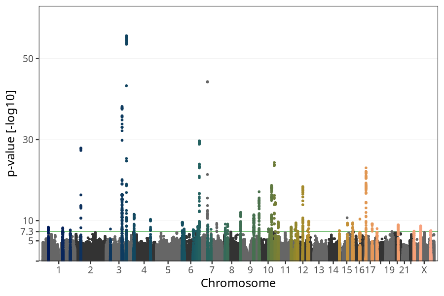
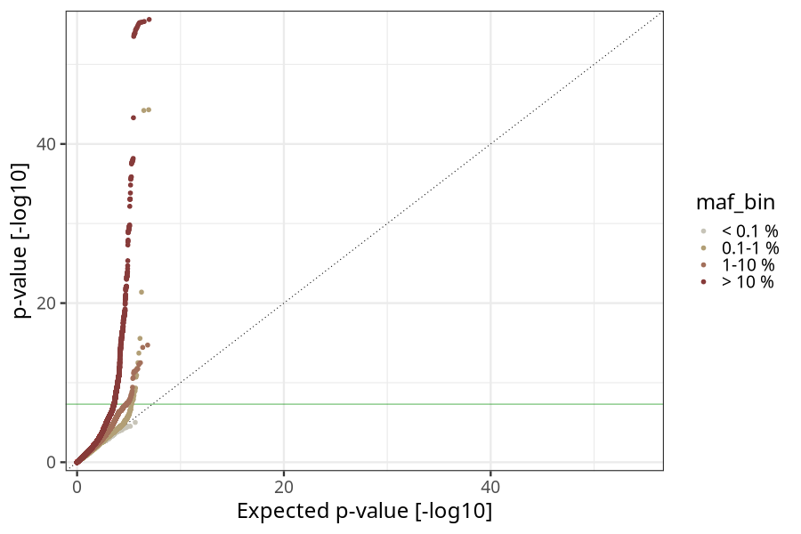
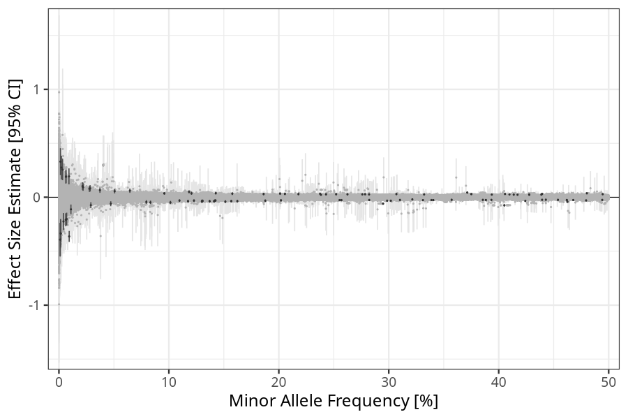
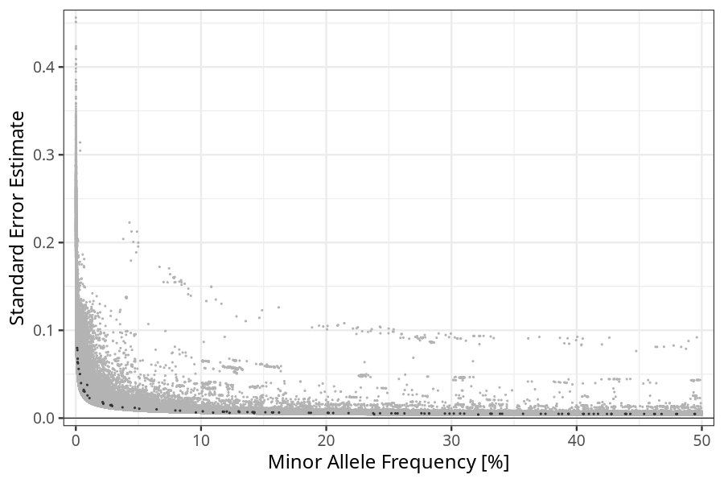

## Birth weight in children
Association results by regenie for Birth weight (weight_birth_eur_core, quantitative) in children
 using the following covariates: n_previous_deliveries, pregnancy_duration, sex, plural_birth, PC1, PC2, PC3, PC4, PC5, PC6, PC7, PC8, PC9, PC10, and genotyping batch
. Simple bp-window pruning of the hits passing p < 5e-08.

Note:
- Markers with a maf < 0.01 are not annotated on the Manhattan plot.
- Markers in the HLA region are not annotated on the Manhattan plot.
### Manhattan

### Top hits common (maf ≥ 1%)
| SNP | chr | bp | allele 0 | allele 1 | allele 1 freq | beta | se | log10p | n | gene |
| --- | --- | -- | -------- | -------- | ------------- | ---- | -- | ------ | - | ---- |
| rs841851 | 1 | 43401829 | A | G | 0.237546 | 0.0322014 | 0.00548271 | 8.36927 | 65581 | [SLC2A1](ensembl/rs841851.md) |
| rs2242195 | 1 | 154988957 | A | G | 0.518527 | -0.0272607 | 0.00469135 | 8.2065 | 65581 | [ZBTB7B](ensembl/rs2242195.md) |
| rs114940022 | 1 | 155937390 | C | T | 0.0218141 | 0.0975506 | 0.0170551 | 7.97187 | 65581 | [ARHGEF2](ensembl/rs114940022.md) |
| rs4100072 | 1 | 214181687 | C | T | 0.201172 | 0.033678 | 0.00600492 | 7.68993 | 65581 | [PROX1](ensembl/rs4100072.md) |
| rs973197 | 1 | 215592251 | G | A | 0.252111 | 0.0282028 | 0.0053954 | 6.76419 | 65581 | [KCTD3](ensembl/rs973197.md) |
| rs2154384 | 1 | 66108517 | C | T | 0.393675 | 0.0245507 | 0.00475118 | 6.62428 | 65581 | [LEPR](ensembl/rs2154384.md) |
| rs1355642 | 1 | 46598903 | A | G | 0.453862 | -0.0241212 | 0.00466925 | 6.62123 | 65581 | [PIK3R3](ensembl/rs1355642.md) |
| rs2993263 | 1 | 46021630 | C | T | 0.393351 | -0.0247878 | 0.00482519 | 6.55454 | 65581 | [AKR1A1](ensembl/rs2993263.md) |
| rs2755253 | 1 | 67470843 | C | T | 0.675381 | -0.0253338 | 0.00499245 | 6.41042 | 65581 | [SLC35D1](ensembl/rs2755253.md) |
| rs17034876 | 2 | 46484310 | C | T | 0.694275 | 0.0571536 | 0.0051477 | 27.9149 | 65581 | [EPAS1](ensembl/rs17034876.md) |
| rs185923464 | 2 | 158487190 | G | A | 0.0276803 | 0.0787091 | 0.0146794 | 7.08422 | 65581 | [ACVR1C](ensembl/rs185923464.md) |
| rs6432007 | 2 | 9615556 | T | C | 0.580748 | 0.024449 | 0.00472001 | 6.65355 | 65581 | [IAH1](ensembl/rs6432007.md) |
| rs72803888 | 2 | 43204791 | C | G | 0.28208 | 0.0261349 | 0.00523504 | 6.22431 | 65581 | [HAAO](ensembl/rs72803888.md) |
| rs838717 | 2 | 234296444 | G | A | 0.551342 | 0.0231532 | 0.00467375 | 6.13817 | 65581 | [DGKD](ensembl/rs838717.md) |
| rs17479393 | 2 | 145653287 | A | T | 0.255266 | -0.026452 | 0.00534067 | 6.13606 | 65581 | [ZEB2](ensembl/rs17479393.md) |
| rs900400 | 3 | 156798775 | T | C | 0.405133 | -0.0748843 | 0.00473362 | 55.6427 | 65581 | [LEKR1](ensembl/rs900400.md) |
| rs2877716 | 3 | 123094451 | T | C | 0.739444 | -0.0689952 | 0.00528815 | 38.1805 | 65581 | [ADCY5](ensembl/rs2877716.md) |
| rs12488341 | 3 | 32917415 | G | A | 0.306933 | 0.0297474 | 0.00521873 | 7.92182 | 65581 | [TRIM71](ensembl/rs12488341.md) |
| rs145849771 | 3 | 154226213 | A | G | 0.0284202 | 0.0821974 | 0.0149813 | 7.38768 | 65581 | [GPR149](ensembl/rs145849771.md) |
| rs62285074 | 3 | 156242649 | A | C | 0.338814 | -0.0259161 | 0.0049242 | 6.84859 | 65581 | [KCNAB1](ensembl/rs62285074.md) |
| rs2687739 | 3 | 193521978 | G | A | 0.262433 | 0.0267791 | 0.00530415 | 6.35184 | 65581 | [OPA1](ensembl/rs2687739.md) |
| rs724577 | 4 | 17993410 | A | C | 0.73901 | -0.03683 | 0.00527287 | 11.5448 | 65581 | [LCORL](ensembl/rs724577.md) |
| rs13146972 | 4 | 145569692 | C | T | 0.439472 | 0.0306164 | 0.00465697 | 10.3109 | 65581 | [HHIP-AS1, HHIP](ensembl/rs13146972.md) |
| rs13113755 | 4 | 15073611 | T | C | 0.533429 | 0.0251921 | 0.00465549 | 7.20358 | 65581 | [RP11-665G4.1](ensembl/rs13113755.md) |
| rs6840552 | 4 | 38494096 | A | C | 0.117434 | -0.0369675 | 0.00722354 | 6.50952 | 65581 | [RP11-617D20.1](ensembl/rs6840552.md) |
| rs66584692 | 5 | 158392277 | G | A | 0.388323 | -0.0255206 | 0.00477547 | 7.04159 | 65581 | [EBF1](ensembl/rs66584692.md) |
| rs1287260 | 5 | 36059151 | A | G | 0.764893 | 0.0291714 | 0.00551065 | 6.92115 | 65581 | [UGT3A2](ensembl/rs1287260.md) |
| rs854045 | 5 | 57098603 | G | T | 0.821111 | -0.0300377 | 0.00606026 | 6.14404 | 65581 | [CTD-2023N9.1](ensembl/rs854045.md) |
| rs7772579 | 6 | 152042502 | A | C | 0.294773 | -0.0591325 | 0.0051594 | 29.6844 | 65581 | [ESR1](ensembl/rs7772579.md) |
| rs4712523 | 6 | 20657564 | A | G | 0.298486 | -0.0320909 | 0.00507821 | 9.58057 | 65581 | [CDKAL1](ensembl/rs4712523.md) |
| rs2225906 | 6 | 141869843 | T | C | 0.753098 | 0.0320829 | 0.00538076 | 8.60489 | 65581 | No gene found |
| rs61175078 | 6 | 34223443 | G | A | 0.142671 | 0.0377926 | 0.00663573 | 7.9096 | 65581 | [C6orf1](ensembl/rs61175078.md) |
| rs12525502 | 6 | 105344946 | G | T | 0.156752 | -0.0361463 | 0.00641685 | 7.75186 | 65581 | [HACE1](ensembl/rs12525502.md) |
| rs1591805 | 6 | 126717064 | A | G | 0.504407 | -0.025659 | 0.00467637 | 7.38831 | 65581 | [CENPW](ensembl/rs1591805.md) |
| rs12207896 | 6 | 127437399 | C | T | 0.278492 | 0.0279702 | 0.00518219 | 7.16988 | 65581 | [RSPO3](ensembl/rs12207896.md) |
| rs3907648 | 6 | 74395505 | G | A | 0.66448 | 0.0255986 | 0.00496359 | 6.60105 | 65581 | [RP11-553A21.3](ensembl/rs3907648.md) |
| rs1319012 | 6 | 41852616 | T | A | 0.916914 | -0.0434064 | 0.00872007 | 6.19163 | 65581 | [USP49](ensembl/rs1319012.md) |
| rs2050702 | 6 | 37084059 | A | G | 0.647902 | -0.0241645 | 0.00487878 | 6.13614 | 65581 | [PIM1](ensembl/rs2050702.md) |
| rs10948661 | 6 | 51787440 | G | C | 0.201935 | -0.0288033 | 0.00583118 | 6.10618 | 65581 | [PKHD1](ensembl/rs10948661.md) |
| rs62396185 | 6 | 26180634 | G | C | 0.282243 | -0.0254735 | 0.00517533 | 6.06743 | 65581 | [HIST1H2BE](ensembl/rs62396185.md) |
| rs146611524 | 6 | 39093306 | C | T | 0.0109096 | -0.111873 | 0.0227722 | 6.04655 | 65581 | [SAYSD1](ensembl/rs146611524.md) |
| rs80121495 | 7 | 47269931 | G | T | 0.064534 | 0.0605941 | 0.00995355 | 8.94099 | 65581 | [TNS3](ensembl/rs80121495.md) |
| rs147778456 | 7 | 72130154 | G | A | 0.0219731 | 0.0923388 | 0.0162885 | 7.8426 | 65581 | [CALN1](ensembl/rs147778456.md) |
| rs113707810 | 7 | 72747127 | G | T | 0.0506825 | 0.0561194 | 0.010719 | 6.78374 | 65581 | [FKBP6](ensembl/rs113707810.md) |
| rs12667418 | 7 | 16122923 | T | C | 0.413659 | 0.0241209 | 0.00471831 | 6.49696 | 65581 | [ISPD](ensembl/rs12667418.md) |
| rs2075125 | 7 | 35301542 | C | A | 0.385586 | -0.0244179 | 0.00477667 | 6.49632 | 65581 | [TBX20](ensembl/rs2075125.md) |
| rs1592388 | 7 | 125736495 | G | A | 0.310209 | -0.0251782 | 0.00504111 | 6.22939 | 65581 | [AC000370.2](ensembl/rs1592388.md) |
| rs2010596 | 8 | 142243742 | C | T | 0.424217 | -0.0336272 | 0.00471127 | 12.0224 | 65581 | [SLC45A4](ensembl/rs2010596.md) |
| rs13262861 | 8 | 41508577 | C | A | 0.151375 | -0.0405933 | 0.00659074 | 9.13586 | 65581 | [NKX6-3](ensembl/rs13262861.md) |
| rs732563 | 8 | 23345526 | T | C | 0.494568 | 0.0285717 | 0.00464064 | 9.12952 | 65581 | [ENTPD4](ensembl/rs732563.md) |
| rs56080166 | 8 | 66795198 | G | A | 0.340512 | -0.0264397 | 0.00489277 | 7.18551 | 65581 | [PDE7A](ensembl/rs56080166.md) |
| rs3903044 | 8 | 26060748 | G | A | 0.217816 | 0.0293484 | 0.00568039 | 6.62276 | 65581 | [PPP2R2A](ensembl/rs3903044.md) |
| rs9325812 | 8 | 17286341 | C | G | 0.674228 | -0.0253359 | 0.00494929 | 6.51285 | 65581 | [MTMR7](ensembl/rs9325812.md) |
| rs10505073 | 8 | 106112262 | G | C | 0.186154 | 0.0299862 | 0.00599871 | 6.23885 | 65581 | [RP11-127H5.1](ensembl/rs10505073.md) |
| rs28578070 | 9 | 139248216 | A | G | 0.580854 | -0.0436618 | 0.00507287 | 17.1247 | 65581 | [GPSM1](ensembl/rs28578070.md) |
| rs16909922 | 9 | 98265901 | A | G | 0.118344 | 0.0502183 | 0.00722165 | 11.4492 | 65581 | [PTCH1](ensembl/rs16909922.md) |
| rs4742824 | 9 | 98807195 | A | T | 0.706506 | -0.0289295 | 0.00534391 | 7.20911 | 65581 | [ERCC6L2](ensembl/rs4742824.md) |
| rs10809252 | 9 | 10947717 | C | G | 0.130711 | -0.0353087 | 0.00690144 | 6.50604 | 65581 | [PTPRD](ensembl/rs10809252.md) |
| rs2418444 | 9 | 119105667 | T | G | 0.800332 | 0.0304866 | 0.00612132 | 6.19756 | 65581 | [PAPPA](ensembl/rs2418444.md) |
| rs1801253 | 10 | 115805056 | G | C | 0.738316 | 0.0546836 | 0.00528867 | 24.3319 | 65581 | [ADRB1](ensembl/rs1801253.md) |
| rs11187140 | 10 | 94466910 | G | A | 0.371396 | 0.0433518 | 0.00481138 | 18.687 | 65581 | [HHEX](ensembl/rs11187140.md) |
| rs71486610 | 10 | 124134803 | G | C | 0.480186 | 0.0365145 | 0.0046411 | 14.442 | 65581 | [PLEKHA1](ensembl/rs71486610.md) |
| rs10786156 | 10 | 96014622 | C | G | 0.405697 | 0.0303087 | 0.00472251 | 9.85964 | 65581 | [PLCE1](ensembl/rs10786156.md) |
| rs2394529 | 10 | 70985267 | G | C | 0.732595 | 0.0301685 | 0.00527781 | 7.96259 | 65581 | [RP11-227H15.4, HKDC1](ensembl/rs2394529.md) |
| rs7100689 | 10 | 82222178 | C | A | 0.754108 | 0.0302564 | 0.00545115 | 7.54527 | 65581 | [TSPAN14](ensembl/rs7100689.md) |
| rs61875120 | 10 | 114753259 | T | C | 0.205578 | 0.0311068 | 0.00577512 | 7.14327 | 65581 | [TCF7L2](ensembl/rs61875120.md) |
| rs67523008 | 10 | 120646806 | C | T | 0.157672 | 0.0334058 | 0.0064665 | 6.62125 | 65581 | [RP11-498J9.2](ensembl/rs67523008.md) |
| rs116997468 | 10 | 92990603 | C | G | 0.120578 | 0.0368948 | 0.00746933 | 6.10614 | 65581 | [PCGF5](ensembl/rs116997468.md) |
| rs12360854 | 11 | 10067027 | A | T | 0.479499 | -0.0295076 | 0.00464605 | 9.6701 | 65581 | [SBF2](ensembl/rs12360854.md) |
| rs1784784 | 11 | 111483185 | G | A | 0.728664 | 0.0307376 | 0.00522418 | 8.3967 | 65581 | [SIK2](ensembl/rs1784784.md) |
| rs11037265 | 11 | 1652383 | A | C | 0.187698 | -0.0318519 | 0.0059478 | 7.06834 | 65581 | [KRTAP5-5](ensembl/rs11037265.md) |
| rs11227313 | 11 | 65588938 | C | T | 0.332125 | 0.0262251 | 0.00492301 | 7.00075 | 65581 | [CFL1](ensembl/rs11227313.md) |
| rs10794341 | 11 | 923034 | G | A | 0.442878 | -0.0231939 | 0.00469504 | 6.10744 | 65581 | [AP2A2](ensembl/rs10794341.md) |
| rs757081 | 11 | 17351683 | C | G | 0.357206 | -0.0238347 | 0.00485082 | 6.04842 | 65581 | [NUCB2](ensembl/rs757081.md) |
| rs8756 | 12 | 66359752 | C | A | 0.462503 | -0.0416533 | 0.0046607 | 18.3986 | 65581 | [HMGA2](ensembl/rs8756.md) |
| rs7310615 | 12 | 111865049 | C | G | 0.545299 | 0.0301906 | 0.00470776 | 9.84544 | 65581 | [SH2B3](ensembl/rs7310615.md) |
| rs35756741 | 12 | 12868701 | C | T | 0.101406 | -0.0482974 | 0.00770133 | 9.44607 | 65581 | [CDKN1B](ensembl/rs35756741.md) |
| rs76895963 | 12 | 4384844 | T | G | 0.0214575 | 0.102828 | 0.0182134 | 7.78386 | 65581 | [CCND2-AS1, CCND2](ensembl/rs76895963.md) |
| rs855286 | 12 | 102946454 | T | C | 0.907598 | -0.0445084 | 0.00804488 | 7.50075 | 65581 | [IGF1](ensembl/rs855286.md) |
| rs12823128 | 12 | 26872730 | T | C | 0.467798 | -0.0254587 | 0.00464863 | 7.36298 | 65581 | [ITPR2](ensembl/rs12823128.md) |
| rs7316287 | 12 | 111321512 | T | C | 0.276001 | 0.0269582 | 0.00549186 | 6.03786 | 65581 | [CCDC63](ensembl/rs7316287.md) |
| rs9581923 | 13 | 28453210 | C | T | 0.130029 | -0.0383468 | 0.00768525 | 6.21835 | 65581 | [PDX1-AS1](ensembl/rs9581923.md) |
| rs77235285 | 14 | 101198609 | C | T | 0.141083 | -0.0374189 | 0.00675252 | 7.52296 | 65581 | [DLK1](ensembl/rs77235285.md) |
| rs5029104 | 14 | 38964544 | T | C | 0.43947 | -0.0238463 | 0.00468328 | 6.45016 | 65581 | [CLEC14A](ensembl/rs5029104.md) |
| rs55684513 | 15 | 96846638 | C | T | 0.301875 | -0.032261 | 0.00514011 | 9.46011 | 65581 | [NR2F2-AS1](ensembl/rs55684513.md) |
| rs8033577 | 15 | 56138416 | G | A | 0.775037 | 0.0347037 | 0.00555971 | 9.36447 | 65581 | [NEDD4](ensembl/rs8033577.md) |
| rs2871865 | 15 | 99194896 | C | G | 0.0832574 | -0.0476064 | 0.00845867 | 7.7395 | 65581 | [IGF1R](ensembl/rs2871865.md) |
| rs1573643 | 15 | 91420973 | T | C | 0.331097 | -0.0269646 | 0.00499298 | 7.17746 | 65581 | [FURIN](ensembl/rs1573643.md) |
| rs8029398 | 15 | 67339055 | T | C | 0.494158 | -0.0248082 | 0.00467275 | 6.95796 | 65581 | [SMAD3](ensembl/rs8029398.md) |
| rs12385947 | 15 | 83575040 | C | T | 0.541525 | -0.024036 | 0.0046668 | 6.58518 | 65581 | [HOMER2](ensembl/rs12385947.md) |
| rs3814283 | 16 | 50268817 | G | T | 0.75658 | -0.0369129 | 0.00559626 | 10.3743 | 65581 | [PAPD5](ensembl/rs3814283.md) |
| rs72797197 | 16 | 69514015 | A | G | 0.13022 | -0.0349918 | 0.00698051 | 6.27043 | 65581 | [CYB5B](ensembl/rs72797197.md) |
| rs72771097 | 16 | 20049222 | G | A | 0.242961 | 0.0271482 | 0.00544171 | 6.21667 | 65581 | [GPR139](ensembl/rs72771097.md) |
| rs222849 | 17 | 7185861 | T | C | 0.616907 | 0.0481111 | 0.0047883 | 23.0264 | 65581 | [SLC2A4](ensembl/rs222849.md) |
| rs4239208 | 17 | 55361231 | C | G | 0.62323 | -0.0296522 | 0.00479171 | 9.21577 | 65581 | [MSI2](ensembl/rs4239208.md) |
| rs3751921 | 17 | 25642315 | A | G | 0.4278 | 0.0233336 | 0.0047014 | 6.15882 | 65581 | [WSB1](ensembl/rs3751921.md) |
| rs55638894 | 18 | 11995451 | A | G | 0.162296 | -0.0363106 | 0.00633088 | 8.01214 | 65581 | [IMPA2](ensembl/rs55638894.md) |
| rs679574 | 19 | 49206108 | C | G | 0.461958 | -0.0253083 | 0.00464325 | 7.29918 | 65581 | [FUT2](ensembl/rs679574.md) |
| rs41355649 | 19 | 33790556 | G | A | 0.0471292 | -0.0599848 | 0.011646 | 6.58576 | 65581 | [CTD-2540B15.11, CEBPA](ensembl/rs41355649.md) |
| rs1062967 | 19 | 53342152 | T | C | 0.438759 | 0.0245448 | 0.00479605 | 6.50967 | 65581 | [ZNF28, ZNF468](ensembl/rs1062967.md) |
| rs10413888 | 19 | 1643921 | T | G | 0.417103 | 0.0234312 | 0.00478678 | 6.00737 | 65581 | [TCF3](ensembl/rs10413888.md) |
| rs6029178 | 20 | 39178557 | G | A | 0.375085 | 0.0292189 | 0.00479872 | 8.94423 | 65581 | [MAFB](ensembl/rs6029178.md) |
| rs1974 | 20 | 22562311 | G | A | 0.0373188 | 0.0648663 | 0.0122028 | 6.97361 | 65581 | [FOXA2](ensembl/rs1974.md) |
| rs6134000 | 20 | 10682863 | A | G | 0.42774 | 0.0248645 | 0.00468397 | 6.95632 | 65581 | [RP11-103J8.1](ensembl/rs6134000.md) |
| rs1886843 | 20 | 57244201 | A | G | 0.641554 | 0.0259704 | 0.00495974 | 6.78546 | 65581 | [STX16, STX16-NPEPL1](ensembl/rs1886843.md) |
| rs28530618 | 20 | 31275581 | A | G | 0.51034 | -0.0231636 | 0.00466907 | 6.15425 | 65581 | [COMMD7](ensembl/rs28530618.md) |
| rs9617090 | 22 | 50439194 | C | T | 0.409773 | 0.0261154 | 0.00475574 | 7.39913 | 65581 | [IL17REL](ensembl/rs9617090.md) |
| rs134569 | 22 | 29463381 | C | T | 0.635885 | -0.0248792 | 0.00483803 | 6.56668 | 65581 | [C22orf31](ensembl/rs134569.md) |
| rs62240962 | 22 | 42259524 | C | T | 0.0795021 | -0.0442766 | 0.00869622 | 6.44943 | 65581 | [SREBF2](ensembl/rs62240962.md) |
| rs6614540 | 23 | 50308735 | C | G | 0.729168 | -0.0257824 | 0.00429923 | 8.69674 | 65581 | No gene found |
| rs112890944 | 23 | 129080965 | C | T | 0.0958914 | 0.035592 | 0.00642939 | 7.50898 | 65581 | No gene found |
| rs56197033 | 23 | 79551925 | G | A | 0.142404 | -0.0299045 | 0.00556002 | 7.12429 | 65581 | No gene found |
| rs112819962 | 23 | 80150155 | C | T | 0.122818 | -0.0309161 | 0.00596255 | 6.66561 | 65581 | No gene found |
| rs4898364 | 23 | 152900485 | C | T | 0.23831 | 0.0227867 | 0.0044352 | 6.55573 | 65581 | No gene found |
| rs7065171 | 23 | 133683590 | C | G | 0.639598 | 0.0203692 | 0.00398687 | 6.4898 | 65581 | No gene found |
| rs1751095 | 23 | 78615733 | A | C | 0.908972 | 0.0328695 | 0.00661902 | 6.16509 | 65581 | No gene found |
| rs56082080 | 23 | 80677252 | G | T | 0.109655 | -0.0308729 | 0.00623349 | 6.13565 | 65581 | No gene found |
| rs4528006 | 23 | 78050342 | C | T | 0.32143 | -0.0199822 | 0.00403789 | 6.12657 | 65581 | No gene found |
### Top hits rare (maf < 1%)
| SNP | chr | bp | allele 0 | allele 1 | allele 1 freq | beta | se | log10p | n | gene |
| --- | --- | -- | -------- | -------- | ------------- | ---- | -- | ------ | - | ---- |
| rs145904578 | 1 | 96245985 | A | T | 0.00131121 | -0.392322 | 0.077458 | 6.38884 | 65581 | [RP11-147C23.1](ensembl/rs145904578.md) |
| rs180962133 | 1 | 96946572 | G | C | 0.00150629 | -0.334515 | 0.0675841 | 6.12865 | 65581 | [PTBP2](ensembl/rs180962133.md) |
| 1_230490042_C:G | 1 | 230490042 | G | C | 0.00108218 | -0.392926 | 0.0798744 | 6.06121 | 65581 | [PGBD5](ensembl/1_230490042_C_G.md) |
| rs79373793 | 2 | 137652875 | G | A | 0.00140377 | 0.329863 | 0.0638112 | 6.6291 | 65581 | [THSD7B](ensembl/rs79373793.md) |
| rs562978948 | 3 | 67828214 | A | G | 0.00224171 | 0.275049 | 0.0559802 | 6.04797 | 65581 | [SUCLG2](ensembl/rs562978948.md) |
| rs138715366 | 7 | 44246271 | C | T | 0.00935469 | -0.362726 | 0.0257618 | 44.2974 | 65581 | [YKT6](ensembl/rs138715366.md) |
| rs188722495 | 7 | 43661279 | C | T | 0.00620445 | -0.208933 | 0.0308025 | 10.9292 | 65581 | [STK17A, COA1](ensembl/rs188722495.md) |
| rs186723949 | 7 | 115876773 | T | A | 0.00644953 | 0.192515 | 0.030917 | 9.32248 | 65581 | [TES](ensembl/rs186723949.md) |
| rs117114704 | 7 | 116616887 | T | C | 0.00632725 | 0.18958 | 0.0322153 | 8.3995 | 65581 | [ST7, ST7-OT4](ensembl/rs117114704.md) |
| rs184966700 | 7 | 44970717 | C | T | 0.0041418 | -0.224679 | 0.0398603 | 7.76097 | 65581 | [RP4-647J21.1](ensembl/rs184966700.md) |
| rs181265705 | 8 | 117799217 | G | A | 0.00329271 | 0.256358 | 0.0501669 | 6.49214 | 65581 | [UTP23](ensembl/rs181265705.md) |
| rs114405432 | 9 | 17646685 | G | A | 0.00911613 | 0.193398 | 0.037819 | 6.50064 | 45032 | [SH3GL2](ensembl/rs114405432.md) |
| rs528350911 | 15 | 53747228 | C | G | 0.00704329 | -0.202238 | 0.0301624 | 10.6958 | 65581 | [WDR72](ensembl/rs528350911.md) |
| rs528784287 | 16 | 1615239 | G | A | 0.00173299 | -0.337258 | 0.0623915 | 7.18959 | 65581 | [IFT140](ensembl/rs528784287.md) |
### HLA top hits
HLA region: chr 6, 27-34 Mb

| SNP | chr | bp | allele 0 | allele 1 | allele 1 freq | beta | se | p | n | gene |
| --- | --- | -- | -------- | -------- | ------------- | ---- | -- | - | - | ---- |
| rs62399430 | 6 | 30993866 | A | T | 0.137078 | -0.0372119 | 0.00680638 | 7.33993 | 65581 | [MUC22](ensembl/rs62399430.md) |
| rs113525864 | 6 | 31733186 | A | C | 0.0290484 | -0.0735457 | 0.01381 | 6.99718 | 65581 | [SAPCD1-AS1](ensembl/rs113525864.md) |
| rs13191810 | 6 | 32586831 | C | T | 0.256957 | -0.0265995 | 0.00532644 | 6.22777 | 65581 | [HLA-DQA1](ensembl/rs13191810.md) |
| rs9380173 | 6 | 30309105 | G | A | 0.141776 | -0.0326513 | 0.00666371 | 6.01817 | 65581 | [TRIM39, TRIM39-RPP21](ensembl/rs9380173.md) |
### Quality Control
- QQ plot

- Beta vs. Allele Frequency

- Standard error vs. Allele Frequency

