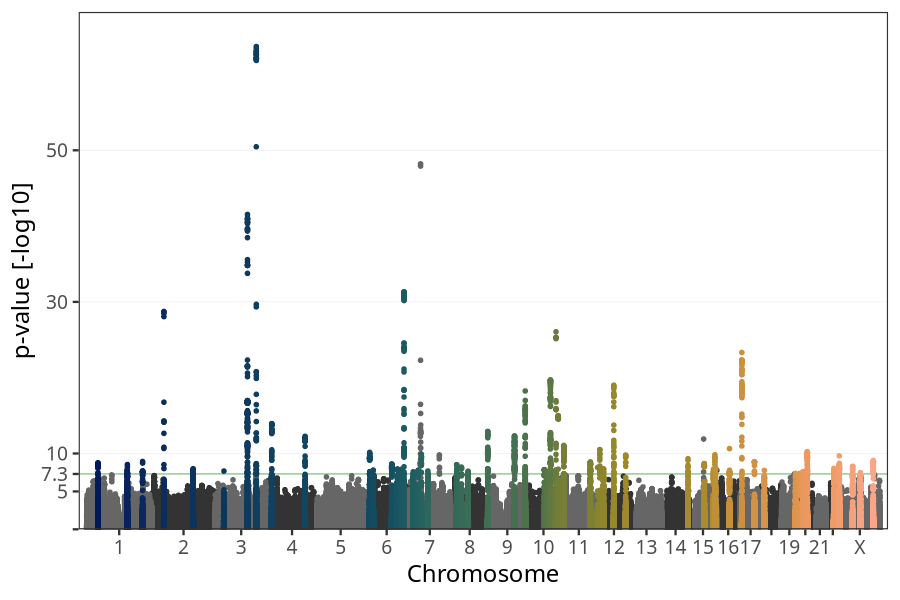
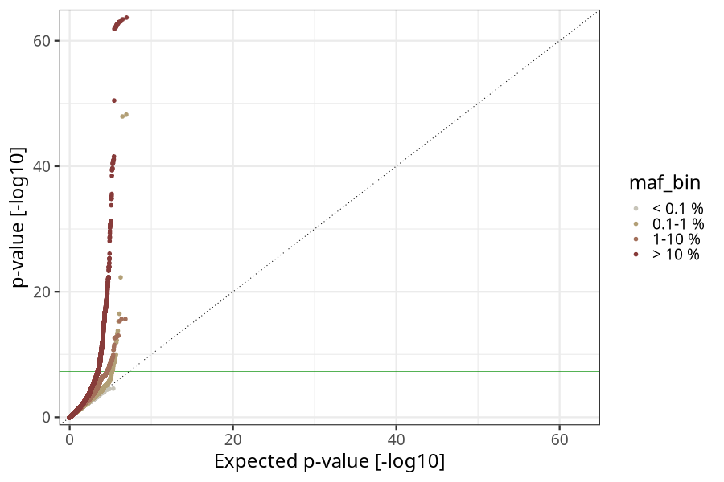
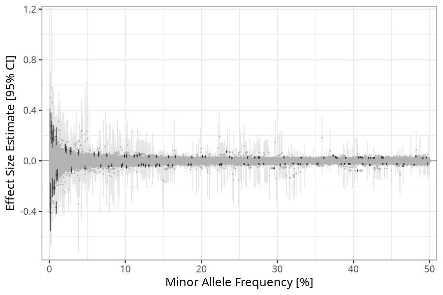
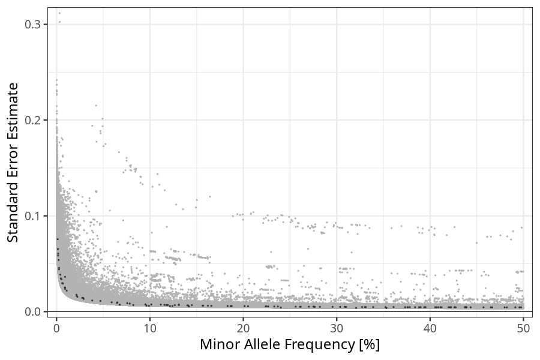

## Birth weight in children
Association results by regenie for Birth weight (weight_birth, quantitative) in children
 using the following covariates: n_previous_deliveries, pregnancy_duration, sex, plural_birth, PC1, PC2, PC3, PC4, PC5, PC6, PC7, PC8, PC9, PC10, and genotyping batch
. Simple bp-window pruning of the hits passing p < 5e-08.

Note:
- Markers with a maf < 0.01 are not annotated on the Manhattan plot.
- Markers in the HLA region are not annotated on the Manhattan plot.
### Manhattan

### Top hits common (maf ≥ 1%)
| SNP | chr | bp | allele 0 | allele 1 | allele 1 freq | beta | se | log10p | n | gene |
| --- | --- | -- | -------- | -------- | ------------- | ---- | -- | ------ | - | ---- |
| rs4100072 | 1 | 214181687 | C | T | 0.20132 | 0.0350921 | 0.00576387 | 8.94263 | 70952 | [PROX1](ensembl/rs4100072.md) |
| rs841851 | 1 | 43401829 | A | G | 0.237093 | 0.0317504 | 0.00527069 | 8.76903 | 70952 | [SLC2A1](ensembl/rs841851.md) |
| rs114940022 | 1 | 155937390 | C | T | 0.0215754 | 0.0976815 | 0.0164459 | 8.54402 | 70952 | [ARHGEF2](ensembl/rs114940022.md) |
| rs114130331 | 1 | 155306195 | T | C | 0.0274772 | 0.0811536 | 0.0143223 | 7.83576 | 70952 | [ASH1L](ensembl/rs114130331.md) |
| rs2993263 | 1 | 46021630 | C | T | 0.395173 | -0.0244967 | 0.00463295 | 6.90658 | 70952 | [AKR1A1](ensembl/rs2993263.md) |
| rs2755253 | 1 | 67470843 | C | T | 0.676069 | -0.0250637 | 0.00479968 | 6.75192 | 70952 | [SLC35D1](ensembl/rs2755253.md) |
| rs785482 | 1 | 46555300 | T | C | 0.438516 | -0.023418 | 0.00451488 | 6.6698 | 70952 | [PIK3R3](ensembl/rs785482.md) |
| rs6679251 | 1 | 26637111 | C | T | 0.742319 | 0.0258089 | 0.0051085 | 6.35966 | 70952 | [UBXN11](ensembl/rs6679251.md) |
| rs4040185 | 1 | 161529191 | T | A | 0.144912 | -0.0335262 | 0.00679466 | 6.09432 | 70952 | [FCGR3A](ensembl/rs4040185.md) |
| rs17034876 | 2 | 46484310 | C | T | 0.693916 | 0.0557149 | 0.00494332 | 28.7374 | 70952 | [EPAS1](ensembl/rs17034876.md) |
| rs1542348 | 2 | 158346266 | C | T | 0.115544 | 0.0404623 | 0.00706244 | 7.99614 | 70952 | [CYTIP](ensembl/rs1542348.md) |
| rs6432007 | 2 | 9615556 | T | C | 0.576575 | 0.0243264 | 0.00453972 | 7.07631 | 70952 | [IAH1](ensembl/rs6432007.md) |
| rs11124906 | 2 | 43197221 | G | C | 0.389805 | 0.0240959 | 0.00468498 | 6.56853 | 70952 | [HAAO](ensembl/rs11124906.md) |
| rs900400 | 3 | 156798775 | T | C | 0.405478 | -0.0770224 | 0.00454521 | 63.6849 | 70952 | [LEKR1](ensembl/rs900400.md) |
| rs11708067 | 3 | 123065778 | A | G | 0.233066 | 0.0717582 | 0.00526706 | 41.5399 | 70952 | [ADCY5](ensembl/rs11708067.md) |
| rs12488341 | 3 | 32917415 | G | A | 0.308676 | 0.0280483 | 0.00500468 | 7.67992 | 70952 | [TRIM71](ensembl/rs12488341.md) |
| rs1607462 | 3 | 156243963 | A | G | 0.327185 | -0.0252062 | 0.0047707 | 6.89722 | 70952 | [KCNAB1](ensembl/rs1607462.md) |
| rs145849771 | 3 | 154226213 | A | G | 0.0284432 | 0.0736381 | 0.0143737 | 6.52212 | 70952 | [GPR149](ensembl/rs145849771.md) |
| rs2687739 | 3 | 193521978 | G | A | 0.260714 | 0.0255861 | 0.00510106 | 6.27734 | 70952 | [OPA1](ensembl/rs2687739.md) |
| rs2270894 | 3 | 9975386 | C | G | 0.224421 | -0.0275756 | 0.00562095 | 6.03143 | 70952 | [IL17RC](ensembl/rs2270894.md) |
| rs724577 | 4 | 17993410 | A | C | 0.737167 | -0.0390531 | 0.00505773 | 13.9393 | 70952 | [LCORL](ensembl/rs724577.md) |
| rs13146972 | 4 | 145569692 | C | T | 0.437299 | 0.0322906 | 0.00447664 | 12.2622 | 70952 | [HHIP-AS1, HHIP](ensembl/rs13146972.md) |
| rs6840552 | 4 | 38494096 | A | C | 0.117769 | -0.036182 | 0.00692073 | 6.76624 | 70952 | [RP11-617D20.1](ensembl/rs6840552.md) |
| rs13137747 | 4 | 3437086 | C | T | 0.422494 | 0.0233435 | 0.00460042 | 6.40993 | 70952 | [RGS12](ensembl/rs13137747.md) |
| rs72801474 | 5 | 132444128 | G | A | 0.111661 | 0.0390383 | 0.00729479 | 7.05942 | 70952 | [HSPA4](ensembl/rs72801474.md) |
| rs1287260 | 5 | 36059151 | A | G | 0.763462 | 0.0279907 | 0.00529295 | 6.90851 | 70952 | [UGT3A2](ensembl/rs1287260.md) |
| rs66584692 | 5 | 158392277 | G | A | 0.388231 | -0.0236291 | 0.00458799 | 6.58471 | 70952 | [EBF1](ensembl/rs66584692.md) |
| rs12657171 | 5 | 58291208 | C | T | 0.0647323 | 0.046378 | 0.00905569 | 6.51822 | 70952 | [PDE4D](ensembl/rs12657171.md) |
| rs854045 | 5 | 57098603 | G | T | 0.822746 | -0.0291264 | 0.00583912 | 6.21497 | 70952 | [CTD-2023N9.1](ensembl/rs854045.md) |
| rs2915821 | 5 | 151113808 | G | A | 0.497403 | -0.0220081 | 0.00449236 | 6.01625 | 70952 | [ATOX1](ensembl/rs2915821.md) |
| rs3020340 | 6 | 152043290 | A | G | 0.2956 | -0.0583267 | 0.00495097 | 31.3098 | 70952 | [ESR1](ensembl/rs3020340.md) |
| rs7451008 | 6 | 20673880 | T | C | 0.261502 | -0.0330831 | 0.00507373 | 10.1543 | 70952 | [CDKAL1](ensembl/rs7451008.md) |
| rs12525502 | 6 | 105344946 | G | T | 0.156346 | -0.0367957 | 0.00616289 | 8.62618 | 70952 | [HACE1](ensembl/rs12525502.md) |
| rs1591805 | 6 | 126717064 | A | G | 0.509587 | -0.0257076 | 0.00449636 | 7.96596 | 70952 | [CENPW](ensembl/rs1591805.md) |
| rs2225906 | 6 | 141869843 | T | C | 0.754839 | 0.0295086 | 0.00518099 | 7.9102 | 70952 | No gene found |
| rs12207896 | 6 | 127437399 | C | T | 0.276515 | 0.0282261 | 0.00499299 | 7.80264 | 70952 | [RSPO3](ensembl/rs12207896.md) |
| rs61175078 | 6 | 34223443 | G | A | 0.14099 | 0.0361765 | 0.0064084 | 7.78246 | 70952 | [C6orf1](ensembl/rs61175078.md) |
| rs1984116 | 6 | 35525994 | G | A | 0.443487 | -0.0242571 | 0.00448552 | 7.19533 | 70952 | [FKBP5](ensembl/rs1984116.md) |
| rs3907648 | 6 | 74395505 | G | A | 0.665421 | 0.0247078 | 0.00476721 | 6.66051 | 70952 | [RP11-553A21.3](ensembl/rs3907648.md) |
| rs1775878 | 6 | 91589098 | C | T | 0.589332 | 0.0233781 | 0.0045776 | 6.48516 | 70952 | [MAP3K7](ensembl/rs1775878.md) |
| rs9358913 | 6 | 26239404 | A | G | 0.282004 | -0.0250601 | 0.00497392 | 6.32819 | 70952 | [HIST1H4F](ensembl/rs9358913.md) |
| rs12206267 | 6 | 51760454 | C | T | 0.183194 | -0.0291318 | 0.00583347 | 6.22789 | 70952 | [PKHD1](ensembl/rs12206267.md) |
| rs146611524 | 6 | 39093306 | C | T | 0.0109325 | -0.108619 | 0.0218525 | 6.17546 | 70952 | [SAYSD1](ensembl/rs146611524.md) |
| rs2050702 | 6 | 37084059 | A | G | 0.647507 | -0.0230837 | 0.00468464 | 6.07946 | 70952 | [PIM1](ensembl/rs2050702.md) |
| rs80121495 | 7 | 47269931 | G | T | 0.0650005 | 0.0612621 | 0.00952244 | 9.90399 | 70952 | [TNS3](ensembl/rs80121495.md) |
| rs2075125 | 7 | 35301542 | C | A | 0.383936 | -0.0259368 | 0.00458925 | 7.7988 | 70952 | [TBX20](ensembl/rs2075125.md) |
| rs147778456 | 7 | 72130154 | G | A | 0.0222678 | 0.0870866 | 0.0155246 | 7.69288 | 70952 | [CALN1](ensembl/rs147778456.md) |
| rs13231996 | 7 | 16120161 | C | T | 0.411277 | 0.0252124 | 0.00453001 | 7.58306 | 70952 | [ISPD](ensembl/rs13231996.md) |
| rs73133091 | 7 | 72828329 | G | T | 0.0590318 | 0.0532734 | 0.00973102 | 7.35804 | 70952 | [FZD9](ensembl/rs73133091.md) |
| rs34776209 | 7 | 23513093 | C | T | 0.226474 | -0.0266262 | 0.00535464 | 6.17995 | 70952 | [IGF2BP3](ensembl/rs34776209.md) |
| rs13231987 | 7 | 125710080 | G | A | 0.275845 | -0.0249286 | 0.00502087 | 6.16305 | 70952 | [AC000370.2](ensembl/rs13231987.md) |
| rs2301680 | 7 | 93116299 | A | G | 0.491243 | 0.0218267 | 0.00445423 | 6.01897 | 70952 | [CALCR](ensembl/rs2301680.md) |
| rs2010596 | 8 | 142243742 | C | T | 0.421527 | -0.033579 | 0.00452904 | 12.9122 | 70952 | [SLC45A4](ensembl/rs2010596.md) |
| rs732563 | 8 | 23345526 | T | C | 0.495745 | 0.0264456 | 0.00445662 | 8.52927 | 70952 | [ENTPD4](ensembl/rs732563.md) |
| rs6986080 | 8 | 41488038 | G | C | 0.223913 | -0.0312792 | 0.00538246 | 8.20775 | 70952 | [AGPAT6](ensembl/rs6986080.md) |
| rs56080166 | 8 | 66795198 | G | A | 0.339063 | -0.0263455 | 0.00470736 | 7.6605 | 70952 | [PDE7A](ensembl/rs56080166.md) |
| rs4921543 | 8 | 17205606 | C | A | 0.165765 | 0.0315038 | 0.00600042 | 6.81848 | 70952 | [MTMR7](ensembl/rs4921543.md) |
| rs10505073 | 8 | 106112262 | G | C | 0.187541 | 0.0293806 | 0.00574686 | 6.4976 | 70952 | [RP11-127H5.1](ensembl/rs10505073.md) |
| rs28578070 | 9 | 139248216 | A | G | 0.580927 | -0.0433606 | 0.00487216 | 18.2517 | 70952 | [GPSM1](ensembl/rs28578070.md) |
| rs16909922 | 9 | 98265901 | A | G | 0.119129 | 0.0499915 | 0.00691293 | 12.3212 | 70952 | [PTCH1](ensembl/rs16909922.md) |
| rs4742824 | 9 | 98807195 | A | T | 0.707481 | -0.027392 | 0.0051359 | 7.01608 | 70952 | [ERCC6L2](ensembl/rs4742824.md) |
| rs1801253 | 10 | 115805056 | G | C | 0.73772 | 0.0543248 | 0.00507042 | 26.0583 | 70952 | [ADRB1](ensembl/rs1801253.md) |
| rs11187140 | 10 | 94466910 | G | A | 0.373252 | 0.0427959 | 0.00461998 | 19.7026 | 70952 | [HHEX](ensembl/rs11187140.md) |
| rs71486610 | 10 | 124134803 | G | C | 0.482096 | 0.035739 | 0.00445507 | 14.9831 | 70952 | [PLEKHA1](ensembl/rs71486610.md) |
| rs10786156 | 10 | 96014622 | C | G | 0.407017 | 0.0269063 | 0.00453127 | 8.53961 | 70952 | [PLCE1](ensembl/rs10786156.md) |
| rs2394529 | 10 | 70985267 | G | C | 0.729745 | 0.0287088 | 0.00505651 | 7.86455 | 70952 | [RP11-227H15.4, HKDC1](ensembl/rs2394529.md) |
| rs61875120 | 10 | 114753259 | T | C | 0.205018 | 0.0313952 | 0.00554496 | 7.82486 | 70952 | [TCF7L2](ensembl/rs61875120.md) |
| rs7100689 | 10 | 82222178 | C | A | 0.756228 | 0.0293164 | 0.00525449 | 7.61714 | 70952 | [TSPAN14](ensembl/rs7100689.md) |
| rs67523008 | 10 | 120646806 | C | T | 0.157032 | 0.0321934 | 0.00621787 | 6.6482 | 70952 | [RP11-498J9.2](ensembl/rs67523008.md) |
| rs2801827 | 10 | 79646969 | G | A | 0.101418 | 0.0378872 | 0.00746995 | 6.40477 | 70952 | [DLG5](ensembl/rs2801827.md) |
| rs12360854 | 11 | 10067027 | A | T | 0.479781 | -0.0304832 | 0.00446321 | 11.0707 | 70952 | [SBF2](ensembl/rs12360854.md) |
| rs9734135 | 11 | 111536190 | G | A | 0.747212 | 0.0310657 | 0.00512848 | 8.85931 | 70952 | [SIK2](ensembl/rs9734135.md) |
| rs17641418 | 11 | 17161341 | T | C | 0.352216 | -0.0250306 | 0.00466171 | 7.10238 | 70952 | [PIK3C2A](ensembl/rs17641418.md) |
| rs11227313 | 11 | 65588938 | C | T | 0.331126 | 0.0252794 | 0.00472758 | 7.04908 | 70952 | [CFL1](ensembl/rs11227313.md) |
| rs11037265 | 11 | 1652383 | A | C | 0.186405 | -0.0301034 | 0.00572797 | 6.83086 | 70952 | [KRTAP5-5](ensembl/rs11037265.md) |
| rs2168101 | 11 | 8255408 | C | A | 0.31005 | -0.0250286 | 0.00487831 | 6.53934 | 70952 | [LMO1](ensembl/rs2168101.md) |
| rs8756 | 12 | 66359752 | C | A | 0.465105 | -0.0407354 | 0.00448072 | 19.0093 | 70952 | [HMGA2](ensembl/rs8756.md) |
| rs35756741 | 12 | 12868701 | C | T | 0.101527 | -0.049087 | 0.00738736 | 10.5174 | 70952 | [CDKN1B](ensembl/rs35756741.md) |
| rs7310615 | 12 | 111865049 | C | G | 0.54865 | 0.0289713 | 0.00453231 | 9.78632 | 70952 | [SH2B3](ensembl/rs7310615.md) |
| rs76895963 | 12 | 4384844 | T | G | 0.0212746 | 0.101596 | 0.0175549 | 8.14563 | 70952 | [CCND2-AS1, CCND2](ensembl/rs76895963.md) |
| rs12823128 | 12 | 26872730 | T | C | 0.466431 | -0.0255813 | 0.00447127 | 7.97575 | 70952 | [ITPR2](ensembl/rs12823128.md) |
| rs855286 | 12 | 102946454 | T | C | 0.908358 | -0.041313 | 0.00775063 | 7.00849 | 70952 | [IGF1](ensembl/rs855286.md) |
| rs9669403 | 12 | 46798900 | G | A | 0.37825 | 0.0239545 | 0.00466392 | 6.55213 | 70952 | [RP11-474P2.2](ensembl/rs9669403.md) |
| rs7316287 | 12 | 111321512 | T | C | 0.275048 | 0.026564 | 0.0052744 | 6.32388 | 70952 | [CCDC63](ensembl/rs7316287.md) |
| rs35814923 | 12 | 124792672 | C | T | 0.130974 | 0.0339828 | 0.00683906 | 6.17183 | 70952 | [FAM101A](ensembl/rs35814923.md) |
| rs9581923 | 13 | 28453210 | C | T | 0.130956 | -0.0375027 | 0.00735555 | 6.46564 | 70952 | [PDX1-AS1](ensembl/rs9581923.md) |
| rs77235285 | 14 | 101198609 | C | T | 0.140172 | -0.040499 | 0.00650677 | 9.31496 | 70952 | [DLK1](ensembl/rs77235285.md) |
| rs17475157 | 14 | 38974730 | C | A | 0.393832 | -0.0242765 | 0.00460627 | 6.86586 | 70952 | [CLEC14A](ensembl/rs17475157.md) |
| rs55684513 | 15 | 96846638 | C | T | 0.303724 | -0.0315758 | 0.0049266 | 9.83494 | 70952 | [NR2F2-AS1](ensembl/rs55684513.md) |
| rs8033275 | 15 | 56138427 | C | T | 0.772881 | 0.0319026 | 0.00532967 | 8.66702 | 70952 | [NEDD4](ensembl/rs8033275.md) |
| rs1573891 | 15 | 99186488 | G | C | 0.126624 | -0.0389923 | 0.00675837 | 8.09955 | 70952 | [RP11-35O15.1](ensembl/rs1573891.md) |
| rs1573643 | 15 | 91420973 | T | C | 0.330165 | -0.0273752 | 0.00479869 | 7.93355 | 70952 | [FURIN](ensembl/rs1573643.md) |
| rs3814283 | 16 | 50268817 | G | T | 0.756848 | -0.0359403 | 0.00537405 | 10.6447 | 70952 | [PAPD5](ensembl/rs3814283.md) |
| rs1379575 | 16 | 20052123 | G | A | 0.2701 | 0.0263361 | 0.00504124 | 6.75705 | 70952 | [GPR139](ensembl/rs1379575.md) |
| rs76650513 | 16 | 88307224 | A | G | 0.360896 | 0.024318 | 0.00480507 | 6.37956 | 70952 | [ZNF469](ensembl/rs76650513.md) |
| rs1152083 | 16 | 67206375 | C | T | 0.0757135 | 0.0444836 | 0.00881068 | 6.3521 | 70952 | [NOL3](ensembl/rs1152083.md) |
| rs222849 | 17 | 7185861 | T | C | 0.618178 | 0.0465505 | 0.00460156 | 23.3298 | 70952 | [SLC2A4](ensembl/rs222849.md) |
| rs4794716 | 17 | 55362424 | G | C | 0.622057 | -0.0279237 | 0.00459558 | 8.90989 | 70952 | [MSI2](ensembl/rs4794716.md) |
| rs3751921 | 17 | 25642315 | A | G | 0.426061 | 0.0231742 | 0.00451359 | 6.54793 | 70952 | [WSB1](ensembl/rs3751921.md) |
| rs55638894 | 18 | 11995451 | A | G | 0.162076 | -0.0343381 | 0.00608858 | 7.7688 | 70952 | [IMPA2](ensembl/rs55638894.md) |
| rs1062967 | 19 | 53342152 | T | C | 0.439034 | 0.0252551 | 0.00460842 | 7.37178 | 70952 | [ZNF28, ZNF468](ensembl/rs1062967.md) |
| rs679574 | 19 | 49206108 | C | G | 0.457172 | -0.0243482 | 0.00447085 | 7.28807 | 70952 | [FUT2](ensembl/rs679574.md) |
| rs158366 | 19 | 54705317 | C | G | 0.412337 | -0.023958 | 0.00454164 | 6.87741 | 70952 | [RPS9](ensembl/rs158366.md) |
| rs41355649 | 19 | 33790556 | G | A | 0.0469815 | -0.0586962 | 0.011184 | 6.81368 | 70952 | [CTD-2540B15.11, CEBPA](ensembl/rs41355649.md) |
| rs10413888 | 19 | 1643921 | T | G | 0.419896 | 0.0229804 | 0.0045993 | 6.23371 | 70952 | [TCF3](ensembl/rs10413888.md) |
| rs56204511 | 19 | 47776012 | C | T | 0.437485 | 0.0236953 | 0.00475845 | 6.19582 | 70952 | [CCDC9](ensembl/rs56204511.md) |
| rs6029178 | 20 | 39178557 | G | A | 0.376068 | 0.0301353 | 0.00460315 | 10.2304 | 70952 | [MAFB](ensembl/rs6029178.md) |
| rs1974 | 20 | 22562311 | G | A | 0.0382089 | 0.0648054 | 0.0116297 | 7.59988 | 70952 | [FOXA2](ensembl/rs1974.md) |
| rs6134000 | 20 | 10682863 | A | G | 0.427332 | 0.0246641 | 0.00450046 | 7.37212 | 70952 | [RP11-103J8.1](ensembl/rs6134000.md) |
| rs6128396 | 20 | 57250784 | T | C | 0.643385 | 0.0234512 | 0.00476739 | 6.06074 | 70952 | [STX16, STX16-NPEPL1](ensembl/rs6128396.md) |
| rs9617090 | 22 | 50439194 | C | T | 0.408924 | 0.0290206 | 0.00456346 | 9.69332 | 70952 | [IL17REL](ensembl/rs9617090.md) |
| rs134569 | 22 | 29463381 | C | T | 0.635452 | -0.0266348 | 0.00463661 | 8.0352 | 70952 | [C22orf31](ensembl/rs134569.md) |
| rs62240962 | 22 | 42259524 | C | T | 0.0784116 | -0.0451191 | 0.00840493 | 7.09943 | 70952 | [SREBF2](ensembl/rs62240962.md) |
| rs12687208 | 23 | 129087973 | T | C | 0.098923 | 0.0374549 | 0.00609792 | 9.08957 | 70952 | No gene found |
| rs6614540 | 23 | 50308735 | C | G | 0.729583 | -0.0241402 | 0.00412919 | 8.29859 | 70952 | No gene found |
| rs56197033 | 23 | 79551925 | G | A | 0.1418 | -0.0295309 | 0.00534801 | 7.47437 | 70952 | No gene found |
| rs2503989 | 23 | 133701147 | C | G | 0.35326 | -0.0207582 | 0.00382984 | 7.22505 | 70952 | No gene found |
| rs112819962 | 23 | 80150155 | C | T | 0.121497 | -0.0307313 | 0.00575379 | 7.0343 | 70952 | No gene found |
| rs4528006 | 23 | 78050342 | C | T | 0.320769 | -0.0206996 | 0.00388064 | 7.01753 | 70952 | No gene found |
| rs1751095 | 23 | 78615733 | A | C | 0.910084 | 0.0335545 | 0.00639204 | 6.8165 | 70952 | No gene found |
| rs56067791 | 23 | 81002231 | G | A | 0.0677149 | -0.0376701 | 0.00725522 | 6.68215 | 70952 | No gene found |
| rs111711894 | 23 | 73737867 | A | C | 0.124042 | -0.0299915 | 0.0057997 | 6.63342 | 70952 | No gene found |
| rs5945326 | 23 | 152899922 | A | G | 0.240187 | 0.0215949 | 0.00424221 | 6.44715 | 70952 | No gene found |
| rs111273910 | 23 | 77549201 | C | A | 0.0821749 | -0.0347284 | 0.00686142 | 6.38071 | 70952 | No gene found |
| rs5938570 | 23 | 75741067 | A | G | 0.904469 | 0.0320015 | 0.00633379 | 6.36046 | 70952 | No gene found |
| rs5959714 | 23 | 76784006 | G | C | 0.903385 | 0.0317446 | 0.00634775 | 6.24367 | 70952 | No gene found |
| rs35610395 | 23 | 76276653 | G | A | 0.0962398 | -0.0311246 | 0.00628038 | 6.14259 | 70952 | No gene found |
### Top hits rare (maf < 1%)
| SNP | chr | bp | allele 0 | allele 1 | allele 1 freq | beta | se | log10p | n | gene |
| --- | --- | -- | -------- | -------- | ------------- | ---- | -- | ------ | - | ---- |
| rs145904578 | 1 | 96245985 | A | T | 0.00127501 | -0.408416 | 0.075615 | 7.17931 | 70952 | [RP11-147C23.1](ensembl/rs145904578.md) |
| rs180962133 | 1 | 96946572 | G | C | 0.00148938 | -0.349408 | 0.0653479 | 7.04828 | 70952 | [PTBP2](ensembl/rs180962133.md) |
| rs562978948 | 3 | 67828214 | A | G | 0.00222393 | 0.275981 | 0.053868 | 6.52249 | 70952 | [SUCLG2](ensembl/rs562978948.md) |
| rs138715366 | 7 | 44246271 | C | T | 0.00908327 | -0.369515 | 0.0251314 | 48.2122 | 70952 | [YKT6](ensembl/rs138715366.md) |
| rs188722495 | 7 | 43661279 | C | T | 0.00613033 | -0.214703 | 0.0297549 | 12.2704 | 70952 | [STK17A, COA1](ensembl/rs188722495.md) |
| rs117865971 | 7 | 116217080 | G | T | 0.00533061 | 0.216309 | 0.0337869 | 9.81471 | 70952 | [AC006159.4](ensembl/rs117865971.md) |
| rs184966700 | 7 | 44970717 | C | T | 0.00406762 | -0.212597 | 0.038603 | 7.4384 | 70952 | [RP4-647J21.1](ensembl/rs184966700.md) |
| rs142660731 | 7 | 6207891 | C | G | 0.00457269 | 0.174533 | 0.0347227 | 6.3014 | 70952 | [CYTH3](ensembl/rs142660731.md) |
| rs558916447 | 7 | 46407717 | G | A | 0.00163206 | -0.291109 | 0.0585997 | 6.16922 | 70952 | [AC011294.3](ensembl/rs558916447.md) |
| rs570244616 | 8 | 18114511 | G | A | 0.00263009 | 0.228152 | 0.0456936 | 6.22604 | 70952 | [NAT1](ensembl/rs570244616.md) |
| rs114405432 | 9 | 17646685 | G | A | 0.00907389 | 0.193783 | 0.0363513 | 7.00983 | 48671 | [SH3GL2](ensembl/rs114405432.md) |
| rs528350911 | 15 | 53747228 | C | G | 0.00684904 | -0.208398 | 0.029349 | 11.9061 | 70952 | [WDR72](ensembl/rs528350911.md) |
| rs141936001 | 15 | 57946370 | A | T | 0.00267253 | 0.223394 | 0.0442194 | 6.35919 | 70952 | [GCOM1, MYZAP, POLR2M](ensembl/rs141936001.md) |
| rs528784287 | 16 | 1615239 | G | A | 0.00169159 | -0.342473 | 0.0606497 | 7.78642 | 70952 | [IFT140](ensembl/rs528784287.md) |
| rs5747003 | 22 | 17613671 | T | C | 0.00911657 | -0.117056 | 0.0236288 | 6.13836 | 70952 | [AC006946.15](ensembl/rs5747003.md) |
### HLA top hits
HLA region: chr 6, 27-34 Mb

| SNP | chr | bp | allele 0 | allele 1 | allele 1 freq | beta | se | p | n | gene |
| --- | --- | -- | -------- | -------- | ------------- | ---- | -- | - | - | ---- |
| rs113525864 | 6 | 31733186 | A | C | 0.0290068 | -0.0709029 | 0.013265 | 7.04401 | 70952 | [SAPCD1-AS1](ensembl/rs113525864.md) |
| rs17190491 | 6 | 31081635 | G | A | 0.0951476 | -0.0404553 | 0.00758664 | 7.01366 | 70952 | [PSORS1C1](ensembl/rs17190491.md) |
| rs13191810 | 6 | 32586831 | C | T | 0.25608 | -0.0256605 | 0.00512586 | 6.25534 | 70952 | [HLA-DQA1](ensembl/rs13191810.md) |
### Quality Control
- QQ plot

- Beta vs. Allele Frequency

- Standard error vs. Allele Frequency

