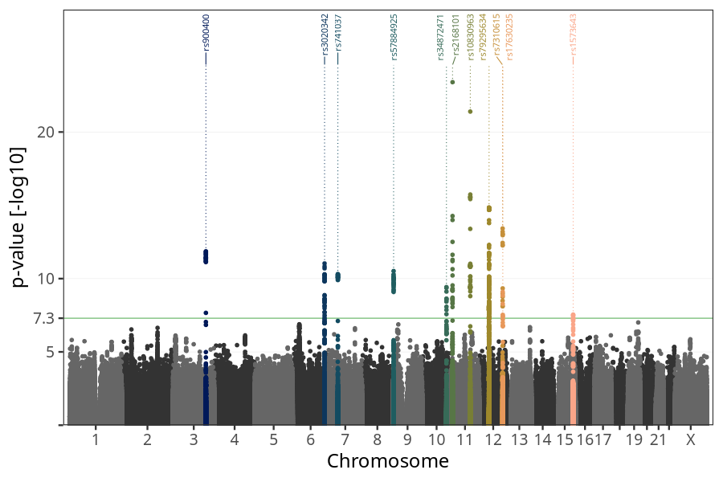
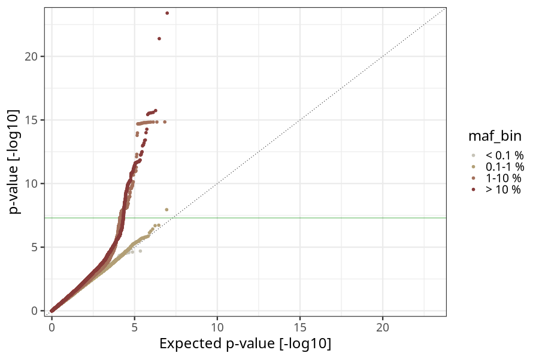
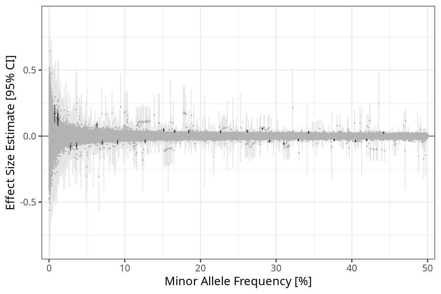
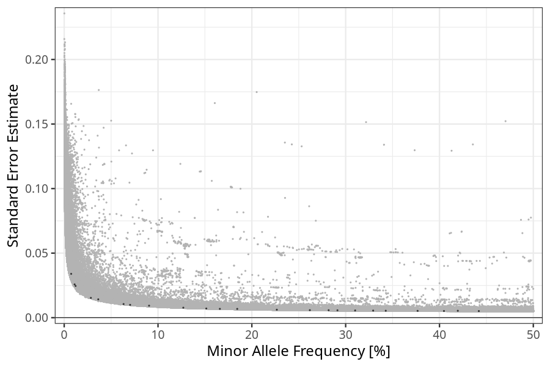

## Birth weight in mothers
Association results by regenie for Birth weight (weight_birth, quantitative) in mothers
 using the following covariates: n_previous_deliveries, pregnancy_duration, sex, plural_birth, PC1, PC2, PC3, PC4, PC5, PC6, PC7, PC8, PC9, PC10, and genotyping batch
. Simple bp-window pruning of the hits passing p < 5e-08.

Note:
- Markers with a maf < 0.01 are not annotated on the Manhattan plot.
- Markers in the HLA region are not annotated on the Manhattan plot.
### Manhattan

### Top hits common (maf ≥ 1%)
| SNP | chr | bp | allele 0 | allele 1 | allele 1 freq | beta | se | log10p | n | gene |
| --- | --- | -- | -------- | -------- | ------------- | ---- | -- | ------ | - | ---- |
| rs6709087 | 2 | 169799010 | A | G | 0.226616 | 0.0318868 | 0.0061632 | 6.63931 | 58314 | [ABCB11](ensembl/rs6709087.md) |
| rs539447 | 2 | 45138325 | A | G | 0.526917 | -0.0264829 | 0.00516404 | 6.53414 | 58314 | [SIX3-AS1](ensembl/rs539447.md) |
| rs900400 | 3 | 156798775 | T | C | 0.404775 | -0.0366823 | 0.00517901 | 11.8502 | 58314 | [LEKR1](ensembl/rs900400.md) |
| rs17036101 | 3 | 12277845 | G | A | 0.0702659 | -0.0491001 | 0.0099349 | 6.11209 | 58314 | [PPARG](ensembl/rs17036101.md) |
| rs2220514 | 4 | 145576558 | G | A | 0.441943 | 0.0253116 | 0.00511536 | 6.12541 | 58314 | [HHIP-AS1, HHIP](ensembl/rs2220514.md) |
| rs3020342 | 6 | 152047753 | A | G | 0.291252 | -0.0388386 | 0.00569645 | 11.0348 | 58314 | [ESR1](ensembl/rs3020342.md) |
| rs741037 | 7 | 44232833 | G | A | 0.151474 | 0.0466187 | 0.00709337 | 10.3046 | 58314 | [GCK](ensembl/rs741037.md) |
| rs188224301 | 7 | 125593798 | A | G | 0.0363009 | -0.0732622 | 0.0141934 | 6.61136 | 58314 | [AC000370.2](ensembl/rs188224301.md) |
| rs76343360 | 7 | 26504924 | C | T | 0.0121592 | 0.1223 | 0.0245499 | 6.2004 | 58314 | [KIAA0087](ensembl/rs76343360.md) |
| rs57884925 | 9 | 4285119 | C | G | 0.506702 | 0.0337729 | 0.00508348 | 10.5143 | 58314 | [GLIS3](ensembl/rs57884925.md) |
| rs111526775 | 9 | 26678042 | A | G | 0.0111048 | 0.13591 | 0.0257697 | 6.8746 | 58314 | [CAAP1](ensembl/rs111526775.md) |
| rs1333051 | 9 | 22136489 | A | T | 0.126958 | -0.0395973 | 0.00773181 | 6.51806 | 58314 | [CDKN2B-AS1](ensembl/rs1333051.md) |
| rs34872471 | 10 | 114754071 | T | C | 0.261827 | 0.036421 | 0.00581529 | 9.42282 | 58314 | [TCF7L2](ensembl/rs34872471.md) |
| rs2168101 | 11 | 8255408 | C | A | 0.310093 | -0.0565269 | 0.0055789 | 23.4009 | 58314 | [LMO1](ensembl/rs2168101.md) |
| rs10830963 | 11 | 92708710 | C | G | 0.281835 | 0.055632 | 0.00575287 | 21.3945 | 58314 | [MTNR1B](ensembl/rs10830963.md) |
| rs1870019 | 11 | 100901473 | A | G | 0.34274 | 0.0270349 | 0.00537132 | 6.31662 | 58314 | [PGR](ensembl/rs1870019.md) |
| rs35826789 | 11 | 66867155 | T | A | 0.0904801 | -0.0462331 | 0.00930689 | 6.16889 | 58314 | [KDM2A](ensembl/rs35826789.md) |
| rs79295634 | 12 | 47180008 | A | G | 0.0632976 | 0.0841475 | 0.0105415 | 14.8434 | 58314 | [SLC38A4](ensembl/rs79295634.md) |
| rs7310615 | 12 | 111865049 | C | G | 0.548951 | 0.0390724 | 0.00516299 | 13.4207 | 58314 | [SH2B3](ensembl/rs7310615.md) |
| rs17630235 | 12 | 112591686 | G | A | 0.376688 | -0.0292209 | 0.00527022 | 7.53058 | 58314 | [TRAFD1](ensembl/rs17630235.md) |
| rs7339001 | 13 | 108128848 | T | A | 0.519941 | -0.0264733 | 0.00509667 | 6.68706 | 58314 | [FAM155A](ensembl/rs7339001.md) |
| rs1573643 | 15 | 91420973 | T | C | 0.32929 | -0.0305029 | 0.00549711 | 7.54137 | 58314 | [FURIN](ensembl/rs1573643.md) |
| rs5418 | 17 | 7185092 | G | A | 0.547242 | 0.0251218 | 0.00512782 | 6.01653 | 58314 | [SLC2A4](ensembl/rs5418.md) |
| rs35106244 | 19 | 49203829 | C | T | 0.419532 | -0.0284779 | 0.00534212 | 7.0098 | 58314 | [FUT2](ensembl/rs35106244.md) |
| rs77875289 | 19 | 39469245 | A | G | 0.184428 | 0.0343608 | 0.00679235 | 6.37466 | 58314 | [FBXO17](ensembl/rs77875289.md) |
### Top hits rare (maf < 1%)
| SNP | chr | bp | allele 0 | allele 1 | allele 1 freq | beta | se | log10p | n | gene |
| --- | --- | -- | -------- | -------- | ------------- | ---- | -- | ------ | - | ---- |
| rs147667815 | 17 | 77984254 | C | T | 0.00742777 | 0.168041 | 0.033942 | 6.13133 | 58314 | [TBC1D16](ensembl/rs147667815.md) |
### HLA top hits
HLA region: chr 6, 27-34 Mb

| SNP | chr | bp | allele 0 | allele 1 | allele 1 freq | beta | se | p | n | gene |
| --- | --- | -- | -------- | -------- | ------------- | ---- | -- | - | - | ---- |
| rs142006308 | 6 | 31757791 | G | A | 0.0284253 | -0.0808913 | 0.015329 | 6.88169 | 58314 | [VARS](ensembl/rs142006308.md) |
| rs9263740 | 6 | 31111400 | T | C | 0.165913 | 0.0356492 | 0.00683358 | 6.73977 | 58314 | [CCHCR1](ensembl/rs9263740.md) |
### Quality Control
- QQ plot

- Beta vs. Allele Frequency

- Standard error vs. Allele Frequency

