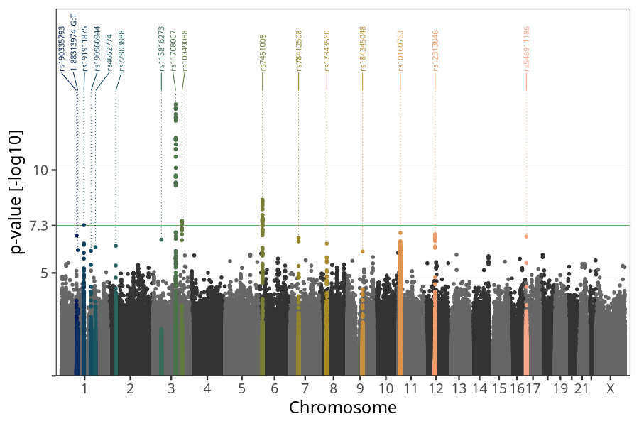
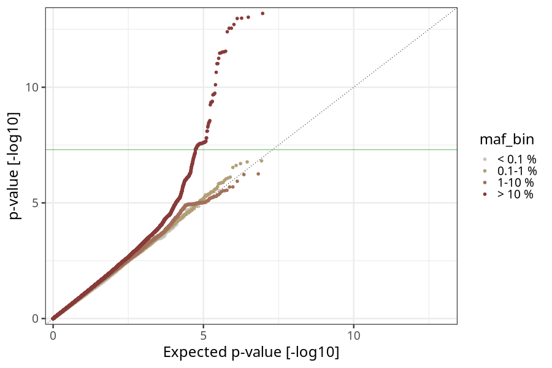
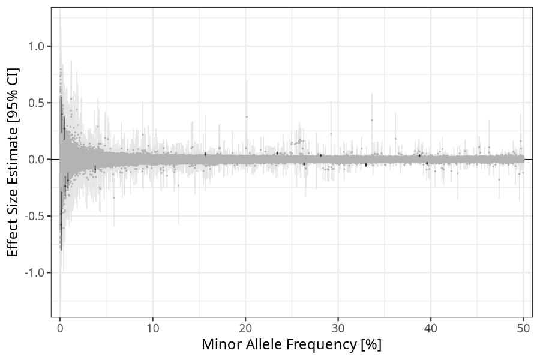
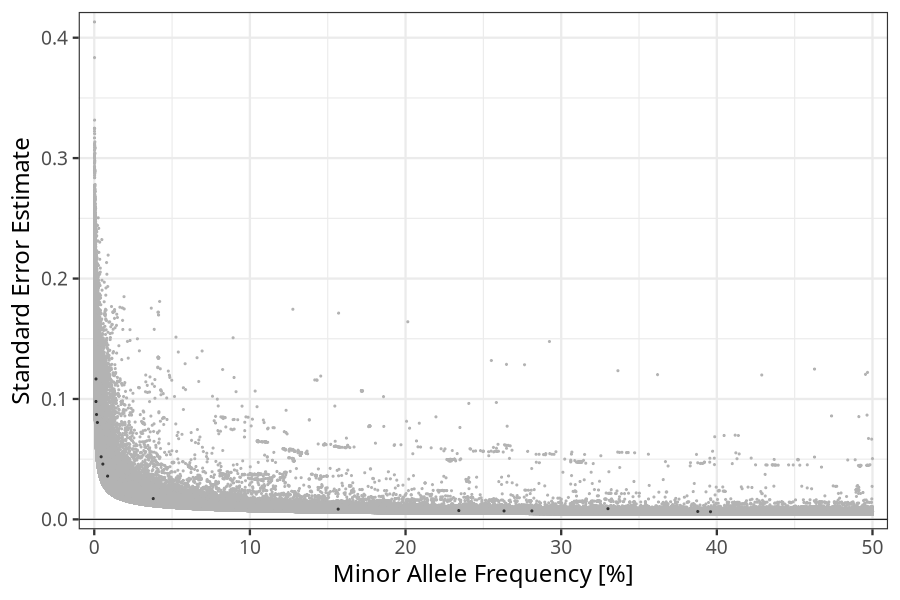

## Birth weight in parents
Association results by regenie for Birth weight (weight_birth, quantitative) in parents
 using the following covariates: n_previous_deliveries, pregnancy_duration, sex, plural_birth, PC1, PC2, PC3, PC4, PC5, PC6, PC7, PC8, PC9, PC10, and genotyping batch
. Simple bp-window pruning of the hits passing p < 1e-06.

### Manhattan

### Top hits common (maf ≥ 1%)
| SNP | chr | bp | allele 0 | allele 1 | allele 1 freq | beta | se | log10p | n | gene |
| --- | --- | -- | -------- | -------- | ------------- | ---- | -- | ------ | - | ---- |
| rs191911875 | 1 | 120551940 | A | G | 0.330049 | -0.0485102 | 0.00888477 | 7.3221 | 40100 | [NOTCH2](ensembl/rs191911875.md) |
| rs4652774 | 1 | 183060818 | A | G | 0.0379036 | -0.0863705 | 0.0172581 | 6.2521 | 40100 | [LAMC1](ensembl/rs4652774.md) |
| rs72803888 | 2 | 43204791 | C | G | 0.281158 | 0.0352775 | 0.00700959 | 6.31561 | 40100 | [HAAO](ensembl/rs72803888.md) |
| rs11708067 | 3 | 123065778 | A | G | 0.234227 | 0.0547586 | 0.00730275 | 13.1896 | 40100 | [ADCY5](ensembl/rs11708067.md) |
| rs10049088 | 3 | 156797648 | C | T | 0.395944 | -0.0351352 | 0.00634263 | 7.51815 | 40100 | [LEKR1](ensembl/rs10049088.md) |
| rs7451008 | 6 | 20673880 | T | C | 0.263288 | -0.0415659 | 0.0069927 | 8.55621 | 40100 | [CDKAL1](ensembl/rs7451008.md) |
| rs17343560 | 8 | 37278911 | C | G | 0.387766 | 0.033169 | 0.0065289 | 6.42393 | 40100 | [RP11-150O12.6](ensembl/rs17343560.md) |
| rs10160763 | 11 | 10238173 | G | T | 0.593263 | 0.033367 | 0.00629098 | 6.94566 | 40100 | [SBF2](ensembl/rs10160763.md) |
| rs12313846 | 12 | 62531412 | A | G | 0.15672 | 0.0448245 | 0.00849125 | 6.88619 | 40100 | [FAM19A2](ensembl/rs12313846.md) |
### Top hits rare (maf < 1%)
| SNP | chr | bp | allele 0 | allele 1 | allele 1 freq | beta | se | log10p | n | gene |
| --- | --- | -- | -------- | -------- | ------------- | ---- | -- | ------ | - | ---- |
| rs190335793 | 1 | 81421617 | G | A | 0.00442756 | 0.272907 | 0.0519862 | 6.81692 | 40100 | [LPHN2](ensembl/rs190335793.md) |
| 1_88313974_G:T | 1 | 88313974 | G | T | 0.00111818 | -0.576378 | 0.116606 | 6.1138 | 40100 | [LMO4](ensembl/1_88313974_G_T.md) |
| rs190966944 | 1 | 158867138 | T | G | 0.00109726 | -0.482047 | 0.0978858 | 6.07294 | 40100 | [PYHIN1](ensembl/rs190966944.md) |
| rs115816273 | 3 | 45876276 | A | G | 0.00552281 | -0.23711 | 0.0459134 | 6.61732 | 40100 | [LZTFL1](ensembl/rs115816273.md) |
| rs78412508 | 7 | 44223858 | G | A | 0.00857973 | -0.186795 | 0.0359338 | 6.69656 | 40100 | [GCK](ensembl/rs78412508.md) |
| rs184345048 | 9 | 83352731 | G | A | 0.00199276 | 0.39506 | 0.0804588 | 6.04079 | 40100 | No gene found |
| rs546911186 | 17 | 5341026 | G | C | 0.00146814 | -0.455308 | 0.0870635 | 6.76989 | 40100 | [C1QBP](ensembl/rs546911186.md) |
### HLA top hits
HLA region: chr 6, 27-34 Mb

| SNP | chr | bp | allele 0 | allele 1 | allele 1 freq | beta | se | p | n | gene |
| --- | --- | -- | -------- | -------- | ------------- | ---- | -- | - | - | ---- |
### Quality Control
- QQ plot

- Beta vs. Allele Frequency

- Standard error vs. Allele Frequency

