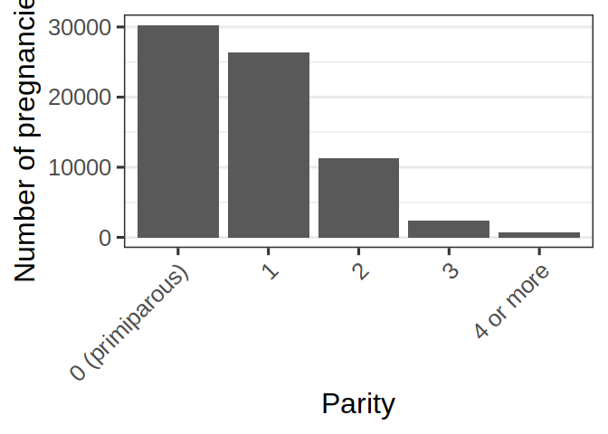
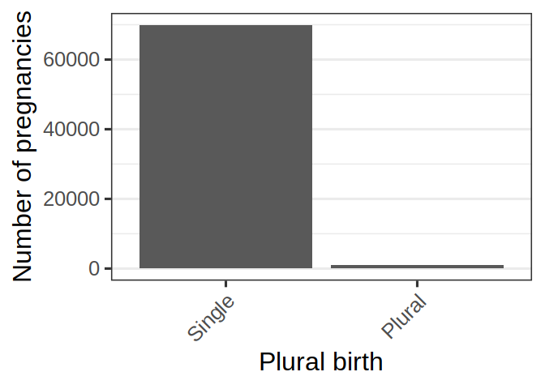
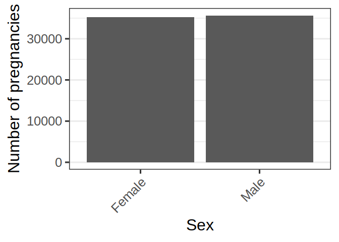
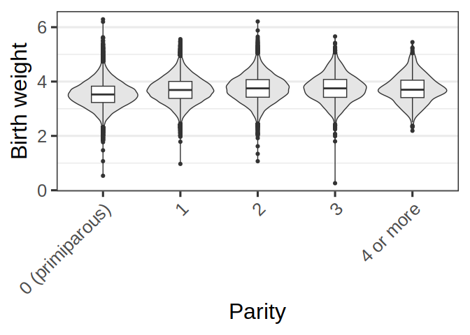
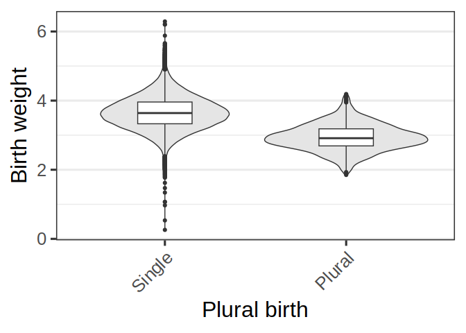
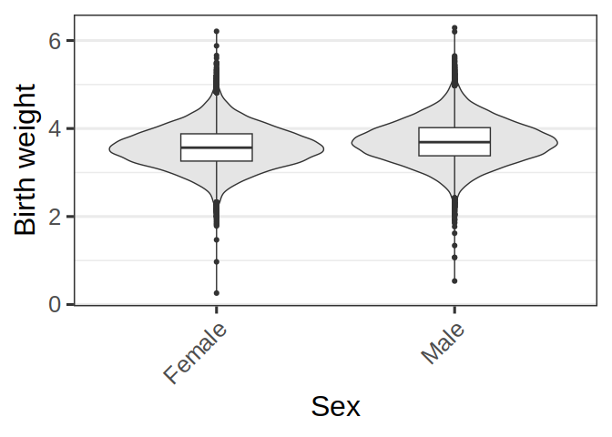

# phenotypes


## Phenotypes

Preparation of the phenotype table for the GWAS pipeline and
documentation of phenotypic distribution.

### Libraries and settings

``` r
library(here)
```

    here() starts at /mnt/work/marc/github/moba/gwas_base_hdgb

``` r
library(conflicted)
```

    Warning: package 'conflicted' was built under R version 4.3.3

``` r
library(yaml)
```

    Warning: package 'yaml' was built under R version 4.3.3

``` r
library(janitor)
library(glue)
library(tidyverse)
```

    Warning: package 'tidyverse' was built under R version 4.3.3

    Warning: package 'ggplot2' was built under R version 4.3.3

    Warning: package 'tidyr' was built under R version 4.3.3

    Warning: package 'readr' was built under R version 4.3.3

    Warning: package 'dplyr' was built under R version 4.3.3

    Warning: package 'stringr' was built under R version 4.3.3

    Warning: package 'forcats' was built under R version 4.3.3

    ── Attaching core tidyverse packages ──────────────────────── tidyverse 2.0.0 ──
    ✔ dplyr     1.1.4     ✔ readr     2.1.5
    ✔ forcats   1.0.0     ✔ stringr   1.5.1
    ✔ ggplot2   3.5.2     ✔ tibble    3.2.1
    ✔ lubridate 1.9.3     ✔ tidyr     1.3.1
    ✔ purrr     1.0.2     

``` r
library(ggplot2)
library(scico)
library(patchwork)
library(ragg)
library(grid)

# Solve name space conflicts
conflicts_prefer(dplyr::filter)
```

    [conflicted] Will prefer dplyr::filter over any other package.

``` r
# General parameters
theme_set(theme_bw(base_size = 24))
```

### Load data from pheno release

``` r
pheno_version <- "pheno_anthropometrics_25-12-12_hdgb"

mfr_data <- read.table(
  file = glue("/mnt/archive/moba/pheno/v12/{pheno_version}/mfr.gz"),
  header = T,
  sep = "\t"
)

population_clusters <- read.table(
  file = "/mnt/archive/moba/geno/HDGB-MoBaGenetics/2025.09.25/pca/moba_genotypes_2025.09.25_clusters",
  header = T,
  sep = "\t"
)
```

### Make a table with phenotypes, exclusion variables, and covariates

``` r
required_columns <- c("preg_id", "child_id", "mother_id", "father_id", "child_sentrix_id", "mother_sentrix_id", "father_sentrix_id", "child_batch", "mother_batch", "father_batch")
exclusion_columns <- c("pregnancy_duration_term", "pop_inference")
covariate_columns <- c("n_previous_deliveries", "pregnancy_duration", "plural_birth", "sex")
phenotype_columns <- c("weight_birth")

phenotype_data <- mfr_data %>% 
  left_join(
    population_clusters %>% 
      select(
        child_sentrix_id = iid,
        pop_inference
      ),
    by = "child_sentrix_id"
  ) %>% 
  mutate(
    n_previous_deliveries = factor(n_previous_deliveries, levels = c("0 (primiparous)", "1", "2", "3", "4 or more")),
    plural_birth = ifelse(is.na(plural_birth), "Single", "Plural"),
    plural_birth = factor(plural_birth, levels = c("Single", "Plural")),
    sex = case_when(
      sex == 1 ~ "Male",
      sex == 2 ~ "Female"
    ),
    sex = factor(sex, levels = c("Female", "Male"))
  ) %>% 
  select(
    all_of(required_columns), all_of(exclusion_columns), all_of(covariate_columns), all_of(phenotype_columns)
  )
```

### Exclusion

``` r
print("Number of participants before exclusion")
```

    [1] "Number of participants before exclusion"

``` r
n_pregnancies <- length(unique(phenotype_data$preg_id))
print(paste0("- N pregnancies: ", n_pregnancies))
```

    [1] "- N pregnancies: 80247"

``` r
n_children_genotyped <- length(unique(phenotype_data$child_sentrix_id))
print(paste0("- N children genotyped: ", n_children_genotyped))
```

    [1] "- N children genotyped: 81023"

``` r
n_mothers_genotyped <- length(unique(phenotype_data$mother_sentrix_id))
print(paste0("- N mothers genotyped: ", n_mothers_genotyped))
```

    [1] "- N mothers genotyped: 65785"

``` r
n_fathers_genotyped <- length(unique(phenotype_data$father_sentrix_id))
print(paste0("- N fathers genotyped: ", n_fathers_genotyped))
```

    [1] "- N fathers genotyped: 44942"

``` r
print("Exclusion of PCA outliers")
```

    [1] "Exclusion of PCA outliers"

``` r
n_pregnancies_previous <- n_pregnancies
n_children_genotyped_previous <- n_children_genotyped
n_mothers_genotyped_previous <- n_mothers_genotyped
n_fathers_genotyped_previous <- n_fathers_genotyped

phenotype_data <- phenotype_data %>% 
  filter(
    pop_inference %in% c("EUR", "EUR_core")
  )

n_pregnancies <- length(unique(phenotype_data$preg_id))
print(paste0("- N pregnancies excluded : ", n_pregnancies_previous - n_pregnancies))
```

    [1] "- N pregnancies excluded : 1406"

``` r
n_children_genotyped <- length(unique(phenotype_data$child_sentrix_id))
print(paste0("- N children genotyped excluded: ", n_children_genotyped_previous - n_children_genotyped))
```

    [1] "- N children genotyped excluded: 1413"

``` r
n_mothers_genotyped <- length(unique(phenotype_data$mother_sentrix_id))
print(paste0("- N mothers genotyped excluded: ", n_mothers_genotyped_previous - n_mothers_genotyped))
```

    [1] "- N mothers genotyped excluded: 1185"

``` r
n_fathers_genotyped <- length(unique(phenotype_data$father_sentrix_id))
print(paste0("- N fathers genotyped excluded: ", n_fathers_genotyped_previous - n_fathers_genotyped))
```

    [1] "- N fathers genotyped excluded: 687"

``` r
print("Exclusion of birth before 37w or after 42w")
```

    [1] "Exclusion of birth before 37w or after 42w"

``` r
n_pregnancies_previous <- n_pregnancies
n_children_genotyped_previous <- n_children_genotyped
n_mothers_genotyped_previous <- n_mothers_genotyped
n_fathers_genotyped_previous <- n_fathers_genotyped

phenotype_data <- phenotype_data %>% 
  filter(
    pregnancy_duration_term == 1
  )

n_pregnancies <- length(unique(phenotype_data$preg_id))
print(paste0("- N pregnancies excluded : ", n_pregnancies_previous - n_pregnancies))
```

    [1] "- N pregnancies excluded : 8307"

``` r
n_children_genotyped <- length(unique(phenotype_data$child_sentrix_id))
print(paste0("- N children genotyped excluded: ", n_children_genotyped_previous - n_children_genotyped))
```

    [1] "- N children genotyped excluded: 8634"

``` r
n_mothers_genotyped <- length(unique(phenotype_data$mother_sentrix_id))
print(paste0("- N mothers genotyped excluded: ", n_mothers_genotyped_previous - n_mothers_genotyped))
```

    [1] "- N mothers genotyped excluded: 6224"

``` r
n_fathers_genotyped <- length(unique(phenotype_data$father_sentrix_id))
print(paste0("- N fathers genotyped excluded: ", n_fathers_genotyped_previous - n_fathers_genotyped))
```

    [1] "- N fathers genotyped excluded: 4123"

``` r
print("Remaining after exclusion criteria")
```

    [1] "Remaining after exclusion criteria"

``` r
print(paste0("- N pregnancies: ", n_pregnancies))
```

    [1] "- N pregnancies: 70534"

``` r
print(paste0("- N children genotyped: ", n_children_genotyped))
```

    [1] "- N children genotyped: 70976"

``` r
print(paste0("- N mothers genotyped: ", n_mothers_genotyped))
```

    [1] "- N mothers genotyped: 58376"

``` r
print(paste0("- N fathers genotyped: ", n_fathers_genotyped))
```

    [1] "- N fathers genotyped: 40132"

### Prevalence of covariates

``` r
discrete_covariate_columns <- c("n_previous_deliveries", "plural_birth", "sex")
discrete_covariate_names <- c("Parity", "Plural birth", "Sex")

for (i in 1:length(discrete_covariate_columns)) {
  
  column <- discrete_covariate_columns[i]
  column_name <- discrete_covariate_names[i]
  
  plot <- ggplot() +
    geom_bar(
      data = phenotype_data,
      mapping = aes(
        x = !!sym(column)
      )
    ) +
    scale_x_discrete(
      name = column_name
    ) +
    scale_y_continuous(
      name = "Number of pregnancies"
    ) +
    theme(
      axis.text.x = element_text(
        angle = 45,
        hjust = 1
      ),
      panel.grid.major.x = element_blank(),
      panel.grid.minor.x = element_blank()
    )
  
  png(
    filename = here(glue("phenotypes/plots/{column}_prevalence.png")),
    width = 800,
    height = 600
  )
  grid.draw(plot)
  dev <- dev.off()
  
  print(glue("{column} prevalence:"))
  grid.draw(plot)
  
}
```

    n_previous_deliveries prevalence:



    plural_birth prevalence:



    sex prevalence:



``` r
continuous_covariate_columns <- c("pregnancy_duration")
continuous_covariate_names <- c("Pregnancy duration")

for (i in 1:length(continuous_covariate_columns)) {
  
  column <- continuous_covariate_columns[i]
  column_name <- continuous_covariate_names[i]
  
  plot <- ggplot() +
    geom_histogram(
      data = phenotype_data,
      mapping = aes(
        x = !!sym(column)
      )
    ) +
    scale_x_continuous(
      name = column_name
    ) +
    scale_y_continuous(
      name = "Number of pregnancies"
    ) +
    theme(
      axis.text.x = element_text(
        angle = 45,
        hjust = 1
      ),
      panel.grid.major.x = element_blank(),
      panel.grid.minor.x = element_blank()
    )
  
  png(
    filename = here(glue("phenotypes/plots/{column}_prevalence.png")),
    width = 800,
    height = 600
  )
  grid.draw(plot)
  dev <- dev.off()
  
  print(glue("{column} prevalence:"))
  grid.draw(plot)
  
}
```

    `stat_bin()` using `bins = 30`. Pick better value with `binwidth`.

    pregnancy_duration prevalence:

    `stat_bin()` using `bins = 30`. Pick better value with `binwidth`.


### Phenotype relative to covariates

``` r
phenotype_columns <- c("weight_birth")
phenotype_column_names <- c("Birth weight")

discrete_covariate_columns <- c("n_previous_deliveries", "plural_birth", "sex")
discrete_covariate_names <- c("Parity", "Plural birth", "Sex")

continuous_covariate_columns <- c("pregnancy_duration")
continuous_covariate_names <- c("Pregnancy duration")

for (column_i in 1:length(phenotype_columns)) {
  
  column <- phenotype_columns[column_i]
  column_name <- phenotype_column_names[column_i]
  
  for (column_j in 1:length(discrete_covariate_columns)) {
    
    covariate_column <- discrete_covariate_columns[column_j]
    covariate_column_name <- discrete_covariate_names[column_j]
    
    plot <- ggplot(
      data = phenotype_data,
      mapping = aes(
        x = !!sym(covariate_column),
        y = !!sym(column)
      )
    ) +
      geom_violin(
        fill = "grey90"
      ) +
      geom_boxplot(
        width=0.3
      ) +
      scale_x_discrete(
        name = covariate_column_name
      ) +
      scale_y_continuous(
        name = column_name
      ) +
      theme(
        axis.text.x = element_text(
          angle = 45,
          hjust = 1
        ),
        panel.grid.major.x = element_blank()
      )
    
    png(
      filename = here(glue("phenotypes/plots/{column}_vs_{covariate_column}.png")),
      width = 800,
      height = 600
    )
    grid.draw(plot)
    dev <- dev.off()
    
    print(glue("{column} vs {covariate_column}:"))
    grid.draw(plot)
    
  }
  
  
  for (column_j in 1:length(continuous_covariate_columns)) {
    
    covariate_column <- continuous_covariate_columns[column_j]
    covariate_column_name <- continuous_covariate_names[column_j]
    
    plot <- ggplot(
      data = phenotype_data,
      mapping = aes(
        x = as.numeric(!!sym(covariate_column)),
        y = !!sym(column)
      )
    ) +
      geom_point(
        alpha = 0.2
      ) +
      geom_smooth(
        # method = "loess"
      ) +
      geom_density2d(
        col = "white"
      ) +
      scale_x_continuous(
        name = covariate_column_name
      ) +
      scale_y_continuous(
        name = column_name
      )
    
    png(
      filename = here(glue("phenotypes/plots/{column}_vs_{covariate_column}.png")),
      width = 800,
      height = 600
    )
    grid.draw(plot)
    dev <- dev.off()
    
    print(glue("{column} vs {covariate_column}:"))
    grid.draw(plot)
    
  }
}
```

    Warning: Removed 24 rows containing non-finite outside the scale range
    (`stat_ydensity()`).

    Warning: Removed 24 rows containing non-finite outside the scale range
    (`stat_boxplot()`).

    weight_birth vs n_previous_deliveries:

    Warning: Removed 24 rows containing non-finite outside the scale range
    (`stat_ydensity()`).
    Removed 24 rows containing non-finite outside the scale range
    (`stat_boxplot()`).

    Warning: Removed 24 rows containing non-finite outside the scale range
    (`stat_ydensity()`).

    Warning: Removed 24 rows containing non-finite outside the scale range
    (`stat_boxplot()`).



    weight_birth vs plural_birth:

    Warning: Removed 24 rows containing non-finite outside the scale range
    (`stat_ydensity()`).
    Removed 24 rows containing non-finite outside the scale range
    (`stat_boxplot()`).

    Warning: Removed 24 rows containing non-finite outside the scale range
    (`stat_ydensity()`).

    Warning: Removed 24 rows containing non-finite outside the scale range
    (`stat_boxplot()`).



    weight_birth vs sex:

    Warning: Removed 24 rows containing non-finite outside the scale range
    (`stat_ydensity()`).
    Removed 24 rows containing non-finite outside the scale range
    (`stat_boxplot()`).

    `geom_smooth()` using method = 'gam' and formula = 'y ~ s(x, bs = "cs")'

    Warning: Removed 24 rows containing non-finite outside the scale range
    (`stat_smooth()`).

    Warning: Removed 24 rows containing non-finite outside the scale range
    (`stat_density2d()`).

    Warning: Removed 24 rows containing missing values or values outside the scale range
    (`geom_point()`).



    weight_birth vs pregnancy_duration:

    `geom_smooth()` using method = 'gam' and formula = 'y ~ s(x, bs = "cs")'

    Warning: Removed 24 rows containing non-finite outside the scale range
    (`stat_smooth()`).

    Warning: Removed 24 rows containing non-finite outside the scale range
    (`stat_density2d()`).

    Warning: Removed 24 rows containing missing values or values outside the scale range
    (`geom_point()`).


### Convert factors to numbers, save table of phenotypes

``` r
# Get the path to file expected by the gwas pipeline

gwas_settings <- read_yaml(file.path(here(), "gwas", "analysis.yaml"))

gwas_pheno_file_directory <- file.path(gwas_settings$work_folder, gwas_settings$id, gwas_settings$release, "pheno", gwas_settings$pheno_version, gwas_settings$pheno_release)

if (!dir.exists(gwas_pheno_file_directory)) {
  
  dir.create(gwas_pheno_file_directory, recursive = T)
  
}

gwas_pheno_file_path <- file.path(gwas_pheno_file_directory, glue("{gwas_settings$pheno_table_name}.gz"))


# Convert factors to numeric

phenotype_data_gwas <- phenotype_data

for (column in discrete_covariate_columns) {
  
  phenotype_data_gwas[[column]] <- as.numeric(phenotype_data_gwas[[column]])
  
}


# Write table

write.table(
  x = phenotype_data_gwas,
  file = gzfile(gwas_pheno_file_path),
  col.names = T,
  row.names = F,
  sep = "\t",
  quote = F
)
```
